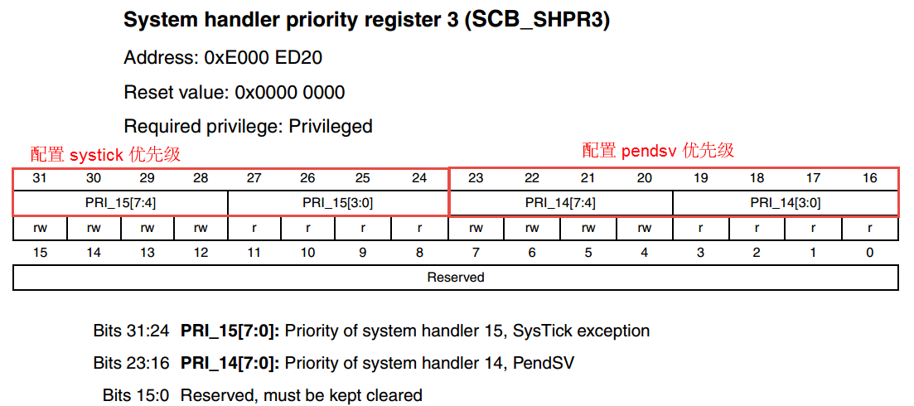

.. vim: syntax=rst

创建任务
========

上一章讲解了基于野火STM32开发板创建完成LiteOS工程模板的内容，本章开始将真正进入如何使用LiteOS的征程，
从最简单的创建任务开始，实现LED翻转的功能，保证读者能够对整个LiteOS有初步的了解。

硬件初始化
~~~~~~~~~~

在启动LiteOS之前，应该先将系统需要的硬件初始化完毕。本章创建的任务需要用到开发板搭载的LED，因此首先
需要将LED硬件部分初始化，具体的处理是在main.c文件的BSP_Init()函数中将LED初始化，如 代码清单:创建任务-1_ 高亮部分所示。

.. code-block:: c
    :caption:  代码清单:创建任务-1BSP_Init()中添加硬件初始化函数
    :emphasize-lines: 17
    :name: 代码清单:创建任务-1
    :linenos:

    /*********************************************************************
    * @ 函数名  ： BSP_Init
    * @ 功能说明： 板级外设初始化，所有开发板上的初始化均可放在这个函数里面
    * @ 参数    ：
    * @ 返回值  ： 无
    *******************************************************************/
    static void BSP_Init(void)
    {
        /*
        * STM32中断优先级分组为4，即4bit都用来表示抢占优先级，范围为0~15
        * 优先级分组只需要分组一次即可，以后如果有其他的任务需要用到中断，
        * 都统一用这个优先级分组，千万不要再分组，切忌。
        */
        NVIC_PriorityGroupConfig( NVIC_PriorityGroup_4 );

        /* LED 初始化 */
        LED_GPIO_Config();
    }

在main函数中调用BSP_Init()，当代码执行到BSP_Init()函数时，操作系统的内容完全未涉及到，即BSP_Init()函数
所做的处理与裸机工程里面的硬件初始化是一样的。当执行完BSP_Init()函数后，CPU才会启动操作系统去运行用户创
建完成的任务。在学习过程中，读者可能已经将任务创建完成，并且LiteOS操作系统也已经运行，可程序运行的现象与
想象中不一样，如LED不会亮、串口没有输出、LCD也没有显示等。如果是初学者，这个时候就会心急如焚，那该如何排
除是硬件出现问题还是系统出现问题呢？在此作者提供一个小小的调试技巧：在硬件初始化完成后，立即测试硬件是否
能正常工作，保证在尚未涉及到操作系统的情况下，硬件是正常工作的，具体实现如 代码清单:创建任务-2_ 高亮部分所示。

.. code-block:: c
    :caption:  代码清单:创建任务-2 BSP_Init()中添加硬件测试函数
    :emphasize-lines: 12-14
    :name: 代码清单:创建任务-2
    :linenos:

    /********************************************************************
    * @brief  主函数
    * @param  无
    * @retval 无
    * @note   第一步：开发板硬件初始化
            第二步：创建App应用任务
            第三步：启动LiteOS，开始多任务调度，启动失败则输出错误信息
    *******************************************************************/
    int main(void)
    {
        /* 板载相关初始化 */
        BSP_Init();						(1)
        LED1_ON;							(2)
        while (1);						(3)
    }

-   代码清单:创建任务-2_ **(1)**\ ：硬件初始化。

-   代码清单:创建任务-2_ **(2)**\ ：测试点亮LED，可以继续添加其他的硬件初始化和测试。在确认硬件能正常
    工作之后，这部分硬件测试的代码可删可不删，因为BSP_Init()函数只执行一次。

-   代码清单:创建任务-2_ **(3)**\ ：为了方便测试硬件是否正常工作，添加一个死循环让程序停在这里，不再继
    续往下执行，当测试完毕后，这个while(1);则必须删除。

创建单任务—SRAM动态内存
~~~~~~~~~~~~~~~~~~~~~~~~

在本小节中将会创建一个任务，任务使用的栈空间和任务控制块是在创建任务的时候全部由LiteOS动态分配的。在LiteOS
系统中，每一个任务都是独立的，它们的运行环境都单独保存在自己的任务栈中，任务栈占用的是MCU内部的SRAM（内存），
创建的任务越多，需要使用的栈空间就越大，即需要使用的SRAM也就越多，一个MCU能够支持创建多少个任务，取决于它的
SRAM空间有多少。

动态内存空间的堆从哪里来
^^^^^^^^^^^^^^^^^^^^^^^^^^^^^^^^

任务控制块和任务栈的内存空间都是从SRAM分配的，具体分配到哪个地址由编译器决定。LiteOS支持动态内存分配，任务控
制块和任务栈的内存空间均由LiteOS分配，在LiteOS中定义了一个OS_SYS_MEM_SIZE宏定义表示系统可以管理的内存大小，
这个宏定义在target_config.h中由用户配置。在创建任务的时候，系统使用LOS_MemAllocAlign()函数从内存池分配需要
的内存，如 代码清单:创建任务-3_ 所示。

.. code-block:: c
    :caption:  代码清单:创建任务-3 LiteOS创建任务进行动态内存分配
    :name: 代码清单:创建任务-3
    :linenos:

    LITE_OS_SEC_TEXT VOID *LOS_MemAllocAlign(VOID *pPool, 
                        UINT32 uwSize, 
                            UINT32 uwBoundary){
        VOID *pRet = NULL;
        UINT32 uwUseSize;
        UINT32 uwGapSize;
        VOID *pAlignedPtr;
        do {
        if ((NULL == pPool) || (0 == uwSize) || (0 == uwBoundary)	
                || !IS_ALIGNED(uwBoundary, sizeof(VOID *))) {
                break;						(1)
            }

            uwUseSize = uwSize + uwBoundary + 4;
            pRet = osHeapAlloc(pPool, uwUseSize);			(2)

            if (pRet) {
                pAlignedPtr = (VOID *)OS_MEM_ALIGN(pRet, uwBoundary);(3)
                if (pRet == pAlignedPtr) {
                    break;
                }

                uwGapSize = (UINT32)pAlignedPtr - (UINT32)pRet;
                OS_MEM_SET_ALIGN_FLAG(uwGapSize);			
                *((UINT32 *)((UINT32)pAlignedPtr - 4)) = uwGapSize;

                pRet = pAlignedPtr;
            }
        } while (0);

        return pRet;
    }

-   代码清单:创建任务-3_ **(1)**\ ：如果传入的参数是非法的，将跳出循环不再继续执行分配内存。

-   代码清单:创建任务-3_ **(2)**\ ：进行内存分配，从系统可管理的OS_SYS_MEM_SIZE大小的内存中进行分配，分配的内存大小
    为uwUseSize，如果内存分配成功，则返回指向内存地址的指针pRet，具体的内存分配过程将会在本书后续详细分析讲解，此处
    读者只需要知道系统是通过osHeapAlloc()函数进行内存分配的即可。

-   代码清单:创建任务-3_ **(3)**\ ：如果内存分配成功，需要对已经分配的内存进行对齐操作，在LiteOS中内存按8字节对齐。

LiteOS核心初始化
^^^^^^^^^^^^^^^^^^^^^

在开始创建任务之前，需要将LiteOS的核心组件进行初始化，LiteOS已经提供了一个函数接口——LOS_KernelInit()，它能够将整个
LiteOS系统的核心部分初始化，在初始化完成后，读者可以根据自己需要创建任务和信号量等。

核心初始化LOS_KernelInit()函数主要做了以下几件事。

    1. 系统内存的初始化，因为LiteOS所管理的内存只是一块内存区域，所以LiteOS将它管理的内存初始化一遍，目的是为了在后续能正常管理。

    2. 如果系统接管中断，那么LiteOS会将所有的中断入口函数通过一个指针数组存储，系统最大支持管理OS_VECTOR_CNT ，即(OS_SYS_VECTOR_CNT +OS_HWI_MAX_NUM)个中断。而系统不接管中断则不会对中断入口函数进行处理，读者可以将LOSCFG_PLATFORM_HWI宏定义配置为是否由系统接管中断。

    3. 任务基本的底层初始化，如LiteOS采用一块内存来管理所有的任务控制块信息，系统最大支持LOSCFG_BASE_CORE_TSK_LIMIT+1个任务（包括空闲任务），该宏定义的值是由用户指定，用户可以根据系统需求进行裁剪，以减少系统的内存开销，并且会初始化系统必要的链表等。

    4. 如果用户使能了任务监视功能，那么系统也会初始化对应的监视功能。

    5. 如果用户使能了信号量、互斥锁、消息队列等IPC通信机制，那么在系统运行前也会将这些内核资源初始化，系统支持最大的信号量、互斥锁、消息队列个数由用户决定，当不需要那么多任务的时候可以进行裁剪，以减少系统的内存开销。

    6. 如果系统使用了软件定时器，就必须使用消息队列（因为软件定时器依赖消息队列进行管理），同时会初始化相关的功能，除此之外系统还会创建一个软件定时器任务。

    7. LiteOS会创建一个空闲任务，空闲任务在系统中是必须存在的，因为处理器是一直在运行的，当整个系统都没有就绪任务的时候，系统必须保证有一个任务在运行。空闲任务就是为这个目的而设计的，空闲任务的优先级最低，当用户创建的任务处于就绪态时，它可以抢占空闲任务的CPU使用权，从而执行用户创建的任务。空闲任务默认的任务栈大小是LOSCFG_BASE_CORE_TSK_IDLE_STACK_SIZE，用户可以进行修改。

定义任务函数
^^^^^^^^^^^^

在创建任务时，需要指定任务函数（或者称之为任务主体），它应该是一个无限的死循环，不能返回，如 代码清单:创建任务-4_ 所示。

.. code-block:: c
    :caption:  代码清单:创建任务-4定义任务函数
    :name: 代码清单:创建任务-4
    :linenos:

    /**********************************************************************
    * @ 函数名  ： Test1_Task
    * @ 功能说明： Test1_Task任务实现
    * @ 参数    ：
    * @ 返回值  ： 无
    *********************************************************************/
    static void Test1_Task(void)
    {
        /* 任务都是一个无限循环，不能返回 */
        while (1) {						(1)
            LED2_TOGGLE;						(2)
            LOS_TaskDelay(1000); /*延时1000个tick*/			(3)
        }
    }

-   代码清单:创建任务-4_ **(1)** ：每个独立的任务都是一个无限循环，不能返回。

-   代码清单:创建任务-4_ **(2)** ：任务点灯测试，翻转LED。

-   代码清单:创建任务-4_ **(1)** ：调用系统延时函数，保证任务得以进行切换，延时1000个Tick。

定义任务ID变量
^^^^^^^^^^^^^^^^

在LiteOS中，任务ID（也可以理解为是任务句柄，下文均采用任务ID表示）是非常重要的，因为它是任务的唯一标
识，任务ID本质是一个从0开始的整数，是任务身份的标志（读者也可以简单理解为任务的索引号）。在任务创建成
功后，系统会返回一个任务ID给用户，用户可以通过任务ID对任务进行挂起、恢复、查询信息等操作，在这之前需
要用户定义一个任务ID变量，用来存储返回的任务ID。其定义如 代码清单:创建任务-5_ 所示。

.. code-block:: c
    :caption:  代码清单:创建任务-5 定义任务ID变量
    :name: 代码清单:创建任务-5
    :linenos:

    /* 定义任务ID变量 */
    UINT32 Test1_Task_Handle;

任务控制块
^^^^^^^^^^

每一个任务都含有一个任务控制块(TCB)。TCB包含了任务栈指针（stack pointer）、任务状态、任务优先级、任务ID、任务
名、任务栈大小等信息，还可以反映出每个任务的运行情况，任务控制块的内容如 代码清单:创建任务-6_ 所示。

任务入口函数：每个新任务得到调度后将执行的函数。该函数由用户实现，在任务创建时，通过任务创建结构体指定。

任务优先级：优先级表示任务执行的优先顺序。任务的优先级决定了在发生任务切换时即将要执行的任务，处于就绪列表中最高优先级的任务将得到执行。

任务栈：每一个任务都拥有一个独立的栈空间，也称之为任务栈。任务栈保存的信息包含局部变量、寄存器、函数参数、函数返回
地址等。发生任务切换时会将切出任务的上下文信息保存在任务自身的任务栈中，在任务恢复运行时还原现场，从而保证在任务恢
复后不丢失数据，继续执行。

任务上下文：任务在运行过程中使用到的一些资源，如寄存器等，称为任务上下文。当某个任务挂起时，系统中的其他任务得到运
行，在任务切换的时候如果没有把切出任务的上下文信息保存下来，就会导致未知的错误。因此LiteOS在任务挂起的时候会将切出
任务的上下文信息保存在任务栈中，在任务恢复的时候，系统将从任务栈中恢复挂起时的上下文信息，任务将继续运行。

.. code-block:: c
    :caption:  代码清单:创建任务-6任务控制块（los_tack.ph）
    :name: 代码清单:创建任务-6
    :linenos:

    typedef struct tagTaskCB {
        VOID            *pStackPointer; /**<任务栈指针    */
        UINT16          usTaskStatus;	/**<任务状态       */
        UINT16          usPriority;	/**<任务优先级      */
        UINT32          uwStackSize;    /**<任务栈大小    */
        UINT32          uwTopOfStack;   /**<任务栈顶      */
        UINT32          uwTaskID;       /**<任务ID         */
        TSK_ENTRY_FUNC  pfnTaskEntry;   /**<任务入口函数     */
        VOID            *pTaskSem;      /**<任务阻塞在哪个信号量  */
        VOID            *pTaskMux;      /**<任务阻塞在哪个互斥锁  */
        UINT32          uwArg;          /**<参数            */
        CHAR            *pcTaskName;    /**<任务名字         */
        LOS_DL_LIST     stPendList;	/**<挂起列表         */
        LOS_DL_LIST     stTimerList;    /**<时间相关列表     */
        UINT32          uwIdxRollNum;
        EVENT_CB_S      uwEvent;		/**<事件         */
        UINT32          uwEventMask;    /**<事件掩码         */
        UINT32          uwEventMode;    /**<事件模式         */
        VOID            *puwMsg;        /**<内存分配给队列    */
    } LOS_TASK_CB;

创建任务
^^^^^^^^

创建任务的时候，使用LOS_TaskCreate()函数来创建一个任务，从前面的章节中读者已经了解到每个任务的具体配置
是需要用户定义的，不同的任务之间参数是不一样的，如 代码清单:创建任务-7_ 所示。

.. code-block:: c
    :caption:  代码清单:创建任务-7创建任务
    :name: 代码清单:创建任务-7
    :linenos:

    /***********************************************************************
    * @ 函数名  ： Creat_Test1_Task
    * @ 功能说明： 创建Test1_Task任务
    * @ 参数    ：
    * @ 返回值  ： 无
    ********************************************************************/
    static UINT32 Creat_Test1_Task()
    {
        UINT32 uwRet = LOS_OK; //定义一个创建任务的返回类型，默认为创建成功的返回值 
        TSK_INIT_PARAM_S task_init_param; /*定义一个局部变量 */	(1)

        task_init_param.usTaskPrio = 5; /* 任务优先级，数值越小，优先级越高*/ (2)
        task_init_param.pcName = "Test1_Task";/* 任务名称 */		(3)	
        task_init_param.pfnTaskEntry = (TSK_ENTRY_FUNC)Test1_Task;	 (4)
        task_init_param.uwStackSize = 0x1000;	/* 任务栈大小 */	(5)	

        uwRet = LOS_TaskCreate(&Test1_Task_Handle, &task_init_param); (6)
        return uwRet;						(7)
    }

-   代码清单:创建任务-7_ **(1)**\ ：定义一个局部的任务参数结构体变量，用于配置任务的参数，如任务优先级、任务入口函数、任务名称、任务栈大小等信息。

-   代码清单:创建任务-7_ **(2)**\ ：任务的优先级。优先级范围由target_config.h中的宏决定，其中最高优先级为LOS_TASK_PRIORITY_HIGHEST，最低优先
    级为LOS_TASK_PRIORITY_LOWEST。在LiteOS中，优先级数值越小，任务优先级越高，0代表最高优先级。

-   代码清单:创建任务-7_ **(3)**\ ：任务名字，字符串形式。使用字符串的目的有两个：一是方便用户调试；二是因为LiteOS创建任务时不会给name分配内存，
    而是直接使用用户传入的字符串，使用字符串的方式（C语言里面以双引号包含的字符串）编译器会在text段（即flash）创建字符串实体。这样使用更
    安全，如果在局部使用字符数组则可能会导致后续访问任务名name时结果不可预知造成错误。

-   代码清单:创建任务-7_ **(4)**\ ：任务入口函数，即任务的具体实现函数，一般来说任务函数是不允许退出的，否则任务将通过lr寄存器返回。但在LiteOS中，
    系统在任务初始化时将任务的上下文初始化情况如下：r0寄存器被设置为任务的taskid ，pc寄存器被设置为osTaskEntry()，lr寄存器被设置为osTaskExit()。
    osTaskEntry()函数中会调用用户的任务函数，并在返回后调用LOS_TaskDelete()删除自己，所以尽管lr寄存器被设置为osTaskExit()，但并不会真正返回到这
    个函数中，这就大大提高了代码的健壮性。当然这些操作对用户来说是不可见的，读者可以将osTaskEntry函数理解为是哨兵，在用户函数退出的时候，哨兵发现了，
    就把自己删除掉而不是通过lr返回到osTaskExit中。

-   代码清单:创建任务-7_ **(5)**\ ：任务栈大小，单位为字节。使用动态内存创建任务时，只需要知道任务栈的大小即可，因为它的任务栈空间是在任务创建
    时由系统动态分配的。如果系统的内存不足以分配足够大的任务栈，那么该任务将无法被创建，同时返回错误代码，用户就可以根据错误代码调整系统的内存。

-   代码清单:创建任务-7_ **(6)**\ ：使用LOS_TaskCreate()函数创建一个任务，需要传递用户定义的任务ID变量Test1_Task_Handle的地址，在创建任务完成
    后，系统将返回一个任务ID，任务参数结构体task_init_param配置的参数作为创建任务所需的参数。

-   代码清单:创建任务-7_ **(7)**\ ：返回任务创建的结果，如果是LOS_OK，则表示任务创建成功，否则表示任务创建失败，并且返回错误代码。

main.c文件内容全貌
~~~~~~~~~~~~~~~~~~~~~~

把任务主体、任务ID变量、任务控制块这三部分的代码统一放到main.c中实现，就可以组成一个系统可以运行的任务，并且使用串口打印
调试信息以便观察，如 代码清单:创建任务-8_ 所示。

.. code-block:: c
    :caption:  代码清单:创建任务-8main.c文件内容全貌
    :name: 代码清单:创建任务-8
    :linenos:

    /***************************************************************
    * @file    main.c
    * @author  fire
    * @version V1.0
    * @date    2018-xx-xx
    * @brief   STM32全系列开发板-LiteOS！
    **************************************************************
    * @attention
    *
    * 实验平台:野火 F103-霸道 STM32 开发板
    * 论坛    :http://www.firebbs.cn
    * 淘宝    :http://firestm32.taobao.com
    *
    ***************************************************************
    */
    /* LiteOS 头文件 */
    #include "los_sys.h"
    #include "los_task.ph"
    /* 板级外设头文件 */
    #include "bsp_usart.h"
    #include "bsp_led.h"

    /* 定义任务ID变量 */
    UINT32 Test1_Task_Handle;

    /* 函数声明 */
    static UINT32 AppTaskCreate(void);
    static UINT32 Creat_Test1_Task(void);

    static void Test1_Task(void);
    static void BSP_Init(void);

    /***************************************************************
    * @brief  主函数
    * @param  无
    * @retval 无
    * @note   第一步：开发板硬件初始化
                第二步：创建App应用任务
                第三步：启动LiteOS，开始多任务调度，启动失败则输出错误信息
    **************************************************************/
    int main(void)
    {
        UINT32 uwRet = LOS_OK;  //定义一个任务创建的返回值，默认为创建成功

        /* 板载相关初始化 */
        BSP_Init();

        printf("这是一个[野火]-STM32全系列开发板-LiteOS-SRAM动态创建单任务实验！\n\n");

        /* LiteOS 内核初始化 */
        uwRet = LOS_KernelInit();

        if (uwRet != LOS_OK) {
            printf("LiteOS 核心初始化失败！失败代码0x%X\n",uwRet);
            return LOS_NOK;
        }

        uwRet = AppTaskCreate();
        if (uwRet != LOS_OK) {
            printf("AppTaskCreate创建任务失败！失败代码0x%X\n",uwRet);
            return LOS_NOK;
        }

        /* 开启LiteOS任务调度 */
        LOS_Start();

        //正常情况下不会执行到这里
        while (1);

    }

    /*******************************************************************
    * @ 函数名  ： AppTaskCreate
    * @ 功能说明： 任务创建，为了方便管理，所有的任务创建函数都可以放在这个函数里面
    * @ 参数    ： 无
    * @ 返回值  ： 无
    *************************************************************/
    static UINT32 AppTaskCreate(void)
    {
        /* 定义一个返回类型变量，初始化为LOS_OK */
        UINT32 uwRet = LOS_OK;

        uwRet = Creat_Test1_Task();
        if (uwRet != LOS_OK) {
            printf("Test1_Task任务创建失败！失败代码0x%X\n",uwRet);
            return uwRet;
        }
        return LOS_OK;
    }

    /******************************************************************
    * @ 函数名  ： Creat_Test1_Task
    * @ 功能说明： 创建Test1_Task任务
    * @ 参数    ：
    * @ 返回值  ： 无
    ******************************************************************/
    static UINT32 Creat_Test1_Task()
    {
        //定义一个创建任务的返回类型，初始化为创建成功的返回值
        UINT32 uwRet = LOS_OK;

        //定义一个用于创建任务的参数结构体
        TSK_INIT_PARAM_S task_init_param;

        task_init_param.usTaskPrio = 5;	/* 任务优先级，数值越小，优先级越高 */
        task_init_param.pcName = "Test1_Task";/* 任务名 */
        task_init_param.pfnTaskEntry = (TSK_ENTRY_FUNC)Test1_Task;
        task_init_param.uwStackSize = 1024;		/* 栈大小 */

        uwRet = LOS_TaskCreate(&Test1_Task_Handle, &task_init_param);
        return uwRet;
    }

    /******************************************************************
    * @ 函数名  ： Test1_Task
    * @ 功能说明： Test1_Task任务实现
    * @ 参数    ： NULL
    * @ 返回值  ： NULL
    *****************************************************************/
    static void Test1_Task(void)
    {
        /* 任务都是一个无限循环，不能返回 */
        while (1) {
            LED2_TOGGLE;
            printf("任务1运行中,每1000ticks打印一次信息\r\n");
            LOS_TaskDelay(1000);
        }
    }

    /*******************************************************************
    * @ 函数名  ： BSP_Init
    * @ 功能说明： 板级外设初始化，所有开发板上的初始化均可放在这个函数里面
    * @ 参数    ：
    * @ 返回值  ： 无
    ******************************************************************/
    static void BSP_Init(void)
    {
        /*
        * STM32中断优先级分组为4，即4bit都用来表示抢占优先级，范围为：0~15
        * 优先级分组只需要分组一次即可，以后如果有其他的任务需要用到中断，
        * 都统一用这个优先级分组，千万不要再分组，切忌。
        */
        NVIC_PriorityGroupConfig( NVIC_PriorityGroup_4 );

        /* LED 初始化 */
        LED_GPIO_Config();

        /* 串口初始化	*/
        USART_Config();

    }
    /**************************END OF FILE**********************/

下载验证
^^^^^^^^^^^^

将程序编译好，用DAP仿真器把程序下载到野火STM32开发板（具体型号根据读者使用的开发板而定，每个型号的开发板都
配套有对应的程序），可以看到开发板的LED灯在闪烁，并且串口调试助手输出了任务运行信息，说明创建的任务已经在开
发板上正常运行，具体如图 LiteOS在野火STM32霸道开发板中运行_ 所示。在后续的实验中，均采用动态内存创建任务与内核对象。

创建多任务—SRAM动态内存
~~~~~~~~~~~~~~~~~~~~~~~~

在上一节中介绍了创建单个任务的过程，那么本节将介绍创建多个任务的过程，创建多个任务与创建单个任务的过程其实是相
同的流程——定义任务ID变量、实现函数主体、配置任务相关信息、创建任务。本节将创建两个任务，两个任务的优先级不同，任
务1实现LED1灯闪烁，任务2实现LED2闪烁，两个LED闪烁的频率不一样，并且在串口中输出相应的调试信息，具体实现如 代码清单:创建任务-9_ 所示。

.. code-block:: c
    :caption:  代码清单:创建任务-9创建多任务—SRAM动态内存
    :name: 代码清单:创建任务-9
    :linenos:

    /***************************************************************
    * @file    main.c
    * @author  fire
    * @version V1.0
    * @date    2018-xx-xx
    * @brief   STM32全系列开发板-LiteOS！
    **************************************************************
    * @attention
    *
    * 实验平台:野火 F103-霸道 STM32 开发板
    * 论坛    :http://www.firebbs.cn
    * 淘宝    :http://firestm32.taobao.com
    *
    ***************************************************************
    */
    /* LiteOS 头文件 */
    #include "los_sys.h"
    #include "los_task.ph"
    /* 板级外设头文件 */
    #include "bsp_usart.h"
    #include "bsp_led.h"

    /*定义任务ID变量 */
    UINT32 Test1_Task_Handle;
    UINT32 Test2_Task_Handle;

    /* 函数声明 */
    static UINT32 AppTaskCreate(void);
    static UINT32 Creat_Test1_Task(void);
    static UINT32 Creat_Test2_Task(void);

    static void Test1_Task(void);
    static void Test2_Task(void);
    static void BSP_Init(void);

    /***************************************************************
    * @brief  主函数
    * @param  无
    * @retval 无
    * @note   第一步：开发板硬件初始化
                第二步：创建App应用任务
                第三步：启动LiteOS，开始多任务调度，启动失败则输出错误信息
    **************************************************************/
    int main(void)
    {
        UINT32 uwRet = LOS_OK;  //定义一个任务创建的返回值，默认为创建成功

        /* 板载相关初始化 */
        BSP_Init();

        printf("这是一个[野火]-STM32全系列开发板-LiteOS-SRAM动态创建多任务！\n\n");

        /* LiteOS 内核初始化 */
        uwRet = LOS_KernelInit();

        if (uwRet != LOS_OK) {
            printf("LiteOS 核心初始化失败！失败代码0x%X\n",uwRet);
            return LOS_NOK;
        }

        uwRet = AppTaskCreate();
        if (uwRet != LOS_OK) {
            printf("AppTaskCreate创建任务失败！失败代码0x%X\n",uwRet);
            return LOS_NOK;
        }

        /* 开启LiteOS任务调度 */
        LOS_Start();

        //正常情况下不会执行到这里
        while (1);

    }

    /***********************************************************************
    * @ 函数名  ： AppTaskCreate
    * @ 功能说明： 任务创建，为了方便管理，所有的任务创建函数都可以放在这个函数里面
    * @ 参数    ： 无
    * @ 返回值  ： 无
    *****************************************************************/
    static UINT32 AppTaskCreate(void)
    {
        /* 定义一个返回类型变量，初始化为LOS_OK */
        UINT32 uwRet = LOS_OK;

        uwRet = Creat_Test1_Task();
        if (uwRet != LOS_OK) {
            printf("Test1_Task任务创建失败！失败代码0x%X\n",uwRet);
            return uwRet;
        }

        uwRet = Creat_Test2_Task();
        if (uwRet != LOS_OK) {
            printf("Test2_Task任务创建失败！失败代码0x%X\n",uwRet);
            return uwRet;
        }
        return LOS_OK;
    }

    /******************************************************************
    * @ 函数名  ： Creat_Test1_Task
    * @ 功能说明： 创建Test1_Task任务
    * @ 参数    ：
    * @ 返回值  ： 无
    ******************************************************************/
    static UINT32 Creat_Test1_Task()
    {
        //定义一个创建任务的返回类型，初始化为创建成功的返回值
        UINT32 uwRet = LOS_OK;

        //定义一个用于创建任务的参数结构体
        TSK_INIT_PARAM_S task_init_param;

        task_init_param.usTaskPrio = 5;	/* 任务优先级，数值越小，优先级越高 */
        task_init_param.pcName = "Test1_Task";/* 任务名 */
        task_init_param.pfnTaskEntry = (TSK_ENTRY_FUNC)Test1_Task;
        task_init_param.uwStackSize = 1024;		/* 栈大小 */

        uwRet = LOS_TaskCreate(&Test1_Task_Handle, &task_init_param);
        return uwRet;
    }
    /*******************************************************************
    * @ 函数名  ： Creat_Test2_Task
    * @ 功能说明： 创建Test2_Task任务
    * @ 参数    ：
    * @ 返回值  ： 无
    ******************************************************************/
    static UINT32 Creat_Test2_Task()
    {
        // 定义一个创建任务的返回类型，初始化为创建成功的返回值
        UINT32 uwRet = LOS_OK;
        TSK_INIT_PARAM_S task_init_param;

        task_init_param.usTaskPrio = 4;	/* 任务优先级，数值越小，优先级越高 */
        task_init_param.pcName = "Test2_Task";	/* 任务名*/
        task_init_param.pfnTaskEntry = (TSK_ENTRY_FUNC)Test2_Task;
        task_init_param.uwStackSize = 1024;	/* 栈大小 */

        uwRet = LOS_TaskCreate(&Test2_Task_Handle, &task_init_param);

        return uwRet;
    }

    /******************************************************************
    * @ 函数名  ： Test1_Task
    * @ 功能说明： Test1_Task任务实现
    * @ 参数    ： NULL
    * @ 返回值  ： NULL
    *****************************************************************/
    static void Test1_Task(void)
    {
        /* 任务都是一个无限循环，不能返回 */
        while (1) {
            LED2_TOGGLE;
            printf("任务1运行中,每1000ticks打印一次信息\r\n");
            LOS_TaskDelay(1000);
        }
    }
    /******************************************************************
    * @ 函数名  ： Test2_Task
    * @ 功能说明： Test2_Task任务实现
    * @ 参数    ： NULL
    * @ 返回值  ： NULL
    *****************************************************************/
    static void Test2_Task(void)
    {
        /* 任务都是一个无限循环，不能返回 */
        while (1) {
            LED1_TOGGLE;
            printf("任务2运行中,每500ticks打印一次信息\n");
            LOS_TaskDelay(500);
        }
    }

    /*******************************************************************
    * @ 函数名  ： BSP_Init
    * @ 功能说明： 板级外设初始化，所有开发板上的初始化均可放在这个函数里面
    * @ 参数    ：
    * @ 返回值  ： 无
    ******************************************************************/
    static void BSP_Init(void)
    {
        /*
        * STM32中断优先级分组为4，即4bit都用来表示抢占优先级，范围为0~15
        * 优先级分组只需要分组一次即可，以后如果有其他的任务需要用到中断，
        * 都统一用这个优先级分组，千万不要再分组，切忌。
        */
        NVIC_PriorityGroupConfig( NVIC_PriorityGroup_4 );

        /* LED 初始化 */
        LED_GPIO_Config();

        /* 串口初始化	*/
        USART_Config();

    }

    /************************END OF FILE**********************/

本小节的例程只创建了两个任务，如果读者想要创建3个、4个甚至更多的任务，其过程也是一样的。容易忽略的地方是任务栈
的大小、优先级等配置，读者可以根据创建任务的重要性与复杂度等配置不同的任务栈空间与任务优先级。

下载验证
^^^^

将程序编译好，用DAP仿真器把程序下载到野火STM32开发板（具体型号根据读者使用的开发板而定，每个型号的开发板都
配套有对应的配套例程），可以看到开发板上面的两个LED灯以不同的频率在闪烁，而且串口也输出对于的运行信息，说明
创建的两个任务能够正常运行，具体如图 LiteOS多任务在野火STM32霸道开发板运行_ 所示。

LiteOS的启动流程
~~~~~~~~~~~~~~~~~~~~~

在目前常见的RTOS中，主要有两种常见的启动方式，本书将通过伪代码的形式来介绍这两种启动方式的区别，然后再结合源码具体分析LiteOS的启动流程。

第一种启动方式
^^^^^^^^^^^^^^

这种启动方式的过程如下：在main函数中将系统硬件初始化完成，将RTOS内核初始化完成，将系统所有的任务都创建完成，如此一来整
个系统就万事俱备，只需要启动RTOS的调度器，就可以开启多任务的调度。伪代码实现如 代码清单:创建任务-10_ 所示。

注意：此处提供的是伪代码，在实际中不一定可用，仅作举例使用。

.. code-block:: c
    :caption:  代码清单:创建任务-10第一种启动方式伪代码实现
    :name: 代码清单:创建任务-10
    :linenos:

    int main (void)
    {
        /* 硬件初始化 */
        BSP_Init();                                         (1)

        /* RTOS系统初始化 */
        LOS_KernelInit();                                	(2)

        /* 创建任务1，但任务1不会执行，因为调度器还没有开启 */    	(3)
        Creat_Test1_Task();
        /* 创建任务2，但任务2不会执行，因为调度器还没有开启 */
        Creat_Test2_Task();

        /* ......继续创建各种任务 */

        /* 启动RTOS，开始调度 */
        LOS_Start();                                      	(4)
    }

    void Test1_Task ( void *arg )                           	(5)
    {
        while (1)
        {
            /* 任务主体，必须有阻塞的情况出现 */
        }
    }

    void Test2_Task ( void *arg )                           	(6)
    {
        while (1)
        {
            /* 任务主体，必须有阻塞的情况出现 */
        }
    }

-   代码清单:创建任务-10_ **(1)**\ ：硬件初始化。硬件初始化还属于裸机的范畴，读者可以把需要使用到的硬件都初始
    化完成并且进行测试，确保硬件能够正常工作。

-   代码清单:创建任务-10_ **(2)**\ ：RTOS系统初始化。不同的系统初始化所完成的工作是不一样的，在LiteOS中，需要
    对系统内存、内核资源等进行初始化，此外还需要创建一个空闲任务以保证系统的正常运行。

-   代码清单:创建任务-10_ **(3)**\ ：创建各种用户任务。此处用户需要把所有系统中所有任务都创建完成，但此时系统还未开启调度。

-   代码清单:创建任务-10_ **(4)**\ ：启动RTOS调度器，系统开启任务调度。此时调度器就会从已经创建完成的就绪任务
    中选择一个优先级最高的任务开始运行。

-   代码清单:创建任务-10_ **(5)(6)**\ ：任务主体通常是一个不带返回值并且是无限循环的C函数，函数体中必须有阻塞
    的情况出现，否则该任务会一直在while循环中占有CPU，导致系统中优先级比它低的任务无法获得CPU的使用权。

第二种启动方式
^^^^^^^^^^^^^^

这种启动方法式过程如下：在main函数中将系统硬件与RTOS内核初始化完成，接着创建一个启动任务（或者称之为App任务）后就
立即启动调度器，在启动任务中创建各种应用任务，当系统的所有任务都创建成功后，启动任务就把自己删除，具体的伪代码实现
如 代码清单:创建任务-11_ 所示。

注意：此处提供的是伪代码，在实际中不一定可用，仅作举例使用。

.. code-block:: c
    :caption:  代码清单:创建任务-11 第二种启动方式伪代码实现
    :name: 代码清单:创建任务-11
    :linenos:

    int main (void)
    {
        /* 硬件初始化 */
        BSP_Init();                           	    	 (1)

        /* RTOS 系统初始化 */
        LOS_KernelIni();                            	 (2)

        /* 创建一个启动任务 */
        Creat_App_Task();		                  	(3)

        /* 启动RTOS，开始调度 */
        RTOS_Start();                                        (4)
    }

    /* 启动任务，在里面创建任务 */
    void App_Task_Start( void *arg )                         (5)
    {
        /* 创建任务1，然后执行 */
        Creat_Test1_Task();                          	(6)

        /* 当任务1阻塞时，继续创建任务2，然后执行 */
        Creat_Test2_Task();

        /* ......继续创建各种任务 */

        /* 当任务创建完成，删除启动任务 */
        Delete_App_Task();                    	(7)
    }

    void Test1_Task( void *arg )                               (8)
    {
        while (1)
        {
            /* 任务实体，必须有阻塞的情况出现 */
        }
    }

    void Test2_Task( void *arg )                               (9)
    {
        while (1)
        {
            /* 任务实体，必须有阻塞的情况出现 */
        }
    }

-   代码清单:创建任务-11_ **(1)**\ ：硬件初始化。

-   代码清单:创建任务-11_ **(2)**\ ：RTOS系统初始化。

-   代码清单:创建任务-11_ **(3)**\ ：创建一个启动任务，因为需要在该任务中创建系统需要的应用任务。

-   代码清单:创建任务-11_ **(4)**\ ：启动RTOS调度器，开始任务调度。

-   代码清单:创建任务-11_ **(5)**\ ：其实任务本应该是一个不带返回值且无限循环的C函数，但因为启动任务的特殊性，它只需执行
    一次后就要被删除，因此它需要在退出之前显式地把自己删除。同时在启动任务中，它会把系统需要的所有应用任务都创建完成。

-   代码清单:创建任务-11_ **(6)**\ ：创建任务。每创建一个任务后，该任务都将进入就绪态，系统会进行一次调度，如果新创建任务
    的优先级比启动任务优先级高，那么将发生一次任务调度，新创建的任务将得到CPU的使用权，此时新创建的任务将被运行，当新创建
    的任务进入阻塞状态让出CPU使用权的时候，启动任务得到CPU使用权从而继续运行。反之如果新创建任务的优先级比启动任务第，则不
    会发生任务调度。

-   代码清单:创建任务-11_ **(7)**\ ：在系统所有应用任务创建完成后，启动任务将删除自己，完成使命，从此系统将再无启动任务。

-   代码清单:创建任务-11_ **(8)(9)**\ ：任务主体通常是一个不带返回值并且是无限循环的C函数，函数体中必须有阻塞的情况出现，否
    则该任务会一直在while循环中占有CPU，导致系统中优先级比它低的任务无法获得CPU的使用权。

LiteOS的启动流程
^^^^^^^^^^^^^^^^^^^^^

启动文件
'''''''''''

在系统上电的时候，系统第一个执行的是启动文件中由汇编编写的复位函数Reset_Handler，如 代码清单3‑12_ 所示。复位函数会进行
系统时钟的初始化、接着调用运行时库函数__main初始化系统的运行的环境，__main是keil提供的类似gcc的init_array的初始化分散加
载相关内容的函数，这个函数并非是C库函数，可以称之为运行时库函数。

启动文件由汇编编写，是系统上电复位后第一个执行的程序，主要做了以下工作。

    1. 初始化栈指针 SP=_initial_sp

    2. 初始化 PC 指针=Reset_Handler

    3. 初始化中断向量表

    4. 配置系统时钟

    5. 调用__main 初始化用户栈，从而最终调用 main 函数去到 C 的世界

.. code-block:: guess
    :caption:  代码清单:创建任务-12 Reset_Handler函数
    :name: 代码清单:创建任务-12
    :linenos:

    Reset_Handler
                    IMPORT  SystemInit
                    IMPORT  __main
                    LDR     R0, =SystemInit
                    BLX     R0
                    LDR     R0, =__main
                    BX      R0

                    ALIGN
                    END

LiteOS初始化
''''''''''''''''''

在main函数中，用户必须对LiteOS核心部分（内核）进行初始化，因为只有在LiteOS内核初始化完成之后，用户才能调用系统相
关的函数进行创建任务、消息队列、信号量等操作。如果LiteOS内核初始化失败，则返回错误代码。LiteOS内核初始化的实现如
代码清单:创建任务-13_ 所示。

.. code-block:: c
    :caption:  代码清单:创建任务-13LiteOS内核初始化
    :name: 代码清单:创建任务-13
    :linenos:

    LITE_OS_SEC_TEXT_INIT UINT32 LOS_KernelInit(VOID)
    {
        UINT32 uwRet;

        osRegister();						(1)

        m_aucSysMem0 = OS_SYS_MEM_ADDR;
        uwRet = osMemSystemInit();					(2)
        if (uwRet != LOS_OK) {
            PRINT_ERR("osMemSystemInit error %d\n", uwRet);
            return uwRet;
        }

    #if (LOSCFG_PLATFORM_HWI == YES)				(3)
        {
            osHwiInit();
        }
    #endif

    #if (LOSCFG_PLATFORM_EXC == YES)
        {
            osExcInit(MAX_EXC_MEM_SIZE);
        }
    #endif

        uwRet =osTaskInit();					(4)
        if (uwRet != LOS_OK) {
            PRINT_ERR("osTaskInit error\n");
            return uwRet;
        }

    #if (LOSCFG_BASE_CORE_TSK_MONITOR == YES)			(5)
        {
            osTaskMonInit();
        }
    #endif

    #if (LOSCFG_BASE_CORE_CPUP == YES)				(6)
        {
            uwRet = osCpupInit();
            if (uwRet != LOS_OK) {
                PRINT_ERR("osCpupInit error\n");
                return uwRet;
            }
        }
    #endif

    #if (LOSCFG_BASE_IPC_SEM == YES)				(7)
        {
            uwRet = osSemInit();
            if (uwRet != LOS_OK) {
                return uwRet;
            }
        }
    #endif

    #if (LOSCFG_BASE_IPC_MUX == YES)				(8)
        {
            uwRet = osMuxInit();
            if (uwRet != LOS_OK) {
                return uwRet;
            }
        }
    #endif

    #if (LOSCFG_BASE_IPC_QUEUE == YES)				(9)
        {
            uwRet = osQueueInit();
            if (uwRet != LOS_OK) {
                PRINT_ERR("osQueueInit error\n");
                return uwRet;
            }
        }
    #endif

    #if (LOSCFG_BASE_CORE_SWTMR == YES)				(10)
        {
            uwRet = osSwTmrInit();
            if (uwRet != LOS_OK) {
                PRINT_ERR("osSwTmrInit error\n");
                return uwRet;
            }
        }
    #endif

    #if(LOSCFG_BASE_CORE_TIMESLICE == YES)				(11)
        osTimesliceInit();
    #endif

        uwRet = osIdleTaskCreate();
        if (uwRet != LOS_OK) {
            return uwRet;
        }

    #if (LOSCFG_TEST == YES)					(12)
        uwRet = los_TestInit();
        if (uwRet != LOS_OK) {
            PRINT_ERR("los_TestInit error\n");
            return uwRet;
        }
    #endif

        return LOS_OK;
    }

-   代码清单:创建任务-13_ **(1)**\ ：根据target_config.h中的LOSCFG_BASE_CORE_TSK_LIMIT宏定义配置系统最大支持的任务个数，
    默认为LOSCFG_BASE_CORE_TSK_LIMIT+1，包括空闲任务IDLE。

-   代码清单:创建任务-13_ **(2)**\ ：初始化LiteOS内存管理模块，系统管理的内存大小为OS_SYS_MEM_SIZE，可以由用户进行设置。

-   代码清单:创建任务-13_ **(3)**\ ：如果在target_config.h中使能LOSCFG_PLATFORM_HWI宏定义，则进行硬件中断模块的初始化。
    表示LiteOS接管系统中断，使用中断时首先需要注册中断，否则将无法响应中断；反之系统的中断将由硬件响应。

-   代码清单:创建任务-13_ **(4)**\ ：初始化任务模块相关的内容，如分配内存、初始化链表，为后续创建任务做准备工作。

-   代码清单:创建任务-13_ **(5)**\ ：在target_config.h中使能LOSCFG_BASE_CORE_TSK_MONITOR宏定义，表示启用任务监视器功能，
    则需要对任务监视器进行相关初始化。

-   代码清单:创建任务-13_ **(6)**\ ：本书例程未使能LOSCFG_BASE_CORE_CPUP宏定义，暂时不需要进行相关初始化。

-   代码清单:创建任务-13_ **(7)**\ ：在target_config.h中使能LOSCFG_BASE_IPC_SEM宏定义，表示系统使用信号量功能，则需要初
    始化信号量相关内容，如分配内存、初始化信号量链表等。

-   代码清单:创建任务-13_ **(8)**\ ：在target_config.h中使能LOSCFG_BASE_IPC_MUX宏定义，表示使系统用互斥锁功能，所以需要
    对互斥锁进行相关初始化，如分配内存、初始化链表等。

-   代码清单:创建任务-13_ **(9)**\ ：在target_config.h中使能LOSCFG_BASE_IPC_QUEUE宏定义，表示系统使用消息队列功能，则对
    对消息队列进行相关初始化，如分配内存、初始化链表等。

提示：系统支持最大的信号量、互斥锁、消息队列个数由用户决定，并且在内核初始化的时候会分配对应控制块所需的内存空间，用户可以
根据系统的需求进行裁剪，以减少系统的内存开销。

-   代码清单:创建任务-13_ **(10)**\ ：在target_config.h中使能LOSCFG_BASE_CORE_SWTMR宏定义，表示系统使用软件定时器功能，在
    使用软件定时器的时候，必须使用消息队列功能，因为LiteOS的软件定时器是依赖消息队列实现的。系统会对软件定时器进行相关初始化，如如分配
    内存、初始化链表等，除此之外系统还会创建一个软件定时器任务osSwTmrTask与一个软件定时器命令队列m_uwSwTmrHandlerQueue。

-   代码清单:创建任务-13_ **(11)**\ ：本书例程未使能LOSCFG_BASE_CORE_TIMESLICE宏定义，暂时不需要进行相关初始化。

-   代码清单:创建任务-13_ **(12)**\ ：本书例程未使能 LOSCFG_TEST宏定义，暂时不需要进行相关初始化。

在系统完成一系相关的初始化之后，LiteOS就可以正常启动了，读者可以使用系统提供的API来创建任务、内核对象等，然后开启任务调度，并且
读者可以在任务中使用内核资源完成需要的功能，伪代码如 代码清单:创建任务-14_ 高亮部分所示。

.. code-block:: c
    :caption:  代码清单:创建任务-14创建任务与开启调度（伪代码）
    :emphasize-lines: 9,16,23
    :name: 代码清单:创建任务-14
    :linenos:

    /* LiteOS 核心初始化 */
    uwRet = LOS_KernelInit();
    if (uwRet != LOS_OK)
    {
        printf("LiteOS 核心初始化失败！\n");
        return LOS_NOK;
    }
    /* 创建Test1_Task任务创建失败 */
    uwRet = Creat_Test1_Task();
    if (uwRet != LOS_OK)
    {
        printf("Test1_Task任务创建失败！\n");
        return LOS_NOK;
    }
    /* 创建Test2_Task任务创建失败 */
    uwRet = Creat_Test2_Task();
    if (uwRet != LOS_OK)
    {
        printf("Test2_Task任务创建失败！\n");
        return LOS_NOK;
    }
    /* 开启LiteOS任务调度 */
    LOS_Start();

开启任务调度
''''''''''''

任务创建完成时默认是就绪态（OS_TASK_STATUS_READY），只有处于就绪态的任务才能参与系统的调度。系统调度器的开启由LOS_Start()函数来实现，
如 代码清单:创建任务-15_ 所示。系统在开启调度器后，任务会进行切换，任务的切换包括获取就绪列表中最高优先级任务、切出任务上文保存、切入任务下文恢复等动作。

.. code-block:: c
    :caption:  代码清单:创建任务-15 开启任务调度
    :name: 代码清单:创建任务-15
    :linenos:

    /* 开启LiteOS任务调度 */
    LOS_Start();

下面来看看LOS_Start()函数的实现过程，如 代码清单:创建任务-16_ 所示。

.. code-block:: c
    :caption:  代码清单:创建任务-16LOS_Start()源码
    :name: 代码清单:创建任务-16
    :linenos:

    LITE_OS_SEC_TEXT_INIT UINT32 LOS_Start(VOID)
    {
        UINT32 uwRet;
    #if (LOSCFG_BASE_CORE_TICK_HW_TIME == NO)
        uwRet = osTickStart();				(1)

        if (uwRet != LOS_OK) {
            PRINT_ERR("osTickStart error\n");
            return uwRet;
        }
    #else
        extern int os_timer_init(void);
        uwRet = os_timer_init();
        if (uwRet != LOS_OK) {
            PRINT_ERR("os_timer_init error\n");
            return uwRet;
        }
    #endif
        LOS_StartToRun();					(2)

        return uwRet;
    }

-   代码清单:创建任务-16_ **(1)**\ ：打开系统必要的时钟以保证系统能获得正常的时基，系统时钟节拍根据宏定义OS_SYS_CLOCK与
    LOSCFG_BASE_CORE_TICK_PER_SECOND进行设置。

-   代码清单:创建任务-16_ **(2)**\ ：LOS_StartToRun()函数采用汇编实现，其源码在los_dispatch_keil.S文件中，如 代码清单:创建任务-17_ 所示。

.. code-block:: guess
    :caption:  代码清单:创建任务-17 LOS_StartToRun()源码
    :name: 代码清单:创建任务-17
    :linenos:

    OS_NVIC_INT_CTRL            EQU     0xE000ED04
    OS_NVIC_SYSPRI2             EQU     0xE000ED20			(1)
    OS_NVIC_PENDSV_PRI          EQU     0xF0F00000			(2)
    OS_NVIC_PENDSVSET           EQU     0x10000000
    OS_TASK_STATUS_RUNNING      EQU     0x0010

        AREA    |.text|, CODE, READONLY
        THUMB
        REQUIRE8

    LOS_StartToRun
        LDR     R4, =OS_NVIC_SYSPRI2
        LDR     R5, =OS_NVIC_PENDSV_PRI
        STR     R5, [R4]					(3)

        LDR     R0, =g_bTaskScheduled
        MOV     R1, #1
        STR     R1, [R0]

        MOV     R0, #2
        MSR     CONTROL, R0

        LDR     R0, =g_stLosTask
        LDR     R2, [R0, #4]
        LDR     R0, =g_stLosTask
        STR     R2, [R0]

        LDR     R3, =g_stLosTask
        LDR     R0, [R3]
        LDRH    R7, [R0 , #4]
        MOV     R8,  #OS_TASK_STATUS_RUNNING
        ORR     R7,  R7,  R8
        STRH    R7,  [R0 , #4]

        LDR     R12, [R0]
        ADD     R12, R12, #36

        LDMFD   R12!, {R0-R7}
        MSR     PSP, R12

        MOV     LR, R5
    ;MSR     xPSR, R7

        CPSIE   I
        BX      R6

-   代码清单:创建任务-16_ **(3)**\ ：配置SysTick与PendSV 的优先级，通过该句代码将系统处理优先级寄存器SCB_SHPR3（地址为：0xE000ED20

-   代码清单:创建任务-16_ **(1)**\ ）配置为0xF0F00000（代码清单:创建任务-16_ **(2)**\），即最低的优先级，避免SysTick与PendSV中断抢
    占系统中的其他重要中断，其寄存器说明如图 系统中断优先级寄存器SCB_SHPR3_ 所示。

其他代码可根据表 ARM常用汇编指令和指示符讲解_ 理解。

.. list-table::
   :widths: 50 50
   :name: ARM常用汇编指令和指示符讲解
   :header-rows: 0

   * - 指令名称
     - 作用

   * - EQU
     - 给数字常量取一个符号名，相当于C语言中的define

   * - AREA
     - 汇编一个新的代码段或者数据段

   * - SPACE
     - 分配内存空间

   * - PRESERVE8
     - 当前文件栈需按照8字节对齐

   * - EXPORT
     - 声明一个标号具有全局属性，可被外部的文件使用

   * - DCD
     - 以字为单位分配内存，要求4字节对齐，并要求初始化这些内存

   * - PROC
     - 定义子程序，与ENDP成对使用，表示子程序结束

   * - WEAK
     - 弱定义，如果外部文件声明了一个标号，则优先使用外部文件定义的标号，如果外部文件没有定义也不出错。要注意的是：这个不是ARM的指令，是编译器的，这里放在一起只是为了方便。

   * - IMPORT
     - 声明标号来自外部文件，跟C语言中的EXTERN关键字类似

   * - B
     - 跳转到一个标号

   * - ALIGN
     - 编译器对指令或者数据的存放地址进行对齐，一般需要跟一个立即数，缺省表示4字节对齐。要注意的是：这个不是ARM的指令，是编译器的，这里放在一起只是为了方便。

   * - END
     - 到达文件的末尾，文件结束

   * - IF,ELSE,ENDIF
     - 汇编条件分支语句，跟C语言的if else类似

   * -
     -

   * - MRS
     - 加载特殊功能寄存器的值到通用寄存器

   * - MSR
     - 存储通用寄存器的值到特殊功能寄存器

   * - CBZ
     - 比较，如果结果为 0 就转移

   * - CBNZ
     - 比较，如果结果非 0 就转移

   * - LDR
     - 从存储器中加载字到一个寄存器中

   * - LDR[伪指令]  加
     - 一个立即数或者一个地址值到一个寄存器。

   * - LDRH
     - 从存储器中加载半字到一个寄存器中

   * - LDRB
     - 从存储器中加载字节到一个寄存器中

   * - STR
     - 把一个寄存器按字存储到存储器中

   * - STRH
     - 把一个寄存器存器的低半字存储到存储器中

   * - STRB
     - 把一个寄存器的低字节存储到存储器中

   * - LDMIA
     - 将多个字从存储器加载到CPU寄存器，先操作，指针在递增

   * - STMDB
     - 将多个字从CPU寄存器存储到存储器，指针先递减，再操作

   * - ORR
     - 按位或

   * - BX
     - 直接跳转到由寄存器给定的地址

   * - BL
     - 跳转到标号对应的地址，并且把跳转前的下条指令地址保存到 LR

   * - BLX
     - 跳转到由寄存器REG指定的地址，并根据 REG 的 LSB切换处理器状态，还要把转移前的下条指令地址保存到LR。ARM(LSB=0)，Thumb(LSB=1)。CM3 只在 Thumb中运行，就必须保证 reg 的 LSB=1。

