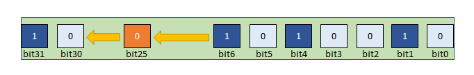
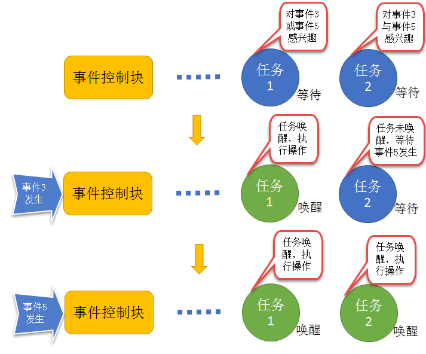
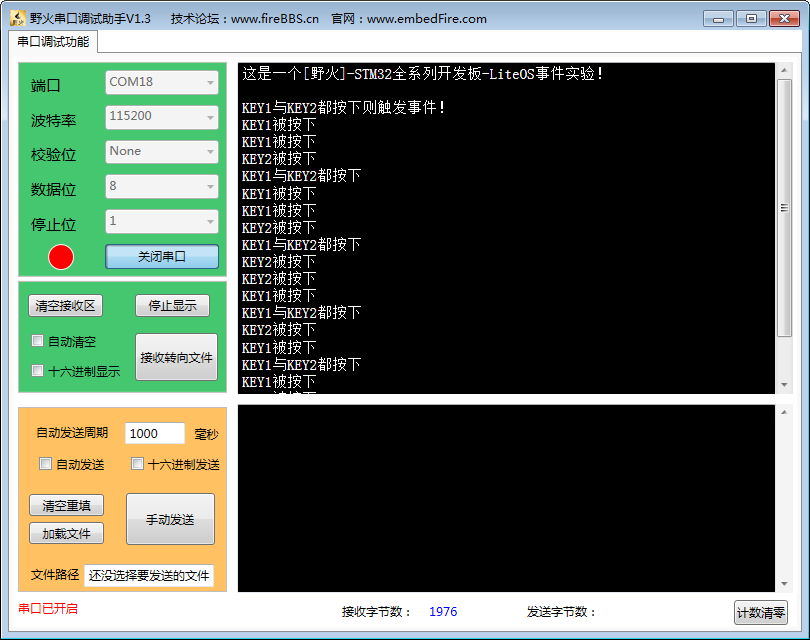

.. vim: syntax=rst

事件
=======

读者回想一下在裸机编程中是不是经常用到标记变量呢？它用来标志某个事件的发生情况，然后在循环中判断事件是否发生，如果是等待多个事件的话，
还会通过多个标记进行判断，如if((xxx_flag)&&(xxx_flag))。当然，更加有效的用法就使用变量的某些位进行标志，比如bit0表示事件0，bit1表示
事件1，当两个事件都发生的时候，就通过判断对应的标记位是否被置1，如：if(0x03 == (xxx_flag&0x03))。然而在操作系统中，也是可以使用事件
作为同步的处理，并且实现阻塞机制，操作系统中的事件是一种数据结构而非标记变量。

事件的基本概念
~~~~~~~~~~~~~~~~~

事件是一种实现任务间通信的机制，主要用于实现多任务间的同步，只能实现事件类型的通信，而无无数据传输。事件与信号量不同：它可以实现一对多，
多对多的同步处理。即一个任务可以等待多个事件的发生，可以是任意一个事件发生时唤醒任务，也可以是几个事件都发生后才唤醒任务。同样的，系统
也允许多个任务同步多个事件。

每一个事件控制块只需要很少的内存空间来保存事件信息，事件标记存储在一个UINT32类型的变量uwEventID中，该变量在事件控制块中定义，每一位代
表一个事件，可以称之为事件集合，任务通过“逻辑与”或“逻辑或”与一个或多个事件建立关联，可以称该变量为事件集合。事件的“逻辑或”也被称作是独
立型同步：在任务感兴趣的若干个事件中，任意一个事件发生时任务均可被唤醒；事件“逻辑与”则被称为是关联型同步：在任务感兴趣的若干个事件都发
生时才会被唤醒，事件发生的时间可以不同步。

在多任务环境下，任务与任务、任务与中断之间往往需要同步操作，一个事件的发生会告知等待中的任务，即形成一个任务与任务、中断与任务间的同步。
LiteOS事件可以提供一对多、多对多的同步操作。一对多同步模型：一个任务等待多个事件的触发；多对多同步模型：多个任务等待多个事件的触发，任
务可以通过设置事件位来实现事件的触发和等待操作。

LiteOS提供的事件具有如下特点。

    1. 事件相互独立，一个32位的变量（事件集合），用于标识该任务发生的事件类型，其中每一位表示一种事件类型（0表示该事件类型未发生、1表示该事件类型已经发生），一共31种事件类型（第25位保留）。

    2. 事件不提供传输数据功能。

    3. 事件无排队性，即多次向任务设置同一事件（如果任务还未来得及读走），等效于只设置一次。

    4. 允许多个任务对同一事件进行读写操作。

    5. 支持事件等待超时机制。

在LiteOS中，每个事件获取的时候，可以指定任务感兴趣的事件，并且选择读取事件信息标记，它有三个属性，分别是逻辑与（LOS_WAITMODE_AND），逻
辑或（LOS_WAITMODE_OR）以及是否清除事件标记（LOS_WAITMODE_CLR）。当任务等待事件同步时，可以通过任务感兴趣的事件位和事件信息标记来判断
当前接收的事件是否满足要求，如果满足则说明任务等待到对应的事件，系统将唤醒等待的任务；否则，任务会根据用户指定的阻塞时间继续等待下去。

事件的应用场景
~~~~~~~~~~~~~~~~~~~

LiteOS的事件用于事件类型的通讯，无数据传输，即可以用事件做标志位，判断某些事件是否发生了，然后根据结果做处理。可能读者就有疑问了，为什么
不直接用变量做标志呢？其实若是在裸机编程中，用全局变量是最为有效的方法，但在操作系统中，使用全局变量就要考虑以下问题。

    1. 如何对全局变量进行保护呢？如何处理多任务同时对它进行访问？

    2. 如何让内核对事件进行有效管理呢？使用全局变量的话，就需要在任务中轮询查看事件是否发送，这会浪费大量的CPU资源；除此之外还有阻塞超时机制。

所以，在操作系统中，还是使用操作系统提供的通信机制更为简单方便，LiteOS事件具有以下优点。

    1. 允许多个任务对同一事件进行读写操作。

    2. 可以有效的解决中断服务程序和任务之间的同步问题。

    3. 支持事件等待超时机制。

    4. 事件发生可以立即唤醒等待中的任务。

在某些场合，可能需要多个事件发生了才能进行下一步操作，比如大型危险机器的启动，需要检查各项指标，当指标不达标的时候，无法启动，所以需要
事件做等待处理，当所有的指标都检测完毕，机器才允许启动。

事件可使用于多种场合，它能够在一定程度上替代信号量，用于任务与任务间，中断与任务间的同步。一个任务或中断服务程序可以写入事件，那么等待
对应事件的任务将被唤醒并进行处理。但是它与信号量不同的是：事件的写操作是不可累计的，而信号量的释放动作是可累计的。事件另外一个特性是，
任务可等待多个事件发生。此外任务还可以按照需求选择是“逻辑或”“逻辑与”读取事件。而信号量只能识别单一同步动作，不能同时等待多个信号的同步。

各个事件可分别发送或一起写入事件集合中，任务仅对需要的事件进行关注即可，当事件发生时并且满足任务唤醒的条件，任务将被唤醒并执行后续的处理动作。

事件的运作机制
~~~~~~~~~~~~~~~~~~~

任务可以根据事件类型（事件掩码）uwEventMask读取单个或者多个事件，事件读取成功后，如果读取模式设置为LOS_WAITMODE_CLR则会清除已读取到的
事件类型，反之不会清除已读到的事件类型。用户可以选择读取事件的模式，读取事件类型中的所有事件或者是任意事件。

任务/中断可以写入指定的事件类型（事件掩码），设置事件集合的某些位为1，系统支持写入多个事件类型，写事件成功可能会触发任务调度。

清除事件时，根据入事件控制块和待清除的事件类型，对事件对应位进行清0操作。

事件控制块中有一个32位的变量uwEventID，可以称之为事件集合，它用于标识该任务发生的事件类型，其中每一位表示一种事件类型（0表示该事件类型未
发生、1表示该事件类型已经发生），一共31种事件类型（第25位保留），如图 事件集合_ 所示。

事件唤醒机制，当任务因为等待某个或者多个事件发生而进入阻塞态，当事件发生的时候会被唤醒，其过程如图 事件唤醒任务示意图_ 所示。

任务1对事件3或事件5感兴趣（逻辑或LOS_WAITMODE_OR），当发生其中的某一个事件都会被唤醒，并且执行相应操作。而任务2对事件3与事件5感兴趣（
逻辑与LOS_WAITMODE_AND），当且仅当事件3与事件5都发生的时候，任务2才会被唤醒，如果只有其中一个事件发生，那么任务2还是会继续等待事件发生。
如果在读事件函数中设置了清除事件位LOS_WAITMODE_CLR，那么当任务2被唤醒后，系统会把事件3和事件5的事件位清零。

事件使用讲解
~~~~~~~~~~~~~~~~~~

事件控制块
^^^^^^^^^^^^^

系统都是通过事件控制块对事件进行操作的，事件控制块中包含了一个32位的uwEventID变量，其变量的各个位表示一个事件，此外还存在一个事件链表
stEventList，用于记录等待事件的任务，所有在等待此事件的任务，事件控制块结构如 代码清单:事件-1_ 所示。

.. code-block:: c
    :caption: 代码清单:事件-1事件控制块
    :name: 代码清单:事件-1
    :linenos:

    /**
    * @ingroup los_event
    * 事件控制结构体
    */
    typedef struct tagEvent {
        UINT32      uwEventID;   /**< 事件控制块中的事件集合，指示逻辑处理的事件*/

        LOS_DL_LIST stEventList;    /**<事件阻塞列表*/
    } EVENT_CB_S, *PEVENT_CB_S;

事件错误代码
^^^^^^^^^^^^^^^^^^

在LiteOS中，与事件相关的函数大多数都会有返回值，其返回值是一些错误代码，方便使用者进行调试，下面列出一些常见的错误代码与参考解决方案，如表 常见事件错误代码说明_ 所示。

.. list-table::
   :widths: 25 25 25 25
   :name: 常见事件错误代码说明
   :header-rows: 0

   * - 序号
     - 定义
     - 描述
     - 参考解决方案

   * - 1
     - LOS_ERRNO_EVENT_SETBIT_INVALID
     - 事件集合的第25个bit不能设置为1，因为该位已经作为错误代码使用
     - 事件集合的第25bit置为0

   * - 2
     - LOS_ERRNO_EVENT_READ_TIMEOUT
     - 读超时
     - 增加等待时间或者重新读取

   * - 3
     - LOS_ERRNO_EVENT_EVENTMASK_INVALID
     - 入参的事件是无效的
     - 传入有效的事件参数

   * - 4
     - LOS_ERRNO_EVENT_READ_IN_INTERRUPT
     - 在中断中读取事件
     - 启动新的任务来获取事件

   * - 5
     - LOS_ERRNO_EVENT_FLAGS_INVALID
     - 读取事件的mode无效
     - 传入有效的mode参数

   * - 6
     - LOS_ERRNO_EVENT_READ_IN_LOCK
     - 任务锁住，不能读取事件
     - 解锁任务，再读取事件

   * - 7
     - LOS_ERRNO_EVENT_PTR_NULL
     - 传入的参数为空指针
     - 传入非空入参

事件初始化函数LOS_EventInit()
^^^^^^^^^^^^^^^^^^^^^^^^^^^^^^^^^^

LiteOS提供事件的初始化函数——LOS_EventInit()，它需要用户定义一个事件控制块结构，然后将事件控制块的地址通过pstEventCB参数传递到事件初始
化函数中， LOS_EventInit()源码如 代码清单:事件-2_ 所示，使用实例如 代码清单:事件-3_ 高亮部分所示。

.. code-block:: c
    :caption: 代码清单:事件-2事件初始化函数LOS_EventInit()源码
    :name: 代码清单:事件-2
    :linenos:

    LITE_OS_SEC_TEXT_INIT UINT32 LOS_EventInit(PEVENT_CB_S pstEventCB)
    {
        if (pstEventCB == NULL) {				(1)
            return LOS_ERRNO_EVENT_PTR_NULL;
        }
        pstEventCB->uwEventID = 0;				(2)
        LOS_ListInit(&pstEventCB->stEventList);		(3)
        return LOS_OK;
    }

-   代码清单:事件-2_  **(1)**\ ：判断事件控制块指针是否有效，如果为NULL则返回错误代码。

-   代码清单:事件-2_  **(2)**\ ：初始化事件集合为0，所有事件尚未发生。

-   代码清单:事件-2_  **(3)**\ ：事件链表初始化。

.. code-block:: c
    :caption: 代码清单:事件-3事件初始化函数LOS_EventInit()实例
    :emphasize-lines: 1-2,4-5
    :name: 代码清单:事件-3
    :linenos:

    /* 定义事件标志组的控制块 */
    static EVENT_CB_S EventGroup_CB;
    UINT32 uwRet = LOS_OK;/* 定义一个返回类型，初始化为成功的返回值 */
    /* 初始化一个事件标志组*/
    uwRet = LOS_EventInit(&EventGroup_CB);
    if (uwRet != LOS_OK)
    {
        printf("EventGroup_CB事件标志组初始化失败！\n");
    }

事件销毁函数LOS_EventDestory()
^^^^^^^^^^^^^^^^^^^^^^^^^^^^^^^^^^^^^^

在某些场合中事件可能只需要使用一次，如危险机器的启动，假如各项指标都达到了，并且机器启动成功了，那事件可能就不会重复使用，那么可以进行
销毁事件。LiteOS提供了一个销毁事件的函数——LOS_EventDestory()，其源码如 代码清单:事件-4_ 所示，使用实例如 代码清单:事件-5_ 高亮部分所示。

.. code-block:: c
    :caption: 代码清单:事件-4事件销毁函数LOS_EventDestory()源码
    :name: 代码清单:事件-4
    :linenos:

    LITE_OS_SEC_TEXT_INIT UINT32 LOS_EventDestory(PEVENT_CB_S pstEventCB)
    {
        if (pstEventCB == NULL) {					(1)
            return LOS_ERRNO_EVENT_PTR_NULL;
        }

        pstEventCB->stEventList.pstNext = (LOS_DL_LIST *)NULL;	(2)
        pstEventCB->stEventList.pstPrev = (LOS_DL_LIST *)NULL;
        return LOS_OK;
    }

-   代码清单:事件-4_  **(1)**\ ：判断事件控制块指针是否有效，如果有效（不为NULL），则进行销毁操作，否则返回错误代码。

-   代码清单:事件-4_  **(1)**\ ：将事件列表的指针指向NULL，清除事件列表。

.. code-block:: c
    :caption: 代码清单:事件-5事件销毁函数LOS_EventDestory()实例
    :emphasize-lines: 1-2,4-5
    :name: 代码清单:事件-5
    :linenos:

    /* 定义事件标志组的控制块 */
    static EVENT_CB_S EventGroup_CB;
    UINT32 uwRet = LOS_OK;/* 定义一个返回类型，初始化为成功的返回值 */
    /* 销毁一个事件标志组*/
    uwRet = LOS_EventDestory(&EventGroup_CB);
    if (uwRet != LOS_OK)
    {
        printf("EventGroup_CB事件销毁失败！\n");
    }

写指定事件函数LOS_EventWrite()
^^^^^^^^^^^^^^^^^^^^^^^^^^^^^^^^^^^

此函数用于写入事件中指定的位，当位被置位之后，阻塞在该位上的任务将会被解锁。使用该函数接口时，通过指定事件设置对应的标志位，然后遍历阻塞
在事件列表上的任务，判断是否满足任务唤醒条件，如果满足则唤醒该任务。需要注意的是uwEventID的第25位是LiteOS保留出来的，原因是为了区别读事
件函数LOS_EventRead()返回的是事件还是错误代码，LOS_EventWrite()源码如 代码清单:事件-6_ 所示。

.. code-block:: c
    :caption: 代码清单:事件-6写指定事件函数LOS_EventWrite()源码
    :name: 代码清单:事件-6
    :linenos:

    LITE_OS_SEC_TEXT UINT32 LOS_EventWrite(PEVENT_CB_S pstEventCB, UINT32 uwEvents)
    {
        LOS_TASK_CB *pstResumedTask;
        LOS_TASK_CB *pstNextTask = (LOS_TASK_CB *)NULL;
        UINTPTR     uvIntSave;
        UINT8       ucExitFlag = 0;

        if (pstEventCB == NULL) {					(1)
            return LOS_ERRNO_EVENT_PTR_NULL;
        }

        if (uwEvents & LOS_ERRTYPE_ERROR) {				(2)
            return LOS_ERRNO_EVENT_SETBIT_INVALID;
        }

        uvIntSave = LOS_IntLock();

        pstEventCB->uwEventID |= uwEvents;				(3)
        if (!LOS_ListEmpty(&pstEventCB->stEventList)) {		(4)
            for (pstResumedTask = LOS_DL_LIST_ENTRY((&pstEventCB->stEventList)->
                                            pstNext, LOS_TASK_CB, stPendList);
                &pstResumedTask->stPendList != (&pstEventCB->stEventList);) {
                pstNextTask = LOS_DL_LIST_ENTRY(pstResumedTask->stPendList.pstNext,
                                                LOS_TASK_CB, stPendList);
                                    (5)
                if (((pstResumedTask->uwEventMode & LOS_WAITMODE_OR) &&
                    (pstResumedTask->uwEventMask & uwEvents) != 0) ||
                    ((pstResumedTask->uwEventMode & LOS_WAITMODE_AND) &&
                    (pstResumedTask->uwEventMask & pstEventCB->uwEventID) ==
                    pstResumedTask->uwEventMask)) {		(6)
                    ucExitFlag = 1;

                    osTaskWake(pstResumedTask, OS_TASK_STATUS_PEND);
                }
                pstResumedTask = pstNextTask;
            }

            if (ucExitFlag == 1) {
                (VOID)LOS_IntRestore(uvIntSave);
                LOS_Schedule();					(7)
                return LOS_OK;
            }
        }

        (VOID)LOS_IntRestore(uvIntSave);
        return LOS_OK;
    }

-   代码清单:事件-6_  **(1)**\ ：判断事件控制块指针是否有效，如果为NULL则返回错误代码。

-   代码清单:事件-6_  **(2)**\ ：判断写入的事件是否为第25位，因为事件集合中的25位是LiteOS保留的，所以如果被写入则返回错误代码。

-   代码清单:事件-6_  **(3)**\ ：使用或运算符写入自定义的事件位。

-   代码清单:事件-6_  **(4)-(5)**\ ：如果有任务阻塞在该事件上，那么，从事件阻塞列表中查找该任务，因为可能有多个任务阻塞在这里，需要将事件阻塞列表进行一次遍历，处理每个任务感兴趣的事件。

-   代码清单:事件-6_  **(6)**\ ：如果刚好写入的事件满足唤醒阻塞任务的条件，那么将变量ucExitFlag的值设置为1，并且将任务从阻塞列表中解除，添加到就绪列表中。

-   代码清单:事件-6_  **(7)**\ ：如果写入的事件满足任务唤醒条件（ucExitFlag=1），就进行一次任务调度。

如果想要记录一个事件的发生，这个事件在事件集合的位置是bit0，当事件还未发生时，事件集合bit0为0，当它发生时，读者只需要往事件集合bit0中
写入1，那这就表示事件已经发生了。为了便于理解，一般操作都是用宏定义来实现：如 #define EVENT (0x01 << x)， “<<x”表示写入事件集合的
bit x ，如 代码清单:事件-7_ 高亮部分所示。

.. code-block:: c
    :caption: 代码清单:事件-7写指定事件函数LOS_EventWrite()实例
    :emphasize-lines: 4-5,13-14,19
    :name: 代码清单:事件-7
    :linenos:

    /* 定义事件标志组的控制块 */
    static EVENT_CB_S EventGroup_CB;

    #define KEY1_EVENT  (0x01 << 0) //设置事件掩码的位0
    #define KEY2_EVENT  (0x01 << 1) //设置事件掩码的位1

    static void Key_Task(void)
    {
        while (1) {//如果KEY1被按下
            if ( Key_Scan(KEY1_GPIO_PORT,KEY1_GPIO_PIN) == KEY_ON ) {
    //			LED1_ON;       //点亮LED1
                printf ( "KEY1被按下\n");
                //置位事件标志组的BIT0
            LOS_EventWrite(&EventGroup_CB, KEY1_EVENT);
            }//如果KEY2被按下
            if (  Key_Scan(KEY2_GPIO_PORT,KEY2_GPIO_PIN) == KEY_ON) {
    //			LED2_ON;            //点亮LED2
                printf ( "KEY2被按下\n");
            LOS_EventWrite(&EventGroup_CB, KEY2_EVENT);	//置位事件标志组的BIT1
            }
            LOS_TaskDelay(20);
        }
    }

读指定事件函数LOS_EventRead()
^^^^^^^^^^^^^^^^^^^^^^^^^^^^^^^^^^

LiteOS提供了一个读取指定事件的函数——LOS_EventRead()，通过这个函数，就可以知道事件集合中的哪一位，哪一个事件发生了，然后可以通过 “逻辑与”
“逻辑或”等操作对感兴趣的事件进行读取。且仅当任务等待的事件发生时，任务才能读取到事件信息。在这段时间中，如果事件一直没发生，该任务将保持
阻塞状态以等待事件发生。当其他任务或中断服务程序往其等待的事件设置对应的标志位时，并且满足读取事件的条件，该任务将自动由阻塞态转为就绪态。
当任务阻塞时间超时，即使事件还未发生，任务也会自动恢复为就绪态。如果正确读取事件则返回事件集合变量的值，由用户判断再做处理，因为在读取事
件时可能会返回不确定的值，如果阻塞时间超时将返回错误代码，所以需要判断任务所等待的事件是否真的发生。LOS_EventRead()函数源码如 代码清单:事件-8_ 所示。

.. code-block:: c
    :caption: 代码清单:事件-8读指定事件函数LOS_EventRead()源码
    :name: 代码清单:事件-8
    :linenos:

    LITE_OS_SEC_TEXT UINT32 LOS_EventRead(PEVENT_CB_S pstEventCB,
                                        UINT32 uwEventMask,
                                        UINT32 uwMode,
                                        UINT32 uwTimeOut)
    {
        UINT32      uwRet = 0;
        UINTPTR     uvIntSave;
        LOS_TASK_CB *pstRunTsk;

        if (pstEventCB == NULL) {					(1)
            return LOS_ERRNO_EVENT_PTR_NULL;
        }

        if (uwEventMask == 0) {					(2)
            return LOS_ERRNO_EVENT_EVENTMASK_INVALID;
        }

        if (uwEventMask & LOS_ERRTYPE_ERROR) {			(3)
            return LOS_ERRNO_EVENT_SETBIT_INVALID;
        }

        if (((uwMode & LOS_WAITMODE_OR) && (uwMode & LOS_WAITMODE_AND)) ||
            uwMode & ~(LOS_WAITMODE_OR | LOS_WAITMODE_AND | LOS_WAITMODE_CLR) ||
            !(uwMode & (LOS_WAITMODE_OR | LOS_WAITMODE_AND))) {
            return LOS_ERRNO_EVENT_FLAGS_INVALID;			(4)
        }

        if (OS_INT_ACTIVE) {					(5)
            return LOS_ERRNO_EVENT_READ_IN_INTERRUPT;
        }

        uvIntSave = LOS_IntLock();
        uwRet = LOS_EventPoll(&(pstEventCB->uwEventID), uwEventMask, uwMode); (6)

        if (uwRet == 0) {
            if (uwTimeOut == 0) {					(7)
                (VOID)LOS_IntRestore(uvIntSave);
                return uwRet;
            }

            if (g_usLosTaskLock) {					(8)
                (VOID)LOS_IntRestore(uvIntSave);
                return LOS_ERRNO_EVENT_READ_IN_LOCK;
            }

            pstRunTsk = g_stLosTask.pstRunTask;			(9)
            pstRunTsk->uwEventMask = uwEventMask;			(10)
            pstRunTsk->uwEventMode = uwMode;			(11)
            osTaskWait(&pstEventCB->stEventList, OS_TASK_STATUS_PEND, uwTimeOut);(12)
            (VOID)LOS_IntRestore(uvIntSave);
            LOS_Schedule();					(13)

            if (pstRunTsk->usTaskStatus & OS_TASK_STATUS_TIMEOUT) {	(14)
                uvIntSave = LOS_IntLock();
                pstRunTsk->usTaskStatus &= (~OS_TASK_STATUS_TIMEOUT);
                (VOID)LOS_IntRestore(uvIntSave);
                return LOS_ERRNO_EVENT_READ_TIMEOUT;
            }

            uvIntSave = LOS_IntLock();
            uwRet = LOS_EventPoll(&pstEventCB->uwEventID,uwEventMask,uwMode); (15)
            (VOID)LOS_IntRestore(uvIntSave);
        } else {
            (VOID)LOS_IntRestore(uvIntSave);
        }

        return uwRet;
    }

-   代码清单:事件-8_  **(1)**\ ：判断事件控制块指针是否有效，如果为NULL则返回错误代码。

-   代码清单:事件-8_  **(2)**\ ：判断等待的事件是否有效，如果无效则返回错误代码。

-   代码清单:事件-8_  **(3)**\ ：判断事件的第25位是否被置一，如果被置一则错误代码。

-   代码清单:事件-8_  **(4)**\ ：判断读取事件的模式是否有效，若无效则返回错误代码，uwMode可选的参数如下。

    -  所有事件（LOS_WAITMODE_AND）。

    -  任一事件（LOS_WAITMODE_OR）。

    -  清除事件（LOS_WAITMODE_CLR），LOS_WAITMODE_CLR可以与LOS_WAITMODE_AND、LOS_WAITMODE_OR之中的任意一个进行或运算操作。

-   代码清单:事件-8_  **(5)**\ ：如果在中断中读取事件，这是非法操作，返回错误代码。

-   代码清单:事件-8_  **(6)**\ ：检查事件是否满足唤醒任务，根据事件控制块，事件掩码和事件读取模式发生，并根据事件读取模式处理事件，如果返回0则表示事件未满足唤醒任务的条件。

-   代码清单:事件-8_  **(7)**\ ：如果读取的事件与任务感兴趣的事件不符合，同时用户也不设置阻塞时间，那么返回读取事件结果uwRet，这个结果是不确定的值。

-   代码清单:事件-8_  **(8)**\ ：如果调度器已上锁，返回错误代码。

-   代码清单:事件-8_  **(9)**\ ：程序能运行到这里，说明读取不到用户需要的事件，并且用户指定了阻塞时间，系统会获取当前任务的控制块，然后将任务设置为阻塞态以等待事件的发生。

-   代码清单:事件-8_  **(10)**\ ：记录任务等待的事件是哪一个。

-   代码清单:事件-8_  **(11)**\ ：记录任务等待的事件模式是哪一种。

-   代码清单:事件-8_  **(12)**\ ：将任务添加到阻塞链表，阻塞的时间由用户指定。

-   代码清单:事件-8_  **(13)**\ ：进行一次任务调度。

-   代码清单:事件-8_  **(14)**\ ：程序能运行到这里，说明有其他任务或者是中断写入了事件，或者是阻塞的时间到了，系统需要判断一下解除阻塞的原因，如果是由于等待的时间超时，则返回错误代码LOS_ERRNO_EVENT_READ_TIMEOUT。

-   代码清单:事件-8_  **(15)**\ ：程序能运行到这里，说明是其他任务或者是中断写入了事件，并且满足唤醒任务的条件，那么系统会再检查一次任务等待的事件是否与事件控制块中的事件吻合，根据用户指定的uwEventMask、uwMode决定是否需要清除事件标志，然后返回唤醒任务的事件的值。

当用户调用这个函数接口时，系统首先根据用户指定参数和读取模式来判断任务要等待的事件是否发生，如果已经发生，则根据参数uwMode来决定是否清除
事件的相应标志位，并且返回事件的值，但是这个值并不是一个稳定的值，所以在等待到对应事件的时候，还需判断事件是否与任务需要的一致；如果事件
没有发生，则把任务添加到事件阻塞列表中，把任务等待的事件标志值和等待模式记录下来，直到事件发生或等待时间超时，事件等待函数LOS_EventRead()
使用实例如 代码清单:事件-9_ 高亮部分所示。

.. code-block:: c
    :caption: 代码清单:事件-9读指定事件函数LOS_EventRead()实例
    :emphasize-lines: 2-5,16-20
    :name: 代码清单:事件-9
    :linenos:

    /* 定义事件标志组的控制块 */
    static EVENT_CB_S EventGroup_CB;

    #define KEY1_EVENT  (0x01 << 0)//设置事件掩码的位0
    #define KEY2_EVENT  (0x01 << 1)//设置事件掩码的位1
    /***********************************************************************
    * @ 函数名  ： LED_Task
    * @ 功能说明： 等待事件成立
    * @ 参数    ：
    * @ 返回值  ： 无
    *******************************************************************/
    static void LED_Task(void)
    {
        UINT32 uwEvent;
        while (1) {
            /* 等待事件标志组 等待两位均被置位，读取后清除*/
            uwEvent =	LOS_EventRead(&EventGroup_CB, //事件标志组对象
                                    KEY1_EVENT|KEY2_EVENT, //等待BIT0和BIT1
                    LOS_WAITMODE_AND|LOS_WAITMODE_CLR,
                                    LOS_WAIT_FOREVER ); 	//无期限等待
            if ((KEY1_EVENT|KEY2_EVENT) == uwEvent) {
                printf ( "KEY1与KEY2都按下\n");
                LED1_TOGGLE;          //LED1	翻转
    //		LOS_EventClear(&EventGroup_CB, ~KEY1_EVENT); //清除事件标志
    //		LOS_EventClear(&EventGroup_CB, ~KEY2_EVENT); //清除事件标志
            } else {
                printf ( "事件错误！\n");
            }
        }
    }

在读事件时，可以选择读取模式，读取模式如下。

    1. 所有事件（LOS_WAITMODE_AND）：读取掩码中所有事件类型，只有读取的所有事件类型都发生了，才能读取成功。

    2. 任一事件（LOS_WAITMODE_OR）： 读取掩码中任一事件类型，读取的事件中任意一种事件类型发生了，就可以读取成功。

    3. 清除事件（LOS_WAITMODE_CLR）：LOS_WAITMODE_AND\| LOS_WAITMODE_CLR或 LOS_WAITMODE_OR\| LOS_WAITMODE_CLR 时表示读取成功后，对应事件类型位会自动清除。如果模式没有设置为自动清除的话，那么需要手动显式清除。

清除指定事件函数LOS_EventClear()
^^^^^^^^^^^^^^^^^^^^^^^^^^^^^^^^^^^^^

如果在获取事件的时候没有将对应的标志位清除，那就需要使用LOS_EventClear()函数显式清除事件标志，其源码如 代码清单:事件-10_ 所示，使用实例如 代码清单:事件-11_ 高亮部分所示。

.. code-block:: c
    :caption: 代码清单:事件-10清除指定事件函数LOS_EventClear()源码
    :name: 代码清单:事件-10
    :linenos:

    LITE_OS_SEC_TEXT_MINOR UINT32 LOS_EventClear(PEVENT_CB_S pstEventCB, UINT32 uwEvents)
    {
        UINTPTR uvIntSave;

        if (pstEventCB == NULL) {					(1)
            return LOS_ERRNO_EVENT_PTR_NULL;
        }
        uvIntSave = LOS_IntLock();
        pstEventCB->uwEventID &= uwEvents;				(2)
        (VOID)LOS_IntRestore(uvIntSave);

        return LOS_OK;
    }

-   代码清单:事件-10_  **(1)**\ ：判断事件控制块指针是否有效，如果有效（不为NULL），则进行清除操作，否则返回错误代码。

-   代码清单:事件-10_  **(2)**\ ：对事件的标志位进行按位清除操作，但是需要注意将uwEvents参数取反。

.. code-block:: c
    :caption: 代码清单:事件-11清除指定事件函数LOS_EventClear()实例
    :emphasize-lines: 2-5,16-20,24-25
    :name: 代码清单:事件-11
    :linenos:

    /* 定义事件标志组的控制块 */
    static EVENT_CB_S EventGroup_CB;

    #define KEY1_EVENT  (0x01 << 0)//设置事件掩码的位0
    #define KEY2_EVENT  (0x01 << 1)//设置事件掩码的位1
    /***********************************************************************
    * @ 函数名  ： LED_Task
    * @ 功能说明： 等待事件成立
    * @ 参数    ：
    * @ 返回值  ： 无
    *******************************************************************/
    static void LED_Task(void)
    {
        UINT32 uwEvent;
        while (1) {
            /* 等待事件标志组 等待两位均被置位，读取后清除*/
            uwEvent =	LOS_EventRead(&EventGroup_CB, //事件标志组对象
                                    KEY1_EVENT|KEY2_EVENT, //等待BIT0和BIT1
                    LOS_WAITMODE_AND,
                                    LOS_WAIT_FOREVER ); 	//无期限等待
            if ((KEY1_EVENT|KEY2_EVENT) == uwEvent) {
                printf ( "KEY1与KEY2都按下\n");
                LED1_TOGGLE;          //LED1	翻转
            LOS_EventClear(&EventGroup_CB, ~KEY1_EVENT); //清除事件标志
            LOS_EventClear(&EventGroup_CB, ~KEY2_EVENT); //清除事件标志
            } else {
                printf ( "事件错误！\n");
            }
        }
    }

事件标志组实验
~~~~~~~~~~~~~~~~~~~

事件标志组实验是在LiteOS中创建了两个任务，一个是写事件任务，一个是读事件任务，两个任务独立运行，写事件任务通过检测按键的按下情况写入不
同的事件，读事件任务则读取这两个事件标志位，并且判断两个事件是否都发生，如果是则输出相应信息。等待事件任务的等待时间是LOS_WAIT_FOREVER，
一直在等待事件的发生，等待到事件之后清除对应的事件标记位，如 代码清单:事件-12_ 高亮部分所示。

.. code-block:: c
    :caption: 代码清单:事件-12事件标志组实验源码
    :emphasize-lines: 47-48,54-55,117-121,188-208,215-236
    :name: 代码清单:事件-12
    :linenos:

    /***************************************************************
    * @file    main.c
    * @author  fire
    * @version V1.0
    * @date    2018-xx-xx
    * @brief   STM32全系列开发板-LiteOS！
    **************************************************************
    * @attention
    *
    * 实验平台:野火 F103-霸道 STM32 开发板
    * 论坛    :http://www.firebbs.cn
    * 淘宝    :http://firestm32.taobao.com
    *
    ***************************************************************
    */
    /* LiteOS 头文件 */
    #include "los_sys.h"
    #include "los_task.ph"
    /* 板级外设头文件 */
    #include "bsp_usart.h"
    #include "bsp_led.h"
    #include "bsp_key.h"

    /*************************** 任务ID *********************************/
    /*
    * 任务ID是一个从0开始的数字，用于索引任务，当任务创建完成之后，它就具有了一个任务ID
    * 以后要想操作这个任务都需要通过这个任务ID，
    * 
    */

    /* 定义任务ID变量 */
    UINT32 LED_Task_Handle;
    UINT32 Key_Task_Handle;

    /**************************** 内核对象ID ****************************/
    /*
    * 信号量，消息队列，事件标志组，软件定时器这些都属于内核的对象，要想使用这些内核
    * 对象，必须先创建，创建成功之后会返回一个相应的ID。实际上就是一个整数，后续
    * 就可以通过这个ID操作这些内核对象。
    *
    * 
    内核对象就是一种全局的数据结构，通过这些数据结构可以实现任务间的通信，
    * 任务间的事件同步等各种功能。至于这些功能的实现是通过调用这些内核对象的函数
    * 来完成的
    *
    */
    /* 定义事件标志组的控制块 */
    static EVENT_CB_S EventGroup_CB;

    /*************************** 宏定义 ************************************/
    /*
    * 在写应用程序的时候，可能需要用到一些宏定义。
    */
    #define KEY1_EVENT  (0x01 << 0)//设置事件掩码的位0
    #define KEY2_EVENT  (0x01 << 1)//设置事件掩码的位1

    /* 函数声明 */
    static UINT32 AppTaskCreate(void);
    static UINT32 Creat_LED_Task(void);
    static UINT32 Creat_Key_Task(void);

    static void LED_Task(void);
    static void Key_Task(void);
    static void BSP_Init(void);

    /***************************************************************
    * @brief  主函数
    * @param  无
    * @retval 无
    * @note   第一步：开发板硬件初始化
                第二步：创建App应用任务
                第三步：启动LiteOS，开始多任务调度，启动失败则输出错误信息
    **************************************************************/
    int main(void)
    {
        UINT32 uwRet = LOS_OK;  //定义一个任务创建的返回值，默认为创建成功

        /* 板载相关初始化 */
        BSP_Init();

        printf("这是一个[野火]-STM32全系列开发板-LiteOS事件实验！\n\n");
        printf("KEY1与KEY2都按下则触发事件！\n");

        /* LiteOS 内核初始化 */
        uwRet = LOS_KernelInit();

        if (uwRet != LOS_OK) {
            printf("LiteOS 核心初始化失败！失败代码0x%X\n",uwRet);
            return LOS_NOK;
        }

        uwRet = AppTaskCreate();
        if (uwRet != LOS_OK) {
            printf("AppTaskCreate创建任务失败！失败代码0x%X\n",uwRet);
            return LOS_NOK;
        }

        /* 开启LiteOS任务调度 */
        LOS_Start();
    
        //正常情况下不会执行到这里
        while (1);
    }
    
    
    /***********************************************************************
    * @ 函数名  ： AppTaskCreate
    * @ 功能说明： 任务创建，为了方便管理，所有的任务创建函数都可以放在这个函数里面
    * @ 参数    ： 无
    * @ 返回值  ： 无
    ***************************************************************/
    static UINT32 AppTaskCreate(void)
    {
        /* 定义一个返回类型变量，初始化为LOS_OK */
        UINT32 uwRet = LOS_OK;
    
        /* 创建一个事件标志组*/
        uwRet = LOS_EventInit(&EventGroup_CB);
        if (uwRet != LOS_OK) {
            printf("EventGroup_CB事件标志组创建失败！失败代码0x%X\n",uwRet);
        }
    
        uwRet = Creat_LED_Task();
        if (uwRet != LOS_OK) {
            printf("LED_Task任务创建失败！失败代码0x%X\n",uwRet);
            return uwRet;
        }
    
        uwRet = Creat_Key_Task();
        if (uwRet != LOS_OK) {
            printf("Key_Task任务创建失败！失败代码0x%X\n",uwRet);
            return uwRet;
        }
        return LOS_OK;
    }
    
    
    /******************************************************************
    * @ 函数名  ： Creat_LED_Task
    * @ 功能说明： 创建LED_Task任务
    * @ 参数    ：
    * @ 返回值  ： 无
    ******************************************************************/
    static UINT32 Creat_LED_Task()
    {
        //定义一个返回类型变量，初始化为LOS_OK
        UINT32 uwRet = LOS_OK;
    
        //定义一个用于创建任务的参数结构体
        TSK_INIT_PARAM_S task_init_param;
    
        task_init_param.usTaskPrio = 5;	/* 任务优先级，数值越小，优先级越高 */
        task_init_param.pcName = "LED_Task";/* 任务名 */
        task_init_param.pfnTaskEntry = (TSK_ENTRY_FUNC)LED_Task;
        task_init_param.uwStackSize = 1024;		/* 栈大小 */
    
        uwRet = LOS_TaskCreate(&LED_Task_Handle, &task_init_param);
        return uwRet;
    }
    /*******************************************************************
    * @ 函数名  ： Creat_Key_Task
    * @ 功能说明： 创建Key_Task任务
    * @ 参数    ：
    * @ 返回值  ： 无
    ******************************************************************/
    static UINT32 Creat_Key_Task()
    {
        // 定义一个返回类型变量，初始化为LOS_OK
        UINT32 uwRet = LOS_OK;
        TSK_INIT_PARAM_S task_init_param;
    
        task_init_param.usTaskPrio = 4;	/* 任务优先级，数值越小，优先级越高 */
        task_init_param.pcName = "Key_Task";	/* 任务名*/
        task_init_param.pfnTaskEntry = (TSK_ENTRY_FUNC)Key_Task;
        task_init_param.uwStackSize = 1024;	/* 栈大小 */
    
        uwRet = LOS_TaskCreate(&Key_Task_Handle, &task_init_param);
    
        return uwRet;
    }
    
    /******************************************************************
    * @ 函数名  ： LED_Task
    * @ 功能说明： LED_Task任务实现
    * @ 参数    ： NULL
    * @ 返回值  ： NULL
    *****************************************************************/
    static void LED_Task(void)
    {
        // 定义一个事件接收变量
        UINT32 uwRet;
        /* 任务都是一个无限循环，不能返回 */
        while (1) {
            /* 等待事件标志组 */
            uwRet = LOS_EventRead(&EventGroup_CB, //事件标志组对象
                                KEY1_EVENT|KEY2_EVENT,  //等待任务感兴趣的事件
                                LOS_WAITMODE_AND,     	//等待两位均被置位
                                LOS_WAIT_FOREVER ); 	//无期限等待
    
            if (( uwRet & (KEY1_EVENT|KEY2_EVENT)) == (KEY1_EVENT|KEY2_EVENT)) {
                /* 如果接收完成并且正确 */
                printf ( "KEY1与KEY2都按下\n");
                LED1_TOGGLE;              //LED1	翻转
                LOS_EventClear(&EventGroup_CB,~KEY1_EVENT); //清除事件标志
                LOS_EventClear(&EventGroup_CB,~KEY2_EVENT); //清除事件标志
            }
        }
    }
    /******************************************************************
    * @ 函数名  ： Key_Task
    * @ 功能说明： Key_Task任务实现
    * @ 参数    ： NULL
    * @ 返回值  ： NULL
    *****************************************************************/
    static void Key_Task(void)
    {
        // 定义一个返回类型变量，初始化为LOS_OK
        UINT32 uwRet = LOS_OK;
    
        /* 任务都是一个无限循环，不能返回 */
        while (1) {
            /* KEY1 被按下 */
            if ( Key_Scan(KEY1_GPIO_PORT,KEY1_GPIO_PIN) == KEY_ON ) {
                printf ( "KEY1被按下\n" );
                /* 触发一个事件1 */
                LOS_EventWrite(&EventGroup_CB,KEY1_EVENT);
            }
            /* KEY2 被按下 */
            if ( Key_Scan(KEY2_GPIO_PORT,KEY2_GPIO_PIN) == KEY_ON ) {
                printf ( "KEY2被按下\n" );
                /* 触发一个事件2 */
                LOS_EventWrite(&EventGroup_CB,KEY2_EVENT);
            }
            LOS_TaskDelay(20);     //每20ms扫描一次
        }
    }
    
    
    /*******************************************************************
    * @ 函数名  ： BSP_Init
    * @ 功能说明： 板级外设初始化，所有开发板上的初始化均可放在这个函数里面
    * @ 参数    ：
    * @ 返回值  ： 无
    ******************************************************************/
    static void BSP_Init(void)
    {
        /*
        * STM32中断优先级分组为4，即4bit都用来表示抢占优先级，范围为：0~15
        * 优先级分组只需要分组一次即可，以后如果有其他的任务需要用到中断，
        * 都统一用这个优先级分组，千万不要再分组，切忌。
        */
        NVIC_PriorityGroupConfig( NVIC_PriorityGroup_4 );
    
        /* LED 初始化 */
        LED_GPIO_Config();
    
        /* 串口初始化	*/
        USART_Config();
    
        /* 按键初始化 */
        Key_GPIO_Config();
    }
    
    
    /*************************************END OF FILE*****************/

事件标志组实验现象
~~~~~~~~~~~~~~~~~~~~~~~~~

程序编译好，用USB线连接电脑和开发板的USB接口（对应丝印为USB转串口），用DAP仿真器把配套程序下载到野火STM32开发板（具体型号根据读者买的开发板
而定，每个型号的开发板都配套有对应的程序），在电脑上打开串口调试助手，然后复位开发板就可以在调试助手中看到串口的打印信息，按下开发板的KEY1按
键写入事件1，按下KEY2按键写入事件2；按下KEY1与KEY2，然后在串口调试助手中可以看到运行结果，并且开发板的LED会进行翻转，如图 事件标志组实验现象_ 所示。

