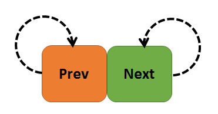

.. vim: syntax=rst

链表
=========

在LiteOS中存在着大量的基础数据结构链表（或者称之为列表List）的操作，要想读懂LiteOS的源码，就必须弄懂链表的基本操作，在列表中的成
员称之为节点（Node），在后续的讲解中，本书所说的链表就是列表。

C语言链表简介
~~~~~~~~~~~~~~~~

链表作为C语言中一种基础的数据结构，在平时写程序的时候用的并不多，但在操作系统里面使用的非常多。链表就好比一个圆形的晾衣架，如
图 圆形晾衣架_ 所示，晾衣架上面有很多钩子，钩子首尾相连。链表也是如此，链表由节点组成，节点与节点之间首尾相连。

.. image:: media/list/list002.jpeg
    :align: center
    :name: 圆形晾衣架
    :alt: 圆形晾衣架

晾衣架的钩子不能代表很多东西，但是钩子本身却可以挂很多东西。同样，链表也类似，链表的节点本身不能存储太多东西，但是节点跟晾衣架的
钩子一样，可以挂载很多数据。

链表分为单向链表和双向链表，本书讲解的链表为双向链表。

双向链表也叫双链表，是链表的一种，是在操作系统中常用的数据结构，它的每个数据节点中都有两个指针，分别指向前驱节点和后继节点。因此，
从双向链表中的任意一个节点开始，都可以很方便地访问它的前驱节点和后继节点，这种数据结构形式使得双向链表在查找时更加方便，特别是大
量数据的遍历，能方便地完成各种插入、删除等操作。

在C语言中，链表与数组很类似，数组的特性是便于索引，而链表的特性是便于插入与删除，两者的示意图如图 链表与数组的对比_ 所示，本书以双向链表为例。

.. image:: media/list/list003.png
    :align: center
    :name: 链表与数组的对比
    :alt: 链表与数组的对比

链表是通过节点把离散的数据链接成一个表，通过对节点的插入和删除操作从而实现对数据的存取。而数组是通过开辟一段连续的内存来存储数据，
这是数组和链表最大的区别。数组的每个成员对应链表的节点，成员和节点的数据类型可以是标准的C类型或者是用户自定义的结构体，数组有起始
地址和结束地址，而链表是一个圈。

链表的使用讲解
~~~~~~~~~~~~~~~~

LiteOS提供了很多操作链表的函数，如链表的初始化、添加节点、删除节点等。

LiteOS的链表节点结构体中只有两个指针，一个是指向前驱节点的指针，另一个是指向后继节点的指针，如 代码清单:链表-1_ 所示。

.. code-block:: c
    :caption: 代码清单:链表-1链表节点结构体
    :name: 代码清单:链表-1
    :linenos:

    typedef struct LOS_DL_LIST {
        struct LOS_DL_LIST *pstPrev;
        struct LOS_DL_LIST *pstNext;

链表初始化函数LOS_ListInit()
^^^^^^^^^^^^^^^^^^^^^^^^^^^^^^^^^^^^^^^^^^^^^^^^^^^

在使用链表的时候必须要先初始化，将链表的指针指向自己，为后续添加节点做准备 ，链表初始化函数LOS_ListInit()的源码如
代码清单:链表-2_ 所示，链表初始化示意图如图 链表初始化示意图_ 所示。

.. code-block:: c
    :caption: 代码清单:链表-2链表初始化函数LOS_ListInit()源码
    :name: 代码清单:链表-2
    :linenos:

    LITE_OS_SEC_ALW_INLINE STATIC_INLINE VOID LOS_ListInit(LOS_DL_LIST *pstList)
    {
        pstList->pstNext = pstList;
        pstList->pstPrev = pstList;
    }

在初始化完成后可以检查一下链表初始化是否成功，判断链表是否为空，链表的初始化实例如 代码清单:链表-3_ 所示。

.. code-block:: c
    :caption: 代码清单:链表-3链表初始化函数LOS_ListInit()实例
    :name: 代码清单:链表-3
    :linenos:

    LOS_DL_LIST *head;			/* 定义一个双向链表的头节点 */
    head = (LOS_DL_LIST *)LOS_MemAlloc(m_aucSysMem0, sizeof(LOS_DL_LIST));
    /* 动态申请头节点的内存 */
    LOS_ListInit(head);		/* 初始化双向链表 */
    if (!LOS_ListEmpty(head))	/* 判断是否初始化成功 */
    {
        printf("双向链表初始化失败!\n\n");
    } else
    {
        printf("双向链表初始化成功!\n\n");
    }

向链表添加节点函数LOS_ListAdd()
^^^^^^^^^^^^^^^^^^^^^^^^^^^^^^^^^^^^^^^^^^^^^^^^^^^^^^^

LiteOS运行向链表中插入节点，插入过程是需要选择插入链表的位置，再执行插入操作，如 代码清单:链表-4_ 所示（源码标注序号对应图片序号），
使用实例如 代码清单:链表-5_ 所示。

.. code-block:: c
    :caption: 代码清单:链表-4向链表添加节点函数LOS_ListAdd()源码
    :name: 代码清单:链表-4
    :linenos:

    LITE_OS_SEC_ALW_INLINE STATIC_INLINE VOID LOS_ListAdd(LOS_DL_LIST *pstList,
                                LOS_DL_LIST *pstNode)
    {
        pstNode->pstNext = pstList->pstNext;		(1)
        pstNode->pstPrev = pstList;			(2)
        pstList->pstNext->pstPrev = pstNode;		(3)
        pstList->pstNext = pstNode;			(4)
    }

插入节点的思想很简单，其过程如图 插入节点的过程示意图_ 所示（pstList 可以看作是Node1）。

.. code-block:: c
    :caption: 代码清单:链表-5向链表添加节点函数LOS_ListAdd()实例
    :name: 代码清单:链表-5
    :linenos:

    printf("添加节点......\n");/* 插入节点*/

    LOS_DL_LIST *node1 = /*动态申请第一个节点的内存 */
    (LOS_DL_LIST *)LOS_MemAlloc(m_aucSysMem0, sizeof(LOS_DL_LIST));
    LOS_DL_LIST *node2 = /*动态申请第二个节点的内存 */
    (LOS_DL_LIST *)LOS_MemAlloc(m_aucSysMem0, sizeof(LOS_DL_LIST));

    printf("添加第一个节点与第二个节点.....\n");
    LOS_ListAdd(head,node1); /* 添加第一个节点，连接在头节点上 */
    LOS_ListAdd(node1,node2); /* 添加第二个节点，连接在第一个节点上 */
    if ((node1->pstPrev == head) && (node2->pstPrev == node1))
    {/* 判断是否插入成功 */
        printf("添加节点成功!\n\n");
    } else
    {
        printf("添加节点失败!\n\n");
    }

从链表删除节点函数LOS_ListDelete()
^^^^^^^^^^^^^^^^^^^^^^^^^^^^^^^^^^^^^^^^^^^^^^^^^^^^^^^^^^^^^

LiteOS支持删除链表中的节点，用户可以使用LOS_ListDelete()函数将节点删除，只需将要删除节点传递到函数中即可，该函数把该节
点的前驱节点与后继节点链接在一起，，然后将该节点的指针指向NULL就表示节点已删除，如 代码清单:链表-6_ 所示，其过程示意图如
图 节点删除过程示意图_ 所示（源码标注序号对应图片序号），LOS_ListDelete()函数使用实例如 代码清单:链表-7_ 所示。

.. code-block:: c
    :caption: 代码清单:链表-6从链表删除节点函数LOS_ListDelete()源码
    :name: 代码清单:链表-6
    :linenos:

    LITE_OS_SEC_ALW_INLINE STATIC_INLINE VOID LOS_ListDelete(LOS_DL_LIST *pstNode)
    {
        pstNode->pstNext->pstPrev = pstNode->pstPrev; 	(1)
        pstNode->pstPrev->pstNext = pstNode->pstNext;	(2)
        pstNode->pstNext = (LOS_DL_LIST *)NULL;		(3)
        pstNode->pstPrev = (LOS_DL_LIST *)NULL;		(4)
    }

.. code-block:: c
    :caption: 代码清单:链表-7从链表删除节点函数LOS_ListDelete()实例
    :name: 代码清单:链表-7
    :linenos:

    printf("删除节点......\n");
    LOS_ListDelete(node1);	/* 删除第一个节点 */
    LOS_MemFree(m_aucSysMem0, node1); /* 释放第一个节点的内存， */
    if (head->pstNext == node2)	/* 判断是否删除成功 */
    {
        printf("删除节点成功\n\n");
    } else
    {
        printf("删除节点失败\n\n");

    }

双向链表实验
~~~~~~~~~~~~~~~

双向链表实验实现如下功能：

    1. 调用LOS_ListInit初始双向链表。

    2. 调用LOS_ListAdd向链表中增加节点。

    3. 调用LOS_ListTailInsert向链表尾部插入节点。

    4. 调用LOS_ListDelete删除指定节点。

    5. 调用LOS_ListEmpty判断链表是否为空。

    6. 测试操作是否成功。

实验源码如 代码清单:链表-8_ 高亮部分所示。

.. code-block:: c
    :caption: 代码清单:链表-8双向链表实验
    :emphasize-lines: 107-153
    :name: 代码清单:链表-8
    :linenos:

    /**
    ***************************************************************
    * @file    main.c
    * @author  fire
    * @version V1.0
    * @date    2018-xx-xx
    * @brief   这是一个[野火]-STM32F103霸道LiteOS的双向链表实验！
    ****************************************************************
    * @attention
    *
    * 实验平台:野火  STM32 F103 开发板
    * 论坛    :http://www.firebbs.cn
    * 淘宝    :https://fire-stm32.taobao.com
    *
    ***************************************************************
    */

    /* LiteOS 头文件 */
    #include "los_sys.h"
    #include "los_typedef.h"
    #include "los_task.ph"
    #include "los_memory.h"
    /* 板级外设头文件 */
    #include "stm32f10x.h"
    #include "bsp_usart.h"
    #include "bsp_led.h"
    #include "bsp_key.h"

    /************************** 任务ID ********************************/
    /*
    * 任务ID是一个从0开始的数字，用于索引任务，当任务创建完成之后，它就具有了一个任务ID
    * 以后读者要想操作这个任务都需要通过这个任务ID，
    *
    */
    /* 定义定时器ID变量 */
    UINT32 Test_Task_Handle;

    /* 函数声明 */
    extern LITE_OS_SEC_BSS UINT8* m_aucSysMem0;

    static void AppTaskCreate(void);
    static UINT32 Creat_Test_Task(void);
    static void Test_Task(void);
    static void BSP_Init(void);

    /**
    * @brief  主函数
    * @param  无
    * @retval 无
    * @note   第一步：开发板硬件初始化
            第二步：创建App应用任务
            第三步：启动LiteOS，开始多任务调度，启动不成功则输出错误信息
    */
    int main(void)
    {
    UINT32 uwRet = LOS_OK;
    /* 板级初始化，所有的跟开发板硬件相关的初始化都可以放在这个函数里面 */
    BSP_Init();
    /* 发送一个字符串 */
    printf("这是一个[野火]-STM32全系列开发板- LiteOS的双向链表实验！\n");
    /* LiteOS 核心初始化 */
    uwRet = LOS_KernelInit();
    if (uwRet != LOS_OK) {
        printf("LiteOS 核心初始化失败！\n");
        return LOS_NOK;
    }
    /* 创建App应用任务，所有的应用任务都可以放在这个函数里面 */
    AppTaskCreate();

    /* 开启LiteOS任务调度 */
    LOS_Start();
    }
    static void AppTaskCreate(void)
    {
    UINT32 uwRet = LOS_OK;/* 定义一个创建任务的返回类型，初始化为创建成功的返回值 */
    /* 创建Test_Task任务 */
    uwRet = Creat_Test_Task();
    if (uwRet != LOS_OK) {
        printf("Test_Task任务创建失败！\n");
    }

    }

    /* 创建Test_Task任务*/
    static UINT32 Creat_Test_Task(void)
    {
    UINT32 uwRet = LOS_OK; /* 定义一个创建任务的返回类型，初始化为创建成功的返回值 */
    TSK_INIT_PARAM_S task_init_param;

    task_init_param.usTaskPrio = 4;/* 优先级，数值越小，优先级越高 */
    task_init_param.pcName = "Test_Task";/* 任务名，字符串形式，方便调试 */
    task_init_param.pfnTaskEntry = (TSK_ENTRY_FUNC)Test_Task;
    task_init_param.uwStackSize = 0x1000;/* 栈大小，单位为字，即4个字节 */

    uwRet = LOS_TaskCreate(&Test_Task_Handle, &task_init_param);
    return uwRet;
    }

    /*******************************************************************
    * @ 函数名  ： Clear_Task
    * @ 功能说明： 写入已经初始化成功的内存池地址数据
    * @ 参数    ： void
    * @ 返回值  ： 无
    ****************************************************************/
    static void Test_Task(void)
    {
        UINT32 uwRet = LOS_OK; /* 定义一个初始化的返回类型，初始化为成功的返回值 */
        printf("\n双向链表初始化中......\n");

        LOS_DL_LIST *head; /* 定义一个双向链表的头节点 */
        head = (LOS_DL_LIST *)LOS_MemAlloc(m_aucSysMem0, sizeof(LOS_DL_LIST));
    /* 动态申请头节点的内存 */
        LOS_ListInit(head); /* 初始化双向链表 */
        if (!LOS_ListEmpty(head)) {	/* 判断是否初始化成功 */
            printf("双向链表初始化失败!\n\n");
        } else {
            printf("双向链表初始化成功!\n\n");
        }

        printf("添加节点和尾节点添加......\n");/* 插入节点：顺序插入与从末尾插入 */

        LOS_DL_LIST *node1 =  /*动态申请第一个节点的内存 */
        (LOS_DL_LIST *)LOS_MemAlloc(m_aucSysMem0, sizeof(LOS_DL_LIST));
        LOS_DL_LIST *node2 = /*动态申请第二个节点的内存 */
    (LOS_DL_LIST *)LOS_MemAlloc(m_aucSysMem0, sizeof(LOS_DL_LIST));
        LOS_DL_LIST *tail =	/*动态申请尾节点的内存 */
    (LOS_DL_LIST *)LOS_MemAlloc(m_aucSysMem0, sizeof(LOS_DL_LIST));

        printf("添加第一个节点与第二个节点.....\n");
        LOS_ListAdd(head,node1);	/* 添加第一个节点，连接在头节点上 */
        LOS_ListAdd(node1,node2); /* 添加第二个节点，连接在一个节点上 */
        if ((node1->pstPrev == head) && (node2->pstPrev == node1)) {
            printf("添加节点成功!\n\n");	/* 判断是否插入成功 */
        } else {
            printf("添加节点失败!\n\n");
        }
        printf("将尾节点插入双向链表的末尾.....\n");
        LOS_ListTailInsert(head, tail); /* 将尾节点插入双向链表的末尾 */
        if (tail->pstPrev == node2) {/* 判断是否插入成功 */
            printf("链表尾节点添加成功!\n\n");
        } else {
            printf("链表尾节点添加失败!\n\n");
        }

        printf("删除节点......\n");	/* 删除已有节点 */
        LOS_ListDelete(node1); /* 删除第一个节点 */
        LOS_MemFree(m_aucSysMem0, node1);	/* 释放第一个节点的内存， */
        if (head->pstNext == node2) {/* 判断是否删除成功 */
            printf("删除节点成功\n\n");
        } else {
            printf("删除节点失败\n\n");

        }

        while (1) {
            LED2_TOGGLE;			//LED2翻转
            printf("任务运行中!\n");
            LOS_TaskDelay (2000);
        }
    }

    static void BSP_Init(void)
    {
        /*
        * STM32中断优先级分组为4，即4bit都用来表示抢占优先级，范围为：0~15
        * 优先级分组只需要分组一次即可，以后如果有其他的任务需要用到中断，
        * 都统一用这个优先级分组，千万不要再分组，切忌。
        */
        NVIC_PriorityGroupConfig( NVIC_PriorityGroup_4 );

        /* LED 初始化 */
        LED_GPIO_Config();

        /* 串口初始化	*/
        USART_Config();

        /* 按键初始化 */
        Key_GPIO_Config();
    }

    /***************************END OF FILE**********************/

双向链表实验现象
~~~~~~~~~~~~~~~~~~~~

程序编译好，用USB线连接电脑和开发板的USB接口（对应丝印为USB转串口），用DAP仿真器把配套程序下载到野火STM32开发板（具体型
号根据读者买的开发板而定，每个型号的开发板都配套有对应的程序），在电脑上打开串口调试助手，然后复位开发板就可以在调试助手
中看到串口的打印信息，在串口调试助手中可以看到运行结果，它里面输出了信息表明双向链表的操作已经全部完成，如图 双向链表实验现象_ 所示。

