.. vim: syntax=rst

内存管理
==========

在计算系统中，变量、中间数据一般存放在系统存储空间中，只有在实际使用时才将它们从存储空间调入到中央处理器内部进行运算。通常存储空间可
以分为两种：内部存储空间和外部存储空间。内部存储空间访问速度比较快，能够按照变量地址随机地访问，也就是读者通常所说的RAM（随机存储器），
或电脑的内存；而外部存储空间内所保存的内容相对来说比较固定，即使掉电后数据也不会丢失，可以把它理解为电脑的硬盘。在本章中主要讨论内部
存储空间（RAM）的管理——内存管理。

内存管理基本概念
~~~~~~~~~~~~~~~~~~~~~~~~

LiteOS操作系统将内核与内存管理分开实现，操作系统内核仅规定了必要的内存管理函数原型，而不关心内存管理的函数是如何实现的，所以在LiteOS
中提供了多种内存分配算法（分配策略），但是上层接口（API）却是统一的。这样做可以增加系统的灵活性：用户可以选择对自己更有利的内存管理
策略，在不同的应用场合使用不同的内存分配策略。

在嵌入式程序设计中，内存分配应该是根据所设计系统的特点来决定选择使用动态内存分配或者是静态内存分配算法，一些可靠性要求非常高的系统应
选择使用静态的，而普通的业务系统可以使用动态以提高系统内存利用率。静态分配可以保证设备的可靠性但内存利用率低，而动态内存分配则相反。

LiteOS内存管理模块用于管理系统的内存资源，它是操作系统的核心模块之一，主要包括内存的初始化、分配以及释放。在电脑中可以使用 malloc()
和 free()函数动态的分配/释放内存，但在嵌入式实时操作系统中，调用 malloc()和 free()却是危险的，原因有以下几点。

    1. 这些函数在小型嵌入式系统中并不总是可用的，小型嵌入式设备中的RAM不足。

    2. 它们的实现非常的大，占据了很大的一块代码空间。

    3. 它们都不是安全的。

    4. 它们并不是确定的，每次调用内存分配与释放函数执行的时间可能都不一样。

    5. 它们有可能产生碎片。

    6. 它们会使得链接器配置得复杂。

    7. 如果允许堆空间的生长方向覆盖其他变量占据的内存，它们会成为debug的灾难。

在一般的嵌入式系统中，由于实时性的要求，很少使用虚拟内存机制，所有的内存都需要用户参与分配，直接操作物理内存，因此管理的内存大小不
会超过物理内存大小，系统所有的内存都由用户管理。

此外在嵌入式实时操作系统中，对内存的分配时间要求更为苛刻，分配内存的时间必须是确定的。一般内存管理算法是根据需要存储的数据的长度，
在内存中去寻找一个合适大小的空闲内存块，然后将数据存储在内存块中。而寻找这样一个空闲内存块所耗费的时间是不确定的，因此对于实时系
统来说，这就是不可接受的，实时系统必须要保证内存块的分配过程在可预测的时间内完成，否则实时任务对外部事件的响应也将变得不可确定。

而在嵌入式系统中，内存是十分有限而且是十分珍贵的，而在分配中随着内存不断被分配和释放，整个系统内存区域会产生越来越多的碎片，因为
在分配与释放过程中，导致内存空间中存在一些小的内存块，它们地址不连续，不能够作为连续的内存块分配，所以一定会在某个时间，系统已经
无法分配到合适的内存，导致系统瘫痪。系统中实际是存在空闲内存的，但是因为内存的地址不连续，导致无法分配成功，所以需要一个良好的内
存分配算法来避免这种情况的出现。

不同的嵌入式系统具有不同的内存配置和时间要求，所以单一的内存分配算法只可能适合部分应用程序。因此，LiteOS将内存分配作为可移植层，
LiteOS有针对性的提供了不同的内存分配管理算法，这使得不同的应用程序可以选择适合自身的内存分配算法。

在系统运行过程中，是需要对内存进行管理的，LiteOS提供了内存管理模块给用户使用，内存管理模块通过对内存的分配、释放操作，来管理用户
和OS对内存的使用，使内存的利用率和效率达到最优，同时最大限度地解决系统的内存碎片问题。

LiteOS的内存管理分为静态内存管理和动态内存管理，提供内存初始化、分配、释放等功能，不同的分配算法各有优缺点。

动态分配：在动态内存池中分配用户指定大小的内存块。

-  优点：按需分配。

-  缺点：内存池中可能出现碎片。

静态分配：在静态内存池中分配用户初始化时预设（固定）大小的内存块。

-  优点：分配和释放效率高，静态内存池中无碎片。

-  缺点：只能分配到初始化预设大小的内存块，不能按需分配。

LiteOS提供了多种内存分配算法，默认使用BestFit little（最佳适应算法），所谓“最佳”是指每次分配内存时，总是把最合适内存块大小分配出去，避免“大材小用”。

特点：每次分配的内存块都是最合适大小的，该分配算法尽可能保留系统中连续的内存块，减小内存碎片的情况。

缺点：分配算法时间消耗较大。

内存管理的应用场景
~~~~~~~~~~~~~~~~~~~~~~~~~

内存管理的主要工作是动态划分并管理用户分配好的内存区间，在用户需要使用大小不确定的内存块时按需分配。当用户需要分配内存时，可以通过操作系统
的内存分配函数索取指定大小内存块，一旦使用完毕，通过内存释放函数归还所占用内存块，使之可以重复使用。

例如：用户需要定义一个float型数组：floatArr[];

但是，在使用数组的时候，总有一个问题需要去解决：这个数组应该有多大？在很多的情况下，用户并不能确定要使用多大的数组，可能为了避免发生错误就
需要把数组定义得足够大。即使读者知道想利用的空间大小，但是如果因为某种特殊原因空间利用的大小有增加或者减少，那么一旦发生改变，读者就必须重
新去修改程序，扩大数组的存储范围。这种分配固定大小的内存分配方法称之为静态内存分配。这种内存分配的方法存在比较严重的缺陷，在大多数情况下会
浪费大量的内存空间，在少数情况下，当定义的数组不够大时，可能引起下标越界错误，甚至导致严重后果。

本书用动态内存分配就可以解决上面的问题，所谓动态内存分配就是指在程序执行的过程中动态地分配或者回收存储空间的分配内存的方法。动态内存分配
不需要预先分配存储空间，而是由系统根据程序的需要即时分配，且分配的大小就是程序要求的大小。

内存管理的运作机制
~~~~~~~~~~~~~~~~~~~~~~~~~

动态内存管理（接管中断方式）
^^^^^^^^^^^^^^^^^^^^^^^^^^^^^^^^^^^^^^^^^^

动态内存管理，即在内存资源充足的情况下，从系统配置的一块比较大的连续内存堆（其大小为OS_SYS_MEM_SIZE），根据用户需求，分配任意大小的内存块，
当用户不需要该内存块时，可以释放该内存。与静态内存相比，动态内存管理的好处是按需分配，缺点是消耗的时间较多并且可能产生内存碎片。

在LiteOS中，系统管理的内存大小为OS_SYS_MEM_SIZE，该宏由用户配置，用户可以在内存堆中随意分配内存使用，当内存使用完成后，应及时把该内存释放，
内存管理可以分为以下过程。

1. 初始化内存：在使用内存之前，必须首先初始化内存堆，LiteOS在内核初始化的时候就已经将管理的内存进行初始化了，内存的起始地址是__LOS_HEAP_ADDR_START__，
内存的结束地址是__LOS_HEAP_ADDR_END__，内存池的大小是OS_SYS_MEM_SIZE，用户可以在分散加载文件中修改内存堆的大小，但是最大不能超过芯片的RAM区域，比
如在野火STM32霸道开发板上，其大小不能超过64K，因为STM32F103ZET6的RAM是64K。初始化一个内存堆后，在内存堆中生成一个内存信息管理节点（LOS_HEAP_MANAGER），
而剩余的内存全部被标记为FreeNode，表示未使用的内存，在每一个空闲内存块（FreeNode）头部都有一个空闲内存块节点用于记录内存块的信息，如图 内存初始化_ 所示。

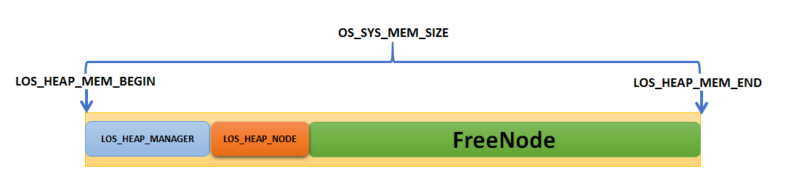

2. 分配内存：当系统内存堆初始化完毕后，用户就可以从系统所管理的内存堆中分配内存了。在LiteOS中，主要使用LOS_MemAlloc()函数分配内存，系统
根据指定的内存大小从内存堆中分配内存，其大小不能超过当前系统管理的可用内存大小。调用三次LOS_MemAlloc()函数可以分配三个内存空间，假设名
称分别为UsedA，UsedB，UsedC，大小分别为sizeA，sizeB，sizeC，剩下的内存则被标记为FreeNode，因为刚初始化完内存堆时只有一个空闲内存块FreeNode，
通过内存分配算法，将所需的内存块从FreeNode中切割，如图 分配内存_ 所示。

3. 释放内存：因为在嵌入式系统中，内存是系统3紧缺资源，当不需要内存块时，应及时释放该内存。在LiteOS 中，可以使用LOS_MemFree()函数释放不再使
用的内存，系统会自动将内存释放到系统管理的内存堆中，假设调用LOS_MemFree()释放内存块UsedB，则会回收内存块UsedB，并且将其标记为FreeNode，如
图 释放内存_ 所示。

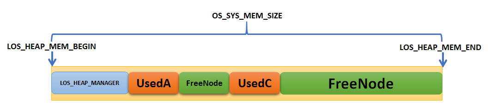

动态内存管理（非接管中断方式）
^^^^^^^^^^^^^^^^^^^^^^^^^^^^^^^^^^^^^^^^^^^

对于非接管中断方式的内存管理其实也是一样的，用户可以在target_config.h文件中自定义系统管理的内存大小OS_SYS_MEM_SIZE。

静态内存池管理
^^^^^^^^^^^^^^^^^^^

静态内存实质上是一块静态数组（可以称之为内存池或静态内存池），静态内存池中的内存块大小需要用户在初始化时设定，初始化后内存块大小不可变更。静态内存池由一个控制块和若干相同大小的内存块构成，内存控制块（也可以称之为内存池信息结构LOS_MEMBOX_INFO）位于内存池头部，用于内存块管理，每个内存块
头部也有一个内存节点信息结构LOS_MEMBOX_NODE，用于将内存块链接起来形成内存块链表，内存块的分配和释放以块大小为粒度，如图 静态内存池示意图_ 所示。

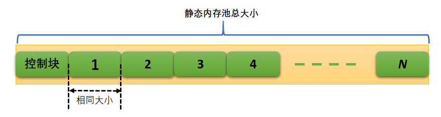

静态内存池使用讲解
~~~~~~~~~~~~~~~~~~~~~~~~~

对于一些安全型的嵌入式系统，通常不允许动态内存分配，那么可以采用非常简单的内存管理策略，在满足设计要求的前提下，内存分配越简单其安全性越高，LiteOS提供了静态内存池管理相关的函数。

静态内存池管理的典型场景开发流程如下。

    1. 规划一个内存区域作为静态内存池。

    2. 调用LOS_MemboxInit()函数将静态内存池进行初始化。

    3. 调用LOS_MemboxAlloc()函数分配内存块，系统将从内存块空闲链表中获取第一个空闲块，并返回该块的用户空间地址，

    4. 调用LOS_MemboxFree()函数将该块内存插入空闲块链表，进行内存的释放。

    5. 调用LOS_MemboxClr()函数将内存块信息清除。

静态内存池控制块
^^^^^^^^^^^^^^^^^^^^^^^^

在静态内存池管理中，LiteOS通过内存控制块保存内存相关信息，如内存块大小、内存块总数、已使用内存块数量，内存块链接指针等，如 代码清单:内存-1_ 所示。

.. code-block:: c
    :caption: 代码清单:内存-1静态内存池控制块
    :name: 代码清单:内存-1
    :linenos:

    /**
    * @ingroup los_membox
    * 内存池信息控制块
    */
    typedef struct {
        UINT32           uwBlkSize;    	(1)
        UINT32           uwBlkNum;       	(2)
        UINT32           uwBlkCnt;       	(3)
        LOS_MEMBOX_NODE  stFreeList;        (4)
    } LOS_MEMBOX_INFO;

-   代码清单:内存-1_ **(1)**\ ：uwBlkSize是内存块大小。

-   代码清单:内存-1_ **(2)**\ ：uwBlkNum是内存块总数。

-   代码清单:内存-1_ **(3)**\ ：uwBlkCnt是已经分配使用的块数。

-   代码清单:内存-1_ **(4)**\ ：内存块链接指针，链接内存池中的空闲内存块，初始化完成时所有内存块处于空闲状态，并且都被链接在空
    闲内存块链表上。用户申请时从空闲内存块链表头部取下一个内存块，用户释放时将内存块重新加入到该链表的头部。

静态内存池初始化函数LOS_MemboxInit()
^^^^^^^^^^^^^^^^^^^^^^^^^^^^^^^^^^^^^^^^^^^^^^^^^^^^^^^^^^^^^^^^^^^^^^^^^^^^^^

在初次使用静态内存池时需要将内存池初始化，用户必须要设定内存池的起始地址、总大小及每个块大小，静态内存池初始化函数LOS_MemboxInit()源码如 代码清单:内存-2_ 所示。

.. code-block:: c
    :caption: 代码清单:内存-2静态内存池初始化函数LOS_MemboxInit()源码
    :name: 代码清单:内存-2
    :linenos:

    LITE_OS_SEC_TEXT_INIT UINT32 LOS_MemboxInit(VOID *pBoxMem,   	(1)
            UINT32 uwBoxSize,					(2)
            UINT32 uwBlkSize)					(3)
    {
        LOS_MEMBOX_INFO *pstBoxInfo = (LOS_MEMBOX_INFO *)pBoxMem;
        LOS_MEMBOX_NODE *pstNode = NULL;
        UINT32 i;
        UINTPTR uvIntSave;

        if (pBoxMem == NULL || uwBlkSize == 0 ||
            uwBoxSize < sizeof(LOS_MEMBOX_INFO)) {			(4)
            return LOS_NOK;
        }

        if (!IS_BOXMEM_ALIGNED(pBoxMem, OS_BOXMEM_BASE_ALIGN)) {	(5)
            return LOS_NOK;
        }

        uvIntSave = LOS_IntLock();

        /*
        * 节点大小与下一个边界对齐，按4字节对齐。
        * 内存池中一个节点大小不足的内存将被忽略。
        */
        pstBoxInfo->uwBlkSize = LOS_MEMBOX_ALIGNED
                                (uwBlkSize + LOS_MEMBOX_MAGIC_SIZE);	(6)
        pstBoxInfo->uwBlkNum = (uwBoxSize - sizeof(LOS_MEMBOX_INFO))
                            / pstBoxInfo->uwBlkSize;		(7)
        pstBoxInfo->uwBlkCnt = 0;					(8)

        if (pstBoxInfo->uwBlkNum == 0) {				(9)
            LOS_IntRestore(uvIntSave);
            return LOS_NOK;
        }

        pstNode = (LOS_MEMBOX_NODE *)(pstBoxInfo + 1);
        pstBoxInfo->stFreeList.pstNext = pstNode;			(10)

        for (i = 0; i < pstBoxInfo->uwBlkNum - 1; ++i) {
            pstNode->pstNext = OS_MEMBOX_NODE_NEXT(pstNode,
                                                pstBoxInfo->uwBlkSize);
            pstNode = pstNode->pstNext;				(11)
        }
        pstNode->pstNext = (LOS_MEMBOX_NODE *)NULL;  /* 下一个节点 */

    #if (LOSCFG_PLATFORM_EXC == YES)
        osMemInfoUpdate(pBoxMem, uwBoxSize, MEM_MANG_MEMBOX);
    #endif

        (VOID)LOS_IntRestore(uvIntSave);

        return LOS_OK;
    }

-   代码清单:内存-2_ **(1)**\ ：pBoxMem是内存池地址，需要用户定义。

-   代码清单:内存-2_ **(2)**\ ：uwBoxSize是内存池大小，由用户定义，uwBoxSize参数值应符合以下两个条件：小于或等于内存池大小；大于LOS_MEMBOX_INFO的大小。

-   代码清单:内存-2_ **(3)**\ ：uwBlkSize是内存块大小，由用户定义。

-   代码清单:内存-2_ **(4)**\ ：判断传入的内存池地址是否有效，如果是无效的，返回错误代码。如果设置的内存块大小为0，也将返回错误代码，内存块大小不允许为0。如果内存池大小小于内存控制块大小，也会返回错误代码。

-   代码清单:内存-2_ **(5)**\ ： 如果内存池不按照4字节对齐，则返回错误代码。

-   代码清单:内存-2_ **(6)**\ ：初始化静态内存池中每个内存块的大小。

-   代码清单:内存-2_ **(7)**\ ：根据设置的内存池大小与内存块大小计算分配的内存块总数。

-   代码清单:内存-2_ **(8)**\ ：初始化已分配内存块数量为0。

-   代码清单:内存-2_ **(9)**\ ：如果内存块的总数是0，返回错误。

-   代码清单:内存-2_ **(10)**\ ：内存控制块的空闲链表指针指向第一个可用内存块。

-   代码清单:内存-2_ **(11)**\ ：将所有可用的内存块节点连接起来，如图 初始化后内存示意图_ 所示。

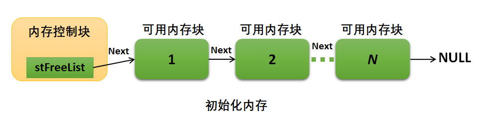

调用静态内存池初始化函数LOS_MemboxInit()后，系统会将指定的内存区域分割为N块（\ *N*\ 值取决于静态内存池总大小和内存块大小），
将所有内存块链接到空闲链表，并在内存起始处放置内存控制块。静态内存池初始化函数LOS_MemboxInit()的使用实例如代 代码清单:内存-3_ 高亮部分所示。

.. code-block:: c
    :caption: 代码清单:内存-3静态内存池初始化函数LOS_MemboxInit()实例
    :emphasize-lines: 10-13
    :name: 代码清单:内存-3
    :linenos:

    /* 相关宏定义 */
    #define  MEM_BOXSIZE   50		//内存池大小
    #define  MEM_BLKSIZE   3		//内存块大小

    static UINT32 BoxMem[MEM_BOXSIZE*MEM_BLKSIZE]; //定义一个数组保证内存池的连续
    UINT32 *p_Num = NULL;			//指向读写内存池地址的指针
    UINT32 *p_Initial = NULL;		//保存初始指针

    UINT32 uwRet = LOS_OK;
    /* 初始化内存池 */
    uwRet = LOS_MemboxInit(&BoxMem[0], 	/* 内存池地址 */
                            MEM_BOXSIZE,	/* 内存池大小 */
                            MEM_BLKSIZE);	/* 内存块大小 */
    if (uwRet != LOS_OK)
    {
        printf("内存池初始化失败\n");
    } else
    {
        printf("内存池初始化成功!\n");
    }

静态内存池分配函数LOS_MemboxAlloc()
^^^^^^^^^^^^^^^^^^^^^^^^^^^^^^^^^^^^^^^^^^^^^^^^^^^^^^^^^^^^^^^^^^^^^^^^^^^^^^

在初始化静态内存池之后才能分配内存，LOS_MemboxAlloc()函数源码如 代码清单:内存-4_ 所示，函数需要传递一个静态内存池指针，表示从哪个静态内存池中分配内存块。

.. code-block:: c
    :caption: 代码清单:内存-4 静态内存池分配函数LOS_MemboxAlloc()源码
    :name: 代码清单:内存-4
    :linenos:

    LITE_OS_SEC_TEXT VOID *LOS_MemboxAlloc(VOID *pBoxMem)
    {
        LOS_MEMBOX_INFO *pstBoxInfo = (LOS_MEMBOX_INFO *)pBoxMem;
        LOS_MEMBOX_NODE *pstNode = NULL;
        LOS_MEMBOX_NODE *pRet = NULL;
        UINTPTR uvIntSave;

        if (pBoxMem == NULL) {				(1)
            return NULL;
        }

        uvIntSave = LOS_IntLock();

        pstNode = &pstBoxInfo->stFreeList;			(2)
        if (pstNode->pstNext != NULL) {			(3)
            pRet = pstNode->pstNext;			(4)
            pstNode->pstNext = pRet->pstNext;		(5)
            OS_MEMBOX_SET_MAGIC(pRet);
            pstBoxInfo->uwBlkCnt++;			(6)
        }

        (VOID)LOS_IntRestore(uvIntSave);

        return pRet == NULL ? NULL : OS_MEMBOX_USER_ADDR(pRet); (7)
    } 

-   代码清单:内存-4_ **(1)**\ ：如果要分配的静态内存池地址无效，则返回错误。

-   代码清单:内存-4_ **(2)**\ ：获取内存控制块的空闲链表指针。

-   代码清单:内存-4_ **(3)**\ ：获取空闲链表的第一个内存块判断该内存块是否为NULL。

-   代码清单:内存-4_ **(4)**\ ：如果不为NULL则表示该内存块可用，保存内存块起始地址。

-   代码清单:内存-4_ **(5)**\ ：更新空闲内存块链表的表头指针，指向下一个可用内存块，如图 分配内存示意图_ 所示。

-   代码清单:内存-4_ **(6)**\ ：记录已分配的内存块个数，uwBlkCnt变量加1。

-   代码清单:内存-4_ **(7)**\ ：如果分配成功则返回正确的内存块地址，否则返回NULL。

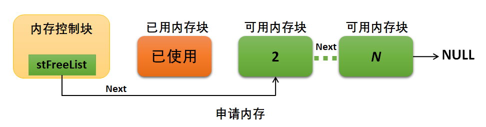

静态内存池分配函数LOS_MemboxAlloc()的使用是很简单的，传递需要分配内存的静态内存池指针即可，因为静态内存池是由用户自己定义的，
在编译的时候就已经确定了静态内存池的大小及地址了，分配成功后返回指向内存块地址，所以需要定义一个可以对内存块地址进行读写的指针，
对分配的内存块进行访问，如 代码清单:内存-5_ 高亮部分所示。

.. code-block:: c
    :caption: 代码清单:内存-5静态内存池分配函数LOS_MemboxAlloc()实例
    :emphasize-lines: 3
    :name: 代码清单:内存-5
    :linenos:

    UINT32 *p_Num = NULL;			//指向读写内存池地址的指针
    static UINT32 BoxMem[MEM_BOXSIZE*MEM_BLKSIZE]; //定义一个数组保证内存池的连续
    p_Num = (UINT32*)LOS_MemboxAlloc(BoxMem); /* 向已经初始化的内存池分配内存 */
    if (NULL == p_Num)
    {
        printf("分配内存失败!\n");
    } else
    {
        printf("分配内存成功!\n");
    }

静态内存池释放函数LOS_MemboxFree()
^^^^^^^^^^^^^^^^^^^^^^^^^^^^^^^^^^^^^^^^^^^^^^^^^^^^^^^^^^^^^^^^^^^^^^^^^

嵌入式系统内存是十分珍贵的，当内存块不再使用的时候就应该把内存归还给系统，否则可能导致系统内存不足。LiteOS提供静态内存池的释
放函数LOS_MemboxFree()，使用该函数可以将内存块归还到对应的静态内存池中，LOS_MemboxFree()函数源码如 代码清单:内存-6_ 所示。

.. code-block:: c
    :caption: 代码清单:内存-6静态内存池释放函数LOS_MemboxFree()源码
    :name: 代码清单:内存-6
    :linenos:

    LITE_OS_SEC_TEXT UINT32 LOS_MemboxFree(VOID *pBoxMem, VOID *pBox)
    {
        LOS_MEMBOX_INFO *pstBoxInfo = (LOS_MEMBOX_INFO *)pBoxMem;
        UINT32 uwRet = LOS_NOK;
        UINTPTR uvIntSave;

        if (pBoxMem == NULL || pBox == NULL) {			(1)
            return LOS_NOK;
        }

        uvIntSave = LOS_IntLock();

        do {
            LOS_MEMBOX_NODE *pstNode = OS_MEMBOX_NODE_ADDR(pBox); 	(2)

            if (osCheckBoxMem(pstBoxInfo, pstNode) != LOS_OK) {	(3)
                break;
            }

            pstNode->pstNext = pstBoxInfo->stFreeList.pstNext;	(4)
            pstBoxInfo->stFreeList.pstNext = pstNode;		(5)
            pstBoxInfo->uwBlkCnt--;				(6)
            uwRet = LOS_OK;
        } while (0);

        (VOID)LOS_IntRestore(uvIntSave);

        return uwRet;
    }

-   代码清单:内存-6_ **(1)**\ ：如果内存池地址为NULL或者内存块地址为NULL，则返回错误代码。

-   代码清单:内存-6_ **(2)**\ ：根据传内存块地址获取偏移得到内存块节点信息结构。

-   代码清单:内存-6_ **(3)**\ ：检查内存块是否有效，如果无效则返回错误。

-   代码清单:内存-6_ **(4)**\ ：将释放的内存块节点添加到空闲链表头部。

-   代码清单:内存-6_ **(5)**\ ： 更新空闲链表的指针，pstNext指向当前释放内存块，如图 释放内存示意图_ 所示。

-   代码清单:内存-6_ **(6)**\ ：记录已经使用的内存块个数，uwBlkCnt变量减1。

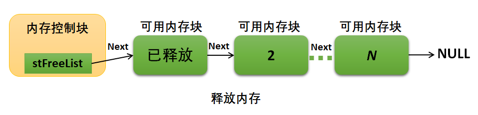

在内存块释放时，需要将释放的内存地址与内存块地址作为参数传递给LOS_MemboxFree()，内存池地址是由用户定义的，内存块地址则是在分配内存时得
到的，如 代码清单:内存-7_ 高亮部分所示。

.. code-block:: c
    :caption: 代码清单:内存-7静态内存池释放函数LOS_MemboxFree()实例
    :emphasize-lines: 6
    :name: 代码清单:内存-7
    :linenos:

    UINT32 *p_Num = NULL;			//指向读写内存池地址的指针
    /* 向已经初始化的内存池分配内存 */
    p_Num = (UINT32*)LOS_MemboxAlloc(BoxMem); //分配成功返回内存块地址

    printf("正在释放内存...........\n");
    uwRet = LOS_MemboxFree(BoxMem, p_Num); //释放内存
    if (LOS_OK == uwRet)
    {
        printf("内存释放成功!\n");//内存释放成功！
    } else
    {
        printf("内存释放失败!\n");//内存释放失败！
    }

静态内存池内容清除函数LOS_MemboxClr()
^^^^^^^^^^^^^^^^^^^^^^^^^^^^^^^^^^^^^^^^^^^^^^^^^^^^^^^^^^^^^^^^^^^^^^^^^^^^^^

LiteOS提供了一个清除内存块内容的函数LOS_MemboxClr()，读者可以使用该函数清除内存块中的内容，如 代码清单:内存-8_ 所示，
LOS_MemboxClr()函数使用实例如 代码清单:内存-9_ 高亮部分所示。

.. code-block:: c
    :caption: 代码清单:内存-8静态内存池内容清除函数LOS_MemboxClr()源码
    :name: 代码清单:内存-8
    :linenos:

    LITE_OS_SEC_TEXT_MINOR VOID LOS_MemboxClr(VOID *pBoxMem, VOID *pBox)
    {
        LOS_MEMBOX_INFO *pstBoxInfo = (LOS_MEMBOX_INFO *)pBoxMem;

        if (pBoxMem == NULL || pBox == NULL) {			(1)
            return;
        }

        memset(pBox, 0, pstBoxInfo->uwBlkSize - LOS_MEMBOX_MAGIC_SIZE); (2)
    }

-   代码清单:内存-8_ **(1)**\ ：如果内存池地址为NULL或者内存块地址为NULL，则返回错误代码。

-   代码清单:内存-8_ **(2)**\ ：将pBox所指向的内存中的内容全部设置为0，清除的内容空间大小为pstBoxInfo->uwBlkSize
- LOS_MEMBOX_MAGIC_SIZE。

.. code-block:: c
    :caption: 代码清单:内存-9静态内存池内容清除函数LOS_MemboxClr()实例
    :emphasize-lines: 3
    :name: 代码清单:内存-9
    :linenos:

    static UINT32 BoxMem[MEM_BOXSIZE*MEM_BLKSIZE];
    p_Num = (UINT32*)LOS_MemboxAlloc(BoxMem);
    LOS_MemboxClr(BoxMem, p_Num);		/* 清除在p_Num地址的内容 */

动态内存使用讲解
~~~~~~~~~~~~~~~~~~~~~~~~

在LiteOS中会经常使用到动态内存分配，如：信号量、队列、互斥锁、软件定时器、等内核对象控制块的内存并不是在编译时静态分配的，而是
在系统初始化时动态分配的。除此之外，任务栈的内存空间也是由系统动态分配的，在创建任务时分配任务栈内存空间，在删除任务时释放任务
栈内存空间，任务栈的大小可以由用户指定，动态分配内存分配使得内存的利用更加灵活，且内存利用率也更高。

使用动态内存分配时需要在配置文件target_config.h中配置OS_SYS_MEM_ADDR宏定义，该宏定义表示系统动态内存池起始地址，此外还需配
置OS_SYS_MEM_SIZE宏定义，它表示系统动态内存池大小，以字节为单位。

动态内存的典型场景开发流程如下。

    1. 使用LOS_MemInit()函数初始化内存堆（在系统内核初始化时就已将内存堆初始化）。

    2. 使用LOS_MemAlloc()函数分配指定大小的内存块。系统会判断内存堆中是否存在分配指定大小的内存空间，若存在，则将该内存块以最适的大小分配给用户，以指针形式返回；若不存在，返回NULL。系统通过内存块链表维护内存堆，在分配内存时，系统将会遍历内存块链表，找到最合适大小的空闲内存块返回给用户。

    3. 使用LOS_MemFree()函数释放动态内存。

动态内存初始化函数LOS_MemInit()
^^^^^^^^^^^^^^^^^^^^^^^^^^^^^^^^^^^^^^^^^^^^^^^^^^^^^^^^^^^^^^^^^^

LiteOS在内核初始化的时候会将系统内存堆进行初始化，如 代码清单:内存-10_ 高亮部分所示，动态内存初始化LOS_MemInit()函数源码如 代码清单:内存-11_ 所示。

.. code-block:: c
    :caption: 代码清单:内存-10 LiteOS初始化管理的所有内存
    :emphasize-lines: 5
    :name: 代码清单:内存-10
    :linenos:

    LITE_OS_SEC_TEXT_INIT UINT32 osMemSystemInit(VOID)
    {
        UINT32 uwRet = LOS_OK;

        uwRet = LOS_MemInit((VOID *)OS_SYS_MEM_ADDR, OS_SYS_MEM_SIZE);

        return uwRet;
    }

.. code-block:: c
    :caption: 代码清单:内存-11动态内存初始化函数LOS_MemInit()源码
    :name: 代码清单:内存-11
    :linenos:

    /******************************************************************
    Function : LOS_MemInit
    Description : 初始化动态内存堆
    Input       : pPool    --- 指向内存堆的指针
                uwSize  --- 要分配的内存大小，以字节为单位
    Output      : None
    Return      : LOS_OK – 初始化成功, LOS_NOK – 初始化错误
    *******************************************************************/
    LITE_OS_SEC_TEXT_INIT UINT32 LOS_MemInit(VOID *pPool, UINT32 uwSize)
    {
        BOOL bRet = TRUE;
        UINTPTR uvIntSave;
    #if (LOSCFG_MEM_MUL_POOL == YES)
        VOID *pNext = g_pPoolHead;
        VOID * pCur = g_pPoolHead;
        UINT32 uwPoolEnd;
    #endif

        if (!pPool || uwSize <= sizeof(struct LOS_HEAP_MANAGER))	(1)
            return LOS_NOK;

        if (!IS_ALIGNED(pPool, OS_MEM_POOL_BASE_ALIGN))
            return LOS_NOK;

        uvIntSave = LOS_IntLock();

    #if (LOSCFG_MEM_MUL_POOL == YES)				(2)
        while (pNext != NULL) {
    uwPoolEnd = (UINT32)pNext + ((struct LOS_HEAP_MANAGER *)pNext)->uwSize;
        if ((pPool <= pNext && ((UINT32)pPool + uwSize) > (UINT32)pNext) ||
    ((UINT32)pPool < uwPoolEnd && ((UINT32)pPool + uwSize) >= uwPoolEnd)) {
                PRINT_ERR("pool [%p, 0x%x) conflict with pool [%p, 0x%x)\n",
    pPool, (UINT32)pPool + uwSize,
    pNext, (UINT32)pNext + ((struct LOS_HEAP_MANAGER *)pNext)->uwSize);

                LOS_IntRestore(uvIntSave);
                return LOS_NOK;
            }
            pCur = pNext;
            pNext = ((struct LOS_HEAP_MANAGER *)pNext)->pNextPool;
        }
    #endif

        bRet = osHeapInit(pPool, uwSize);				(3)
        if (!bRet) {
            LOS_IntRestore(uvIntSave);
            return LOS_NOK;
        }
    #if (LOSCFG_KERNEL_MEM_SLAB == YES)				(4)
        if (uwSize >= SLAB_BASIC_NEED_SIZE) {
            bRet = osSlabMemInit(pPool);
            if (!bRet) {
                LOS_IntRestore(uvIntSave);
                return LOS_NOK;
            }
        }
    #endif

    #if (LOSCFG_MEM_MUL_POOL == YES)
        if (g_pPoolHead == NULL) {
            g_pPoolHead = pPool;
        } else {
            ((struct LOS_HEAP_MANAGER *)pCur)->pNextPool = pPool;
        }

        ((struct LOS_HEAP_MANAGER *)pPool)->pNextPool = NULL;
    #endif

    #if (LOSCFG_PLATFORM_EXC == YES)
        osMemInfoUpdate(pPool, uwSize, MEM_MANG_MEMORY);
    #endif

        LOS_IntRestore(uvIntSave);
        return LOS_OK;
    }

-   代码清单:内存-11_ **(1)**\ ：如果初始化内存堆的地址无效，或初始化内存堆的大小小于LOS_HEAP_MANAGER结构体的容量，则返回错误代码。

-   代码清单:内存-11_ **(2)**\ ：如果开启了LOSCFG_MEM_MUL_POOL宏定义，则进行内存堆相关检查，此处暂时无需理会。

-   代码清单:内存-11_ **(3)**\ ：调用osHeapInit()函数初始化内存堆，其源码如 代码清单:内存-12_ 所示。

-   代码清单:内存-11_ **(4)**\ ：如果开启了LOSCFG_KERNEL_MEM_SLAB内存分配机制，则初始化slab分配器，此处暂时无需理会。

.. code-block:: c
    :caption: 代码清单:内存-12 osHeapInit()源码
    :name: 代码清单:内存-12
    :linenos:

    LITE_OS_SEC_TEXT_INIT BOOL osHeapInit(VOID *pPool, UINT32 uwSz)
    {
        struct LOS_HEAP_NODE* pstNode;
        struct LOS_HEAP_MANAGER *pstHeapMan =
            (struct LOS_HEAP_MANAGER *, pPool);

        if (!pstHeapMan || (uwSz <= (sizeof(struct LOS_HEAP_NODE) +
                                    sizeof(struct LOS_HEAP_MANAGER))))
            return FALSE;

        memset(pPool, 0, uwSz);				(1)

        pstHeapMan->uwSize = uwSz;

        pstNode = pstHeapMan->pstHead =
                    (struct LOS_HEAP_NODE*)((UINT8*)pPool +
                            sizeof(struct LOS_HEAP_MANAGER));	(2)

        pstHeapMan->pstTail = pstNode;				(3)

        pstNode->uwUsed = 0;					(4)
        pstNode->pstPrev = NULL;					(5)
        pstNode->uwSize = uwSz - sizeof(struct LOS_HEAP_NODE) -
                        sizeof(struct LOS_HEAP_MANAGER);		 (6)

        return TRUE;
    }

-   代码清单:内存-12_ **(1)**\ ：将内存堆全部清零。

-   代码清单:内存-12_ **(2)**\ ：每个空闲的内存块都有一个内存块信息节点（用于记录内存块的信息），用户是不允许访问内存块信息节点的（对用
    户是不可见的），只有系统的内存管理模块才允许访问，除此之外，系统中的内存堆中头部还存在内存堆管理结构（也可以称之为内存控制块），用于
    记录内存堆中的信息。系统在空闲内存块中创建一个内存块信息节点，会将内存块地址进行偏移，偏移的大小是内存堆管理结构LOS_HEAP_MANAGER的大小。

-   代码清单:内存-12_ **(3)**\ ：初始化内存堆管理结构，pstTail针指向空闲内存块节点的地址。

-   代码清单:内存-12_ **(4)**\ ：初始化空闲内存块节点信息，uwUsed为0表示未被使用。

-   代码清单:内存-12_ **(5)**\ ：初始化空闲内存块节点的前驱节点为NULL，因为系统当前只有一个空闲内存块。

-   代码清单:内存-12_ **(6)**\ ：计算出系统中可用的空闲内存大小，保存在空闲内存块节点的uwSize中。

内存堆初始化完成后示意图如图 内存堆初始化完成示意图_ 所示，内存堆初始化使用实例如 代码清单:内存-13_ 高亮部分所示。

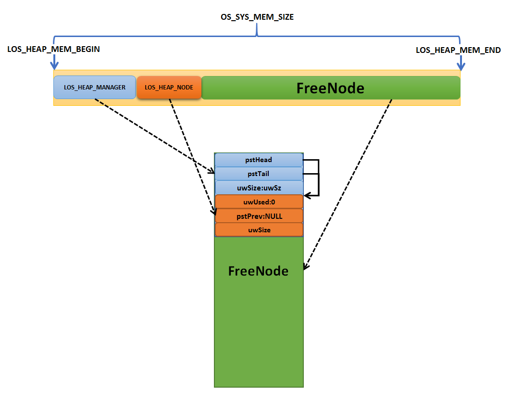

.. code-block:: c
    :caption: 代码清单:内存-13动态内存初始化函数LOS_MemInit()实例
    :emphasize-lines: 3
    :name: 代码清单:内存-13
    :linenos:

    UINT32 uwRet = LOS_OK;

    uwRet = LOS_MemInit(m_aucSysMem0, OS_SYS_MEM_SIZE); //动态内存初始化

动态内存分配函数LOS_MemAlloc()
^^^^^^^^^^^^^^^^^^^^^^^^^^^^^^^^^^^^^^^^^^^^^^^^^^^^^^^^^^^^^^^^^^^^^^^^^^^^^^^^^^^^^^^^^^

分配内存时，系统会遍历内存块链表查找合适大小的内存块，如果找到则将内存块的起始地址返回给用户；如果内存块还允许切割，则取出用户需
要内存空间大小的部分返回给用户，剩下的部分作为新的空闲内存块，插入到空闲内存块链表中，如此一来，极大提高了内存的利用率。动态内存
分配函数LOS_MemAlloc()源码如 代码清单:内存-14_ 所示。

.. code-block:: c
    :caption: 代码清单:内存-14动态内存分配函数LOS_MemAlloc()源码
    :name: 代码清单:内存-14
    :linenos:

    /************************************************************************
    Function : LOS_MemAlloc
    Description : 从内存堆分配内存
    Input       : pPool    ---指向内存堆的指针
                uwSize   ---要分配的内存大小（以字节为单位）
    Output      : None
    Return      : 返回指向已分配内存的指针
    ********************************************************************/
    LITE_OS_SEC_TEXT VOID *LOS_MemAlloc (VOID *pPool, UINT32 uwSize)
    {
        VOID *pRet = NULL;

        if ((NULL == pPool) || (0 == uwSize)) {		(1)
            return pRet;
        }

    #if (LOSCFG_KERNEL_MEM_SLAB == YES)
        pRet = osSlabMemAlloc(pPool, uwSize);		(2)
        if (pRet == NULL)
    #endif
            pRet = osHeapAlloc(pPool, uwSize);		(3)

        return pRet;
    }

-   代码清单:内存-14_ **(1)**\ ：如果要分配的内存堆地址为NULL，或要分配的内存大小为0，返回NULL表示内存分配失败。

-   代码清单:内存-14_ **(2)**\ ：如果使能LOSCFG_KERNEL_MEM_SLAB宏定义，则表示使用slab分配器进行内存分配。

-   代码清单:内存-14_ **(3)**\ ：如果未使能LOSCFG_KERNEL_MEM_SLAB这个宏定义，则使用osHeapAlloc()进行内存的分配，从内存
    堆中分配内存块，osHeapAlloc()函数源码如 代码清单:内存-15_ 所示。

.. code-block:: c
    :caption: 代码清单:内存-15 osHeapAlloc()源码
    :name: 代码清单:内存-15
    :linenos:

    LITE_OS_SEC_TEXT VOID* osHeapAlloc(VOID *pPool, UINT32 uwSz)
    {
        struct LOS_HEAP_NODE *pstNode, *pstT, *pstBest = NULL;
        VOID* pRet = NULL;
        UINT32 uvIntSave;
        struct LOS_HEAP_MANAGER *pstHeapMan =
                    HEAP_CAST(struct LOS_HEAP_MANAGER *, pPool);
        if (!pstHeapMan) {
            return NULL;
        }

        uvIntSave = LOS_IntLock();

        uwSz = ALIGNE(uwSz);
        pstNode = pstHeapMan->pstTail;				(1)

        while (pstNode) {						(2)
            if (!pstNode->uwUsed && pstNode->uwSize >= uwSz &&
                (!pstBest || pstBest->uwSize > pstNode->uwSize)) {
                pstBest = pstNode;
                if (pstBest->uwSize == uwSz) {
                    goto SIZE_MATCH;
                }
            }
            pstNode = pstNode->pstPrev;
        }

        if (!pstBest) { 						(3)
            PRINT_ERR("there's not enough whole to alloc %x Bytes!\n",uwSz);
            goto out;
        }

        if (pstBest->uwSize - uwSz > sizeof(struct LOS_HEAP_NODE)) {(4)

            pstNode = (struct LOS_HEAP_NODE*)(pstBest->ucData + uwSz); (5)

            pstNode->uwUsed = 0;
            pstNode->uwSize = pstBest->uwSize - uwSz- sizeof(struct LOS_HEAP_NODE);
            pstNode->pstPrev = pstBest;				(6)

            if (pstBest != pstHeapMan->pstTail) {
                if ((pstT = osHeapPrvGetNext(pstHeapMan, pstNode)) != NULL)
                    pstT->pstPrev = pstNode;
            } else
                pstHeapMan->pstTail = pstNode;

            pstBest->uwSize = uwSz;
        }

    SIZE_MATCH:
        pstBest->uwAlignFlag = 0;
        pstBest->uwUsed = 1;					(7)
        pRet = pstBest->ucData;
    #if (LOSCFG_MEM_TASK_USED_STATISTICS == YES)
        OS_MEM_ADD_USED(pstBest->uwSize);
    #endif

    #if (LOSCFG_HEAP_MEMORY_PEAK_STATISTICS == YES)
        g_uwCurHeapUsed += (uwSz + sizeof(struct LOS_HEAP_NODE));
        if (g_uwCurHeapUsed > g_uwMaxHeapUsed) {
            g_uwMaxHeapUsed = g_uwCurHeapUsed;
        }
    #endif

    out:
        if (pstHeapMan->pstTail->uwSize < 1024)
            osAlarmHeapInfo(pstHeapMan);

        LOS_IntRestore(uvIntSave);

        if (NULL != pRet) {
            g_uwAllocCount++;
        }

        return pRet;
    }

-   代码清单:内存-15_ **(1)**\ ：获取内存信息管理节点pstHeapMan中成员变量pstTail指向的空闲内存块，从该内存块开始遍历空闲内存块链表。

-   代码清单:内存-15_ **(2)**\ ：遍历整个空闲内存块链表，直到找到最适合用户需要的内存大小的空闲内存块，如果用户需要的内存大小刚好等于空闲内存块大小，则跳转到SIZE_MATCH语句执行，直接返回内存块地址而无需进行切割操作。

-   代码清单:内存-15_ **(3)**\ ：如果没找到，那么分配内存失败，返回错误代码并且退出。

-   代码清单:内存-15_ **(4)**\ ：找到了满足用户需要的内存块，但是内存块的大小比用户指定的大，LiteOS为了避免内存浪费，会将该内存块分割，一部分给用户使用，剩余部分作为新的内存块，插入空闲内存块链表中。

-   代码清单:内存-15_ **(5)**\ ：得到新的空闲内存块节点地址。

-   代码清单:内存-15_ **(6)**\ ：初始化空闲内存块节点的信息，因为新的空闲内存块是未使用的，所以它的uwUsed是0，记录内存块剩余大小uwSize，该值为原内存块大小减去已分配的内存块大小，再减去内存块节点大小，然后将新内存块插入到空闲内存块链表中，并更新内存堆管理结构的信息。

-   代码清单:内存-15_ **(7)**\ ：更新已分配的内存块节点信息，uwUsed设置为1表示该内存块已使用。

分配完成的内存示意图如图 内存分配完成示意图_ 所示，动态内存分配函数LOS_MemAlloc()使用实例如 代码清单:内存-16_ 高亮部分所示。

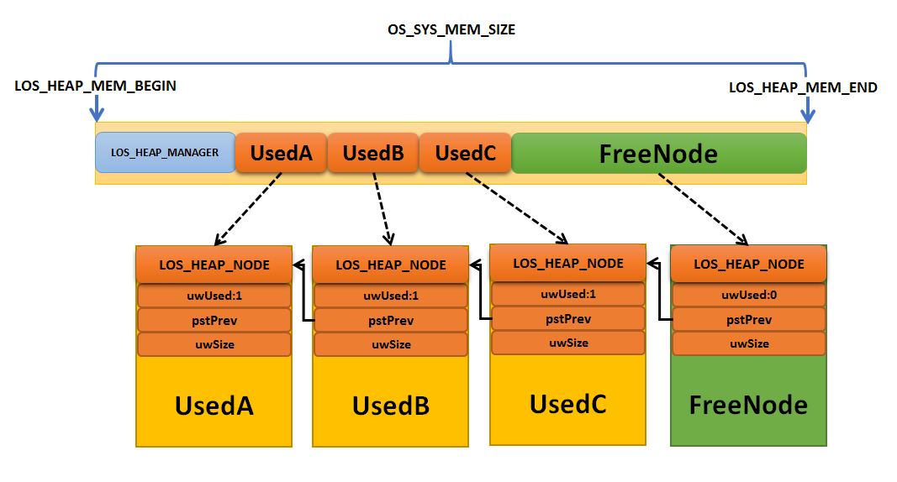

.. code-block:: c
    :caption: 代码清单:内存-16动态内存分配函数LOS_MemAlloc()实例
    :emphasize-lines: 2-3
    :name: 代码清单:内存-16
    :linenos:

    /* 向已经初始化的内存堆分配内存 */
    /* m_aucSysMem0指向要分配的内存块的内存堆地址 ，MALLOC_MEM_SIZE 分配内存的大小*/
    p_Num = (UINT32*)LOS_MemAlloc(m_aucSysMem0,MALLOC_MEM_SIZE);
    if (NULL == p_Num)
    {
        printf("分配内存失败!\n");
    } else
    {
        printf("分配内存成功!\n");
    }

动态内存释放函数LOS_MemFree()
^^^^^^^^^^^^^^^^^^^^^^^^^^^^^^^^^^^^^^^^^^^^^^^^^^^^^^^^^^^^^

嵌入式系统的内存是十分珍贵的，当内存块不再使用的时候就应该及时把内存释放，否则可能导致系统内存不足。LiteOS提供动态内存
释放函数LOS_MemFree()，使用该函数释放动态分配的内存块，源码如 代码清单:内存-17_ 所示。

.. code-block:: c
    :caption: 代码清单:内存-17动态内存释放函数LOS_MemFree()源码
    :name: 代码清单:内存-17
    :linenos:

    /**********************************************************************
    Function : LOS_MemFree
    Description : 释放内存并将其返回到内存堆
    Input       : pPool    ---指向内存堆的指针
                pMem     --- 指向要释放的内存块指针
    Output      : None
    Return      : LOS_OK – 释放成功, LOS_NOK – 释放失败
    ***********************************************************************/
    LITE_OS_SEC_TEXT UINT32 LOS_MemFree (VOID *pPool, VOID *pMem)
    {
        BOOL bRet = FALSE;
        UINT32 uwGapSize;

        if ((NULL == pPool) || (NULL == pMem)) {		(1)
            return LOS_NOK;
        }

    #if (LOSCFG_KERNEL_MEM_SLAB == YES)			(2)
        bRet = osSlabMemFree(pPool, pMem);
        if (bRet != TRUE)
    #endif
        {
            uwGapSize = *((UINT32 *)((UINT32)pMem - 4));
            if (OS_MEM_GET_ALIGN_FLAG(uwGapSize)) {
                uwGapSize = OS_MEM_GET_ALIGN_GAPSIZE(uwGapSize);
                pMem = (VOID *)((UINT32)pMem - uwGapSize);
            }
            bRet = osHeapFree(pPool, pMem);			(3)
        }

        return (bRet == TRUE ? LOS_OK : LOS_NOK);
    }

-   代码清单:内存-17_ **(1)**\ ：如果要释放内存的内存堆地址无效，或要释放的内存块地址无效，返回错误代码。

-   代码清单:内存-17_ **(2)**\ ：如果使用LOSCFG_KERNEL_MEM_SLAB这个宏定义，则表示使用slab分配器进行内存释放。

-   代码清单:内存-17_ **(3)**\ ：如果未使用LOSCFG_KERNEL_MEM_SLAB这个宏定义，则使用osHeapFree()进行内存的释放，源码如 代码清单:内存-18_ 所示。

.. code-block:: c
    :caption: 代码清单:内存-18 osHeapFree()源码
    :name: 代码清单:内存-18
    :linenos:

    LITE_OS_SEC_TEXT BOOL osHeapFree(VOID *pPool, VOID* pPtr)
    {
        struct LOS_HEAP_NODE *pstNode, *pstT;
        UINT32 uvIntSave;
        BOOL bRet = TRUE;

        struct LOS_HEAP_MANAGER *pstHeapMan =
            HEAP_CAST(struct LOS_HEAP_MANAGER *, pPool);

        if (!pstHeapMan || !pPtr) {
            return LOS_NOK;
        }

        if ((UINT32)pPtr < (UINT32)pstHeapMan->pstHead
            || (UINT32)pPtr > ((UINT32)pstHeapMan->pstTail +
                            sizeof(struct LOS_HEAP_NODE))) {
            PRINT_ERR("0x%x out of range!\n", (UINT32)pPtr);
            return FALSE;
        }

        uvIntSave = LOS_IntLock();

        pstNode = ((struct LOS_HEAP_NODE*)pPtr) - 1;		(1)

        /* 检查释放内存的地址是否为内存块的节点*/
        if ((pstNode->uwUsed == 0) ||
            (!((UINT32)pstNode == (UINT32)pstHeapMan->pstHead)
            && ((UINT32)pstNode->pstPrev < (UINT32)pstHeapMan->pstHead
                || (UINT32)pstNode->pstPrev > ((UINT32)pstHeapMan->pstTail +
                                                sizeof(struct LOS_HEAP_NODE))
                || ((UINT32)osHeapPrvGetNext(pstHeapMan,
                            pstNode->pstPrev) != (UINT32)pstNode)
                ))) {						(2)
            bRet = FALSE;
            goto OUT;
        }

        /* 标记为未使用 */
        pstNode->uwUsed = 0;					(3)
    #if (LOSCFG_MEM_TASK_USED_STATISTICS == YES)
        OS_MEM_REDUCE_USED(pstNode->uwSize);
    #endif

    #if (LOSCFG_HEAP_MEMORY_PEAK_STATISTICS == YES)
        if (g_uwCurHeapUsed >= (pstNode->uwSize +
                                sizeof(struct LOS_HEAP_NODE))) {
            g_uwCurHeapUsed -= (pstNode->uwSize +
                                sizeof(struct LOS_HEAP_NODE));
        }
    #endif

        /* 判断能否合并 */
        while (pstNode->pstPrev && !pstNode->pstPrev->uwUsed)	(4)
            pstNode = pstNode->pstPrev;

        while (((pstT = osHeapPrvGetNext(pstHeapMan, pstNode))
                != NULL) && !pstT->uwUsed) {
            pstNode->uwSize += sizeof(struct LOS_HEAP_NODE) + pstT->uwSize;
            if (pstHeapMan->pstTail == pstT)
                pstHeapMan->pstTail = pstNode;
        }

        if ((pstT = osHeapPrvGetNext(pstHeapMan, pstNode)) != NULL)
            pstT->pstPrev = pstNode;

    OUT:
        LOS_IntRestore(uvIntSave);

        if (TRUE == bRet) {
            g_uwFreeCount++;
        }

        return bRet;
    }

-   代码清单:内存-18_ **(1)**\ ：通过传递进来的内存地址进行偏移内存块节点大小（LOS_HEAP_NODE）得到内存块节点地址。

-   代码清单:内存-18_ **(2)**\ ：判断要释放的内存是否合法，如果不合法则无法释放 ，直接跳转到OUT语句，返回错误代码并退出。

-   代码清单:内存-18_ **(3)**\ ：释放内存，将内存块节点中uwUsed成员变量设置为0，表示内存块是未使用的。

-   代码清单:内存-18_ **(4)**\ ：判断释放内存块相邻的内存块是否为空闲内存块，如果是则进行合并。

动态内存释放完成的示意图如图 内存释放完成示意图_ 所示。

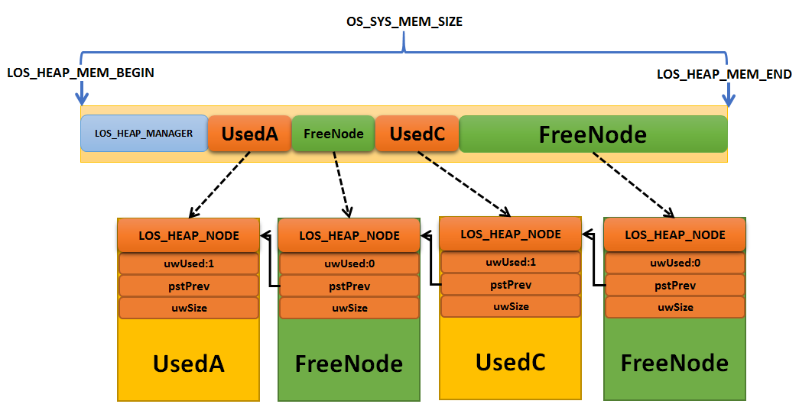

动态内存释放函数需要用户传递正确的内存堆地址与要释放的内存块地址，其使用实例如 代码清单:内存-19_ 高亮部分所示。

.. code-block:: c
    :caption: 代码清单:内存-19动态内存释放函数LOS_MemFree()实例
    :emphasize-lines: 2
    :name: 代码清单:内存-19
    :linenos:

    UINT32 uwRet = LOS_OK;
    uwRet = LOS_MemFree(m_aucSysMem0,p_Num); /* 释放内存*/
    if (LOS_OK == uwRet)
    {
        printf("内存释放成功!\n");
    }

内存管理实验
~~~~~~~~~~~~~~~~~~

静态内存池管理实验
^^^^^^^^^^^^^^^^^^^^^^^^^

静态内存池管理实验是在LiteOS中创建了两个任务，其中一个任务通过按下KEY1分配内存，另一个任务通过按下KEY2清除内存块中的内容以及释
放内存，通过串口输出相关信息。静态内存池区域，可以通过定义全局数组或调用动态内存分配接口方式获取，在不需内存时，注意要及时释放该
段内存，避免内存泄露。实验源码如 代码清单:内存-20_ 高亮部分所示。

.. code-block:: c
    :caption: 代码清单:内存-20静态内存池管理实验源码
    :emphasize-lines: 204-264
    :name: 代码清单:内存-20
    :linenos:

    /***************************************************************
    * @file    main.c
    * @author  fire
    * @version V1.0
    * @date    2018-xx-xx
    * @brief   STM32全系列开发板-LiteOS！
    **************************************************************
    * @attention
    *
    * 实验平台:野火 F103-霸道 STM32 开发板
    * 论坛    :http://www.firebbs.cn
    * 淘宝    :http://firestm32.taobao.com
    *
    ***************************************************************
    */
    /* LiteOS 头文件 */
    #include "los_sys.h"
    #include "los_task.ph"
    #include "los_membox.h"
    /* 板级外设头文件 */
    #include "bsp_usart.h"
    #include "bsp_led.h"
    #include "bsp_key.h"

    /**************************** 任务ID **********************************/
    /*
    * 任务ID是一个从0开始的数字，用于索引任务，当任务创建完成之后，它就具有了一个任务ID
    * 以后要想操作这个任务都需要通过这个任务ID，
    *
    */

    /* 定义任务ID变量 */
    UINT32 LED_Task_Handle;
    UINT32 Key_Task_Handle;

    /***************************** 内核对象ID ******************************/
    /*
    * 信号量，消息队列，事件标志组，软件定时器这些都属于内核的对象，要想使用这些内核
    * 对象，必须先创建，创建成功之后会返回一个相应的ID。实际上就是一个整数，后续
    * 就可以通过这个ID操作这些内核对象。
    *
    *
    内核对象就是一种全局的数据结构，通过这些数据结构可以实现任务间的通信，
    * 任务间的事件同步等各种功能。至于这些功能的实现是通过调用这些内核对象的函数
    * 来完成的
    *
    */

    /************************ 宏定义 ************************************/
    /*
    * 在写应用程序的时候，可能需要用到一些宏定义。
    */
    /* 相关宏定义 */
    #define  MEM_BOXSIZE   128		//内存池大小
    #define  MEM_BLKSIZE   16			//内存块大小

    /* 函数声明 */
    static UINT32 AppTaskCreate(void);
    static UINT32 Creat_LED_Task(void);
    static UINT32 Creat_Key_Task(void);

    static void LED_Task(void);
    static void Key_Task(void);
    static void BSP_Init(void);

    /**************************** 全局变量声明 *******************************/
    /*
    * 在写应用程序的时候，可能需要用到一些全局变量。
    */
    static UINT32 BoxMem[MEM_BOXSIZE*MEM_BLKSIZE];

    UINT32 *p_Num = NULL;			//指向读写内存池地址的指针
    UINT32 *p_Initial = NULL;		//保存初始指针

    /***************************************************************
    * @brief  主函数
    * @param  无
    * @retval 无
    * @note   第一步：开发板硬件初始化
            第二步：创建App应用任务
            第三步：启动LiteOS，开始多任务调度，启动失败则输出错误信息
    **************************************************************/
    int main(void)
    {
    UINT32 uwRet = LOS_OK;  //定义一个任务创建的返回值，默认为创建成功

    /* 板载相关初始化 */
    BSP_Init();

    printf("这是一个[野火]-STM32全系列开发板-LiteOS内存管理实验！\n");
    printf("按下KEY1分配内存，按下KEY2释放内存！\n\n");
    /* LiteOS 内核初始化 */
    uwRet = LOS_KernelInit();

    if (uwRet != LOS_OK) {
        printf("LiteOS 核心初始化失败！失败代码0x%X\n",uwRet);
            return LOS_NOK;
        }

        uwRet = AppTaskCreate();
        if (uwRet != LOS_OK) {
            printf("AppTaskCreate创建任务失败！失败代码0x%X\n",uwRet);
            return LOS_NOK;
        }

        /* 开启LiteOS任务调度 */
        LOS_Start();

        //正常情况下不会执行到这里
        while (1);
    }

    /**********************************************************************
    * @ 函数名  ： AppTaskCreate
    * @ 功能说明： 任务创建，为了方便管理，所有的任务创建函数都可以放在这个函数里面
    * @ 参数    ： 无
    * @ 返回值  ： 无
    *********************************************************************/
    static UINT32 AppTaskCreate(void)
    {
        /* 定义一个返回类型变量，初始化为LOS_OK */
        UINT32 uwRet = LOS_OK;

        uwRet = Creat_LED_Task();
        if (uwRet != LOS_OK) {
            printf("LED_Task任务创建失败！失败代码0x%X\n",uwRet);
            return uwRet;
        }

        uwRet = Creat_Key_Task();
        if (uwRet != LOS_OK) {
            printf("Key_Task任务创建失败！失败代码0x%X\n",uwRet);
            return uwRet;
        }
        return LOS_OK;
    }

    /******************************************************************
    * @ 函数名  ： Creat_LED_Task
    * @ 功能说明： 创建LED_Task任务
    * @ 参数    ：
    * @ 返回值  ： 无
    ******************************************************************/
    static UINT32 Creat_LED_Task()
    {
        //定义一个返回类型变量，初始化为LOS_OK
        UINT32 uwRet = LOS_OK;

        //定义一个用于创建任务的参数结构体
        TSK_INIT_PARAM_S task_init_param;

        task_init_param.usTaskPrio = 5;	/* 任务优先级，数值越小，优先级越高 */
        task_init_param.pcName = "LED_Task";/* 任务名 */
        task_init_param.pfnTaskEntry = (TSK_ENTRY_FUNC)LED_Task;
        task_init_param.uwStackSize = 1024;		/* 栈大小 */

        uwRet = LOS_TaskCreate(&LED_Task_Handle, &task_init_param);
        return uwRet;
    }
    /*******************************************************************
    * @ 函数名  ： Creat_Key_Task
    * @ 功能说明： 创建Key_Task任务
    * @ 参数    ：
    * @ 返回值  ： 无
    ******************************************************************/
    static UINT32 Creat_Key_Task()
    {
        // 定义一个返回类型变量，初始化为LOS_OK
        UINT32 uwRet = LOS_OK;
        TSK_INIT_PARAM_S task_init_param;

        task_init_param.usTaskPrio = 4;	/* 任务优先级，数值越小，优先级越高 */
        task_init_param.pcName = "Key_Task";	/* 任务名*/
        task_init_param.pfnTaskEntry = (TSK_ENTRY_FUNC)Key_Task;
        task_init_param.uwStackSize = 1024;	/* 栈大小 */

        uwRet = LOS_TaskCreate(&Key_Task_Handle, &task_init_param);

        return uwRet;
    }

    /******************************************************************
    * @ 函数名  ： LED_Task
    * @ 功能说明： LED_Task任务实现
    * @ 参数    ： NULL
    * @ 返回值  ： NULL
    *****************************************************************/
    static void LED_Task(void)
    {
        // 定义一个事件接收变量
        UINT32 uwRet;
        /* 任务都是一个无限循环，不能返回 */
        while (1) {
            LED2_TOGGLE;
            LOS_TaskDelay(1000);/* 延时1000个Tick */
        }
    }
    /******************************************************************
    * @ 函数名  ： Key_Task
    * @ 功能说明： Key_Task任务实现
    * @ 参数    ： NULL
    * @ 返回值  ： NULL
    *****************************************************************/
    static void Key_Task(void)
    {
        // 定义一个返回类型变量，初始化为LOS_OK
        UINT32 uwRet = LOS_OK;

        printf("正在初始化静态内存池....................\n");
        /* 初始化内存池 */
        uwRet = LOS_MemboxInit(	&BoxMem[0], /* 内存池地址 */
                                MEM_BOXSIZE,	/* 内存池大小 */
                                MEM_BLKSIZE);	/* 内存块大小 */
        if (uwRet != LOS_OK)
            printf("内存池初始化失败\n\n");
        else
            printf("内存池初始化成功!\n\n");

        /* 任务都是一个无限循环，不能返回 */
        while (1) {
            /* KEY1 被按下 */
            if ( Key_Scan(KEY1_GPIO_PORT,KEY1_GPIO_PIN) == KEY_ON ) {
                if (NULL == p_Num) {
                    printf("正在向内存池分配内存....................\n");

                    /* 向已经初始化的内存池分配内存 */
                    p_Num = (UINT32*)LOS_MemboxAlloc(BoxMem);

                    if (NULL == p_Num)
                        printf("分配内存失败!\n");
                    else {
                        printf("分配内存成功!地址为0x%X \n",(uint32_t)p_Num);
                //向Test_Ptr中写入当数据:当前系统时间
                        sprintf((char*)p_Num,"当前系统TickCount
                        = %d",(UINT32)LOS_TickCountGet());
                        printf("写入的数据是 %s \n\n",(char*)p_Num);
                    }
                } else
                    printf("请先按下KEY2释放内存再分配\n");
            }

            /* KEY2 被按下 */
            if ( Key_Scan(KEY2_GPIO_PORT,KEY2_GPIO_PIN) == KEY_ON ) {
                if (NULL != p_Num) {
            printf("清除前内存信息是 %s ,地址为0x%X \n", (char*)p_Num,(uint32_t)p_Num);
                    printf("正在清除p_Num的内容......................\n");
                    LOS_MemboxClr(BoxMem, p_Num); /* 清除在p_Num地址的内容 */
            printf("清除后内存信息是 %s ,地址为0x%X \n\n", (char*)p_Num,(uint32_t)p_Num);

                    printf("正在释放内存.............................\n");
                    uwRet = LOS_MemboxFree(BoxMem, p_Num);
                    if (LOS_OK == uwRet) {
                        printf("内存释放成功!\n");//内存释放成功！
                        p_Num = NULL;
                    } else {
                        printf("内存释放失败!\n");//内存释放失败！
                    }
                } else
                    printf("请先按下KEY1分配内存再释放\n");
            }

            LOS_TaskDelay(20);     //每20ms扫描一次
        }
    }

    /*******************************************************************
    * @ 函数名  ： BSP_Init
    * @ 功能说明： 板级外设初始化，所有开发板上的初始化均可放在这个函数里面
    * @ 参数    ：
    * @ 返回值  ： 无
    ******************************************************************/
    static void BSP_Init(void)
    {
        /*
        * STM32中断优先级分组为4，即4bit都用来表示抢占优先级，范围为：0~15
        * 优先级分组只需要分组一次即可，以后如果有其他的任务需要用到中断，
        * 都统一用这个优先级分组，千万不要再分组，切忌。
        */
        NVIC_PriorityGroupConfig( NVIC_PriorityGroup_4 );

        /* LED 初始化 */
        LED_GPIO_Config();

        /* 串口初始化	*/
        USART_Config();

        /* 按键初始化 */
        Key_GPIO_Config();
    }

    /*******************************END OF FILE**********************/

动态内存管理实验
^^^^^^^^^^^^^^^^^^^^^^^^

动态内存的使用需要注意以下几点。

1. 由于系统中动态内存管理需要一个内存堆管理结构，故实际用户可使用空间总量小于在配置文件los_config.h中配置项OS_SYS_MEM_SIZE的大小。

2. 系统中地址对齐分配内存分配LOS_MemAllocAlign()可能会消耗部分对齐导致的空间，故存在一些内存碎片，当系统释放该对齐内存时，同时回收由于对齐导致的内存碎片。

3. 系统支持重新分配内存，如果使用LOS_MemRealloc()函数重新分配内存块成功，系统会判定是否需要释放原来分配的空间，并返回重新分配的空间，用户不需要手动释放原来的内存块。

4. 系统中多次调用LOS_MemFree()时，第一次会返回成功，但对同一块内存进行多次重复释放会导致非法指针操作，导致结果不可预知。

内存管理实验使用bestfit_little方案进行内存管理测试，创建了两个任务，分别是LED任务与内存管理测试任务，内存管理测试任务通过检
测按键是否按下来分配内存或释放内存，当分配内存成功就向该内存写入一些数据，如当前系统的时间等信息，并且通过串口输出相关信息，
实验源码如 代码清单:内存-21_ 高亮部分所示。

.. code-block:: c
    :caption: 代码清单:内存-21动态内存管理实验源码
    :emphasize-lines: 202-245
    :name: 代码清单:内存-21
    :linenos:

    /***************************************************************
    * @file    main.c
    * @author  fire
    * @version V1.0
    * @date    2018-xx-xx
    * @brief   STM32全系列开发板-LiteOS！
    **************************************************************
    * @attention
    *
    * 实验平台:野火 F103-霸道 STM32 开发板
    * 论坛    :http://www.firebbs.cn
    * 淘宝    :http://firestm32.taobao.com
    *
    ***************************************************************
    */
    /* LiteOS 头文件 */
    #include "los_sys.h"
    #include "los_task.ph"
    #include "los_memory.h"
    /* 板级外设头文件 */
    #include "bsp_usart.h"
    #include "bsp_led.h"
    #include "bsp_key.h"

    /********************************** 任务ID ******************************/
    /*
    * 任务ID是一个从0开始的数字，用于索引任务，当任务创建完成之后，它就具有了一个任务ID
    * 以后要想操作这个任务都需要通过这个任务ID，
    * 
    */

    /* 定义任务ID变量 */
    UINT32 LED_Task_Handle;
    UINT32 Key_Task_Handle;

    /*************************** 内核对象ID ****************************/
    /*
    * 信号量，消息队列，事件标志组，软件定时器这些都属于内核的对象，要想使用这些内核
    * 对象，必须先创建，创建成功之后会返回一个相应的ID。实际上就是一个整数，后续
    * 就可以通过这个ID操作这些内核对象。
    *
    * 
    内核对象就是一种全局的数据结构，通过这些数据结构可以实现任务间的通信，
    * 任务间的事件同步等各种功能。至于这些功能的实现是通过调用这些内核对象的函数
    * 来完成的
    *
    */

    /************************ 宏定义 ************************************/
    /*
    * 在写应用程序的时候，可能需要用到一些宏定义。
    */
    /* 相关宏定义 */
    #define  	MALLOC_MEM_SIZE   	16	//分配内存的大小（字节）

    /* 函数声明 */
    static UINT32 AppTaskCreate(void);
    static UINT32 Creat_LED_Task(void);
    static UINT32 Creat_Key_Task(void);

    static void LED_Task(void);
    static void Key_Task(void);
    static void BSP_Init(void);

    /**************************** 全局变量声明 *******************************/
    /*
    * 在写应用程序的时候，可能需要用到一些全局变量。
    */
    UINT32 *p_Num = NULL;			//指向读写内存地址的指针

    /***************************************************************
    * @brief  主函数
    * @param  无
    * @retval 无
    * @note   第一步：开发板硬件初始化
            第二步：创建App应用任务
            第三步：启动LiteOS，开始多任务调度，启动失败则输出错误信息
    **************************************************************/
    int main(void)
    {
    UINT32 uwRet = LOS_OK;  //定义一个任务创建的返回值，默认为创建成功

    /* 板载相关初始化 */
    BSP_Init();

    printf("这是一个[野火]-STM32全系列开发板-LiteOS动态内存管理实验！\n");
    printf("系统初始化的时候已经进行内存初始化，所以此时无需初始化\n");
    printf("按下KEY1分配内存，按下KEY2释放内存！\n\n");
    /* LiteOS 内核初始化 */
    uwRet = LOS_KernelInit();

    if (uwRet != LOS_OK) {
        printf("LiteOS 核心初始化失败！失败代码0x%X\n",uwRet);
        return LOS_NOK;
    }

        /* 创建App应用任务，所有的应用任务都可以放在这个函数里面 */
        uwRet = AppTaskCreate();
        if (uwRet != LOS_OK) {
            printf("AppTaskCreate创建任务失败！失败代码0x%X\n",uwRet);
            return LOS_NOK;
        }

        /* 开启LiteOS任务调度 */
        LOS_Start();

        //正常情况下不会执行到这里
        while (1);
    }

    /**********************************************************************
    * @ 函数名  ： AppTaskCreate
    * @ 功能说明： 任务创建，为了方便管理，所有的任务创建函数都可以放在这个函数里面
    * @ 参数    ： 无
    * @ 返回值  ： 无
    ********************************************************************/
    static UINT32 AppTaskCreate(void)
    {
        /* 定义一个返回类型变量，初始化为LOS_OK */
        UINT32 uwRet = LOS_OK;

        uwRet = Creat_LED_Task();
        if (uwRet != LOS_OK) {
            printf("LED_Task任务创建失败！失败代码0x%X\n",uwRet);
            return uwRet;
        }

        uwRet = Creat_Key_Task();
        if (uwRet != LOS_OK) {
            printf("Key_Task任务创建失败！失败代码0x%X\n",uwRet);
            return uwRet;
        }
        return LOS_OK;
    }

    /******************************************************************
    * @ 函数名  ： Creat_LED_Task
    * @ 功能说明： 创建LED_Task任务
    * @ 参数    ：
    * @ 返回值  ： 无
    ******************************************************************/
    static UINT32 Creat_LED_Task()
    {
        //定义一个返回类型变量，初始化为LOS_OK
        UINT32 uwRet = LOS_OK;

        //定义一个用于创建任务的参数结构体
        TSK_INIT_PARAM_S task_init_param;

        task_init_param.usTaskPrio = 5;	/* 任务优先级，数值越小，优先级越高 */
        task_init_param.pcName = "LED_Task";/* 任务名 */
        task_init_param.pfnTaskEntry =(TSK_ENTRY_FUNC)LED_Task;
        task_init_param.uwStackSize = 1024;		/* 栈大小 */

        uwRet = LOS_TaskCreate(&LED_Task_Handle, &task_init_param);
        return uwRet;
    }
    /*******************************************************************
    * @ 函数名  ： Creat_Key_Task
    * @ 功能说明： 创建Key_Task任务
    * @ 参数    ：
    * @ 返回值  ： 无
    ******************************************************************/
    static UINT32 Creat_Key_Task()
    {
        // 定义一个返回类型变量，初始化为LOS_OK
        UINT32 uwRet = LOS_OK;
        TSK_INIT_PARAM_S task_init_param;

        task_init_param.usTaskPrio = 4;	/* 任务优先级，数值越小，优先级越高 */
        task_init_param.pcName = "Key_Task";	/* 任务名*/
        task_init_param.pfnTaskEntry = (TSK_ENTRY_FUNC)Key_Task;
        task_init_param.uwStackSize = 1024;	/* 栈大小 */

        uwRet = LOS_TaskCreate(&Key_Task_Handle, &task_init_param);

        return uwRet;
    }

    /******************************************************************
    * @ 函数名  ： LED_Task
    * @ 功能说明： LED_Task任务实现
    * @ 参数    ： NULL
    * @ 返回值  ： NULL
    *****************************************************************/
    static void LED_Task(void)
    {
        // 定义一个事件接收变量
        UINT32 uwRet;
        /* 任务都是一个无限循环，不能返回 */
        while (1) {
            LED2_TOGGLE;
            LOS_TaskDelay(1000);/* 延时1000个Tick */
        }
    }
    /******************************************************************
    * @ 函数名  ： Key_Task
    * @ 功能说明： Key_Task任务实现
    * @ 参数    ： NULL
    * @ 返回值  ： NULL
    *****************************************************************/
    static void Key_Task(void)
    {
        // 定义一个返回类型变量，初始化为LOS_OK
        UINT32 uwRet = LOS_OK;

        /* 任务都是一个无限循环，不能返回 */
        while (1) {
            /* KEY1 被按下 */
            if ( Key_Scan(KEY1_GPIO_PORT,KEY1_GPIO_PIN) == KEY_ON ) {
                if (NULL == p_Num) {
                    printf("正在分配内存....................\n");
                    p_Num = (UINT32*)LOS_MemAlloc(m_aucSysMem0,MALLOC_MEM_SIZE);

                    if (NULL == p_Num)
                        printf("分配内存失败!\n");
                    else {
                        printf("分配内存成功!地址为0x%X \n",(uint32_t)p_Num);
            //向Test_Ptr中写入当数据:当前系统时间
                        sprintf((char*)p_Num,"当前系统TickCount
                                = %d",(UINT32)LOS_TickCountGet());
                        printf("写入的数据是 %s \n\n",(char*)p_Num);
                    }
                } else
                    printf("请先按下KEY2释放内存再分配\n");
            }

            /* KEY2 被按下 */
            if ( Key_Scan(KEY2_GPIO_PORT,KEY2_GPIO_PIN) == KEY_ON ) {
                if (NULL != p_Num) {
                    printf("正在释放内存....................\n");
                    uwRet = LOS_MemFree(m_aucSysMem0,p_Num);
                    if (LOS_OK == uwRet) {
                        printf("内存释放成功!\n\n");//内存释放成功！
                        p_Num = NULL;
                    } else {
                        printf("内存释放失败!\n\n");//内存释放失败！
                    }
                } else
                    printf("请先按下KEY1分配内存再释放\n\n");
            }

            LOS_TaskDelay(20);     //每20ms扫描一次
        }
    }

    /*******************************************************************
    * @ 函数名  ： BSP_Init
    * @ 功能说明： 板级外设初始化，所有开发板上的初始化均可放在这个函数里面
    * @ 参数    ：
    * @ 返回值  ： 无
    ******************************************************************/
    static void BSP_Init(void)
    {
        /*
        * STM32中断优先级分组为4，即4bit都用来表示抢占优先级，范围为：0~15
        * 优先级分组只需要分组一次即可，以后如果有其他的任务需要用到中断，
        * 都统一用这个优先级分组，千万不要再分组，切忌。
        */
        NVIC_PriorityGroupConfig( NVIC_PriorityGroup_4 );

        /* LED 初始化 */
        LED_GPIO_Config();

        /* 串口初始化	*/
        USART_Config();

        /* 按键初始化 */
        Key_GPIO_Config();
    }

    /******************************END OF FILE*****************/

内存管理实验现象
~~~~~~~~~~~~~~~~~~~~~~~~

静态内存池管理现象
^^^^^^^^^^^^^^^^^^^^^^^^^

程序编译好，用USB线连接电脑和开发板的USB接口（对应丝印为USB转串口），用DAP仿真器把配套程序下载到野火STM32开发板（具体型号根据读者买的开发
板而定，每个型号的开发板都配套有对应的程序），在电脑上打开串口调试助手，然后复位开发板，按下KEY1分配内存，然后按下KEY2释放内存，可以在调试
助手中看到串口打印信息与运行结果，如图 静态内存池管理实验现象_ 所示。

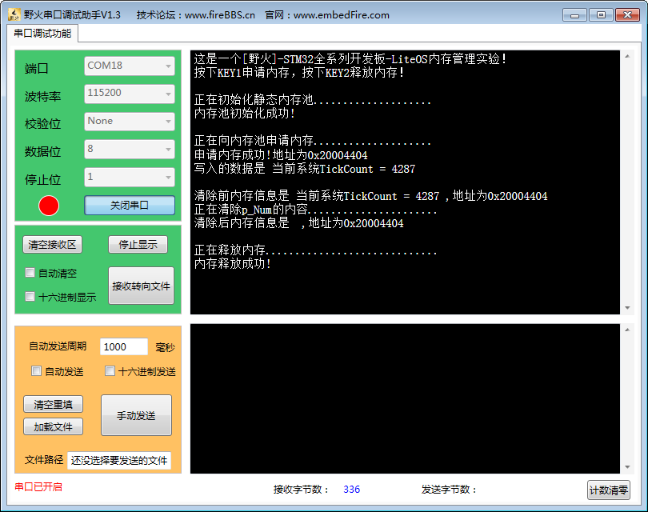

动态内存管理现象
^^^^^^^^^^^^^^^^^^^^^^^^

程序编译好，用USB线连接电脑和开发板的USB接口（对应丝印为USB转串口），用DAP仿真器把配套程序下载到野火STM32开发板（具体型号根据读者买的开发板
而定，每个型号的开发板都配套有对应的程序），在电脑上打开串口调试助手，然后复位开发板，按下KEY1分配内存，然后按下KEY2释放内存，可以在调试
助手中看到串口打印信息与运行结果，如 图 动态内存管理实验现象_ 所示。

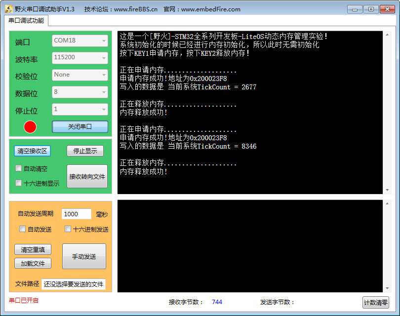

