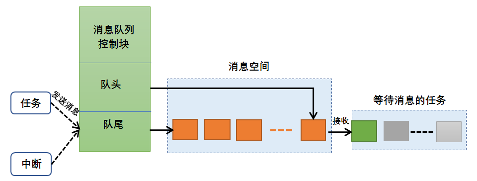
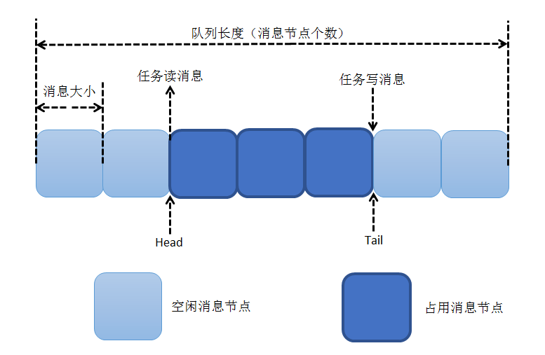
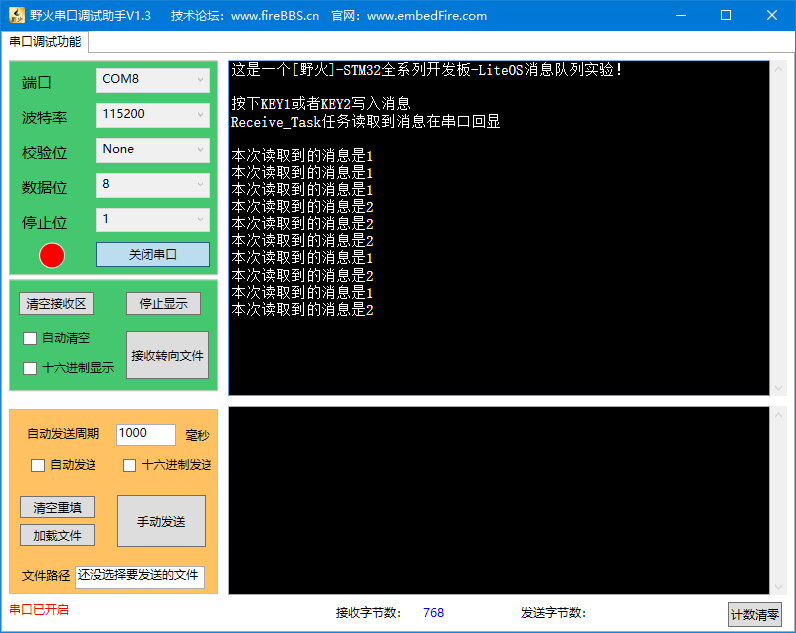

.. vim: syntax=rst

消息队列
=============

不知读者是否在裸机编程中这样使用过数组？它用于存储数据，在需要的时候再从数组中读取。本章的消息队列是LiteOS也能
实现数据存储的功能，并且更加完善，它在操作系统中常被用于传输数据。

消息队列的基本概念
~~~~~~~~~~~~~~~~~~

队列又称消息队列，是一种常用于系统中通信的数据结构，队列可以在任务与任务间、中断和任务间传送信息，实现了接收来自
任务或中断的不固定长度的消息，并根据LiteOS提供不同函数接口选择传递消息是否存放在自己空间。任务能够从队列中读取消
息，当队列中的消息为空时，读取消息的任务将被阻塞，用户可以指定任务阻塞的时间uwTimeOut，在这段时间中，如果队列的消
息一直为空，该任务将保持阻塞状态以等待消息到了。当队列中有新消息时，阻塞的任务会被唤醒；当任务等待的时间超过了指
定的阻塞时间，即使队列中依然没有消息，任务也会自动从阻塞态转为就绪态。消息队列是一种异步的通信方式。

通过消息队列服务，任务或中断服务例程可以将一条或多条消息放入消息队列中。同样，一个或多个任务可以从消息队列中获得
消息。当有多个消息写入到消息队列时，通常是先进入的消息先传递给任务，也就是说，任务先得到的是最先进入队列的消息，
即先进先出原则（First In First Out，FIFO），但是也支持后进先出原则（Last In First Out，LIFO）。

用户在处理业务时，消息队列提供了异步处理机制，允许将一个消息放入队列，但并不立即处理它，这样子队列就起到缓存消息的作用。

LiteOS中使用队列数据结构实现任务异步通信工作，具有如下特性。

    1. 消息以先进先出方式排队，支持异步读写工作方式。

    2. 读队列和写队列都支持超时机制。

    3. 写入消息类型由通信双方约定，可以允许不同长度（不超过消息节点最大值）的任意类型消息。

    4. 消息支持后进先出方式排队（LIFO）。

    5. 一个任务能够从任意一个消息队列读取和写入消息。

    6. 多个任务能够从同一个消息队列读取和写入消息。

消息队列的运作机制
~~~~~~~~~~~~~~~~~~~~~~~

创建队列时，根据用户传入队列长度和消息节点大小来开辟相应的内存空间以供该队列使用，初始化消息队列的相关信息，创建成功后返回队列ID。

在队列控制块中维护一个消息头节点位置usQueueHead和一个消息尾节点位置usQueueTail变量，用于记录当前队列中消息存
储情况。usQueueHead表示队列中被占用消息节点的起始位置，usQueueTail表示占用消息节点的结束位置（或者可以理解为
队列中空闲消息的起始位置），在消息队列刚创建时usQueueHead和usQueueTail均指向队列起始位置。

写队列时，根据usQueueTail找到消息节点末尾的空闲节点作为消息写入区域。如果usQueueTail已经指向队列尾则采用回卷
方式（可以将LiteOS的消息队列看做是一个环形队列，这样子操作很方便，也能避免溢出，达到缓冲的效果）。根据
usReadWriteableCnt[OS_QUEUE_WRITE]判断队列是否可以写入，不能对已满的队列进行写队列操作。

读队列时，根据usQueueHead找到最先写入队列中的消息节点进行读取。如果usQueueHead已经指向队列尾也采用回卷方式。
根据usReadWriteableCnt [OS_QUEUE_READ]判断队列是否有消息读取，对没有消息的队列进行读队列操作会引起任务挂起
（假设用户指定阻塞时间的话）。

删除队列时，根据传入的队列ID寻找到对应的队列，把队列状态置为未使用，释放原队列所占的空间，对应的队列控制头置为初始状态。

LiteOS的消息队列采用两个双向链表来维护，一个链表指向消息队列的头部，一个链表指向消息队列的尾部（stReadWriteList[QUEUE_HEAD_TAIL]），
通过访问这两个链表就能直接访问对应的消息空间（消息空间中的每个节点称之为消息节点），并且通过消息队列控制块中的读写
类型（usReadWriteableCnt[QUEUE_READ_WRITE]）来操作消息队列，消息队列的运作过程如图 消息队列运作过程_ 所示。

消息队列的读写运作如图 队列读写消息操作示意图_ 所示。

消息队列的传输机制
~~~~~~~~~~~~~~~~~~~~

既然队列是任务间通信的数据结构，那么它必然是可以存储消息数据的，消息是存储在消息节点中，而消息节点的大小在创建队列的时候由用户
指定。LiteOS提供的队列是一种先进先出线性表，只允许在一端插入，在另一端进行读取（出队），支持异步读写工作方式，就像来买车票的人
一样，先到的人先买到票，后到的人后买到票，不允许插队。当然除此之外，LiteOS也提供一种后进先出的队列操作方式，这种方式能支持传输
紧急的消息，在某些场合也是会比较常用，就像插队一样，后来买票的人能先买到票。

一般来说，数据的传递是有复制与引用传递两种方式，所谓复制就是将某个数据直接复制到另一个存储数据的地方，就像在电脑中将某个文件复
制到另一个文件中，这两个文件都是一模一样的，修改源文件并不会影响已经复制的文件，但是文件占用的内存是同样的。而引用传递则是传递
数据的指针，该指针指向源数据存储的地址，就好比是从电脑中的源文件创建了一个文件的快捷方式，通过快捷方式也能打开源文件，并且快捷
方式的占用内存是非常小的，但是有个缺点，假如修改了源文件的内容，那么，通过快捷方式打开的文件，其内容也会相应被修改，这样子就造
成数据的可变性，在某些场合下是不安全的。

LiteOS提供了两种消息的传输方式，一种是复制方式，另一种是引用方式，通过上文的类比，读者可以选择自己需要的消息传输方式。作者这里
有个小小的建议，读者可以根据消息的大小与重要性来选择消息的传递方式，假如消息是很重要的话，选择复制的方式会更加安全，假如消息的
数据量很小的话，也是可以选择复制的方式。假如消息只是一些不重要的内容或者消息数据量很大，可以选择引用方式。

消息队列的阻塞机制
~~~~~~~~~~~~~~~~~~~~

在系统中创建了一个队列，每个任务都可以去对它进行读写操作，但是为了保护每个任务对它进行读写操作的过程，则必须要有阻塞机制，在某
个任务对它读写操作的时候，必须保证该任务能正常完成读写操作，而不受后来的任务干扰。除此之外，当队列已满的时候，其他任务就不能将
消息写入而导致消息的覆盖，同理，当队列为空的时候，读取消息的任务也无法读取消息，这种机制可以称之为阻塞机制。

出队阻塞
^^^^^^^^^^^^

假设有一个任务A对某个队列进行读操作的时候（也就是出队），发现它没有消息，那么此时任务A有三个选择：第一个选择，任务A不进行等待，
既然队列没有消息，那任务A也不必阻塞等待消息的到来，这样子任务A不会进入阻塞态；第二个选择，任务A阻塞等待，其等待时间由用户定义，
比如可以是1000个Tick，在超时时间到来之前假如队列有消息了，那任务A恢复就绪态，读取队列的消息，如果任务A刚好是最高优先级的就绪态，
那么系统将进行一次任务调度；假如已经超出等待的时间，队列还没有消息可以读取，那任务A将恢复为就绪态继续运行；第三个选择，任务A进
入阻塞态一直等待消息的到来，直到完成读取队列的消息。

入队阻塞
^^^^^^^^^^^^

同理，对某个队列的写操作也是一样的（写操作就是将消息写入队列中，也就是入队），当任务A向某个队列中写入一个消息，发现这个队列已
经满了， LiteOS出于对队列中消息的保护，使这个队列无法被写入消息，如此一来任务的写操作就会被阻塞。在消息入队的时候，当且仅当队
列允许入队时，任务才能成功写入消息；队列中无可用消息节点时，说明消息队列已满，此时，系统会根据用户指定的阻塞超时时间将任务阻塞，
在指定的超时时间内如果还不能完成入队操作，写入消息的任务会收到一个错误代码LOS_ERRNO_QUEUE_ISFULL，然后解除阻塞状态；当然，只
有在任务中写入消息才允许进行阻塞状态，而在中断中写入消息不允许带有阻塞机制，用户必须将阻塞时间设置为0，否则就直接返回错误代码
LOS_ERRNO_QUEUE_READ_IN_INTERRUPT，因为写入消息的上下文环境是在中断中，不允许出现阻塞的情况。

假如有多个任务阻塞在一个消息队列中，那么这些阻塞的任务将按照任务优先级进行排序，优先级高的任务将优先获得队列的访问权。

消息队列应用场景
~~~~~~~~~~~~~~~~

消息队列可以应用于传递不定长消息的场合，包括任务与任务间的消息传递，中断和任务间传递信息。

常用Queue错误代码说明
~~~~~~~~~~~~~~~~~~~~~~~

在LiteOS中，与队列相关的函数大多数都会有返回值，其返回值是一些错误代码，方便使用者进行调试，下面列出一些常见的错误代码与参考解决
方案如表 常用队列错误代码说明_ 所示。

.. list-table::
   :widths: 25 25 25 25
   :name: 常用队列错误代码说明
   :header-rows: 0

   * - 序号
     - 定义
     - 描述
     - 参考解决方案

   * - 1
     - LOS_ERRNO_QUEUE_MAXNUM_ZERO
     - 队列资源的最大数目配置为0
     - 配置要大于0的队列资源的最大数量。如果不使用队列模块，则将配置项设置为将队列资源的最大数量的剪裁设置为NO

   * - 2
     - LOS_ERRNO_QUEUE_NO_MEMORY
     - 队列块内存无法初始化
     - 为队列块分配更大的内存分区，或减少队列资源的最大数量

   * - 3
     - LOS_ERRNO_QUEUE_CREATE_NO_MEMORY
     - 队列创建的内存未能被请求
     - 为队列分配更多的内存，或减少要创建的队列中的队列长度和节点的数目

   * - 4
     - LOS_ERRNO_QUEUE_SIZE_TOO_BIG
     - 队列创建时消息长度超过上限
     - 更改创建队列中最大消息的大小至不超过上限

   * - 5
     - LOS_ERR NO_TSK_ENTRY_NULL
     - 已超过创建的队列的数量的上限
     - 增加队列的配置资源数量

   * - 6
     - LOS_ERRNO_QUEUE_NOT_FOUND
     - 无效的队列
     - 确保队列ID是有效的

   * - 7
     - LOS_ERRNO_QUEUE_PEND_IN_LOCK
     - 当任务被锁定时，禁止在队列中被阻塞
     - 使用队列前解锁任务

   * - 8
     - LOS_ERRNO_QUEUE_TIMEOUT
     - 等待处理队列的时间超时
     - 检查设置的超时时间是否合适

   * - 9
     - LOS_ERRNO_QUEUE_IN_TSKUSE
     - 阻塞任务的队列不能被删除
     - 使任务能够获得资源而不是在队列中被阻塞

   * - 10
     - LOS_ERRNO_QUEUE_WRITE_IN_INTERRUPT
     - 在中断处理程序中不能写队列
     - 将写队列设为非阻塞模式

   * - 11
     - LOS_ERRNO_QUEUE_NOT_CREATE
     - 队列未创建
     - 检查队列中传递的ID是否有效

   * - 12
     - LOS_ERRNO_QUEUE_IN_TSKWRITE
     - 队列读写不同步
     - 同步队列的读写

   * - 13
     - LOS_ERRNO_QUEUE_CREAT_PTR_NULL
     - 队列创建过程中传递的参数为空指针
     - 确保传递的参数不为空指针

   * - 14
     - LOS_ERRNO_QUEUE_PARA_ISZERO
     - 队列创建过程中传递的队列长度或消息节点大小为0
     - 传入正确的队列长度和消息节点大小

   * - 15
     - LOS_ERRNO_QUEUE_READ_INVALID
     - 读取的队列的handle无效
     - 检查队列中传递的handle是否有效

   * - 16
     - LOS_ERRNO_QUEUE_READ_PTR_NULL
     - 队列读取过程中传递的指针为空
     - 检查指针中传递的是否为空

   * - 17
     - LOS_ERRNO_QUEUE_READSIZE_ISZERO
     - 队列读取过程中传递的缓冲区大小为0
     - 通过一个正确的缓冲区大小

   * - 18
     - LOS_ERRNO_QUEUE_WRITE_INVALID
     - 队列写入过程中传递的队列handle无效
     - 检查队列中传递的handle是否有效

   * - 19
     - LOS_ERRNO_QUEUE_WRITE_PTR_NULL
     - 队列写入过程中传递的指针为空
     - 检查指针中传递的是否为空

   * - 20
     - LOS_ERRNO_QUEUE_WRITESIZE_ISZERO
     - 队列写入过程中传递的缓冲区大小为0
     - 通过一个正确的缓冲区大小

   * - 21
     - LOS_ERRNO_QUEUE_WRITE_NOT_CREATE
     - 写入消息的队列未创建
     - 传入有效队列ID

   * - 22
     - LOS_ERRNO_QUEUE_WRITE_SIZE_TOO_BIG
     - 队列写入过程中传递的缓冲区大小比队列大小要大
     - 减少缓冲区大小，或增大队列节点

   * - 23
     - LOS_ERRNO_QUEUE_ISFULL
     - 在队列写入过程中没有可用的空闲节点
     - 确保在队列写入之前，可以使用空闲的节点

   * - 24
     - LOS_ERRNO_QUEUE_PTR_NULL
     - 正在获取队列信息时传递的指针为空
     - 检查指针中传递的是否为空

   * - 25
     - LOS_ERRNO_QUEUE_READ_IN_INTERRUPT
     - 在中断处理程序中不能读队列
     - 将读队列设为非阻塞模式

   * - 26
     - L OS_ERRNO_QUEUE_MAIL_HANDLE_INVALID
     - 正在释放队列的内存时传递的队列的handle无效
     - 检查队列中传递的handle是否有效

   * - 27
     - LOS_ERRNO_QUEUE_MAIL_PTR_INVALID
     - 传入的消息内存池指针为空
     - 检查指针是否为空

   * - 28
     - LOS_ERRNO_QUEUE_MAIL_FREE_ERROR
     - membox内存释放失败
     - 传入非空membox内存指针

   * - 29
     - LOS_ERRNO_QUEUE_READ_NOT_CREATE
     - 待读取的队列未创建
     - 传入有效队列ID

   * - 30
     - LOS_ERRNO_QUEUE_ISEMPTY
     - 队列已空
     - 确保在读取队列时包含消息

   * - 31
     - LOS_ERRNO_QUEUE_READ_SIZE_TOO_SMALL
     - 读缓冲区大小小于队列大小
     - 增加缓冲区大小，或减小队列节点大小

常用消息队列的函数讲解
~~~~~~~~~~~~~~~~~~~~~~

使用消息队列的典型流程如下。

    1. 创建消息队列LOS_QueueCreate()。

    2. 创建成功后，可以得到消息队列的ID值。

    3. 写队列操作函数LOS_QueueWrite()。

    4. 读队列操作函数LOS_QueueRead()。

    5. 删除队列LOS_QueueDelete()。

消息队列创建函数LOS_QueueCreate()
^^^^^^^^^^^^^^^^^^^^^^^^^^^^^^^^^^^^

消息队列创建函数LOS_QueueCreate()用于创建一个队列，读者可以根据自己的需要去创建队列，可以指定队列的长度以及消息节
点的大小等信息，LiteOS创建队列的函数原型如 代码清单:消息队列-1_ 所示。

创建消息队列时系统会先给消息队列分配一块内存空间，这块内存的大小等于(单个消息节点大小+4个字节)与消息队列长度的乘积，
接着再初始化消息队列，此时消息队列为空。LiteOS的消息队列控制块由多个元素组成，当系统初始化时，系统会为控制块分配对
应的内存空间，用于保存消息队列的基本信息如消息的存储位置，头指针usQueueHead、尾指针usQueueTail、消息大小usQueueSize
以及队列长度usQueueLen等。在消息队列创建成功的时候，这些内存就被占用了，只有删除了消息队列的时候，这段内存才会被释
放掉，创建成功的队列已经确定队列的长度与消息节点的大小，且无法再次更改，每个消息节点可以存放不大于消息大小usQueueSize
的任意类型的消息，消息节点个数的总和就是队列的长度，用户可以在消息队列创建时指定。

.. code-block:: c
    :caption:  代码清单:消息队列-1队列创建函数LOS_QueueCreate()函数原型
    :name: 代码清单:消息队列-1
    :linenos:

    extern UINT32 LOS_QueueCreate(CHAR *pcQueueName,	 (1)
                            UINT16 usLen,		 (2)
                            UINT32 *puwQueueID,	 (3)
                            UINT32 uwFlags,	 (4)
                            UINT16 usMaxMsgSize);     (5)

-   代码清单:消息队列-1_  **(1)**\ ：pcQueueName是消息队列名称，LiteOS保留，暂时未使用。

-   代码清单:消息队列-1_  **(2)**\ ：usLen是队列长度，值范围是1~0xFFFF。

-   代码清单:消息队列-1_  **(3)**\ ：puwQueueID是消息队列ID变量指针，该变量用于保存创建队列成功时返回的消息队列ID，由
    用户定义，对消息队列的读写操作都是通过消息队列ID来操作的。

-   代码清单:消息队列-1_  **(4)**\ ：uwFlags是队列模式，保留参数，暂不使用。

-   代码清单:消息队列-1_  **(5)**\ ：usMaxMsgSize是消息节点大小（单位为字节），其取值范围为1~(0xFFFF-4)。

队列控制块与任务控制类似，每一个队列都由对应的队列控制块维护，队列控制块中包含了队列的所有信息，比如队列的一些状态信息，
使用情况等，如 代码清单:消息队列-2_ 所示。

.. code-block:: c
    :caption:  代码清单:消息队列-2队列控制块
    :name: 代码清单:消息队列-2
    :linenos:

    typedef struct tagQueueCB {
        UINT8       *pucQueue;      /**< 队列指针 */
        UINT16      usQueueState;   /**< 队列状态 */
        UINT16      usQueueLen;     /**< 队列中消息个数 */
        UINT16      usQueueSize;    /**< 消息节点大小 */
        UINT16      usQueueID;      /**< 队列ID */
        UINT16      usQueueHead;    /**< 消息头节点位置（数组下标）*/
        UINT16      usQueueTail;    /**< 消息尾节点位置（数组下标）*/
        UINT16       usReadWriteableCnt[2]; /**< 可读或可写资源的计数，0：可读，1：可写* /
        LOS_DL_LIST  stReadWriteList[2]; /**< 指向要读取或写入的链表的指针，0：读列表，1：写列表/
        LOS_DL_LIST stMemList; 	/ ** <指向内存链表的指针* /
    } QUEUE_CB_S;

创建队列必须是调用LOS_QueueCreate()函数进行创建，在创建成功后返回一个队列ID。在创建队列时会返回创建的情况的，如
果返回LOS_OK，则表明队列创建成功，若是其他错误代码，读者可以根据表 5‑1定位错误并解决，创建消息队列的应用实例如
代码清单:消息队列-3_ 加粗部分所示，其源码如 代码清单:消息队列-4_ 所示。

.. code-block:: c
    :caption: 代码清单:消息队列-3队列创建函数LOS_QueueCreate()实例
    :emphasize-lines: 3-8
    :name: 代码清单:消息队列-3
    :linenos:

    UINT32 uwRet = LOS_OK;/* 定义一个创建队列的返回类型，初始化为创建成功的返回值 */

    /* 创建一个测试队列*/
    uwRet = LOS_QueueCreate("Test_Queue",		/* 队列的名称，保留，未使用*/
                            128,			/* 队列的长度 */
                            &Test_Queue_Handle,	/* 队列的ID(句柄) */
                            0,			/* 队列模式，官方暂时未使用 */
                            16);			/* 最大消息大小（字节）*/
    if (uwRet != LOS_OK)
    {
        printf("Test_Queue队列创建失败！\n");
    }

.. code-block:: c
    :caption: 代码清单:消息队列-4队列创建函数LOS_QueueCreate()源码
    :name: 代码清单:消息队列-4
    :linenos:

    /****************************************************************
    Function    : LOS_QueueCreate
    Description : 创建一个队列
    Input       : pcQueueName  --- 队列名称，官方保留未用
                usLen        --- 队列长度
                uwFlags      --- 队列模式，FIFO或PRIO，官方保留未用
                usMaxMsgSize --- 最大消息大小（字节）
    Output      : puwQueueID   --- 队列ID
    Return      : LOS_OK表示成功或失败时其他的错误代码
    *********************************************************************/
    LITE_OS_SEC_TEXT_INIT UINT32 LOS_QueueCreate(CHAR *pcQueueName,
                            UINT16 usLen,
                            UINT32 *puwQueueID,
                            UINT32 uwFlags,
                            UINT16 usMaxMsgSize )
    {
        QUEUE_CB_S      *pstQueueCB;
        UINTPTR         uvIntSave;
        LOS_DL_LIST     *pstUnusedQueue;
        UINT8           *pucQueue;
        UINT16          usMsgSize = usMaxMsgSize + sizeof(UINT32);

        (VOID)pcQueueName;						(1)
        (VOID)uwFlags;

        if (NULL == puwQueueID) {					(2)
            return LOS_ERRNO_QUEUE_CREAT_PTR_NULL;
        }

        if (usMaxMsgSize > OS_NULL_SHORT -4) {
            return LOS_ERRNO_QUEUE_SIZE_TOO_BIG;
        }

        if ((0 == usLen) || (0 == usMaxMsgSize)) {			(3)
            return LOS_ERRNO_QUEUE_PARA_ISZERO;
        }

        pucQueue = (UINT8 *)LOS_MemAlloc(m_aucSysMem0, usLen * usMsgSize);(4)
        if (NULL == pucQueue) {
            return LOS_ERRNO_QUEUE_CREATE_NO_MEMORY;
        }

        uvIntSave = LOS_IntLock();
        if (LOS_ListEmpty(&g_stFreeQueueList)) {			(5)
            LOS_IntRestore(uvIntSave);
            (VOID)LOS_MemFree(m_aucSysMem0, pucQueue);
            return LOS_ERRNO_QUEUE_CB_UNAVAILABLE;
        }

        pstUnusedQueue = LOS_DL_LIST_FIRST(&(g_stFreeQueueList));	(6)
        LOS_ListDelete(pstUnusedQueue);
        pstQueueCB = (GET_QUEUE_LIST(pstUnusedQueue));
        pstQueueCB->usQueueLen = usLen;				(7)
        pstQueueCB->usQueueSize = usMsgSize;			(8)
        pstQueueCB->pucQueue = pucQueue;				(9)
        pstQueueCB->usQueueState = OS_QUEUE_INUSED;
        pstQueueCB->usReadWriteableCnt[OS_QUEUE_READ]  = 0;		(10)
        pstQueueCB->usReadWriteableCnt[OS_QUEUE_WRITE] = usLen;	(11)
        pstQueueCB->usQueueHead = 0;				(12)
        pstQueueCB->usQueueTail = 0;
        LOS_ListInit(&pstQueueCB->stReadWriteList[OS_QUEUE_READ]);	(13)
        LOS_ListInit(&pstQueueCB->stReadWriteList[OS_QUEUE_WRITE]);
        LOS_ListInit(&pstQueueCB->stMemList);
        LOS_IntRestore(uvIntSave);

        *puwQueueID = pstQueueCB->usQueueID;			(14)

        return LOS_OK;
    }

-   代码清单:消息队列-4_ **(1)**\ ：由于LiteOS对队列的名称、队列模式等进行了保留，未使用，所以，传进来的队列名称与队列模式参数会强制被转换成空类型。

-   代码清单:消息队列-4_  **(2)**\ ：如果传递进来的队列ID指针puwQueueID为NULL，则返回错误代码。

-   代码清单:消息队列-4_  **(3)**\ ：如果传递进来的usMaxMsgSize过大或者是为0，则返回错误代码。

-   代码清单:消息队列-4_  **(4)**\ ：使用LOS_MemAlloc为队列分配内存，分配的大小根据传递进来的usLen（队列长度）与usMaxMsgSize（消息节
    点大小（字节））进行动态分配。

-   代码清单:消息队列-4_  **(5)**\ ：判断一下系统当前是否还可以创建消息队列，因为在系统配置中已经定义了最大可创建的消息队列个数，并且在
    系统核心初始化的时候将可以创建的消息队列进行初始化，采用空闲消息队控制块列表进行管理，此时如果g_stFreeQueueList为空，那么表示系统当
    前的消息队列已经达到支持的最大，无法进行创建，所以刚刚申请的内存就需要调用LOS_MemFree()函数进行释放，然后返回一个错误代码
    LOS_ERRNO_QUEUE_CB_UNAVAILABLE。用户可以在traget_config.h文件修改宏定义LOSCFG_BASE_IPC_QUEUE_LIMIT，以增加系统支持的消息队列个数。

-   代码清单:消息队列-4_  **(6)**\ ：从系统管理的空闲消息队列控制块列表中取下一个消息队列控制块，表示消息队列已经被创建。

-   代码清单:消息队列-4_  **(7)**\ ：创建一个队列的具体过程，根据传进来的参数进行配置队列的长度usLen。

-   代码清单:消息队列-4_  **(8)**\ ：配置消息队列的每个消息节点的大小usMsgSize。

-   代码清单:消息队列-4_  **(9)**\ ：配置消息队列存放消息的起始地址pucQueue，即消息空间的内存地址，并且将消息队列的状态要设置为OS_QUEUE_INUSED
    表示队列已使用。

-   代码清单:消息队列-4_  **(10)**\ ：初始化消息队列可读的消息个数为0。

-   代码清单:消息队列-4_  **(11)**\ ：初始化消息队列可写的消息个数是usLen。

-   代码清单:消息队列-4_  **(12)**\ ：创建消息队列时，usQueueHead和usQueueTail都是0，也就是指向初始位置，随着消息队列的读写，这两个指针位置会改变。

-   代码清单:消息队列-4_  **(13)**\ ：初始化读写操作的消息空间的链表。

-   代码清单:消息队列-4_  **(14)**\ ：将队列ID通过puwQueueID指针返回给用户，后续用户可以使用这个队列ID即可对队列操作，创建完成之后返回LOS_OK。

消息队列删除函数LOS_QueueDelete()
^^^^^^^^^^^^^^^^^^^^^^^^^^^^^^^^^^^^^^

队列删除函数是根据队列ID直接删除的，删除之后这个队列的所有信息都会被系统回收清空，而且不能再次使用这个队列了，但是需要
注意的是，队列在使用或者阻塞中是不能被删除的，如果某个队列没有被创建，那也是无法被删除的，uwQueueID是LOS_QueueDelete()
函数传入的参数，是队列ID，表示的是要删除哪个队列，其函数原型如 代码清单:消息队列-5_ 所示。

.. code-block:: c
    :caption:  代码清单:消息队列-5 LOS_TaskDelete()函数原型
    :name: 代码清单:消息队列-5
    :linenos:

    /**
    * 此API用于删除队列。
    * 此API不能用于删除未创建的队列。
    * 如果同步队列被阻塞，或正在读取或写入某些队列，则同步队列将无法删除。
    */
    extern UINT32 LOS_QueueDelete(UINT32 uwQueueID);

队列删除函数的实例：如 代码清单:消息队列-6_ 加粗部分所示，如果队列删除成功，则返回LOS_OK，否则返回其他错误代码。

.. code-block:: c
    :caption:  代码清单:消息队列-6 LOS_TaskDelete()函数使用实例
    :emphasize-lines: 3-10
    :name: 代码清单:消息队列-6
    :linenos:

    UINT32 uwRet = LOS_OK;/* 定义一个删除队列的返回类型，初始化为删除成功的返回值 */

    uwRet = LOS_QueueDelete(Test_Queue_Handle); /* 删除队列 */
    if (uwRet != LOS_OK)	/* 删除队列失败，返回其他错误代码 */
    {
        printf("删除队列失败！\n");
    } else 		/* 删除队列成功，返回LOS_OK */
    {
        printf("删除队列成功！\n");
    }

LOS_TaskDelete()函数的实现如 代码清单:消息队列-7_ 所示。

.. code-block:: c
    :caption:  代码清单:消息队列-7 LOS_TaskDelete()函数源码
    :name: 代码清单:消息队列-7
    :linenos:

    /*******************************************************************
    Function    : LOS_QueueDelete
    Description : 删除一个队列
    Input       : puwQueueID --- 队列ID
    Output      : None
    Return      : LOS_OK表示成功或失败时返回其他错误代码
    **********************************************************************/
    LITE_OS_SEC_TEXT_INIT UINT32 LOS_QueueDelete(UINT32 uwQueueID)
    {
        QUEUE_CB_S *pstQueueCB;
        UINT8 *pucQueue = NULL;
        UINTPTR  uvIntSave;
        UINT32 uwRet;

        if (uwQueueID >= LOSCFG_BASE_IPC_QUEUE_LIMIT) {		(1)
            return LOS_ERRNO_QUEUE_NOT_FOUND;
        }

        uvIntSave = LOS_IntLock();
        pstQueueCB = (QUEUE_CB_S *)GET_QUEUE_HANDLE(uwQueueID);	(2)
        if (OS_QUEUE_UNUSED == pstQueueCB->usQueueState) {
            uwRet = LOS_ERRNO_QUEUE_NOT_CREATE;
            goto QUEUE_END;
        }

        if (!LOS_ListEmpty(&pstQueueCB->stReadWriteList[OS_QUEUE_READ])) {(3)
            uwRet = LOS_ERRNO_QUEUE_IN_TSKUSE;
            goto QUEUE_END;
        }

        if (!LOS_ListEmpty(&pstQueueCB->stReadWriteList[OS_QUEUE_WRITE])) {(4)
            uwRet = LOS_ERRNO_QUEUE_IN_TSKUSE;
            goto QUEUE_END;
        }

        if (!LOS_ListEmpty(&pstQueueCB->stMemList)) {		(5)
            uwRet = LOS_ERRNO_QUEUE_IN_TSKUSE;
            goto QUEUE_END;
        }

        if ((pstQueueCB->usReadWriteableCnt[OS_QUEUE_WRITE] + pstQueueCB->
            usReadWriteableCnt[OS_QUEUE_READ]) != pstQueueCB->usQueueLen) {
            uwRet = LOS_ERRNO_QUEUE_IN_TSKWRITE;				(6)
            goto QUEUE_END;
        }

        pucQueue = pstQueueCB->pucQueue;
        pstQueueCB->pucQueue = (UINT8 *)NULL;
        pstQueueCB->usQueueState = OS_QUEUE_UNUSED;			(7)
        LOS_ListAdd(&g_stFreeQueueList, &pstQueueCB->stReadWriteList[OS_QUEUE_WRITE]);
        LOS_IntRestore(uvIntSave);

        uwRet = LOS_MemFree(m_aucSysMem0, (VOID *)pucQueue);		(8)
        return uwRet;

    QUEUE_END:
        LOS_IntRestore(uvIntSave);
        return uwRet;
    }

-   代码清单:消息队列-7_  **(1)**\ ：判断队列ID是否有效，如果是无效的队列，则返回错误代码。

-   代码清单:消息队列-7_  **(2)**\ ：根据队列ID获取对应的队列控制块，并且获取队列当前状态，如果队列是未使用状态，则返回错误代码。

-   代码清单:消息队列-7_  **(3)**\ ：如果当前系统中有任务在等待队列中的消息，那么这个队列是无法被删除的，返回错误代码。

-   代码清单:消息队列-7_  **(4)**\ ：如果当前系统有任务等待写入消息到队列中，那么这个队列也是无法被删除的，返回错误代码。

-   代码清单:消息队列-7_  **(5)**\ ：如果当前队列非空，系统为了保证任务获得资源，此时的队列也是无法被删除的，返回错误代码。

-   代码清单:消息队列-7_  **(6)**\ ：如果队列的读写是不同步的，那么返回错误代码。

-   代码清单:消息队列-7_  **(7)**\ ：将要删除的队列变为未使用状态，并且添加到消息队列控制块空闲列表中，归还给系统，以便系统创建可以新的消息队列。

-   代码清单:消息队列-7_  **(8)**\ ：将队列的内存进行释放。

消息队列写消息函数
^^^^^^^^^^^^^^^^^^

不带复制方式写入LOS_QueueWrite()
''''''''''''''''''''''''''''''''''''''

任务或者中断服务程序都可以给消息队列写入消息，当写入消息时，如果队列未满，LiteOS会将消息复制到消息队列队尾，否则，会根据
用户指定的阻塞超时时间进行阻塞，在这段时间中，如果队列还是满的，该任务将保持阻塞状态以等待队列有空闲的消息节点。如果系统
中有任务从其等待的队列中读取了消息（队列未满），该任务将自动由阻塞态转为就绪态。当任务等待的时间超过了指定的阻塞时间，即
使队列中还是满的，任务也会自动从阻塞态变成就绪态，此时写入消息的任务或者中断程序会收到一个错误代码LOS_ERRNO_QUEUE_ISFULL。

同时LiteOS支持后进先出（LIFO）方式写入消息，即支持写入紧急消息，写入紧急消息的过程与普通写入消息几乎一样，唯一的不同是，
当写入紧急消息时，写入的位置是消息队列队头而非队尾，这样读取任务就能够优先读取到紧急消息，从而及时进行消息处理。

LiteOS消息队列的传递方式有两种，一种是不带复制传递消息，另一种是带复制传递消息，不带复制传递消息的函数原型如 代码清单:消息队列-8_ 所示，
其实验实例如 代码清单:消息队列-9_ 加粗部分所示。

.. code-block:: c
    :caption:  代码清单:消息队列-8 LOS_QueueWrite()函数原型
    :name: 代码清单:消息队列-8
    :linenos:

    extern UINT32 LOS_QueueWrite(UINT32 uwQueueID,			(1)
                                VOID *pBufferAddr,			(2)
                                UINT32 uwBufferSize,		(3)
                                UINT32 uwTimeOut);			 (4)

-   代码清单:消息队列-8_  **(1)**\ ：uwQueueID是队列ID，由LOS_QueueCreate()函数返回的，其值范围为1~LOSCFG_BASE_IPC_QUEUE_LIMIT。

-   代码清单:消息队列-8_  **(2)**\ ：pBufferAddr：消息的起始地址。

-   代码清单:消息队列-8_  **(3)**\ ：uwBufferSize是写入消息的大小。

-   代码清单:消息队列-8_  **(4)**\ ：uwTimeOut是等待时间，其值范围为0~LOS_WAIT_FOREVER，单位为Tick，当uwTimeOut为0的时候是不等待，
    为LOS_WAIT_FOREVER时候是一直等待，在中断中使用该函数uwTimeOut的值必须为0。

.. code-block:: c
    :caption: 代码清单:消息队列-9 LOS_QueueWrite()函数实例 
    :emphasize-lines: 15-19,24-28
    :name: 代码清单:消息队列-9
    :linenos:

    /************************************************************************
    * @ 函数名  ： Send_Task
    * @ 功能说明： 通过按键进行对队列的写操作
    * @ 参数    ：
    * @ 返回值  ： 无
    *********************************************************************/
    UINT32 send_data1 = 1;	/* 写入队列的第一个消息 */
    UINT32 send_data2 = 2;	/* 写入队列的第二个消息 */
    static void Send_Task(void)    
    {    
        UINT32 uwRet = LOS_OK;	/* 定义一个返回类型，初始化为成功的返回值 */
        /* 任务都是一个无限循环，不能返回 */
        while (1) { /* K1 被按下 */
            if ( Key_Scan(KEY1_GPIO_PORT,KEY1_GPIO_PIN) == KEY_ON ) {  
                /* 将消息写入到队列中，等待时间为 0  */
                uwRet = LOS_QueueWrite(Test_Queue_Handle, /* 写入的队列ID */
                                        &send_data1,	/* 写入的消息 */
                                    sizeof(send_data1),/* 消息的大小 */
                                        0);		/* 等待时间为 0  */
                if (LOS_OK != uwRet) {
                    printf("消息不能写入到消息队列！错误代码0x%x \n",uwRet);
                }/* K2 被按下 */
            } else if ( Key_Scan(KEY2_GPIO_PORT,KEY2_GPIO_PIN) == KEY_ON ) { 
                /* 将消息写入到队列中，等待时间为 0  */
                uwRet = LOS_QueueWrite(Test_Queue_Handle, /* 写入的队列ID */
                                        &send_data2,    /* 写入的消息 */
                                        sizeof(send_data2), /* 消息的长度 */
                                        0);		/* 等待时间为 0  */
                if (LOS_OK != uwRet) {
                    printf("消息不能写入到消息队列！错误代码0x%x \n",uwRet);
                }

            }
            /* 20Ticks扫描一次 */
            LOS_TaskDelay(20);
        }
    }

写入队列按照LiteOS的API进行操作即可，但是有几个点需要注意。

    1. 在使用写入队列的操作前应先创建要写入的队列。

    2. 在中断上下文环境中，必须使用非阻塞模式写入，也就是等待时间为0个Tick。

    3. 在初始化LiteOS之前无法调用此API。

    4. 将写入由uwBufferSize指定大小的消息，该值不能大于消息节点的大小。

    5. 写入队列节点中的是消息的地址。

LOS_QueueWrite()函数的源码具体实现如 代码清单:消息队列-10_ 所示。

.. code-block:: c
    :caption:  代码清单:消息队列-10 LOS_QueueWrite()函数源码
    :name: 代码清单:消息队列-10
    :linenos:

    LITE_OS_SEC_TEXT UINT32 LOS_QueueWrite(UINT32 uwQueueID,
                                        VOID *pBufferAddr,
                                        UINT32 uwBufferSize,
                                        UINT32 uwTimeOut)
    {
        if (pBufferAddr == NULL) {
            return LOS_ERRNO_QUEUE_WRITE_PTR_NULL;
        }
        uwBufferSize = sizeof(UINT32*);
        return LOS_QueueWriteCopy(uwQueueID,
                                &pBufferAddr,
                                uwBufferSize,
                                uwTimeOut);
    } 

其实代码很简单，LiteOS实际上是对LOS_QueueWriteCopy()函数进行封装，该函数会在下文进行讲解。只不过在该函数中复制的是消息的地址，而非内容。

带复制写入LOS_QueueWriteCopy()
'''''''''''''''''''''''''''''''''''''

LOS_QueueWriteCopy()是带复制写入的函数接口，函数原型如 代码清单:消息队列-11_ 所示，其使用实例如 代码清单:消息队列-12_ 加粗部分所示。

.. code-block:: c
    :caption:  代码清单:消息队列-11 LOS_QueueWriteCopy()函数原型
    :name: 代码清单:消息队列-11
    :linenos:

    extern UINT32 LOS_QueueWriteCopy(UINT32 uwQueueID,		(1)
                                    VOID *pBufferAddr,		(2)
                                    UINT32 uwBufferSize,		(3)
                                    UINT32 uwTimeOut);		 (4)

-   代码清单:消息队列-11_  **(1)**\ ：uwQueueID是由LOS_QueueCreate创建的队列ID，其值范围为1~LOSCFG_BASE_IPC_QUEUE_LIMIT。

-   代码清单:消息队列-11_  **(2)**\ ：pBufferAddr是存储要写入的消息的起始地址，起始地址不能为空。

-   代码清单:消息队列-11_  **(3)**\ ：uwBufferSize是指定写入消息的大小，其值不能大于消息节点大小。

-   代码清单:消息队列-11_  **(4)**\ ：uwTimeOut是等待时间，其值范围为0~LOS_WAIT_FOREVER，单位为Tick，当uwTimeOut为0的时候是不等
    待，为LOS_WAIT_FOREVER时候是一直等待。

.. code-block:: c
    :caption:  代码清单:消息队列-12 LOS_QueueWriteCopy()函数实例
    :emphasize-lines: 15-19,24-28
    :name: 代码清单:消息队列-12
    :linenos:

    /************************************************************************
    * @ 函数名  ： Send_Task
    * @ 功能说明： 通过按键进行对队列的写操作
    * @ 参数    ：
    * @ 返回值  ： 无
    *********************************************************************/
    UINT32 send_data1 = 1;	/* 写入队列的第一个消息 */
    UINT32 send_data2 = 2;	/* 写入队列的第二个消息 */
    static void Send_Task(void)
    {
        UINT32 uwRet = LOS_OK;	/* 定义一个返回类型，初始化为成功的返回值 */
        /* 任务都是一个无限循环，不能返回 */
        while (1) { /* KEY1 被按下 */
            if ( Key_Scan(KEY1_GPIO_PORT,KEY1_GPIO_PIN) == KEY_ON ) {
                /* 将消息写入到队列中，等待时间为 0  */
            uwRet = LOS_QueueWriteCopy (Test_Queue_Handle,/*写入的队列ID */
                                        &send_data1,	/* 写入的消息 */
                                        sizeof(send_data1),/* 消息的长度 */
                                        0);		/* 等待时间为 0  */
                if (LOS_OK != uwRet) {
                    printf("消息不能写入到消息队列！错误代码0x%x\n",uwRet);
                }/* KEY2 被按下 */
            } else if ( Key_Scan(KEY2_GPIO_PORT,KEY2_GPIO_PIN) == KEY_ON ) {
                /* 将消息写入到队列中，等待时间为 0  */
                uwRet = LOS_QueueWriteCopy (Test_Queue_Handle,/*写入的队列ID */
                                        &send_data2,   /* 写入的消息 */
                                        sizeof(send_data2),/* 消息的长度 */
                                        0);		/* 等待时间为 0  */
                if (LOS_OK != uwRet) {
                    printf("消息不能写入到消息队列！错误代码0x%x\n",uwRet);
                }

            }
            /* 20Ticks扫描一次 */
            LOS_TaskDelay(20);
        }
    }

带复制写入操作有几点需要注意的地方。

    1. 使用写入队列的操作前应先创建要写入的队列。

    2. 在中断上下文环境中，必须使用非阻塞模式写入，也就是等待时间为0个Tick。

    3. 在初始化LiteOS之前无法调用此API。

    4. 将写入由uwBufferSize指定大小的消息，不能大于消息节点的大小。

    5. 写入队列节点中的是存储在BufferAddr中的消息。

LOS_QueueWriteCopy()函数源码如 代码清单:消息队列-13_ 所示。

.. code-block:: c
    :caption:  代码清单:消息队列-13 LOS_QueueWriteCopy()函数源码
    :name: 代码清单:消息队列-13
    :linenos:

    LITE_OS_SEC_TEXT UINT32 LOS_QueueWriteCopy( UINT32 uwQueueID,
            VOID * pBufferAddr,
            UINT32 uwBufferSize,
            UINT32 uwTimeOut )
    {
        UINT32 uwRet;
        UINT32 uwOperateType;

        uwRet = osQueueWriteParameterCheck(uwQueueID,
                                        pBufferAddr,
                                        &uwBufferSize,
                                        uwTimeOut);		(1)
        if (uwRet != LOS_OK) {
            return uwRet;
        }

        uwOperateType = OS_QUEUE_OPERATE_TYPE(OS_QUEUE_WRITE, OS_QUEUE_TAIL); (2)
        return osQueueOperate(uwQueueID,
                            uwOperateType,
                            pBufferAddr,
                            &uwBufferSize,
                            uwTimeOut);				(3)
    }

-   代码清单:消息队列-13_  **(1)**\ ：对传递进来的参数进行检查，如果参数非法就返回错误代码，并且消息不会写入到队列中。

-   代码清单:消息队列-13_  **(2)**\ ：保存处理的类型，LiteOS采用一种通用的处理消息队列的方法进行处理消息，对于复制写入
    消息，其操作方式是写入OS_QUEUE_WRITE，位置是队列尾部OS_QUEUE_TAIL。

-   代码清单:消息队列-13_  **(3)**\ ：osQueueOperate()函数源码实现如 代码清单:消息队列-14_ 所示。

通用的消息队列处理函数
^^^^^^^^^^^^^^^^^^^^^^

osQueueOperate()函数是LiteOS的一个通用处理函数，根据处理类型uwOperateType进行处理。

.. code-block:: c
    :caption:  代码清单:消息队列-14 osQueueOperate()源码
    :name: 代码清单:消息队列-14
    :linenos:

    LITE_OS_SEC_TEXT UINT32 osQueueOperate(UINT32 uwQueueID,
                                        UINT32 uwOperateType,
                                        VOID *pBufferAddr,
                                        UINT32 *puwBufferSize,
                                        UINT32 uwTimeOut)
    {
        QUEUE_CB_S *pstQueueCB;
        LOS_TASK_CB  *pstRunTsk;
        UINTPTR      uvIntSave;
        LOS_TASK_CB  *pstResumedTask;
        UINT32       uwRet = LOS_OK;
        UINT32       uwReadWrite = OS_QUEUE_READ_WRITE_GET(uwOperateType); (1)

        uvIntSave = LOS_IntLock();					(2)

        pstQueueCB = (QUEUE_CB_S *)GET_QUEUE_HANDLE(uwQueueID);	(3)
        if (OS_QUEUE_UNUSED == pstQueueCB->usQueueState) {
            uwRet = LOS_ERRNO_QUEUE_NOT_CREATE;
            goto QUEUE_END;

        }

        if (OS_QUEUE_IS_READ(uwOperateType) &&
        (*puwBufferSize < pstQueueCB->usQueueSize - sizeof(UINT32))){ (4)
            uwRet = LOS_ERRNO_QUEUE_READ_SIZE_TOO_SMALL;
            goto QUEUE_END;
        } else if (OS_QUEUE_IS_WRITE(uwOperateType) &&
        (*puwBufferSize > pstQueueCB->usQueueSize - sizeof(UINT32))) {(5)
            uwRet = LOS_ERRNO_QUEUE_WRITE_SIZE_TOO_BIG;
            goto QUEUE_END;
        }

        if (0 == pstQueueCB->usReadWriteableCnt[uwReadWrite]) {	(6)
            if (LOS_NO_WAIT == uwTimeOut) {
                uwRet = OS_QUEUE_IS_READ(uwOperateType) ?
                LOS_ERRNO_QUEUE_ISEMPTY : LOS_ERRNO_QUEUE_ISFULL;  (7)
                goto QUEUE_END;
            }

            if (g_usLosTaskLock) {
                uwRet = LOS_ERRNO_QUEUE_PEND_IN_LOCK;		(8)
                goto QUEUE_END;
            }

            pstRunTsk = (LOS_TASK_CB *)g_stLosTask.pstRunTask;	(9)
            osTaskWait(&pstQueueCB->stReadWriteList[uwReadWrite],
                    OS_TASK_STATUS_PEND_QUEUE, uwTimeOut);	(10)
            LOS_IntRestore(uvIntSave);
            LOS_Schedule();					(11)

            uvIntSave = LOS_IntLock();

            if (pstRunTsk->usTaskStatus & OS_TASK_STATUS_TIMEOUT) {	(12)
                pstRunTsk->usTaskStatus &= (~OS_TASK_STATUS_TIMEOUT);
                uwRet = LOS_ERRNO_QUEUE_TIMEOUT;
                goto QUEUE_END;
            }
        } else {
            pstQueueCB->usReadWriteableCnt[uwReadWrite]--;		(13)
        }

        osQueueBufferOperate(pstQueueCB,
                            uwOperateType,
                            pBufferAddr,
                            puwBufferSize);			(14)

        if (!LOS_ListEmpty(&pstQueueCB->stReadWriteList[!uwReadWrite])) {(15)
            pstResumedTask = OS_TCB_FROM_PENDLIST(LOS_DL_LIST_FIRST(&
                                pstQueueCB->stReadWriteList[!uwReadWrite]));

            osTaskWake(pstResumedTask, OS_TASK_STATUS_PEND_QUEUE);	(16)

            LOS_IntRestore(uvIntSave);

            LOS_Schedule();					(17)
            return LOS_OK;
        } else {
            pstQueueCB->usReadWriteableCnt[!uwReadWrite]++;		(18)
        }

    QUEUE_END:
        LOS_IntRestore(uvIntSave);
        return uwRet;
    }

-   代码清单:消息队列-14_  **(1)**\ ：通过OS_QUEUE_READ_WRITE_GET()得到即将处理的操作类型，如果是读，该值为0，如果是写，该值为1。

-   代码清单:消息队列-14_  **(2)**\ ：屏蔽中断，因为在后续的操作中，系统不希望被打扰，否则有可能影响对阻塞在消息队列中任务的操作。

-   代码清单:消息队列-14_  **(3)**\ ：通过消息队列ID获取对应的消息队列控制块，并且判断消息队列是否已使用，如果是未使用的，则返回一个错误代码并退出操作。

-   代码清单:消息队列-14_  **(4)**\ ：如果要操作队列的方式是读取，那么还需要判断一下存放消息的地址空间大小是否足以放得下消息队列的消
    息，如果放不下就会返回一个错误代码并且退出操作。

-   代码清单:消息队列-14_  **(5)**\ ：如果要操作队列的方式是写入，那么还需要判断一下要写入消息队列中的消息大小，消息节点大小是否能存
    储即将要写入的消息，如果无法存储就会返回一个错误代码并且退出操作。

-   代码清单:消息队列-14_  **(6)**\ ：对于读取消息操作，如果当前消息队列中的可读的消息个数是0，那表明当队列是空的，则不能读取消息；对
    于写入消息操作，如果当前消息队列中可以写入的消息个数也是0，表明此时队列已满，不允许写入消息。反之则跳转到 代码清单:消息队列-14_  **(13)** 处执行。

-   代码清单:消息队列-14_  **(7)**\ ：在不可读写消息的情况下，如果用户不设置阻塞超时的话，那么如果是读消息队列操作，则返回一个错误代
    码LOS_ERRNO_QUEUE_ISEMPTY；如果是写消息队列操作，则返回一个错误代码LOS_ERRNO_QUEUE_ISFULL。

-   代码清单:消息队列-14_  **(8)**\ ：如果任务被上锁，那不允许操作消息队列，返回一个错误代码LOS_ERRNO_QUEUE_PEND_IN_LOCK。

-   代码清单:消息队列-14_  **(9)**\ ：获取当前任务的任务控制块。

-   代码清单:消息队列-14_  **(10)**\ ：根据用户指定的阻塞超时时间uwTimeOut进行等待，把当前任务添加到对应操作队列的阻塞列表中，如果是
    写消息操作，将任务添加到写操作阻塞列表，当队列有空闲的消息节点时，任务就会恢复就绪态执行写入操作，或者当阻塞时间超时任务也会恢复就
    绪态；如果是读消息操作，将任务添加到读操作阻塞列表中，等到其他任务/中断写入消息，当队列有可读消息时，任务恢复就绪态执行读消息操作，
    或者当阻塞时间超时任务也会恢复就绪态。

-   代码清单:消息队列-14_  **(11)**\ ：进行切换任务。

-   代码清单:消息队列-14_  **(12)**\：程序能运行到这一步，说明任务已经解除阻塞了，有可能是阻塞时间超时，也可能是有其他任务操作了消息
    队列，导致阻塞在消息队列的任务解除阻塞。系统需要进一步判断任务解除阻塞的原因，如果是阻塞时间超时，直接返回一个错误代码
    LOS_ERRNO_QUEUE_TIMEOUT并且退出操作。

-   代码清单:消息队列-14_  **(13)**\ ：如果任务不是因为超时恢复就绪态的，那就说明消息队列可以进行读写操作，可读写的消息个数减一。

-   代码清单:消息队列-14_  **(14)**\ ：调用osQueueBufferOperate()函数进行对应的操作，源码实现如 代码清单:消息队列-15_ 所示。

-   代码清单:消息队列-14_  **(15)**\ ：如果与操作相反的阻塞列表中有任务在阻塞，那么在操作完成后需要恢复任务。LiteOS直接采
    用stReadWriteList[!uwReadWrite]表示操作相反的阻塞列表。例如：当前是进行读消息操作，在读取消息之后，那么队列就有空闲的
    消息节点了，此时队列将允许写入消息，因此系统就会判断一下写操作阻塞列表是否有任务在等待写入，如果有那就将任务恢复就绪态；
    对于写消息操作也是如此。

-   代码清单:消息队列-14_  **(16)**\ ：调用osTaskWake()函数唤醒任务。

-   代码清单:消息队列-14_  **(17)**\ ：进行一次任务调度。

-   代码清单:消息队列-14_  **(18)**\ ：如果没有任务阻塞在与当前操作相反的阻塞列表中，那么与当前操作相反的可用消息个数加一。比
    如：当前是读消息操作，那么读取完消息之后，可写消息的操作个数就要加一；如果当前是写消息操作，那么可读消息的个数就要加一。

.. code-block:: c
    :caption:  代码清单:消息队列-15 osQueueBufferOperate()源码
    :name: 代码清单:消息队列-15
    :linenos:

    LITE_OS_SEC_TEXT static VOID osQueueBufferOperate(QUEUE_CB_S *pstQueueCB,
                                UINT32 uwOperateType,
                            VOID *pBufferAddr,
                                UINT32 *puwBufferSize)
    {
        UINT8        *pucQueueNode;
        UINT32       uwMsgDataSize = 0;
        UINT16      usQueuePosion = 0;

        /* 获取消息队列操作类型 */
        switch (OS_QUEUE_OPERATE_GET(uwOperateType)) {
        case OS_QUEUE_READ_HEAD:
            usQueuePosion = pstQueueCB->usQueueHead;
            (pstQueueCB->usQueueHead + 1 == pstQueueCB->usQueueLen) ?
            (pstQueueCB->usQueueHead = 0) : (pstQueueCB->usQueueHead++);(1)
            break;

        case OS_QUEUE_WRITE_HEAD:
            (0 == pstQueueCB->usQueueHead) ?
            (pstQueueCB->usQueueHead = pstQueueCB->usQueueLen - 1)
            : (--pstQueueCB->usQueueHead);
            usQueuePosion = pstQueueCB->usQueueHead;		(2)
            break;

        case OS_QUEUE_WRITE_TAIL :
            usQueuePosion = pstQueueCB->usQueueTail;
            (pstQueueCB->usQueueTail + 1 == pstQueueCB->usQueueLen) ?
            (pstQueueCB->usQueueTail = 0) : (pstQueueCB->usQueueTail++);(3)
            break;

        default:
            PRINT_ERR("invalid queue operate type!\n");
            return;
        }

        pucQueueNode = &(pstQueueCB->pucQueue[(usQueuePosion *
                                            (pstQueueCB->usQueueSize))]);

        if (OS_QUEUE_IS_READ(uwOperateType)) {
            memcpy((VOID *)&uwMsgDataSize,
            (VOID *)(pucQueueNode + pstQueueCB->usQueueSize - sizeof(UINT32)),
                sizeof(UINT32));
            memcpy((VOID *)pBufferAddr,
                (VOID *)pucQueueNode, uwMsgDataSize);
            *puwBufferSize = uwMsgDataSize;
        } else {
            memcpy((VOID *)pucQueueNode,
                (VOID *)pBufferAddr, *puwBufferSize);
            memcpy((VOID *)(pucQueueNode +
                            pstQueueCB->usQueueSize - sizeof(UINT32)),
                puwBufferSize, sizeof(UINT32));
        }
    }

-   代码清单:消息队列-15_  **(1)(3)**\ ：LiteOS的消息队列支持回卷方式操作，即当可读或者可写指针达到消息队列的末尾时，将
    重置指针从0开始，可以把队列看作是一个环形队列。

-   代码清单:消息队列-15_  **(2)**\ ：LiteOS的消息队列支持LIFO，处理紧急消息，从消息队列头部写入。

消息队列读消息函数
^^^^^^^^^^^^^^^^^^

不带复制方式读取LOS_QueueRead()
'''''''''''''''''''''''''''''''''

消息队列的传输方式分为两种，一种是不带复制的，另一种是带复制的，不带复制读取消息函数原型如 代码清单:消息队列-16_ 所示。该函数用于读取指
定队列中的消息，并将获取的消息存储到pBufferAddr指定的地址，用户需要指定读取消息的存储地址与大小，其实验实例如 代码清单:消息队列-17_ 加粗部分所示。

.. code-block:: c
    :caption:  代码清单:消息队列-16 LOS_QueueRead()函数原型
    :name: 代码清单:消息队列-16
    :linenos:

    extern UINT32 LOS_QueueRead(UINT32 uwQueueID,			(1)
                                VOID *pBufferAddr,			(2)
                                UINT32 uwBufferSize,		(3)
                                UINT32 uwTimeOut);			 (4)

-   代码清单:消息队列-16_  **(1)**\ ：uwQueueID是由LOS_QueueCreate创建的队列ID，其值范围为1~LOSCFG_BASE_IPC_QUEUE_LIMIT。

-   代码清单:消息队列-16_  **(2)**\ ：pBufferAddr是存储获取消息的起始地址。

-   代码清单:消息队列-16_  **(3)**\ ：uwBufferSize是读取消息缓冲区的大小，该值不能小于消息节点大小。

-   代码清单:消息队列-16_  **(4)**\ ：uwTimeOut是等待时间，其值范围为0~LOS_WAIT_FOREVER，单位为Tick，当uwTimeOut为0的时候是不等待，
    为LOS_WAIT_FOREVER时候是一直等待。

.. code-block:: c
    :caption:  代码清单:消息队列-17 LOS_QueueRead()实例
    :emphasize-lines: 13-17
    :name: 代码清单:消息队列-17
    :linenos:

    /***********************************************************************
    * @ 函数名  ： Receive_Task
    * @ 功能说明： 读取队列的消息
    * @ 参数    ：
    * @ 返回值  ： 无
    **********************************************************************
    static void Receive_Task(void)
    {
        UINT32 uwRet = LOS_OK;
        UINT32 r_queue; /* r_queue地址作为队列读取来的存放地址的变量 */
        UINT32 buffsize = 10; 
        while (1) {
            /* 队列读取，等待时间为一直等待 */
            uwRet = LOS_QueueRead(Test_Queue_Handle,/* 读取队列的ID(句柄) */
                                &r_queue,	/* 读取的消息保存位置 */
                                buffsize,/* 读取消息的长度 */
                                LOS_WAIT_FOREVER); /* 等待时间：一直等 */
            if (LOS_OK == uwRet) {
                printf("本次读取到的消息是%d\n", *(UINT32 *)r_queue );
            } else {
                printf("消息读取出错\n");
            }
            LOS_TaskDelay(20);
        }
    }

读取消息的时候需要注意以下几点。

    1. 使用LOS_QueueRead()这个函数之前应先创建需要读取消息的队列，并根据队列ID进行读取消息。

    2. 队列读取采用的是先进先出（FIFO）模式，首先读取首先存储在队列中的消息。

    3. 必须要用户定义一个存储地址的变量，假设为r_queue，并且把存储消息的地址传递给 LOS_QueueRead()函数，否则，将发生地址非法的错误。

    4. 在中断上下文环境中，必须使用非阻塞模式写入，也就是等待时间为0个Tick。

    5. 在初始化LiteOS之前无法调用此API。

    6. r_queue变量中存放的是队列节点的地址。

    7. LOS_QueueReadCopy()和LOS_QueueWriteCopy()是一组接口，LOS_QueueRead()和LOS_QueueWrite()是一组接口，两组接口需要配套使用。

LOS_QueueRead()函数的源码的实现如 代码清单:消息队列-18_ 所示，实际上LOS_QueueRead()是LiteOS对LOS_QueueReadCopy()函数的封装，
只不过读取的消息是地址而非内容。

.. code-block:: c
    :caption:  代码清单:消息队列-18LOS_QueueRead()函数源码
    :name: 代码清单:消息队列-18
    :linenos:

    LITE_OS_SEC_TEXT UINT32 LOS_QueueRead(UINT32  uwQueueID,
                                        VOID *pBufferAddr,
                                        UINT32 uwBufferSize,
                                        UINT32 uwTimeOut)
    {
        return LOS_QueueReadCopy(uwQueueID,
                                pBufferAddr,
                                &uwBufferSize,
                                uwTimeOut);
    }

带复制读取LOS_QueueReadCopy()
'''''''''''''''''''''''''''''''''''

LOS_QueueReadCopy()是带复制读取读取消息函数，其函数原型如 代码清单:消息队列-19_ 所示，实验实例如 代码清单:消息队列-20_ 加粗部分所示。

.. code-block:: c
    :caption:  代码清单:消息队列-19 LOS_QueueReadCopy()函数原型
    :name: 代码清单:消息队列-19
    :linenos:

    extern UINT32 LOS_QueueReadCopy(UINT32 uwQueueID,
                                    VOID *pBufferAddr,
                                    UINT32 *puwBufferSize,
                                    UINT32 uwTimeOut);

-   代码清单:消息队列-19_  **(1)**\ ：uwQueueID是由LOS_QueueCreate创建的队列ID，其值范围为1~LOSCFG_BASE_IPC_QUEUE_LIMIT。

-   代码清单:消息队列-19_  **(2)**\ ：pBufferAddr是存储获取消息的起始地址。

-   代码清单:消息队列-19_  **(3)**\ ：uwBufferSize是读取消息缓冲区的大小，该值不能小于消息节点大小。

-   代码清单:消息队列-19_  **(4)**\ ：uwTimeOut是等待时间，其值范围为0~LOS_WAIT_FOREVER，单位为Tick，当uwTimeOut为0的时候表示
    不等待，为LOS_WAIT_FOREVER的时候表示一直等待。

.. code-block:: c
    :caption:  代码清单:消息队列-20 LOS_QueueReadCopy()函数实例
    :emphasize-lines: 16-21
    :name: 代码清单:消息队列-20
    :linenos:

    /******************************************************************
    * @ 函数名  ： Receive_Task
    * @ 功能说明： Receive_Task任务实现
    * @ 参数    ： NULL
    * @ 返回值  ： NULL
    *****************************************************************/
    static void Receive_Task(void)
    {
        /* 定义一个返回类型变量，初始化为LOS_OK */
        UINT32 uwRet = LOS_OK;
        UINT32 r_queue;
        UINT32 buffsize = 10;
        /* 任务都是一个无限循环，不能返回 */
        while (1)
        {
            buffsize = 10;		//更新传递进来的buffsize大小
            /* 队列读取，等待时间为一直等待 */
            uwRet = LOS_QueueReadCopy(Test_Queue_Handle,
                                    &r_queue,  /* 读取消息保存位置 */
                                    &buffsize, /* 读取消息的大小 */
                                    LOS_WAIT_FOREVER);  /* 等待时间：一直等 */

            if (LOS_OK == uwRet)
            {
                printf("本次读取到的消息是%d\n",r_queue);
            }
            else
            {
                printf("消息读取出错,错误代码0x%X\n",uwRet);
            }
        }
    } 

LOS_QueueReadCopy()函数需要注意以下几点。

    1. 使用LOS_QueueReadCopy()这个函数之前应先创建需要读取消息的队列，并根据队列ID进行读取消息。

    2. 队列读取采用的是先进先出（FIFO）模式，首先读取首先存储在队列中的消息。

    3. 必须要用户自己定义一个存储空间，如r_queue，并且把存储消息的起始地址传递给 LOS_QueueReadCopy()函数，否则，将发生地址非法的错误。

    4. 不要在非阻塞模式下读取或写入队列，例如中断，如果非要在中断中读取消息（一般中断是不读取消息的，但是也有例外，比如在某个定时器中断中读取信息判断一下），请将队列设为非阻塞模式，也就是等待时间为0个Tick。

    5. 在初始化LiteOS之前无法调用此API。

    6. r_queue中存放的是队列节点中的消息而非地址，因此该空间必须是足够大的。

    7. 用户必须在读取消息时指定读取消息的大小，其值不能小于消息节点大小。如buffsize，该变量既作为输入又作为输出，作为输入是指定读取缓冲区的大小；作为输出，buffsize是用于保存读取到消息的大小，把读取到的消息大小写在buffsize变量中，在调用LOS_QueueWriteCopy()函数前应该注意更新buffsize的值。

LOS_QueueReadCopy()源码的实现过程如 代码清单:消息队列-21_ 所示，实际上也是通过调用消息队列通用处理函数osQueueOperate()进行处理，
处理的方式是读操作OS_QUEUE_READ，位置是队列头部OS_QUEUE_HEAD。

.. code-block:: c
    :caption:  代码清单:消息队列-21 LOS_QueueReadCopy()源码
    :name: 代码清单:消息队列-21
    :linenos:

    LITE_OS_SEC_TEXT UINT32 LOS_QueueReadCopy(UINT32  uwQueueID,
            VOID *  pBufferAddr,
            UINT32 * puwBufferSize,
            UINT32  uwTimeOut)
    {
        UINT32 uwRet;
        UINT32 uwOperateType;

        uwRet = osQueueReadParameterCheck(uwQueueID,
                                        pBufferAddr,
                                        puwBufferSize,
                                        uwTimeOut);
        if (uwRet != LOS_OK) {
            return uwRet;
        }

        uwOperateType = OS_QUEUE_OPERATE_TYPE(OS_QUEUE_READ, OS_QUEUE_HEAD);
        return osQueueOperate(uwQueueID,
                            uwOperateType,
                            pBufferAddr,
                            puwBufferSize,
                            uwTimeOut);
    }

消息队列实验
~~~~~~~~~~~~~~~~~~

消息队列实验是在LiteOS中创建了两个任务，一个是写消息任务，另一个是读消息任务，两个任务独立运行，写消息任务是通过检测按键的按
下情况来写入消息；而读消息任务则一直等待消息的到来，当读取消息成功就通过串口把消息打印在串口调试助手中，实验源码如 代码清单:消息队列-22_ 加粗部分所示。

.. code-block:: c
    :caption:  代码清单:消息队列-22 消息队列实验源码
    :emphasize-lines: 48-52,121-130,197-216,224-260
    :name: 代码清单:消息队列-22
    :linenos:

    /***************************************************************
    * @file    main.c
    * @author  fire
    * @version V1.0
    * @date    2018-xx-xx
    * @brief   STM32全系列开发板-LiteOS！
    **************************************************************
    * @attention
    *
    * 实验平台:野火 F103-霸道 STM32 开发板
    * 论坛    :http://www.firebbs.cn
    * 淘宝    :http://firestm32.taobao.com
    *
    ***************************************************************
    */
    /* LiteOS 头文件 */
    #include "los_sys.h"
    #include "los_task.ph"
    #include "los_queue.h"
    /* 板级外设头文件 */
    #include "bsp_usart.h"
    #include "bsp_led.h"
    #include "bsp_key.h"

    /******************************* 任务ID ********************************/
    /*
    * 任务ID是一个从0开始的数字，用于索引任务，当任务创建完成之后，它就具有了一个任务ID
    * 以后要想操作这个任务都需要通过这个任务ID
    *
    */

    /* 定义任务ID变量 */
    UINT32 Receive_Task_Handle;
    UINT32 Send_Task_Handle;

    /****************************** 内核对象ID *************************/
    /*
    * 信号量，消息队列，事件标志组，软件定时器这些都属于内核的对象，要想使用这些内核
    * 对象，必须先创建，创建成功之后会返回一个相应的ID。实际上就是一个整数，后续
    * 就可以通过这个ID操作这些内核对象。
    *
    * 
    * 内核对象就是一种全局的数据结构，通过这些数据结构可以实现任务间的通信，
    * 任务间的事件同步等各种功能。至于这些功能的实现是通过调用这些内核对象的函数
    * 来完成的
    *
    */
    /* 定义消息队列的ID变量 */
    UINT32 Test_Queue_Handle;
    /* 定义消息队列长度 */
    #define  TEST_QUEUE_LEN  	16
    #define  TEST_QUEUE_SIZE  	16

    /************************** 全局变量声明 ******************************/
    /*
    * 在写应用程序的时候，可能需要用到一些全局变量。
    */
    UINT32 send_data1 = 1;
    UINT32 send_data2 = 2;
    /* 函数声明 */
    static UINT32 AppTaskCreate(void);
    static UINT32 Creat_Receive_Task(void);
    static UINT32 Creat_Send_Task(void);

    static void Receive_Task(void);
    static void Send_Task(void);
    static void BSP_Init(void);

    /***************************************************************
    * @brief  主函数
    * @param  无
    * @retval 无
    * @note   第一步：开发板硬件初始化
                第二步：创建App应用任务
                第三步：启动LiteOS，开始多任务调度，启动失败则输出错误信息
    **************************************************************/
    int main(void)
    {
        //定义一个返回类型变量，初始化为LOS_OK
        UINT32 uwRet = LOS_OK;

        /* 板载相关初始化 */
        BSP_Init();

        printf("这是一个[野火]-STM32全系列开发板-LiteOS消息队列实验！\n\n");
        printf("按下KEY1或者KEY2写入队列消息\n");
        printf("Receive_Task任务读取到消息在串口回显\n\n");

        /* LiteOS 内核初始化 */
        uwRet = LOS_KernelInit();

        if (uwRet != LOS_OK) {
            printf("LiteOS 核心初始化失败！失败代码0x%X\n",uwRet);
            return LOS_NOK;
        }

        uwRet = AppTaskCreate();
        if (uwRet != LOS_OK) {
            printf("AppTaskCreate创建任务失败！失败代码0x%X\n",uwRet);
            return LOS_NOK;
        }

        /* 开启LiteOS任务调度 */
        LOS_Start();

        //正常情况下不会执行到这里
        while (1);
    }

    /**********************************************************************
    * @ 函数名  ： AppTaskCreate
    * @ 功能说明： 任务创建，为了方便管理，所有的任务创建函数都可以放在这个函数里面
    * @ 参数    ： 无
    * @ 返回值  ： 无
    ******************************************************************/
    static UINT32 AppTaskCreate(void)
    {
        /* 定义一个返回类型变量，初始化为LOS_OK */
        UINT32 uwRet = LOS_OK;

        /* 创建一个测试队列*/
        uwRet = LOS_QueueCreate("Test_Queue",	/* 队列的名称 */
                                TEST_QUEUE_LEN,	/* 队列的长度 */
                                &Test_Queue_Handle, /* 队列的ID(句柄) */
                                0,		/* 队列模式，官方暂时未使用 */
                                TEST_QUEUE_SIZE);	/* 节点大小，单位为字节 */
        if (uwRet != LOS_OK) {
            printf("Test_Queue队列创建失败！失败代码0x%X\n",uwRet);
            return uwRet;
        }

        uwRet = Creat_Receive_Task();
        if (uwRet != LOS_OK) {
            printf("Receive_Task任务创建失败！失败代码0x%X\n",uwRet);
            return uwRet;
        }

        uwRet = Creat_Send_Task();
        if (uwRet != LOS_OK) {
            printf("Send_Task任务创建失败！失败代码0x%X\n",uwRet);
            return uwRet;
        }
        return LOS_OK;
    }

    /******************************************************************
    * @ 函数名  ： Creat_Receive_Task
    * @ 功能说明： 创建Receive_Task任务
    * @ 参数    ：
    * @ 返回值  ： 无
    ******************************************************************/
    static UINT32 Creat_Receive_Task()
    {
        //定义一个返回类型变量，初始化为LOS_OK
        UINT32 uwRet = LOS_OK;

        //定义一个用于创建任务的参数结构体
        TSK_INIT_PARAM_S task_init_param;

        task_init_param.usTaskPrio = 5;	/* 任务优先级，数值越小，优先级越高 */
        task_init_param.pcName = "Receive_Task";/* 任务名 */
        task_init_param.pfnTaskEntry = (TSK_ENTRY_FUNC)Receive_Task;
        task_init_param.uwStackSize = 1024;		/* 栈大小 */

        uwRet = LOS_TaskCreate(&Receive_Task_Handle, &task_init_param);
        return uwRet;
    }

    /*******************************************************************
    * @ 函数名  ： Creat_Send_Task
    * @ 功能说明： 创建Send_Task任务
    * @ 参数    ：
    * @ 返回值  ： 无
    ******************************************************************/
    static UINT32 Creat_Send_Task()
    {
        // 定义一个返回类型变量，初始化为LOS_OK
        UINT32 uwRet = LOS_OK;
        TSK_INIT_PARAM_S task_init_param;

        task_init_param.usTaskPrio = 4;	/* 任务优先级，数值越小，优先级越高 */
        task_init_param.pcName = "Send_Task";	/* 任务名*/
        task_init_param.pfnTaskEntry = (TSK_ENTRY_FUNC)Send_Task;
        task_init_param.uwStackSize = 1024;	/* 栈大小 */

        uwRet = LOS_TaskCreate(&Send_Task_Handle, &task_init_param);

        return uwRet;
    }

    /******************************************************************
    * @ 函数名  ： Receive_Task
    * @ 功能说明： Receive_Task任务实现
    * @ 参数    ： NULL
    * @ 返回值  ： NULL
    *****************************************************************/
    static void Receive_Task(void)
    {
        /* 定义一个返回类型变量，初始化为LOS_OK */
        UINT32 uwRet = LOS_OK;
        UINT32 r_queue;
        UINT32 buffsize = 10;
        /* 任务都是一个无限循环，不能返回 */
        while (1) {
            /* 队列读取，等待时间为一直等待 */
            uwRet = LOS_QueueRead(Test_Queue_Handle, /* 读取队列的ID(句柄) */
                                &r_queue, /* 读取的消息保存位置 */
                                buffsize, /* 读取的消息的长度 */
                                LOS_WAIT_FOREVER); /* 等待时间：一直等 */
            if (LOS_OK == uwRet) {
                printf("本次读取到的消息是%d\n",*(UINT32 *)r_queue);
            } else {
                printf("消息读取出错,错误代码0x%X\n",uwRet);
            }
        }
    }

    /******************************************************************
    * @ 函数名  ： Send_Task
    * @ 功能说明： Send_Task任务实现
    * @ 参数    ： NULL
    * @ 返回值  ： NULL
    *****************************************************************/
    static void Send_Task(void)
    {
        /* 定义一个返回类型变量，初始化为LOS_OK */
        UINT32 uwRet = LOS_OK;

        /* 任务都是一个无限循环，不能返回 */

        while (1)
        {

            /* K1 被按下 */
            if ( Key_Scan(KEY1_GPIO_PORT,KEY1_GPIO_PIN) == KEY_ON ) {
                /* 将消息写入到队列中，等待时间为 0  */
                uwRet = LOS_QueueWrite(Test_Queue_Handle, /* 写入队列的ID(句柄) */
                                        &send_data1, /* 写入的消息 */
                                        sizeof(send_data1),	/* 消息的长度 */
                                        0);
                if (LOS_OK != uwRet) {
                    printf("消息不能写入到消息队列！错误代码0x%X\n",uwRet);
                }
            }

            /* K2 被按下 */
            if ( Key_Scan(KEY2_GPIO_PORT,KEY2_GPIO_PIN) == KEY_ON ) {
                /* 将消息写入到队列中，等待时间为 0  */
                uwRet = LOS_QueueWrite(	Test_Queue_Handle,
                                        &send_data2, /* 写入的消息 */
                                        sizeof(send_data2),	/* 消息的长度 */
                                        0);
                if (LOS_OK != uwRet) {
                    printf("消息不能写入到消息队列！错误代码0x%X\n",uwRet);
                }
            }
            /* 20ms扫描一次 */
            LOS_TaskDelay(20);
        }
    }

    /*******************************************************************
    * @ 函数名  ： BSP_Init
    * @ 功能说明： 板级外设初始化，所有开发板上的初始化均可放在这个函数里面
    * @ 参数    ：
    * @ 返回值  ： 无
    ******************************************************************/
    static void BSP_Init(void)
    {
        /*
        * STM32中断优先级分组为4，即4bit都用来表示抢占优先级，范围为：0~15
        * 优先级分组只需要分组一次即可，以后如果有其他的任务需要用到中断，
        * 都统一用这个优先级分组，千万不要再分组，切忌。
        */
        NVIC_PriorityGroupConfig( NVIC_PriorityGroup_4 );

        /* LED 初始化 */
        LED_GPIO_Config();

        /* 串口初始化	*/
        USART_Config();

        /* 按键初始化 */
        Key_GPIO_Config();
    }

    /******************** END OF FILE ***************************/

实验现象
~~~~~~~~

将程序编译好，用USB线连接电脑和开发板的USB接口（对应丝印为USB转串口），用DAP仿真器把配套程序下载到野火STM32开发
板（具体型号根据读者买的开发板而定，每个型号的开发板都配套有对应的程序），在电脑上打开串口调试助手，然后复位开发
板，就可以在调试助手中看到串口的打印信息，按下开发板的KEY1按键写入消息1，按下KEY2按键写入消息2；按下KEY1后在串口
调试助手中可以看到读取到消息1，按下KEY2后在串口调试助手中可以看到读取到消息2，如图 消息队列实验现象_ 所示。

