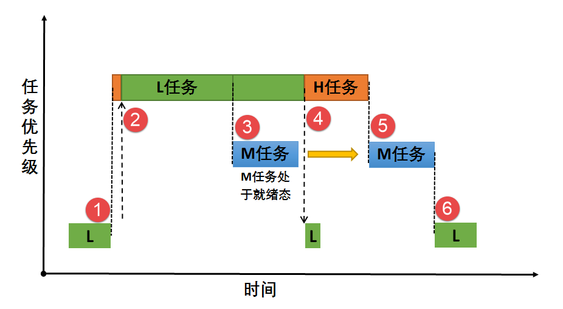
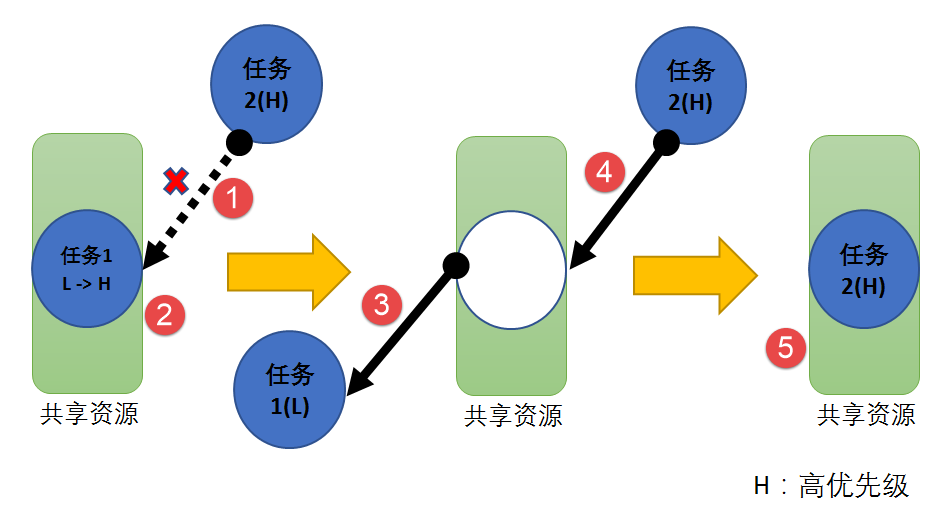
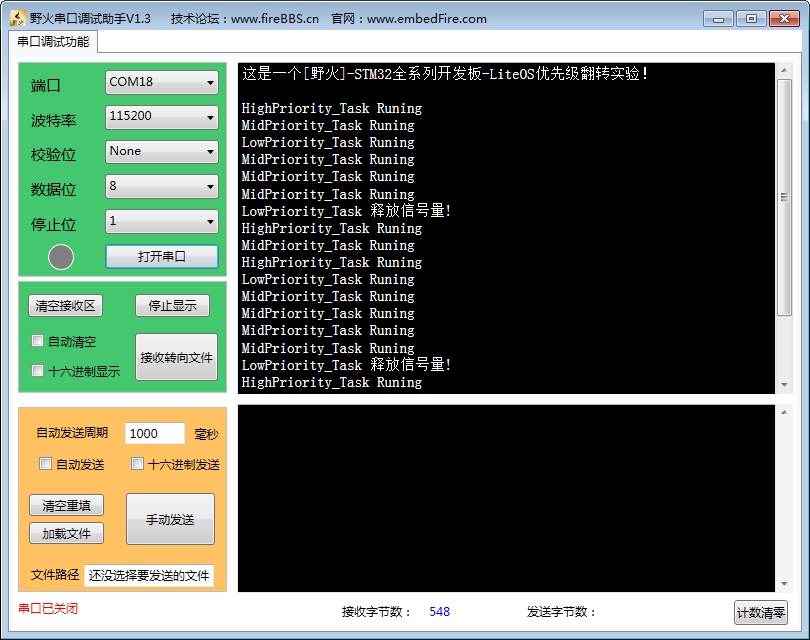
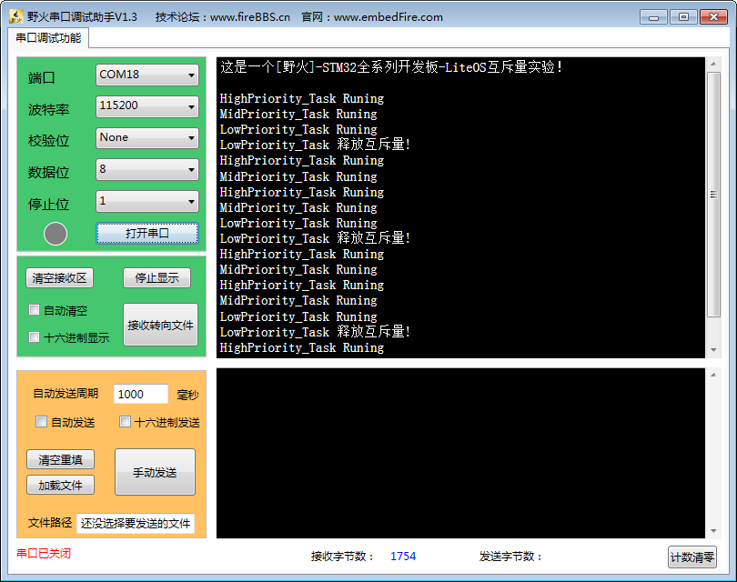

.. vim: syntax=rst

互斥锁
=======

在学习第6章 信号量的时候，本书就提过“互斥”一词，但是在操作系统中使用信号量做临界资源的互斥保护并不是最明智的选择，LiteOS提供另一
种机制——互斥锁，专门用于临界资源互斥保护。

互斥锁的基本概念
~~~~~~~~~~~~~~~~~~~~~~~~

互斥锁又称互斥信号量，是一种特殊的二值信号量，它和信号量不同的是，它具有互斥锁所有权、递归访问以及优先级继承等特性，常用于实现对临
界资源的独占式处理。任意时刻互斥锁的状态只有两种，开锁或闭锁。当互斥锁被任务持有时，该互斥锁处于闭锁状态，任务获得互斥锁的所有权。
当该任务释放互斥锁时，该互斥锁处于开锁状态，任务失去该互斥锁的所有权。当一个任务持有互斥锁时，其他任务将不能再对该互斥锁进行开锁或
持有。持有该互斥锁的任务能够再次获得这个锁而不被挂起，这就是互斥量的递归访问，这个特性与一般的信号量有很大的不同，在信号量中，由于
已经不存在可用的信号量，任务递归获取信号量时会发生主动挂起任务最终形成死锁。

如果想要实现同步功能（任务与任务间或者任务与中断间同步），二值信号量或许是更好的选择，虽然互斥锁也可以用于任务与任务间的同步，但互
斥锁更多的是用于保护资源的互斥。

互斥锁可以充当保护资源的令牌，当一个任务希望访问某个资源时，它必须先获取令牌；当任务使用资源后，必须归还令牌，以便其他任务可以访问该资源。

在二值信号量中也可以用于保护临界资源，当任务获取信号量后才能开始使用该资源，当不需要使用时就释放信号量，如此一来其他任务也能获取到
信号量从而可用使用资源。但信号量会导致的另一个潜在问题：可能发生任务优先级翻转（会在下文详细讲解）。而LiteOS提供的互斥锁可以通过优
先级继承算法，降低优先级翻转产生的危害，所以，在临界资源的保护中一般使用互斥锁。

互斥锁的优先级继承机制
~~~~~~~~~~~~~~~~~~~~~~~~~~~~~~~

在 LiteOS中为了降低优先级翻转产生的危害使用了优先级继承算法，优先级继承算法是指：暂时提高占有某种临界资源的低优先级任务的优先级，
使之与在所有等待该资源的任务中，优先级最高的任务优先级相等，而当这个低优先级任务执行完毕释放该资源时，优先级恢复初始设定值（此处
可以看作是低优先级任务继承了高优先级任务的优先级）。因此，继承优先级的任务避免了系统资源被任何中间优先级的任务抢占。

互斥锁与二值信号量最大的区别是：互斥锁具有优先级继承机制，而信号量没有。也就是说，某个临界资源受到一个互斥锁保护。任务访问该资源
时需要获得互斥锁，如果这个资源正在被一个低优先级任务使用，那么此时的互斥锁是闭锁状态，其他任务不能获得该互斥锁，如果此时一个高优
先级任务想要访问该资源，那么高优先级任务会因为获取不到互斥锁而进入阻塞态，系统会将当前持有该互斥锁任务的优先级临时提升到与高优先
级任务相同，这就是优先级继承机制，它确保高优先级任务进入阻塞状态的时间尽可能短，以及将已经出现的“优先级翻转”危害降低到最小。

任务的优先级在任务创建的时候就已经指定，高优先级的任务可以打断低优先级的任务，抢占CPU的使用权。但是在很多场合中，某些资源只有一
个，当低优先级任务正在占用该资源的时候，互斥锁处于闭锁状态，即便是高优先级任务也只能等待低优先级任务释放互斥锁，然后高优先级任务
才能获得互斥锁去访问该资源。高优先级任务无法运行而低优先级任务可以运行的现象称为“优先级翻转”。

为什么说优先级翻转在操作系统中是危害很大？因为在一开始设计系统的时候，就已经指定任务的优先级了，越重要的任务优先级越高。但是发生
优先级翻转，会导致系统的高优先级任务阻塞时间过长，得不到有效的处理，有可能对整个系统产生严重的危害，同时也违法了操作系统可抢占调度的原则。

举个例子，当前系统中存在三个任务，分别为H任务（High）、M任务（Middle）、L任务（Low），三个任务的优先级顺序为H任务>M任务>L任务。
正常运行的时候H任务可以打断M任务与L任务，M任务可以打断L任务。假设系统中存在一个临界资源，此时该资源被L任务正在使用中，某一时刻，
H任务需要使用该资源，但此时L任务还未释放资源，H任务则因为获取不到该资源使用权而进入阻塞态，L任务继续使用该资源，此时已经出现了
“优先级翻转”现象，高优先级任务在等待低优先级的任务执行，如果在L任务执行的时候刚好M任务被唤醒了，由于M任务优先级比L任务优先级高，
那么会打断L任务，抢占L任务的CPU使用权，直到M任务执行完，再把CPU使用权归还给L任务，L任务继续执行，等到执行完毕之后释放该资源，
此时H任务才能从阻塞态解除，使用该资源。这个过程，本来是最高优先级的H任务，等待了更低优先级的L任务与M任务，其阻塞的时间是M任务运
行时间+L任务运行时间，假如系统中有多个如M任务这样的中间优先级任务抢占最低优先级任务CPU使用权，那么系统最高优先级的任务将持续阻
塞，这是绝对不允许出现的。因此在没有优先级继承的情况下，保护临界资源将有可能产生优先级翻转，其危害极大，优先级翻转过程示意图如
图 优先级翻转示意图_ 所示。

.. image:: media/mutex/mutex002.png
    :align: center
    :name: 优先级翻转示意图
    :alt: 优先级翻转示意图

-   优先级翻转示意图_  **(1)**\ ：L任务正在使用某临界资源， H任务被唤醒，执行H任务。但L任务并未执行完毕，此时临界资源还未释放。

-   优先级翻转示意图_ **(2)**\ ：这个时刻H任务也要对该临界资源进行访问，但 L任务还未释放资源，由于保护机制，H任务进入阻塞态，L任务得以继续运行，此时已经发生了优先级翻转现象。

-   优先级翻转示意图_ **(3)**\ ：某个时刻M任务被唤醒，由于M任务的优先级高于L任务， M任务抢占了CPU的使用权，M任务开始运行，此时L任务尚未执行完，临界资源还未被释放。

-   优先级翻转示意图_ **(4)**\ ：M任务运行结束，归还CPU使用权，L任务继续运行。

-   优先级翻转示意图_ **(5)**\ ：L任务运行结束，释放临界资源，H任务得以对资源进行访问，H任务开始运行。

如果H任务的等待时间过长，对整个系统来说可能是致命的，所以尽可能降低高优先级任务的等待时间以此降低优先级翻转的危害，
而互斥锁就是用于临界资源的保护，并且其特有的优先级继承机制可以降低优先级翻转的产生的危害。

假如系统使用互斥锁保护临界资源，那么就具有优先级继承特性，任务需要在获取互斥锁后才能访问临界资源。在H任务获取互斥锁时，
由于获取不到互斥锁进入阻塞态，那么系统就会把当前正在使用资源的L任务的优先级临时提升到与H任务优先级相同，当M任务被唤醒时，
因为它的优先级比H任务低，所以无法打断L任务，因为此时L任务的优先级被临时提升到H，所以当L任务使用完该资源候释放互斥锁，
H任务将获得互斥锁而恢复运行。因此H任务的阻塞时间仅仅是L任务的执行时间，此时的优先级的危害降到了最低，这就是优先级继承
的优势，其示意图如图 优先级继承示意图_ 所示。

-   优先级继承示意图_  **(1)**\ ： L任务正在使用某临界资源， H任务被唤醒，执行H任务。但L任务尚未运行完毕，此时互斥锁还未释放。

-   优先级继承示意图_ **(2)**\ ：某一时刻H任务也要获取互斥锁访问该资源，由于互斥锁对临界资源的保护机制，H任务无法获得互斥锁而进入阻
    塞态。此时发生优先级继承，系统将L任务的优先级暂时提升到与H任务优先级相同，L任务继续执行。

-   优先级继承示意图_ **(3)**\ ：在某一时刻M任务被唤醒，由于此时M任务的优先级暂时低于L任务，所以M任务仅在就绪态，而无法获得CPU使用权。

-   优先级继承示意图_ **(4)**\ ：L任务运行完毕释放互斥锁，H任务获得互斥锁后恢复运行，此时L任务的优先级会恢复初始指定的优先级。

-   优先级继承示意图_ **(5)**\ ：当H任务运行完毕，M任务得到CPU使用权，开始执行。

-   优先级继承示意图_ **(6)**\ ：系统正常运行，按照初始指定的优先级运行。

使用互斥锁的时候一定需要注意以下几点。

-   1. 在获得互斥锁后，请尽快释放互斥锁。

-   2. 在任务持有互斥锁的这段时间，不得更改任务的优先级。

-   3. LiteOS的优先级继承机制不能解决优先级翻转，只能将这种情况的影响降低到最小，硬实时系统在一开始设计时就要避免优先级翻转发生。

-   4. 互斥锁不能在中断服务函数中使用。

互斥锁的应用场景
~~~~~~~~~~~~~~~~~~~~~~~~

互斥锁的使用比较单一，因为它是信号量的一种，并且它是以锁的形式存在。在初始化的时候，互斥锁处于开锁的状态，而当被任务
持有的时候则立刻转为闭锁的状态。互斥锁更适合于以下场景。

-   1. 可能会引起优先级翻转的情况。

-   2. 任务可能会多次获取互斥锁的情况下。这样可以避免同一任务多次递归持有而造成死锁的问题。

多任务环境下往往存在多个任务竞争同一临界资源的应用场景，互斥锁可被用于对临界资源的保护从而实现独占式访问。另外，互
斥锁可以降低信号量存在的优先级翻转问题带来的影响。

比如有两个任务需要对串口进行发送数据，其硬件资源只有一个，那么两个任务肯定不能同时发送数据，不然将导致数据错误，那
么，就可以用互斥锁对串口资源进行保护，当一个任务正在使用串口的时候，另一个任务则无法使用串口，等到任务使用串口完毕
之后，另外一个任务才能获得串口的使用权。

互斥锁的运作机制
~~~~~~~~~~~~~~~~~~~~~~~~

多任务环境下会存在多个任务访问同一临界资源的场景，该资源会被任务独占处理。其他任务在资源被占用的情况下不允许对该临界
资源进行访问，这个时候就需要用到LiteOS的互斥锁来进行资源保护，那么互斥锁是怎样来避免这种冲突？

使用互斥锁处理不同任务对临界资源的同步访问时，任务想要获得互斥锁才能访问资源，如果一旦有任务成功获得了互斥锁，则互斥
锁立即变为闭锁状态，此时其他任务会因为获取不到互斥锁而不能访问该资源，任务会根据用户指定的阻塞时间进行等待，直到互斥
锁被持有任务释放后，其他任务才能获取互斥锁从而得以访问该临界资源，此时互斥锁再次上锁，如此一来就可以确保同一时刻只有
一个任务正在访问这个临界资源，保证了临界资源操作的安全性，其过程如图 互斥锁运作机制_ 所示。

-   互斥锁运作机制_  **(1)**\ ：因为互斥锁具有优先级继承机制，一般选择使用互斥锁对资源进行保护，如果资源被占用的时候，无论是何种优先级的任务想要使用该资源都会被阻塞。

-   互斥锁运作机制_ **(2)**\ ：假如正在使用该资源的任务1比阻塞中的任务2的优先级低，那么任务1将被系统临时提升到与高优先级任务2相等的优先级（任务1的优先级从L 变成H）。

-   互斥锁运作机制_ **(3)**\ ：当任务1使用完资源之后，释放互斥锁，此时任务1的优先级从H恢复L。

-   互斥锁运作机制_ **(4)-(5)**\ ：任务2此时可以获得互斥锁，然后访问资源，当任务2访问了资源的时候，该互斥锁的状态又为闭锁状态，其他任务无法获取互斥锁。

互斥锁的使用讲解
~~~~~~~~~~~~~~~~~~~~~~~~

互斥锁控制块
^^^^^^^^^^^^^^^^^^

互斥锁控制块与信号量控制类似，系统中每一个互斥锁都有对应的互斥锁控制块，它记录了互斥锁的所有信息，比如互斥锁的状态，
持有次数、ID、所属任务等，如 代码清单:互斥锁-1_ 所示。

.. code-block:: c
    :caption: 代码清单:互斥锁-1互斥锁控制块
    :name: 代码清单:互斥锁-1
    :linenos:

    typedef struct {
        UINT8           ucMuxStat;       (1)
        UINT16          usMuxCount;      (2)
        UINT32          ucMuxID;         (3)
        LOS_DL_LIST     stMuxList;       (4)
        LOS_TASK_CB     *pstOwner;       (5)
        UINT16          usPriority;      (6)
    } MUX_CB_S;

-   代码清单:互斥锁-1_  **(1)**\ ：ucMuxStat是互斥锁状态，其状态有两个：OS_MUX_UNUSED或OS_MUX_USED，表示互斥锁是否被使用。

-   代码清单:互斥锁-1_ **(2)**\ ：usMuxCount是互斥锁持有次数，在每次获取互斥锁的时候，该成员变量会增加，用于记录持有的次数，
    当usMuxCount为0的时候表示互斥锁处于开锁状态，任务可以随时获取，当它是一个正值的时候，表示互斥锁已经被获取了，只有持有互斥锁的任务才能释放它。

-   代码清单:互斥锁-1_ **(3)**\ ：ucMuxID是互斥锁ID。

-   代码清单:互斥锁-1_ **(4)**\ ：stMuxList是互斥锁阻塞列表。用于记录阻塞在此互斥锁的任务。

-   代码清单:互斥锁-1_ **(5)**\ ：\*pstOwner是一个任务控制块指针，指向当前持有该互斥锁任务，如此一来系统就能够知道该互斥锁的所有权归哪个任务，
    互斥锁的释放只能是持有互斥锁的任务进行释放，其他任务都没有权利操作已经处于闭锁状态的互斥锁。

-   代码清单:互斥锁-1_ **(6)**\ ：usPriority是记录持有互斥锁任务的初始优先级，用于处理优先级继承。

互斥锁错误代码
^^^^^^^^^^^^^^^^^^^

在LiteOS中，与互斥锁相关的函数大多数都会有返回值，其返回值是一些错误代码，方便使用者进行调试，下面列出一些常见
的错误代码与参考解决方案，具体如表 常见互斥锁错误代码说明_ 所示。

.. list-table::
   :widths: 25 25 25 25
   :name: 常见互斥锁错误代码说明
   :header-rows: 0

   * - 序号
     - 定义
     - 描述
     - 参考解决方案

   * - 1
     - LOS_ERRNO_MUX_NO_MEMORY
     - 内存请求失败
     - 减少互斥锁限制数量的上限

   * - 2
     - LOS_ERRNO_MUX_INVALID
     - 互斥锁不可用
     - 传入有效的互斥锁的ID

   * - 3
     - LOS_ERRNO_MUX_PTR_NULL
     - 传入空指针
     - 传入合法指针

   * - 4
     - LOS_ERRNO_MUX_ALL_BUSY
     - 没有互斥锁可用
     - 增加互斥锁限制数量的上限

   * - 5
     - LOS_ERRNO_MUX_UNAVAILABLE
     - 锁失败，因为锁被其他任务使用
     - 等待其他任务解锁或者设置等待时间

   * - 6
     - LOS_ERRNO_MUX_PEND_INTERR
     - 在中断中使用互斥锁
     - 在中断中禁止调用此接口

   * - 7
     - LOS_ERRNO_MUX_PEND_IN_LOCK
     - 任务调度没有使能，任务等待另一个任务释放锁
     - 设置PEND为非阻塞模式或者使能任务调度

   * - 8
     - LOS_ERRNO_MUX_TIMEOUT
     - 互斥锁PEND超时
     - 增加等待时间或者设置一直等待模式

   * - 9
     - LOS_ERRNO_MUX_PENDED
     - 删除正在使用的锁
     - 等待解锁再删除锁

互斥锁创建函数LOS_MuxCreate()
^^^^^^^^^^^^^^^^^^^^^^^^^^^^^^^^^^^^^

LiteOS提供互斥锁创建函数接口——LOS_MuxCreate()，该函数用于创建一个互斥锁，在创建互斥锁后，系统会返回互斥锁ID，以后
对互斥锁的操作也是通过互斥锁ID进行操作的，因此需要用户定义一个互斥锁ID变量，并将变量的地址传入互斥锁创建函数中，
LOS_MuxCreate()函数源码如 代码清单:互斥锁-2_ 所示，其使用实例如 代码清单:互斥锁-3_ 高亮部分所示。

.. code-block:: c
    :caption: 代码清单:互斥锁-2 互斥锁创建函数LOS_MuxCreate()源码
    :name: 代码清单:互斥锁-2
    :linenos:

    /*********************************************************************
    Function     : LOS_MuxCreate
    Description  : 创建一个互斥锁,
    Input        : None
    Output       : puwMuxHandle --- 互斥锁ID（句柄）
    Return       : 返回LOS_OK表示创建成功,或者其他失败的错误代码
    *********************************************************************/
    LITE_OS_SEC_TEXT_INIT  UINT32  LOS_MuxCreate (UINT32 *puwMuxHandle)
    {
        UINT32      uwIntSave;
        MUX_CB_S    *pstMuxCreated;
        LOS_DL_LIST *pstUnusedMux;
        UINT32      uwErrNo;
        UINT32      uwErrLine;

        if (NULL == puwMuxHandle) {				(1)
            return LOS_ERRNO_MUX_PTR_NULL;
        }

        uwIntSave = LOS_IntLock();
        if (LOS_ListEmpty(&g_stUnusedMuxList)) {			(2)
            LOS_IntRestore(uwIntSave);
            OS_GOTO_ERR_HANDLER(LOS_ERRNO_MUX_ALL_BUSY);
        }

        pstUnusedMux                = LOS_DL_LIST_FIRST(&(g_stUnusedMuxList));
        LOS_ListDelete(pstUnusedMux);
        pstMuxCreated               = (GET_MUX_LIST(pstUnusedMux)); (3)
        pstMuxCreated->usMuxCount   = 0;				(4)
        pstMuxCreated->ucMuxStat    = OS_MUX_USED;			(5)
        pstMuxCreated->usPriority   = 0;				(6)
        pstMuxCreated->pstOwner     = (LOS_TASK_CB *)NULL;		(7)
        LOS_ListInit(&pstMuxCreated->stMuxList);			(8)
        *puwMuxHandle               = (UINT32)pstMuxCreated->ucMuxID; (9)
        LOS_IntRestore(uwIntSave);
        return LOS_OK;
    ErrHandler:
        OS_RETURN_ERROR_P2(uwErrLine, uwErrNo);
    }

-   代码清单:互斥锁-2_ **(1)**\ ：判断互斥锁ID变量地址是否有效，如果为NULL则返回错误代码。

-   代码清单:互斥锁-2_ **(2)**\：从系统的互斥锁未使用列表取下一个互斥锁控制块，如果系统中没有可用的互斥锁控制块，则返回错误代码，因为系统
    可用的互斥锁个数达到系统支持的上限，读者可以在target_config.h文件中修改LOSCFG_BASE_IPC_MUX_LIMIT宏定义以增加系统支持的互斥锁数量。

-   代码清单:互斥锁-2_ **(3)**\ ：如果系统中互斥锁尚未达到上限，就从互斥锁未使用列表中获取一个互斥锁控制块。

-   代码清单:互斥锁-2_ **(4)**\ ：初始化互斥锁中的持有次数为0，表示互斥锁处于开锁状态，因为新创建的互斥锁是没有被任何任务持有的。

-   代码清单:互斥锁-2_ **(5)**\ ：初始化互斥锁的状态信息为已使用的状态。

-   代码清单:互斥锁-2_ **(6)**\ ：初始化占用互斥锁的任务的优先级，为最高优先级，此时互斥锁没有被任何任务持有，当有任务持有互斥锁时，这个值会设置为持有任务的优先级数值。

-   代码清单:互斥锁-2_ **(7)**\ ：将指向任务控制块的指针初始化为NULL表示没有任务持有互斥锁。

-   代码清单:互斥锁-2_ **(8)**\ ：初始化互斥锁的阻塞列表。

-   代码清单:互斥锁-2_ **(9)**\ ：返回已经创建成功的互斥锁ID。

.. code-block:: c
    :caption: 代码清单:互斥锁-3互斥锁创建函数LOS_MuxCreate()实例
    :emphasize-lines: 1-2,5-6
    :name: 代码清单:互斥锁-3
    :linenos:

    /* 定义互斥锁的ID变量 */
    UINT32 Mutex_Handle;
    UINT32 uwRet = LOS_OK;/* 定义一个创建任务的返回类型，初始化为创建成功的返回值 */

    /* 创建一个互斥锁*/
    uwRet = LOS_MuxCreate(&Mutex_Handle);
    if (uwRet != LOS_OK)
    {
        printf("Mutex_Handle互斥锁创建失败！\n");
    }

互斥锁删除函数LOS_MuxDelete()
^^^^^^^^^^^^^^^^^^^^^^^^^^^^^^^^^^^^^^^^^^^^^^^^^^^^^^^^^^^^^^^^^^

读者可以根据互斥锁ID将互斥锁删除，删除后的互斥锁将不能被使用，它所有信息都会被系统回收，如果系统中有任务持有
互斥锁或者有任务阻塞在互斥锁上时，互斥锁是不能被删除的。uwMuxHandle是互斥锁ID，表示的是要删除哪个互斥锁，其
函数源码如 代码清单:互斥锁-4_ 所示。

.. code-block:: c
    :caption: 代码清单:互斥锁-4互斥锁删除函数LOS_MuxDelete()源码
    :name: 代码清单:互斥锁-4
    :linenos:

    /*********************************************************************
    Function     : LOS_MuxDelete
    Description  : 删除一个互斥锁
    Input        : uwMuxHandle------互斥锁ID
    Output       : None
    Return       : 返回LOS_OK表示删除成功,或者其他失败的错误代码
    *******************************************************************/
    LITE_OS_SEC_TEXT_INIT UINT32 LOS_MuxDelete(UINT32 uwMuxHandle)
    {
        UINT32    uwIntSave;
        MUX_CB_S *pstMuxDeleted;
        UINT32   uwErrNo;
        UINT32   uwErrLine;

        if (uwMuxHandle >= (UINT32)LOSCFG_BASE_IPC_MUX_LIMIT) {	(1)
            OS_GOTO_ERR_HANDLER(LOS_ERRNO_MUX_INVALID);
        }

        pstMuxDeleted = GET_MUX(uwMuxHandle);			(2)
        uwIntSave = LOS_IntLock();
        if (OS_MUX_UNUSED == pstMuxDeleted->ucMuxStat) {		(3)
            LOS_IntRestore(uwIntSave);
            OS_GOTO_ERR_HANDLER(LOS_ERRNO_MUX_INVALID);
        }

        if (!LOS_ListEmpty(&pstMuxDeleted->stMuxList) || pstMuxDeleted->usMuxCount) {
            LOS_IntRestore(uwIntSave);
            OS_GOTO_ERR_HANDLER(LOS_ERRNO_MUX_PENDED);		(4)
        }

        LOS_ListAdd(&g_stUnusedMuxList, &pstMuxDeleted->stMuxList);  (5)
        pstMuxDeleted->ucMuxStat = OS_MUX_UNUSED;			(6)

        LOS_IntRestore(uwIntSave);

        return LOS_OK;
    ErrHandler:
        OS_RETURN_ERROR_P2(uwErrLine, uwErrNo);
    }

-   代码清单:互斥锁-4_ **(1)**\ ：判断互斥锁ID是否有效，如果无效则返回错误代码LOS_ERRNO_MUX_INVALID。

-   代码清单:互斥锁-4_ **(2)**\ ：根据互斥锁ID获取要删除的互斥锁控制块指针。

-   代码清单:互斥锁-4_ **(3)**\ ：如果该互斥锁是未使用的，则返回错误代码。

-   代码清单:互斥锁-4_ **(4)**\ ：如果系统中有任务持有互斥锁或者有任务阻塞在互斥锁上时，系统不会删除该互斥锁，返回错误代码
    LOS_ERRNO_MUX_PENDED，读者需要确保没有任务持有互斥锁或者没有任务阻塞在互斥锁上时再进行删除操作。

-   代码清单:互斥锁-4_ **(5)**\ ：把互斥锁添加到互斥锁未使用列表中。

-   代码清单:互斥锁-4_ **(6)**\ ：将互斥锁的状态改变为未使用，表示互斥锁已经删除。

互斥锁删除函数的使用方法，如 代码清单:互斥锁-5_ 高亮部分所示。

.. code-block:: c
    :caption: 代码清单:互斥锁-5互斥锁删除函数LOS_MuxDelete()实例
    :name: 代码清单:互斥锁-5
    :emphasize-lines: 2
    :linenos:

    UINT32 uwRet = LOS_OK;/* 定义一个返回类型，初始化为删除成功的返回值 */
    uwRet = LOS_MuxDelete(Mutex_Handle); /* 删除互斥锁 */
    if (LOS_OK == uwRet)
    {
        printf("互斥锁删除成功！\n");
    }

互斥锁释放函数LOS_MuxPost()
^^^^^^^^^^^^^^^^^^^^^^^^^^^^^^^^^^^^^^^^^^^^^^^^^^^^^^^^^^^^

任务想要访问某个临界资源时，需要先获取互斥锁，然后才能访问该资源，在任务使用完该资源后必须要及时释放互斥锁，其他任务
才能获取互斥锁从而访问该资源。在前面章节的讲解中，读者应该都知道当互斥锁处于开锁状态的时候，任务才能获取互斥锁，那么，
是什么函数使互斥锁处于开锁状态呢？LiteOS提供了互斥锁释放函数LOS_MuxPost()，持有互斥锁的任务可以调用该函数将互斥锁释
放，释放后的互斥锁处于开锁状态，系统中其他任务可以获取互斥锁。但互斥锁允许在任务中释放而不能在中断中释放，原因有以下两点。

-   1. 中断上下文没有一个任务的概念。

-   2. 互斥锁只能被持有者释放，持有者是任务。

互斥锁有所属关系，只有持有者才能释放锁，而这个持有者是任务，因为中断上下文没有任务概念，所以中断上下文不能持有，也不能释放互斥锁。

使用该函数接口时，只有已持有互斥锁所有权的任务才能释放它，当持有互斥锁的任务调用LOS_MuxPost()函数时会将互斥锁变为开
锁状态，如果有其他任务在等待获取该互斥锁时，等待的任务将被唤醒，然后持有该互斥锁。如果任务的优先级被临时提升，那么当
互斥锁被释放后，任务的优先级将恢复为任务初始设定的优先级，LOS_MuxPost()源码如 代码清单:互斥锁-6_ 所示。

.. code-block:: c
    :caption: 代码清单:互斥锁-6互斥锁释放函数LOS_MuxPost()源码
    :name: 代码清单:互斥锁-6
    :linenos:

    /*********************************************************************
    Function     : LOS_MuxPost
    Description  : 释放一个互斥锁
    Input        : uwMuxHandle ------ 互斥锁ID
    Output       : None
    Return       : 返回LOS_OK表示释放成功,或者其他失败的错误代码
    ********************************************************************/
    LITE_OS_SEC_TEXT UINT32 LOS_MuxPost(UINT32 uwMuxHandle)
    {
        UINT32      uwIntSave;
        MUX_CB_S    *pstMuxPosted = GET_MUX(uwMuxHandle);
        LOS_TASK_CB *pstResumedTask;
        LOS_TASK_CB *pstRunTsk;

        uwIntSave = LOS_IntLock();

        if ((uwMuxHandle >= (UINT32)LOSCFG_BASE_IPC_MUX_LIMIT) ||
            (OS_MUX_UNUSED == pstMuxPosted->ucMuxStat)) {		(1)
            LOS_IntRestore(uwIntSave);
            OS_RETURN_ERROR(LOS_ERRNO_MUX_INVALID);
        }

        pstRunTsk = (LOS_TASK_CB *)g_stLosTask.pstRunTask;
        if ((pstMuxPosted->usMuxCount == 0)||(pstMuxPosted->pstOwner != pstRunTsk)) {
            LOS_IntRestore(uwIntSave);
            OS_RETURN_ERROR(LOS_ERRNO_MUX_INVALID);			(2)
        }

        if (--(pstMuxPosted->usMuxCount) != 0) {			(3)
            LOS_IntRestore(uwIntSave);
            return LOS_OK;
        }

        if ((pstMuxPosted->pstOwner->usPriority)!=pstMuxPosted->usPriority){
            osTaskPriModify(pstMuxPosted->pstOwner, pstMuxPosted->usPriority);
        }								(4)

        if (!LOS_ListEmpty(&pstMuxPosted->stMuxList)) {
        pstResumedTask = OS_TCB_FROM_PENDLIST(
            LOS_DL_LIST_FIRST(&(pstMuxPosted->stMuxList)));	(5)
            pstMuxPosted->usMuxCount    = 1;			(6)
            pstMuxPosted->pstOwner      = pstResumedTask;		(7)
            pstMuxPosted->usPriority    = pstResumedTask->usPriority;(8)
            pstResumedTask->pTaskMux    = NULL;			(9)

            osTaskWake(pstResumedTask, OS_TASK_STATUS_PEND);		(10)

            (VOID)LOS_IntRestore(uwIntSave);
            LOS_Schedule();					(11)
        } else {
            (VOID)LOS_IntRestore(uwIntSave);
        }

        return LOS_OK;
    }

-   代码清单:互斥锁-6_ **(1)**\ ：如果互斥锁ID是无效的，或者要释放的信号量状态是未使用的，则返回错误代码。

-   代码清单:互斥锁-6_ **(2)**\ ：如果互斥锁没有被任务持有，那就无需释放互斥锁；如果持有互斥锁的任务不是当前任务，则不允许进行互斥锁释放操作，
    因为互斥锁的所有权仅归持有互斥锁的任务所有，其他任务不具备释放/获取互斥锁的权利。

-   代码清单:互斥锁-6_ **(3)**\ ：满足释放互斥锁的条件，释放一次互斥锁后usMuxCount持有次数不为0，这就表明当前任务还持有互斥锁，此时互斥锁还处
    于闭锁状态，返回LOS_OK表示释放成功。

-   代码清单:互斥锁-6_ **(4)**\ ：如果当前任务已经完全释放了持有的互斥锁，由于可能发生过优先级继承从而修改了任务的优先级，那么系统就需要恢复任
    务初始的优先级，如果当前任务的优先级与初始设定的优先级不一样，则调用osTaskPriModify()函数使任务的优先级恢复为初始设定的优先级。

-   代码清单:互斥锁-6_ **(5)**\ ：如果有任务阻塞在该互斥锁上，获取阻塞任务的任务控制块。

-   代码清单:互斥锁-6_ **(6)**\ ：设置互斥锁的持有次数为1，新任务持有互斥锁。

-   代码清单:互斥锁-6_ **(7)**\ ：互斥锁的任务控制块指针指向新任务控制块。

-   代码清单:互斥锁-6_ **(8)**\ ：记录持有互斥锁任务的优先级。

-   代码清单:互斥锁-6_ **(9)**\ ：将新任务控制块中pTaskMux指针指向NULL。

-   代码清单:互斥锁-6_ **(10)**\ ：将新任务从阻塞列表中移除，并且添加到就绪列表中。

-   代码清单:互斥锁-6_ **(11)**\ ：进行一次任务调度。

被释放前的互斥锁是处于上锁状态，被释放后互斥锁是开锁状态，除了将互斥锁控制块中usMuxCount变量减一外，还要判断一下持有互
斥锁的任务是否发生优先级继承，如果有的话，要将任务的优先级恢复到初始值；并且判断一下是否有任务阻塞在该互斥锁上，如果有
则将任务恢复就绪态并持有互斥锁。互斥锁释放函数的使用实例如 代码清单:互斥锁-7_ 高亮部分所示。

.. code-block:: c
    :caption: 代码清单:互斥锁-7互斥锁释放函数LOS_MuxPost()实例
    :emphasize-lines: 5-6
    :name: 代码清单:互斥锁-7
    :linenos:

    /* 定义互斥锁的ID变量 */
    UINT32 Mutex_Handle;

    UINT32 uwRet = LOS_OK;/* 定义一个返回类型，初始化为成功的返回值 */
    /* 释放一个互斥锁*/
    uwRet = LOS_MuxPost(Mutex_Handle);
    if (LOS_OK == uwRet)
    {
        printf("互斥锁释放成功！\n");
    }

互斥锁获取函数LOS_MuxPend()
^^^^^^^^^^^^^^^^^^^^^^^^^^^^^^^^^^^^^^^^^^^^^^^^^^^^^^^^^^^^

当互斥锁处于开锁状态时，任务才能够获取互斥锁，当任务持有了某个互斥锁的时候，其他任务就无法获取这个互斥锁，需要等到持有互
斥锁的任务进行释放后，其他任务才能获取成功，任务通过互斥锁获取函数来获取互斥锁的所有权。任务对互斥锁的所有权是独占的，任
意时刻互斥锁只能被一个任务持有，如果互斥锁处于开锁状态，那么获取该互斥锁的任务将成功获得该互斥锁，并拥有互斥锁的使用权；
如果互斥锁处于闭锁状态，获取该互斥锁的任务将无法获得互斥锁，任务将被挂起，在任务被挂起之前，会进行优先级继承，如果当前任
务优先级比持有互斥锁的任务优先级高，那么将会临时提升持有互斥锁任务的优先级。互斥锁的获取函数是LOS_MuxPend()，其源码如
代码清单:互斥锁-8_ 所示。

.. code-block:: c
    :caption: 代码清单:互斥锁-8互斥锁获取函数LOS_MuxPend()源码
    :name: 代码清单:互斥锁-8
    :linenos:

    /*********************************************************************
    Function     : LOS_MuxPend
    Description  : 对指定的互斥锁ID获取互斥锁,
    Input        : uwMuxHandle ------ 互斥锁ID,
                   uwTimeOut  ------- 等待时间
    Output       : None
    Return       : 返回LOS_OK表示获取成功,或者其他失败的错误代码
    *****************************************************************/
    LITE_OS_SEC_TEXT UINT32 LOS_MuxPend(UINT32 uwMuxHandle, UINT32 uwTimeout)
    {
        UINT32     uwIntSave;
        MUX_CB_S  *pstMuxPended;
        UINT32     uwRetErr;
        LOS_TASK_CB  *pstRunTsk;

        if (uwMuxHandle >= (UINT32)LOSCFG_BASE_IPC_MUX_LIMIT) {
            OS_RETURN_ERROR(LOS_ERRNO_MUX_INVALID);			(1)
        }

        pstMuxPended = GET_MUX(uwMuxHandle);
        uwIntSave = LOS_IntLock();
        if (OS_MUX_UNUSED == pstMuxPended->ucMuxStat) {		(2)
            LOS_IntRestore(uwIntSave);
            OS_RETURN_ERROR(LOS_ERRNO_MUX_INVALID);
        }

        if (OS_INT_ACTIVE) {					(3)
            LOS_IntRestore(uwIntSave);
            return LOS_ERRNO_MUX_PEND_INTERR;
        }

        pstRunTsk = (LOS_TASK_CB *)g_stLosTask.pstRunTask;		(4)
        if (pstMuxPended->usMuxCount == 0) {			(5)
            pstMuxPended->usMuxCount++;
            pstMuxPended->pstOwner = pstRunTsk;
            pstMuxPended->usPriority = pstRunTsk->usPriority;
            LOS_IntRestore(uwIntSave);
            return LOS_OK;
        }

        if (pstMuxPended->pstOwner == pstRunTsk) {			(6)
            pstMuxPended->usMuxCount++;
            LOS_IntRestore(uwIntSave);
            return LOS_OK;
        }

        if (!uwTimeout) {						(7)
            LOS_IntRestore(uwIntSave);
            return LOS_ERRNO_MUX_UNAVAILABLE;
        }

        if (g_usLosTaskLock) {					(8)
            uwRetErr = LOS_ERRNO_MUX_PEND_IN_LOCK;
            PRINT_ERR("!!!LOS_ERRNO_MUX_PEND_IN_LOCK!!!\n");
    #if (LOSCFG_PLATFORM_EXC == YES)
            osBackTrace();
    #endif
            goto errre_uniMuxPend;
        }

        pstRunTsk->pTaskMux = (VOID *)pstMuxPended;			(9)

        if (pstMuxPended->pstOwner->usPriority > pstRunTsk->usPriority) {
            osTaskPriModify(pstMuxPended->pstOwner, pstRunTsk->usPriority);
        }								(10)

        osTaskWait(&pstMuxPended->stMuxList, OS_TASK_STATUS_PEND, uwTimeout);

        (VOID)LOS_IntRestore(uwIntSave);
        LOS_Schedule();						(11)

        if (pstRunTsk->usTaskStatus & OS_TASK_STATUS_TIMEOUT) {	(12)
            uwIntSave = LOS_IntLock();
            pstRunTsk->usTaskStatus &= (~OS_TASK_STATUS_TIMEOUT);
            (VOID)LOS_IntRestore(uwIntSave);
            uwRetErr = LOS_ERRNO_MUX_TIMEOUT;
            goto error_uniMuxPend;
        }

        return LOS_OK;

    errre_uniMuxPend:
        (VOID)LOS_IntRestore(uwIntSave);
    error_uniMuxPend:
        OS_RETURN_ERROR(uwRetErr);
    }

-   代码清单:互斥锁-8_ **(1)**\ ：如果互斥锁ID是无效的，返回错误代码。

-   代码清单:互斥锁-8_ **(2)**\ ：根据互斥锁ID获取互斥锁控制块，如果该互斥锁是未使用的，返回错误代码LOS_ERRNO_MUX_INVALID。

-   代码清单:互斥锁-8_ **(3)**\ ：如果在中断中调用此函数，则是非法的，返回错误代码LOS_ERRNO_MUX_PEND_INTERR，因为互斥锁是不允许在中断中使用，只能在任务中获取互斥锁。

-   代码清单:互斥锁-8_ **(4)**\ ：获取当前运行的任务控制块。

-   代码清单:互斥锁-8_ **(5)**\ ：如果此互斥锁处于开锁状态，则可以获取互斥锁，并且将互斥锁的锁定次数加1，互斥锁控制块的成员变量pstOwner指向当前任务控制块，
    记录该互斥锁归哪个任务所有；记录持有互斥锁的任务的优先级，用于优先级继承机制，获取成功返回LOS_OK。

-   代码清单:互斥锁-8_ **(6)**\ ：如果当前任务是持有互斥锁的任务，系统允许再次获取互斥锁，则只需记录次互斥锁被持有的次数即可，返回LOS_OK。

-   代码清单:互斥锁-8_ **(7)**\ ：如果互斥锁处于闭锁状态，那么当前任务将无法获取互斥锁，如果用户指定的阻塞时间为0，则直接返回错误代码LOS_ERRNO_MUX_UNAVAILABLE。

-   代码清单:互斥锁-8_ **(8)**\ ：如果调度器已上锁则返回LOS_ERRNO_MUX_PEND_IN_LOCK 。

-   代码清单:互斥锁-8_ **(9)**\ ：标记一下当前任务是由于获取不到哪个互斥锁而进入阻塞态。

-   代码清单:互斥锁-8_ **(10)**\ ：如果持有该互斥锁的任务优先级比当前任务的优先级低，系统会把持有互斥锁任务的优先级暂时提升到与当前任务优先级一致，除此之外系统还
    会将当前任务添加到互斥锁的阻塞列表中。

-   代码清单:互斥锁-8_ **(11)**\ ：进行一次任务调度。

-   代码清单:互斥锁-8_ **(12)**\：程序能运行到这，说明持有互斥锁的任务释放了互斥锁，或者是阻塞时间已超时，那么系统要判断一下解除阻塞的原因，如果是由于阻塞时间超时，
    则返回错误代码LOS_ERRNO_MUX_TIMEOUT；而如果是持有互斥锁任务释放了互斥锁，那么在释放互斥锁的时候，阻塞的任务已经恢复运行，并且持有互斥锁了。

至此，获取互斥锁的操作就完成了，如果任务获取互斥锁成功，那么在使用完毕需要立即释放，否则造成其他任务无法获取互斥锁而导致
系统无法正常运作，因为互斥锁的优先级继承机制是只能将优先级危害降低，而不能完全消除。同时还需注意的是，互斥锁是不允许在中
断中操作的，互斥锁获取函数的使用实例如 代码清单:互斥锁-9_ 高亮部分所示。

.. code-block:: c
    :caption: 代码清单:互斥锁-9互斥锁获取函数LOS_MuxPend()实例
    :emphasize-lines: 5-6
    :name: 代码清单:互斥锁-9
    :linenos:

    /* 定义互斥锁的ID变量 */
    UINT32 Mutex_Handle;

    UINT32 uwRet = LOS_OK;/* 定义一个返回类型，初始化为成功的返回值 */
    //获取互斥锁，没获取到则一直等待
    uwRet = LOS_MuxPend(Mutex_Handle,LOS_WAIT_FOREVER);
    if (LOS_OK == uwRet)
    {
        printf("互斥获取成功！\n");
    }

使用互斥锁的注意事项
^^^^^^^^^^^^^^^^^^^^^^^^^^^^^^

-   1. 两个任务不能获取同一个互斥锁。如果某任务尝试获取已被持有的互斥锁，则该任务会被阻塞，直到持有该互斥锁的任务释放互斥锁。

-   2. 互斥锁不能在中断服务函数中使用。

-   3. LiteOS作为实时操作系统需要保证任务调度的实时性，尽量避免任务的长时间阻塞，因此在获得互斥锁之后，应该尽快释放互斥锁。

-   4. 任务持有互斥锁的过程中，不允许再调用LOS_TaskPriSet()等函数接口更改持有互斥锁任务的优先级。

-   5. 互斥锁和信号量的区别在于：互斥锁可以被已经持有互斥锁的任务重复获取，而不会形成死锁。这个递归调用功能是通过互斥锁控制块usMuxCount成员变量实现的，这个变量用于记录任务持有互斥锁的次数，在每次获取互斥锁后该变量加1，在释放互斥锁后该变量减1。只有当usMuxCount的值为0时，互斥锁才处于开锁状态，其他任务才能获取该互斥锁。

互斥锁实验
~~~~~~~~~~~~~

模拟优先级翻转实验
^^^^^^^^^^^^^^^^^^^^^^^^^

模拟优先级翻转实验是在LiteOS中创建了三个任务与一个二值信号量，任务分别是高优先级任务，中优先级任务，低优先级任务，用
于模拟产生优先级翻转。低优先级任务在获取信号量的时候，被中优先级打断，中优先级的任务执行时间较长，因为低优先级还未释放
信号量，那么高优先级任务就无法获得信号量而进入阻塞态，此时就发生了优先级翻转，任务在运行中通过串口打印出相关信息，实验
源码如 代码清单:互斥锁-10_ 高亮部分所示。

.. code-block:: c
    :caption: 代码清单:互斥锁-10模拟优先级翻转实验
    :emphasize-lines: 32-35,49-50,118-122,217-233,240-247,255-280
    :name: 代码清单:互斥锁-10
    :linenos:

    /***************************************************************
    * @file    main.c
    * @author  fire
    * @version V1.0
    * @date    2018-xx-xx
    * @brief   STM32全系列开发板-LiteOS！
    **************************************************************
    * @attention
    *
    * 实验平台:野火 F103-霸道 STM32 开发板
    * 论坛    :http://www.firebbs.cn
    * 淘宝    :http://firestm32.taobao.com
    *
    ***************************************************************
    */
    /* LiteOS 头文件 */
    #include "los_sys.h"
    #include "los_task.ph"
    #include "los_sem.h"
    /* 板级外设头文件 */
    #include "bsp_usart.h"
    #include "bsp_led.h"
    #include "bsp_key.h"

    /**************************** 任务ID **********************************/
    /*
    * 任务ID是一个从0开始的数字，用于索引任务，当任务创建完成之后，它就具有了一个任务ID
    * 以后要想操作这个任务都需要通过这个任务ID，
    *
    */

    /* 定义任务ID变量 */
    UINT32 HighPriority_Task_Handle;
    UINT32 MidPriority_Task_Handle;
    UINT32 LowPriority_Task_Handle;

    /**************************** 内核对象ID ****************************/
    /*
    * 信号量，消息队列，事件标志组，软件定时器这些都属于内核的对象，要想使用这些内核
    * 对象，必须先创建，创建成功之后会返回一个相应的ID。实际上就是一个整数，后续
    * 就可以通过这个ID操作这些内核对象。
    *
    * 
    内核对象就是一种全局的数据结构，通过这些数据结构可以实现任务间的通信，
    * 任务间的事件同步等各种功能。至于这些功能的实现是通过调用这些内核对象的函数
    * 来完成的
    *
    */
    /* 定义二值信号量的ID变量 */
    UINT32 BinarySem_Handle;

    /*************************** 全局变量声明 *****************************/
    /*
    * 在写应用程序的时候，可能需要用到一些全局变量。
    */

    /* 函数声明 */
    static UINT32 AppTaskCreate(void);
    static UINT32 Creat_HighPriority_Task(void);
    static UINT32 Creat_MidPriority_Task(void);
    static UINT32 Creat_LowPriority_Task(void);

    static void HighPriority_Task(void);
    static void MidPriority_Task(void);
    static void LowPriority_Task(void);
    static void BSP_Init(void);

    /***************************************************************
    * @brief  主函数
    * @param  无
    * @retval 无
    * @note   第一步：开发板硬件初始化
            第二步：创建App应用任务
            第三步：启动LiteOS，开始多任务调度，启动失败则输出错误信息
    **************************************************************/
    int main(void)
    {
    UINT32 uwRet = LOS_OK;  //定义一个任务创建的返回值，默认为创建成功

    /* 板载相关初始化 */
    BSP_Init();

    printf("这是一个[野火]-STM32全系列开发板-LiteOS优先级翻转实验！\n\n");

    /* LiteOS 内核初始化 */
    uwRet = LOS_KernelInit();

    if (uwRet != LOS_OK) {
        printf("LiteOS 核心初始化失败！失败代码0x%X\n",uwRet);
        return LOS_NOK;
    }

    /* 创建App应用任务，所有的应用任务都可以放在这个函数里面 */
    uwRet = AppTaskCreate();
    if (uwRet != LOS_OK) {
        printf("AppTaskCreate创建任务失败！失败代码0x%X\n",uwRet);
        return LOS_NOK;
        }

        /* 开启LiteOS任务调度 */
        LOS_Start();

        //正常情况下不会执行到这里
        while (1);
    }

    /********************************************************************
    * @ 函数名  ： AppTaskCreate
    * @ 功能说明： 任务创建，为了方便管理，所有的任务创建函数都可以放在这个函数里面
    * @ 参数    ： 无
    * @ 返回值  ： 无
    *********************************************************************/
    static UINT32 AppTaskCreate(void)
    {
        /* 定义一个返回类型变量，初始化为LOS_OK */
        UINT32 uwRet = LOS_OK;

        /* 创建一个二值信号量*/
        uwRet = LOS_BinarySemCreate(1,&BinarySem_Handle);
        if (uwRet != LOS_OK) {
            printf("BinarySem创建失败！失败代码0x%X\n",uwRet);
        }

        uwRet = Creat_HighPriority_Task();
        if (uwRet != LOS_OK) {
            printf("HighPriority_Task任务创建失败！失败代码0x%X\n",uwRet);
            return uwRet;
        }

        uwRet = Creat_MidPriority_Task();
        if (uwRet != LOS_OK) {
            printf("MidPriority_Task任务创建失败！失败代码0x%X\n",uwRet);
            return uwRet;
        }

        uwRet = Creat_LowPriority_Task();
        if (uwRet != LOS_OK) {
            printf("LowPriority_Task任务创建失败！失败代码0x%X\n",uwRet);
            return uwRet;
        }

        return LOS_OK;
    }

    /******************************************************************
    * @ 函数名  ： Creat_HighPriority_Task
    * @ 功能说明： 创建HighPriority_Task任务
    * @ 参数    ：
    * @ 返回值  ： 无
    ******************************************************************/
    static UINT32 Creat_HighPriority_Task()
    {
        //定义一个返回类型变量，初始化为LOS_OK
        UINT32 uwRet = LOS_OK;

        //定义一个用于创建任务的参数结构体
        TSK_INIT_PARAM_S task_init_param;

        task_init_param.usTaskPrio = 3;	/* 任务优先级，数值越小，优先级越高 */
        task_init_param.pcName = "HighPriority_Task";/* 任务名 */
        task_init_param.pfnTaskEntry = (TSK_ENTRY_FUNC)HighPriority_Task;
        task_init_param.uwStackSize = 1024;		/* 栈大小 */

        uwRet = LOS_TaskCreate(&HighPriority_Task_Handle,&task_init_param);
        return uwRet;
    }
    /*******************************************************************
    * @ 函数名  ： Creat_MidPriority_Task
    * @ 功能说明： 创建MidPriority_Task任务
    * @ 参数    ：
    * @ 返回值  ： 无
    ******************************************************************/
    static UINT32 Creat_MidPriority_Task()
    {
        //定义一个返回类型变量，初始化为LOS_OK
        UINT32 uwRet = LOS_OK;
        TSK_INIT_PARAM_S task_init_param;

        task_init_param.usTaskPrio = 4;	/* 任务优先级，数值越小，优先级越高 */
        task_init_param.pcName = "MidPriority_Task";	/* 任务名*/
        task_init_param.pfnTaskEntry = (TSK_ENTRY_FUNC)MidPriority_Task;
        task_init_param.uwStackSize = 1024;	/* 栈大小 */

        uwRet = LOS_TaskCreate(&MidPriority_Task_Handle, &task_init_param);

        return uwRet;
    }

    /*******************************************************************
    * @ 函数名  ： Creat_MidPriority_Task
    * @ 功能说明： 创建MidPriority_Task任务
    * @ 参数    ：
    * @ 返回值  ： 无
    ******************************************************************/
    static UINT32 Creat_LowPriority_Task()
    {
        //定义一个返回类型变量，初始化为LOS_OK
        UINT32 uwRet = LOS_OK;
        TSK_INIT_PARAM_S task_init_param;

        task_init_param.usTaskPrio = 5;	/* 任务优先级，数值越小，优先级越高 */
        task_init_param.pcName = "LowPriority_Task";	/* 任务名*/
        task_init_param.pfnTaskEntry = (TSK_ENTRY_FUNC)LowPriority_Task;
        task_init_param.uwStackSize = 1024;	/* 栈大小 */

        uwRet = LOS_TaskCreate(&LowPriority_Task_Handle, &task_init_param);

        return uwRet;
    }

    /******************************************************************
    * @ 函数名  ： HighPriority_Task
    * @ 功能说明： HighPriority_Task任务实现
    * @ 参数    ： NULL
    * @ 返回值  ： NULL
    *****************************************************************/
    static void HighPriority_Task(void)
    {
        //定义一个返回类型变量，初始化为LOS_OK
        UINT32 uwRet = LOS_OK;

        /* 任务都是一个无限循环，不能返回 */
        while (1) {
            //获取二值信号量 BinarySem_Handle,没获取到则一直等待
            uwRet = LOS_SemPend( BinarySem_Handle , LOS_WAIT_FOREVER );
            if (uwRet == LOS_OK)
                printf("HighPriority_Task Running\n");

            LED1_TOGGLE;
            LOS_SemPost( BinarySem_Handle ); //释放二值信号量 BinarySem_Handle
            LOS_TaskDelay ( 1000 );        /* 延时100Ticks */
        }
    }
    /******************************************************************
    * @ 函数名  ： MidPriority_Task
    * @ 功能说明： MidPriority_Task任务实现
    * @ 参数    ： NULL
    * @ 返回值  ： NULL
    *****************************************************************/
    static void MidPriority_Task(void)
    {
        /* 任务都是一个无限循环，不能返回 */
        while (1) {
            printf("MidPriority_Task Running\n");
            LOS_TaskDelay ( 1000 );        	/* 延时100Ticks */
        }
    }

    /******************************************************************
    * @ 函数名  ： LowPriority_Task
    * @ 功能说明： LowPriority_Task任务实现
    * @ 参数    ： NULL
    * @ 返回值  ： NULL
    *****************************************************************/
    static void LowPriority_Task(void)
    {
        //定义一个返回类型变量，初始化为LOS_OK
        UINT32 uwRet = LOS_OK;

        static uint32_t i;

        /* 任务都是一个无限循环，不能返回 */
        while (1) {
            //获取二值信号量 BinarySem_Handle，没获取到则一直等待
            uwRet = LOS_SemPend( BinarySem_Handle , LOS_WAIT_FOREVER );
            if (uwRet == LOS_OK)
                printf("LowPriority_Task Running\n");

            LED2_TOGGLE;

            for (i=0; i<2000000; i++) { //模拟低优先级任务占用信号量
                //放弃剩余时间片，进行一次任务切换
                LOS_TaskYield();
            }
            printf("LowPriority_Task 释放信号量!\r\n");
            LOS_SemPost( BinarySem_Handle );  //释放二值信号量 BinarySem_Handle

            LOS_TaskDelay ( 1000 );       	/* 延时100Ticks */
        }
    }

    /*******************************************************************
    * @ 函数名  ： BSP_Init
    * @ 功能说明： 板级外设初始化，所有开发板上的初始化均可放在这个函数里面
    * @ 参数    ：
    * @ 返回值  ： 无
    ******************************************************************/
    static void BSP_Init(void)
    {
        /*
        * STM32中断优先级分组为4，即4bit都用来表示抢占优先级，范围为：0~15
        * 优先级分组只需要分组一次即可，以后如果有其他的任务需要用到中断，
        * 都统一用这个优先级分组，千万不要再分组，切忌。
        */
        NVIC_PriorityGroupConfig( NVIC_PriorityGroup_4 );

        /* LED 初始化 */
        LED_GPIO_Config();

        /* 串口初始化	*/
        USART_Config();

        /* 按键初始化 */
        Key_GPIO_Config();
    }

    /*************************************END OF FILE*****************/

互斥锁实验
^^^^^^^^^^^^^

互斥锁实验是基于优先级翻转实验进行修改的，将二值信号替换为互斥锁，目的是为了测试互斥锁的优先级继承机制是否有效，实验源
码如 代码清单:互斥锁-11_ 高亮部分所示。

.. code-block:: c
    :caption: 代码清单:互斥锁-11互斥锁实验
    :emphasize-lines: 32-35,49-50,118-122,217-233,240-247,255-281
    :name: 代码清单:互斥锁-11
    :linenos:

    /***************************************************************
    * @file    main.c
    * @author  fire
    * @version V1.0
    * @date    2018-xx-xx
    * @brief   STM32全系列开发板-LiteOS！
    **************************************************************
    * @attention
    *
    * 实验平台:野火 F103-霸道 STM32 开发板
    * 论坛    :http://www.firebbs.cn
    * 淘宝    :http://firestm32.taobao.com
    *
    ***************************************************************
    */
    /* LiteOS 头文件 */
    #include "los_sys.h"
    #include "los_task.ph"
    #include "los_mux.h"
    /* 板级外设头文件 */
    #include "bsp_usart.h"
    #include "bsp_led.h"
    #include "bsp_key.h"

    /******************************* 任务ID ********************************/
    /*
    * 任务ID是一个从0开始的数字，用于索引任务，当任务创建完成之后，它就具有了一个任务ID
    * 以后要想操作这个任务都需要通过这个任务ID，
    * 
    */

    /* 定义任务ID变量 */
    UINT32 HighPriority_Task_Handle;
    UINT32 MidPriority_Task_Handle;
    UINT32 LowPriority_Task_Handle;

    /***************************** 内核对象ID ****************************/
    /*
    * 信号量，消息队列，事件标志组，软件定时器这些都属于内核的对象，要想使用这些内核
    * 对象，必须先创建，创建成功之后会返回一个相应的ID。实际上就是一个整数，后续
    * 就可以通过这个ID操作这些内核对象。
    *
    * 
    内核对象就是一种全局的数据结构，通过这些数据结构可以实现任务间的通信，
    * 任务间的事件同步等各种功能。至于这些功能的实现是通过调用这些内核对象的函数
    * 来完成的
    *
    */
    /* 定义互斥锁的ID变量 */
    UINT32 Mutex_Handle;

    /************************** 全局变量声明 ********************************/
    /*
    * 在写应用程序的时候，可能需要用到一些全局变量。
    */

    /* 函数声明 */
    static UINT32 AppTaskCreate(void);
    static UINT32 Creat_HighPriority_Task(void);
    static UINT32 Creat_MidPriority_Task(void);
    static UINT32 Creat_LowPriority_Task(void);

    static void HighPriority_Task(void);
    static void MidPriority_Task(void);
    static void LowPriority_Task(void);
    static void BSP_Init(void);

    /***************************************************************
    * @brief  主函数
    * @param  无
    * @retval 无
    * @note   第一步：开发板硬件初始化
            第二步：创建App应用任务
            第三步：启动LiteOS，开始多任务调度，启动失败则输出错误信息
    **************************************************************/
    int main(void)
    {
    UINT32 uwRet = LOS_OK;  //定义一个任务创建的返回值，默认为创建成功

    /* 板载相关初始化 */
    BSP_Init();

    printf("这是一个[野火]-STM32全系列开发板-LiteOS互斥锁实验！\n\n");

    /* LiteOS 内核初始化 */
    uwRet = LOS_KernelInit();

    if (uwRet != LOS_OK) {
        printf("LiteOS 核心初始化失败！失败代码0x%X\n",uwRet);
        return LOS_NOK;
    }

    /* 创建App应用任务，所有的应用任务都可以放在这个函数里面 */
    uwRet = AppTaskCreate();
    if (uwRet != LOS_OK) {
        printf("AppTaskCreate创建任务失败！失败代码0x%X\n",uwRet);
        return LOS_NOK;
        }

        /* 开启LiteOS任务调度 */
        LOS_Start();

        //正常情况下不会执行到这里
        while (1);
    }

    /***********************************************************************
    * @ 函数名  ： AppTaskCreate
    * @ 功能说明： 任务创建，为了方便管理，所有的任务创建函数都可以放在这个函数里面
    * @ 参数    ： 无
    * @ 返回值  ： 无
    ********************************************************************/
    static UINT32 AppTaskCreate(void)
    {
        /* 定义一个返回类型变量，初始化为LOS_OK */
        UINT32 uwRet = LOS_OK;

        /* 创建一个互斥锁*/
        uwRet = LOS_MuxCreate(&Mutex_Handle);
        if (uwRet != LOS_OK) {
            printf("Mutex创建失败！失败代码0x%X\n",uwRet);
        }

        uwRet = Creat_HighPriority_Task();
        if (uwRet != LOS_OK) {
            printf("HighPriority_Task任务创建失败！失败代码0x%X\n",uwRet);
            return uwRet;
        }

        uwRet = Creat_MidPriority_Task();
        if (uwRet != LOS_OK) {
            printf("MidPriority_Task任务创建失败！失败代码0x%X\n",uwRet);
            return uwRet;
        }

        uwRet = Creat_LowPriority_Task();
        if (uwRet != LOS_OK) {
            printf("LowPriority_Task任务创建失败！失败代码0x%X\n",uwRet);
            return uwRet;
        }

        return LOS_OK;
    }

    /******************************************************************
    * @ 函数名  ： Creat_HighPriority_Task
    * @ 功能说明： 创建HighPriority_Task任务
    * @ 参数    ：
    * @ 返回值  ： 无
    ******************************************************************/
    static UINT32 Creat_HighPriority_Task()
    {
        //定义一个返回类型变量，初始化为LOS_OK
        UINT32 uwRet = LOS_OK;

        //定义一个用于创建任务的参数结构体
        TSK_INIT_PARAM_S task_init_param;

        task_init_param.usTaskPrio = 3;	/* 任务优先级，数值越小，优先级越高 */
        task_init_param.pcName = "HighPriority_Task";/* 任务名 */
        task_init_param.pfnTaskEntry = (TSK_ENTRY_FUNC)HighPriority_Task;
        task_init_param.uwStackSize = 1024;		/* 栈大小 */

        uwRet = LOS_TaskCreate(&HighPriority_Task_Handle, &task_init_param);
        return uwRet;
    }
    /*******************************************************************
    * @ 函数名  ： Creat_MidPriority_Task
    * @ 功能说明： 创建MidPriority_Task任务
    * @ 参数    ：
    * @ 返回值  ： 无
    ******************************************************************/
    static UINT32 Creat_MidPriority_Task()
    {
        //定义一个返回类型变量，初始化为LOS_OK
        UINT32 uwRet = LOS_OK;
        TSK_INIT_PARAM_S task_init_param;

        task_init_param.usTaskPrio = 4;	/* 任务优先级，数值越小，优先级越高 */
        task_init_param.pcName = "MidPriority_Task";	/* 任务名*/
        task_init_param.pfnTaskEntry = (TSK_ENTRY_FUNC)MidPriority_Task;
        task_init_param.uwStackSize = 1024;	/* 栈大小 */

        uwRet = LOS_TaskCreate(&MidPriority_Task_Handle, &task_init_param);

        return uwRet;
    }

    /*******************************************************************
    * @ 函数名  ： Creat_MidPriority_Task
    * @ 功能说明： 创建MidPriority_Task任务
    * @ 参数    ：
    * @ 返回值  ： 无
    ******************************************************************/
    static UINT32 Creat_LowPriority_Task()
    {
        //定义一个返回类型变量，初始化为LOS_OK
        UINT32 uwRet = LOS_OK;
        TSK_INIT_PARAM_S task_init_param;

        task_init_param.usTaskPrio = 5;	/* 任务优先级，数值越小，优先级越高 */
        task_init_param.pcName = "LowPriority_Task";	/* 任务名*/
        task_init_param.pfnTaskEntry = (TSK_ENTRY_FUNC)LowPriority_Task;
        task_init_param.uwStackSize = 1024;	/* 栈大小 */

        uwRet = LOS_TaskCreate(&LowPriority_Task_Handle, &task_init_param);

        return uwRet;
    }

    /******************************************************************
    * @ 函数名  ： HighPriority_Task
    * @ 功能说明： HighPriority_Task任务实现
    * @ 参数    ： NULL
    * @ 返回值  ： NULL
    *****************************************************************/
    static void HighPriority_Task(void)
    {
        //定义一个返回类型变量，初始化为LOS_OK
        UINT32 uwRet = LOS_OK;

        /* 任务都是一个无限循环，不能返回 */
        while (1) {
            //获取互斥锁,没获取到则一直等待
            uwRet = LOS_MuxPend( Mutex_Handle , LOS_WAIT_FOREVER );
            if (uwRet == LOS_OK)
                printf("HighPriority_Task Running\n");

            LED1_TOGGLE;
            LOS_MuxPost( Mutex_Handle );   //释放互斥锁
            LOS_TaskDelay ( 1000 );     	/* 延时100Ticks */
        }
    }
    /******************************************************************
    * @ 函数名  ： MidPriority_Task
    * @ 功能说明： MidPriority_Task任务实现
    * @ 参数    ： NULL
    * @ 返回值  ： NULL
    *****************************************************************/
    static void MidPriority_Task(void)
    {
        /* 任务都是一个无限循环，不能返回 */
        while (1) {
            printf("MidPriority_Task Running\n");
            LOS_TaskDelay ( 1000 );        	/* 延时100Ticks */
        }
    }

    /******************************************************************
    * @ 函数名  ： LowPriority_Task
    * @ 功能说明： LowPriority_Task任务实现
    * @ 参数    ： NULL
    * @ 返回值  ： NULL
    *****************************************************************/
    static void LowPriority_Task(void)
    {
        //定义一个返回类型变量，初始化为LOS_OK
        UINT32 uwRet = LOS_OK;

        static uint32_t i;

        /* 任务都是一个无限循环，不能返回 */
        while (1) {
            //获取互斥锁，没获取到则一直等待
            uwRet = LOS_MuxPend( Mutex_Handle , LOS_WAIT_FOREVER );
            if (uwRet == LOS_OK)
                printf("LowPriority_Task Running\n");

            LED2_TOGGLE;

            for (i=0; i<2000000; i++) { //模拟低优先级任务占用信号量
                //放弃剩余时间片，进行一次任务切换
                LOS_TaskYield();
            }
            printf("LowPriority_Task 释放互斥锁!\r\n");
            LOS_MuxPost( Mutex_Handle );    //释放互斥锁

            LOS_TaskDelay ( 1000 );        		/* 延时100Ticks

        }
    }

    /*******************************************************************
    * @ 函数名  ： BSP_Init
    * @ 功能说明： 板级外设初始化，所有开发板上的初始化均可放在这个函数里面
    * @ 参数    ：
    * @ 返回值  ： 无
    ******************************************************************/
    static void BSP_Init(void)
    {
        /*
        * STM32中断优先级分组为4，即4bit都用来表示抢占优先级，范围为：0~15
        * 优先级分组只需要分组一次即可，以后如果有其他的任务需要用到中断，
        * 都统一用这个优先级分组，千万不要再分组，切忌。
        */
        NVIC_PriorityGroupConfig( NVIC_PriorityGroup_4 );

        /* LED 初始化 */
        LED_GPIO_Config();

        /* 串口初始化	*/
        USART_Config();

        /* 按键初始化 */
        Key_GPIO_Config();
    }

    /***************************END OF FILE**********************/

实验现象
~~~~~~~~~~~~

模拟优先级翻转实验现象
^^^^^^^^^^^^^^^^^^^^^^^^^^^^^^^

将程序编译好，用USB线连接电脑和开发板的USB接口（对应丝印为USB转串口），用DAP仿真器把配套程序下载到野火STM32开发板（具
体型号根据读者买的开发板而定，每个型号的开发板都配套有对应的程序），在电脑上打开串口调试助手，然后复位开发板就可以在调
试助手中看到串口的打印信息，它里面输出了信息表明任务正在运行中，并且很明确可以看到：高优先级任务在等待低优先级任务运行完
毕才能获得信号量继续运行，而期间中优先级的任务一直能得到运行，如图 优先级翻转实验现象_ 所示。

互斥锁实验现象
^^^^^^^^^^^^^^^^^^^

将程序编译好，用USB线连接电脑和开发板的USB接口（对应丝印为USB转串口），用DAP仿真器把配套程序下载到野火STM32开发板（具
体型号根据读者买的开发板而定，每个型号的开发板都配套有对应的程序），在电脑上打开串口调试助手，然后复位开发板就可以在调
试助手中看到串口的打印信息，它里面输出了信息表明任务正在运行中，并且很明确可以看到：在低优先级任务运行的时候，中优先级
任务无法抢占低优先级的任务，这是因为互斥锁的优先级继承机制，从而最大程度降低了优先级翻转产生的危害，如图 互斥锁同步实验现象_ 所示。

