.. vim: syntax=rst

移植LiteOS到STM32
====================

本章首先新建一个基于野火STM32全系列（包含M3/4/7）开发板的LiteOS的工程模板，保证LiteOS能够在开发板上运行。后
续的所有LiteOS相关例程都在此模板上进行修改和添加，无需反复新建。在本书配套的例程中，每一章的例程对野火STM32的
每一个开发板都会有一个对应的例程，但是区别都很小，有区别的地方书中会在详细指出，如果没有特别备注，那么例程都是一样的。

移植前的准备工作
~~~~~~~~~~~~~~~~~~

获取STM32的裸机工程模板
^^^^^^^^^^^^^^^^^^^^^^^^^^^^

STM32的裸机工程模板直接使用野火STM32开发板配套的固件库例程即可。本章选取一个比较简单的例程——“GPIO输出—使用固件
库点亮LED”作为裸机工程模板。该裸机工程模板可以在对应开发板资料中的“A盘（资料盘）\\3-程序源码\\1.固件库例程”目录下
获取到，下面以野火F103-霸道开发板的光盘目录为例，具体如 STM32裸机工程模板在光盘资料中的位置_ 所示。

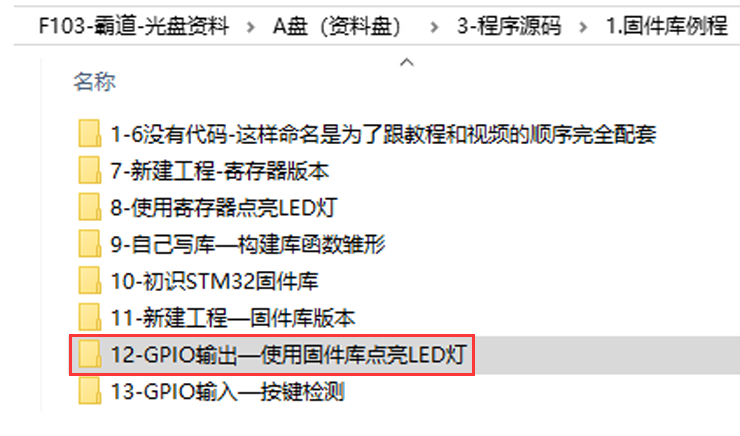

下载LiteOS 源码
^^^^^^^^^^^^^^^^^^^^^

华为LiteOS的源码有两份，分别是master版本和develop版本，这两份LiteOS源码的核心是一样的。develop版本提供了更强大的
组件及丰富的例程，如Wi-Fi块、NB-IoT模块和GPRS模块，并且更新比master版本更快。使用LiteOS接入云端更加简便，而master版本发布则
是改动较大的。本书主要以LiteOS的内核为主，如LiteOS的任务等基础功能、IPC通信机制、内存管理等，无论是使用develop版本还
是master版本，其内核源码的实现方式都是一样的，华为官方建议下载master版本使用。

LiteOS的源码可从LiteOS GitHub仓库地址https://github.com/LiteOS/LiteOS下载到，读者在移植时并不需要把整个LiteOS
源码放进工程文件中，否则工程的代码量太大。本书会在下文讲解如何将LiteOS移植到工程中去，以及如何把LiteOS源码中的核心
部分单独提取出来，方便以后在不同的平台上移植，如所示。目前使用的是LiteOS最新版本，由于LiteOS在不断更新，如果以后
LiteOS更新到更高的版本，则以最新的版本为准。

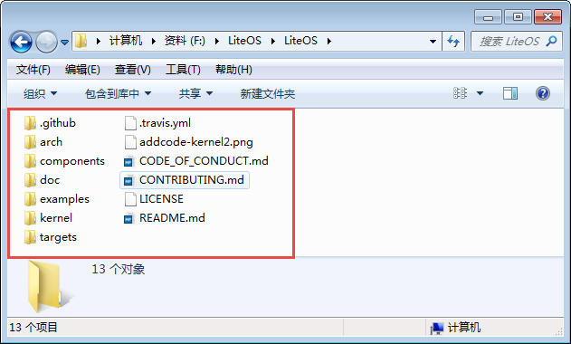

LiteOS源码核心文件夹分析
^^^^^^^^^^^^^^^^^^^^^^^^^^^^^

打开LiteOS源码文件，可以看见里面有8个文件夹，下面先来了解主要文件夹及其子文件夹的作用，然后将LiteOS源码的核心文件提取出
来，添加到工程根目录下的文件夹中，因为工程只需要有用的源码文件，而不是全部的LiteOS源码，所以可以避免工程过于庞大。每个
文件的作用在后文会具体讲解。LiteOS源码核心文件夹的分析具体如表 LiteOS_master源码文件夹主要内容组成_ 所示 。

.. list-table::
   :widths: 25 25 25 25
   :name: LiteOS_master源码文件夹主要内容组成
   :header-rows: 0

   * - 文件夹
     - 文件夹
     - 文件夹
     - 描述

   * - arch
     - arm
     - arm-m
     - M核中断、调度、Tick相关代码

   * -
     -
     - common
     - arm核公用的cmsis core接口

   * - components
     - cmsis
     -
     - LiteOS提供的cmsis os接口实现

   * - kernel
     - base
     - core
     - LiteOS基础内核代码文件，包括队列、task调度、软timer、时间片等功能

   * -
     -
     - om
     - 错误处理的相关文件

   * -
     -
     - include
     - LiteOS内核内部使用的头文件

   * -
     -
     - ipc
     - LiteOS中IPC通信相关的代码文件，包括事件、信号量、消息队列、互斥锁等

   * -
     -
     - mem
     - LiteOS中的内核内存管理的相关代码

   * -
     -
     - misc
     - 内存对齐功能及毫秒级休眠sleep功能

   * -
     - include
     -
     - LiteOS开源内核头文件

   * -
     - extenden
     - ticless to tickless
     - 低功耗框架代码

这些文件夹里面的文件是LiteOS源码的核心文件，可以把它拿出来放到工程文件夹中，并命名为LiteOS以便区分，后续
可以直接移植，如图 从LiteOS提取的核心文件夹_ 所示。

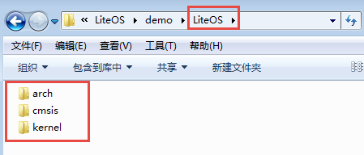

往裸机工程添加LiteOS源码
~~~~~~~~~~~~~~~~~~~~~~~~~~~~~~~

复制LiteOS文件夹到裸机工程根目录
^^^^^^^^^^^^^^^^^^^^^^^^^^^^^^^^^^^^^

鉴于LiteOS的核心文件容量很小，可以直接将上一节中提取的LiteOS目录下的所有文件夹复制到STM32裸机工程里面，让
整个LiteOS跟随工程一起发布。使用这种方法打包的LiteOS 工程，复制到任何一台电脑上面都是可以使用的，而不会提示
找不到LiteOS的源文件，如图 复制LiteOS文件夹到裸机工程_ 所示。

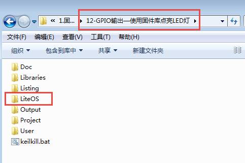

除了LiteOS的核心文件外，还需要移植一下其他文件，如关于LiteOS系统的配置文件。这是一些可以被用户修改的文件，所
以会放在具体的工程文件中。targets就是华为LiteOS为一些常用开发板开发的demo文件夹（含原厂芯片驱动），其内有各个
工程的配置文件，其路径具体如下表所示。

表  LiteOS的配置文件

========== ===================================
文件夹名字 所在源码目录
========== ===================================
OS_CONFIG  LiteOS \\targets\任意一个工程文件下
========== ===================================

将 OS_CONFIG文件夹中的配置文件复制到LiteOS文件夹
^^^^^^^^^^^^^^^^^^^^^^^^^^^^^^^^^^^^^^^^^^^^^^^^^^^^^^^^^^^^^^^^

将OS_CONFIG文件夹中的配置文件复制到上一节提取的LiteOS核心文件夹中，后续在移植工程时，读者需要对这
个文件夹中的某些文件进行修改，以适配不同的工程配置。可以通过修改这个文件夹中的内核配置头文件来裁剪
LiteOS的功能，如图 OS_CONFIG文件夹中的配置文件复制到LiteOS文件夹_ 所示。

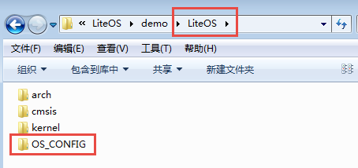

复制Include文件夹到CMSIS文件夹
^^^^^^^^^^^^^^^^^^^^^^^^^^^^^^^^^^^^^^^^^

Include文件夹是Keil_v5安装目录下的一个文件夹，里面包含了ARM的相关文件，其路径为
C:\\Keil_v5\\ARM\\Pack\\ARM\\CMSIS\\5.3.0\\CMSIS\Include，如图 Keil_v5安装目录下的Include文件夹内容_ 所示。因为LiteOS源码中会包含这个文件夹的内
容，所以首先需要将其复制到工程文件中，路径为“\\？\\Libraries\\CMSIS”，“？”代表具体的工程。现在本书示例的路
径是“12-GPIO输出—使用固件库点亮LED灯\\Libraries\\CMSIS”，如图 复制Include文件夹到工程文件夹中_ 所示。将其包含进来可以避免其他电脑在移植
过程中没有相关头文件而引起的编译错误。

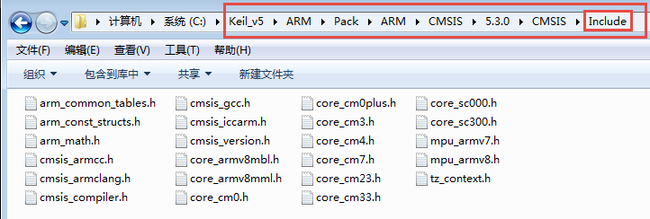

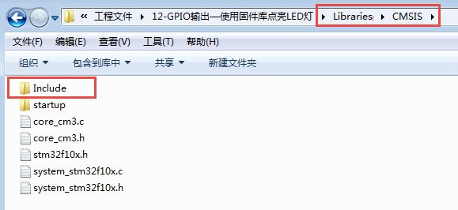

LiteOS 文件夹内容介绍
^^^^^^^^^^^^^^^^^^^^^^^^^^^^

本节将对LiteOS源码文件夹中的内容作简单介绍。注意：此处的LiteOS文件夹并不是2.1.3 小节中提取的核心LiteOS文件夹，
而是华为LiteOS完整源码的文件夹，包括demo、组件等。

targets文件夹简介
''''''''''''''''''''''''

targets文件夹里面存放的是板级工程代码（含原厂芯片驱动），LiteOS已经为各半导体厂商的评估板写好程序，这些程序就存
放在targets文件夹下。本书下载的LiteOS版本是master版本，只有几款开发板的程序，如图 targets文件夹内容_ 所示。 
targets文件夹中的每一个工程文件里都有具体的LiteOS系统初始化文件、配置文件等。例如，Cloud_STM32F429IGTx_FIRE工
程文件夹中的OS_CONFIG是LiteOS功能的配置文件夹，里面的配置文件定义了很多宏，通过这些宏定义，用户可以根据需要裁剪
LiteOS的功能。用户在使用LiteOS时，只需修改OS_CONFIG文件夹中的内容即可，其他文件并不需要改动。为了减小工程的大小,
只需把OS_CONFIG文件夹保留出来即可，如图 STM32F429IGTx_FIRE文件夹内容_ 所示。

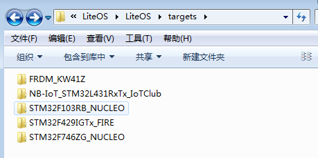

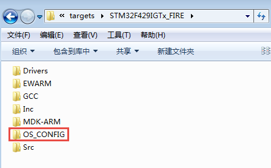

components文件夹简介
''''''''''''''''''''''''''''''

在LiteOS 中，除了内核外的其他第三方软件都是组件，如agent_tiny、lwm2m 、lwip和mbedtls等。这些组件就存放在components文件夹中。

examples文件夹简介
'''''''''''''''''''''''''

examples目录中存放的是供开发者测试LiteOS内核的demo示例，此目录存放的是内核功能测试相关用例的代码。

arch文件夹简介
''''''''''''''''''

LiteOS是软件，单片机是硬件，为了使LiteOS运行在单片机上面，LiteOS和单片机必须关联在一起，那么如何关联呢？还是要通过代码来关联，
这部分关联的文件叫接口文件，通常由汇编语言和C语言联合编写。这些接口文件都是跟硬件密切相关的，不同的硬件接口文件是不一样的，但
都大同小异。编写这些接口文件的过程叫作移植，移植的过程通常由LiteOS和mcu原厂的人来负责，移植好的这些接口文件存放在arch文件夹的
目录中。LiteOS在arch\arm\arm-m目录中存放了cortex-m0、m3、m4和m7内核的单片机的接口文件，使用了这些内核的mcu都可以使用里面的接
口文件。通常网络上出现的“移植某某某RTOS到某某某MCU”的教程，其实准确来说，不能够用“移植”这个词语，应该用“使用LiteOS官方的移植”
这种表述方法。因为这些跟硬件相关的接口文件，所有的RTOS官方都已经写好了，而用户只是使用而已。本章所讲的“移植”也是“使用LiteOS官
方的移植”，在这里这些底层的移植文件暂时无需深入理解，直接使用即可。

kernel文件夹简介
''''''''''''''''''''

kernel文件夹中存放的是LiteOS内核的源文件，是LiteOS内核的核心。前文已经简述了kernel文件夹的作用，此处就不再重复赘述。

添加LiteOS核心源码到工程组文件夹
^^^^^^^^^^^^^^^^^^^^^^^^^^^^^^^^^^^^^

上一节讲解了如何将LiteOS的核心源码放到本地工程目录中的相关内容，本节将讲解如何将LiteOS的核心源码添加到开发环境的组文件夹中。

新建LiteOS下的分组
''''''''''''''''''''''''

接下来需要在开发环境里面新建LiteOS/cmsis、LiteOS/kernel、LiteOS/arch和LiteOS/config四个文件分组，其中，LiteOS/cmsis用于存放
LiteOS文件夹中cmsis文件夹的内容，LiteOS/kernel用于存放LiteOS文件夹中kernel文件夹的内容，LiteOS/arch用于存放LiteOS文件夹中
arch文件夹的内容，LiteOS/config用于存放LiteOS文件夹中OS_CONFIG文件夹的内容。

不同的开发板需要修改对应工程中的CMSIS文件夹的接口文件cortex-m？，“？”表示3、4或者7，具体是由野火STM32开发板的型号决定的，如下表所示。

表 野火STM32开发板型号对应LiteOS的接口文件

=================== ============= ===========================
野火STM32开发板型号 具体芯片型号  LiteOS不同内核的接口文件
=================== ============= ===========================
MINI                STM32F103RCT6 \\Libraries\\CMSIS\\cortex-m3
指南者              STM32F103VET6
霸道                STM32F103ZET6
霸天虎              STM32F407ZGT6 \\Libraries\\CMSIS\\cortex-m4
F429-挑战者         STM32F429IGT6
F767-挑战者         STM32F767IGT6 \\Libraries\\CMSIS\\cortex-m7
H743-挑战者         STM32H743IIT6
=================== ============= ===========================

然后将工程文件的内容添加到工程中去，按照已经新建的分组添加对应的工程源码。需要注意的是，在LiteOS/arch分组中添加的los_dispatch_keil.S
文件，需要在添加时选择文件类型为“All files (*.*)”，添加(*.h)文件类型的时候也需要选择文件类型为“All files(*.*)”。同时，需要根据读者自
己的开发板型号在LiteOS\\arch\\arm\\arm-m\\cortex-m?\\keil中选择对应的接口文件，“？”表示3、4或者7，具体是由野火STM32开发板的型号决定的。
此外还需要添加到工程中的LiteOS核心源码文件路径如表 工程各分组中添加的源码文件及其路径_ 所示。

.. list-table::
   :widths: 33 33 33
   :name: 工程各分组中添加的源码文件及其路径
   :header-rows: 0

   * - 工程分组
     - 工程文件路径
     - 工程源码文件

   * - LiteOS/cmsis
     - \\LiteOS\\cmsis
     - cmsis_LiteOS.c

   * - LiteOS/kernel
     - \\LiteOS\\kernel\\base\\core
     - 所有.c文件

   * -
     - \\LiteOS\\kernel\\base\\ipc
     - 所有.c文件

   * -
     - \\LiteOS\\kernel\\base\\mem\\bestfit_little
     - 所有.c文件
   * -
     - \\LiteOS \\kernel\\base\\mem\\common
     - 所有.c文件
   * -
     - \\LiteOS \\kernel\\base\\mem\\membox
     - 所有.c文件

   * -
     - \\LiteOS\\kernel\\base\\misc
     - 所有.c文件

   * -
     - \\LiteOS\\kernel\\base\\om
     - 所有.c文件

   * -
     - \\LiteOS\\kernel\\extended\\tickless
     - 所有.c文件

   * -
     - \\LiteOS\\kernel
     - los_init.c

   * - LiteOS/arch
     - \\LiteOS\\arch\\arm\\arm-m\\src
     - 所有.c文件

   * -
     - \\LiteOS\\arch\\arm\\arm-m\\cortex-m?\\keil
     - los_dispatch_keil.S

   * - LiteOS/config
     - \\LiteOS\\OS_CONFIG
     - los_builddef.h（可选）

   * -
     -
     - los_printf.h（可选）

   * -
     -
     - target_config.h

LiteOS/config中的target_config.h可用于配置裁剪与配置LiteOS的功能。源码添加完毕之后，如图 添加LiteOS源码到工程分组文件夹_ 所示。

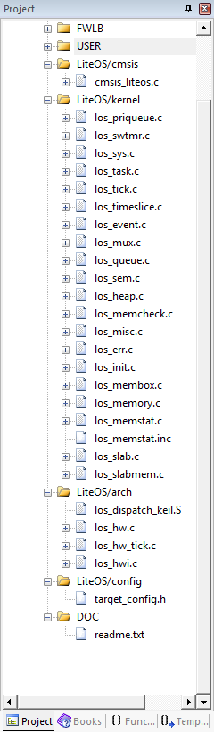

指定LiteOS头文件的路径
''''''''''''''''''''''''''

上节已经讲解了如何将LiteOS的源码添加到开发环境的组文件夹中，编译时需要为这些源文件指定头文件的路径，
否则编译会报错。LiteOS的源码中有很多头文件，必须将对应的路径添加到开发环境里。在添加LiteOS源码时，
一些其他的头文件夹也被复制到了工程目录中，所以这些文件夹的路径也要加到开发环境中。LiteOS头文件的路
径添加完成后的效果如图 在开发环境中指定LiteOS头文件的路径_ 所示。

注意：需要将“工程目录\\Libraries\\CMSIS\\Include”路径下的头文件包含进去。

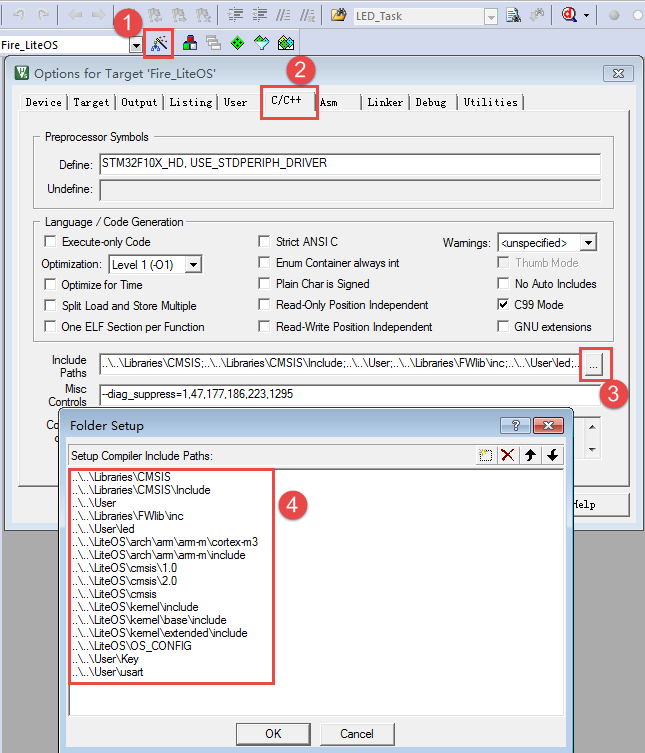

接管中断版本修改target_config.h
~~~~~~~~~~~~~~~~~~~~~~~~~~~~~~~~~~~~~~~~~~~~~~~~~~~~~~~~~~

LiteOS提供了两个版本，一个是接管中断版本，另一个是非接管中断版本，这两个版本的区别很大，在cortex-m系列中
并不经常使用接管中断版本。

接管中断就是指LiteOS管理了系统的可配置中断，系统能够判断中断源是什么，然后决定是否进入中断服务函数由系统。
现在移植的版本是接管中断版本，两个版本的target_config.h稍有不同，但基本一致，稍后将会讲解非接管中断版本。

target_config.h文件内容讲解
^^^^^^^^^^^^^^^^^^^^^^^^^^^^^^^^^^^^^^^^^

target_config.h是直接从LiteOS官方的工程文件夹中复制过来的，路径为\LiteOS\\targets\\STM32F429IGTx_FIRE\OS_CONFIG。
该头文件对裁剪整个LiteOS所需的功能的宏均做了定义，有些宏定义被使能，有些宏定义被失能。开始时用户暂时只需要配置
最简单的功能即可。要想随心所欲的配置LiteOS的功能，用户就必须对这些宏定义的功能有所掌握，下面先简单介绍这些宏定
义的含义，然后再对这些宏定义进行修改。

.. code-block:: c
    :caption:  代码清单:移植-1target_config.h文件内容
    :name: 代码清单:移植-1
    :linenos:

    #ifndef _TARGET_CONFIG_H
    #define _TARGET_CONFIG_H

    #include "los_typedef.h"
    #include "stm32f10x.h"						(1)
    #include <stdio.h>
    #include <string.h>

    #ifdef __cplusplus
    #if __cplusplus
    extern "C" {
    #endif /* __cplusplus */
    #endif /* __cplusplus */

    *======================================================================
                    System clock module configuration		(2)
    =======================================================================*/

    /**
    * @ingroup los_config
    * System clock (unit: HZ)
    */
    #define OS_SYS_CLOCK           	   (SystemCoreClock)	(2)-①

    /**
    * @ingroup los_config
    * Number of Ticks in one second
    */
    #define LOSCFG_BASE_CORE_TICK_PER_SECOND            (1000UL)	(2)-②

    /**
    * @ingroup los_config
    * External configuration item for timer tailoring
    */
    #define LOSCFG_BASE_CORE_TICK_HW_TIME                   NO	(2)-③

    /**
    * @ingroup los_config
    * Configuration LiteOS kernel tickless
    */
    #define LOSCFG_KERNEL_TICKLESS                          NO	(2)-④

    *========================================================================
                    Hardware interrupt module configuration		(3)
    =======================================================================*/

    /**
    * @ingroup los_config
    * Configuration item for hardware interrupt tailoring
    */
    #define LOSCFG_PLATFORM_HWI                              NO	(3)-①

    /**
    * @ingroup los_config
    * Maximum number of used hardware interrupts, including Tick timer interrupts.
    */
    #define LOSCFG_PLATFORM_HWI_LIMIT                       96	(3)-②

    *========================================================================
                    Task module configuration			(4)
    =======================================================================*/

    /**
    * @ingroup los_config
    * Default task priority
    */
    #define LOSCFG_BASE_CORE_TSK_DEFAULT_PRIO             10		(4)-①

    /**
    * @ingroup los_config
    * Maximum supported number of tasks except the idle task rather than the number of usable tasks
    */
    #define LOSCFG_BASE_CORE_TSK_LIMIT                     15 	(4)-②             // max num task

    /**
    * @ingroup los_config
    * Size of the idle task stack
    */
    #define LOSCFG_BASE_CORE_TSK_IDLE_STACK_SIZE   (0x500U) 		(4)-③

    /**
    * @ingroup los_config
    * Default task stack size
    */
    #define LOSCFG_BASE_CORE_TSK_DEFAULT_STACK_SIZE        (0x2D0U)  (4)-③

    /**
    * @ingroup los_config
    * Minimum stack size.
    */
    #define LOSCFG_BASE_CORE_TSK_MIN_STACK_SIZE            (0x130U)	(4)-③

    /**
    * @ingroup los_config
    * Configuration item for task Robin tailoring
    */
    #define LOSCFG_BASE_CORE_TIMESLICE                     YES	(4)-④

    /**
    * @ingroup los_config
    * Longest execution time of tasks with the same priorities
    */
    #define LOSCFG_BASE_CORE_TIMESLICE_TIMEOUT             10	(4)-⑤

    /**
    * @ingroup los_config
    * Configuration item for task (stack) monitoring module tailoring
    */
    #define LOSCFG_BASE_CORE_TSK_MONITOR                  YES	(4)-⑥

    /**
    * @ingroup los_config
    * Configuration item for task perf task filter hook
    */
    #define LOSCFG_BASE_CORE_EXC_TSK_SWITCH                YES	(4)-⑦

    /**
    * @ingroup los_config
    * Configuration item for performance moniter unit
    */
    #define OS_INCLUDE_PERF                                YES	(4)-⑧

    /**
    * @ingroup los_config
    * Define a usable task priority.Highest task priority.
    */
    #define LOS_TASK_PRIORITY_HIGHEST                      0	(4)-⑨

    /**
    * @ingroup los_config
    * Define a usable task priority.Lowest task priority.
    */
    #define LOS_TASK_PRIORITY_LOWEST                       31	(4)-⑩

    /*=====================================================================
                    Semaphore module configuration		(5)
    ======================================================================*/

    /**
    * @ingroup los_config
    * Configuration item for semaphore module tailoring
    */
    #define LOSCFG_BASE_IPC_SEM                           YES	(5)-①

    /**
    * @ingroup los_config
    * Maximum supported number of semaphores
    */
    #define LOSCFG_BASE_IPC_SEM_LIMIT                     20 	(2)-②
    // the max sem-numb

    /*=====================================================================
                            Mutex module configuration		(6)
    ======================================================================*/

    /**
    * @ingroup los_config
    * Configuration item for mutex module tailoring
    */
    #define LOSCFG_BASE_IPC_MUX                           YES	(6)-①

    /**
    * @ingroup los_config
    * Maximum supported number of mutexes
    */
    #define LOSCFG_BASE_IPC_MUX_LIMIT                     15	(6)-②
    // the max mutex-num

    /*======================================================================
                            Queue module configuration		(7)
    ======================================================================*/

    /**
    * @ingroup los_config
    * Configuration item for queue module tailoring
    */
    #define LOSCFG_BASE_IPC_QUEUE                        YES	(7)-①

    /**
    * @ingroup los_config
    * Maximum supported number of queues rather than the number of usable queues
    */
    #define LOSCFG_BASE_IPC_QUEUE_LIMIT                   10	(7)-②
    //the max queue-numb

    /*======================================================================
                Software timer module configuration	(8)
    ======================================================================*/

    #if (LOSCFG_BASE_IPC_QUEUE == YES)
    /**
    * @ingroup los_config
    * Configuration item for software timer module tailoring
    */
    #define LOSCFG_BASE_CORE_SWTMR                        YES	(8)-①

    #define LOSCFG_BASE_CORE_TSK_SWTMR_STACK_SIZE  LOSCFG_BASE_CORE_TSK_DEFAULT_STACK_SIZE

    #define LOSCFG_BASE_CORE_SWTMR_TASK                   YES	(8)-②

    #define LOSCFG_BASE_CORE_SWTMR_ALIGN                  NO	(8)-③
    #if(LOSCFG_BASE_CORE_SWTMR == NO && LOSCFG_BASE_CORE_SWTMR_ALIGN == YES)
    #error "swtmr align first need support swmtr, should make LOSCFG_BASE_CORE_SWTMR = YES"
    #endif

    /**
    * @ingroup los_config
    * Maximum supported number of software timers rather than the number of usable software timers
    */
    #define LOSCFG_BASE_CORE_SWTMR_LIMIT              	 16      	(8)-④    // the max SWTMR numb

    /**
    * @ingroup los_config
    * Max number of software timers ID
    */
    #define OS_SWTMR_MAX_TIMERID     				(8)-⑤
    ((65535/LOSCFG_BASE_CORE_SWTMR_LIMIT) * LOSCFG_BASE_CORE_SWTMR_LIMIT)

    /**
    * @ingroup los_config
    * Maximum size of a software timer queue
    */
    #define OS_SWTMR_HANDLE_QUEUE_SIZE                          (LOSCFG_BASE_CORE_SWTMR_LIMIT + 0)

    /**
    * @ingroup los_config
    * Minimum divisor of software timer multiple alignment
    */
    #define LOS_COMMON_DIVISOR                          10		(8)-⑦
    #endif

    /*======================================================================
                        Memory module configuration		(9)
    ======================================================================*/

    extern UINT8 *m_aucSysMem0;
    extern UINT32 __LOS_HEAP_ADDR_START__;				(9)-①
    extern UINT32 __LOS_HEAP_ADDR_END__;

    /**
    * @ingroup los_config
    * Starting address of the memory
    */
    #define OS_SYS_MEM_ADDR      (VOID *)__LOS_HEAP_ADDR_START__	(9)-②

    /**
    * @ingroup los_config
    * Ending address of the memory
    */
    extern UINT32 g_sys_mem_addr_end;

    /**
    * @ingroup los_config
    * Memory size
    */
    #define OS_SYS_MEM_SIZE  ((UINT32)(__LOS_HEAP_ADDR_END__ - __LOS_HEAP_ADDR_START__ +1)) 	(9)-③

    /**
    * @ingroup los_config
    * Configuration module tailoring of mem node integrity checking
    */
    #define LOSCFG_BASE_MEM_NODE_INTEGRITY_CHECK          	YES	(9)-④

    /**
    * @ingroup los_config
    * Configuration module tailoring of mem node size checking
    */
    #define LOSCFG_BASE_MEM_NODE_SIZE_CHECK             	YES	(9)-⑤

    #define LOSCFG_MEMORY_BESTFIT                          	YES	(9)-⑥

    /**
    * @ingroup los_config
    * Configuration module tailoring of more mempry pool checking
    */
    #define LOSCFG_MEM_MUL_POOL                            	YES	(9)-⑦

    /**
    * @ingroup los_config
    * Number of memory checking blocks
    */
    #define OS_SYS_MEM_NUM                              	20	(9)-⑧

    /**
    * @ingroup los_config
    * Configuration module tailoring of slab memory
    */
    #define LOSCFG_KERNEL_MEM_SLAB                     	YES	(9)-⑨

    /*======================================================================
                            fw Interface configuration		(10)
    ======================================================================*/

    /**
    * @ingroup los_config
    * Configuration item for the monitoring of task communication
    */
    #define LOSCFG_COMPAT_CMSIS_FW                      	YES	(10)-①

    /*======================================================================
                                    others			(11)
    =====================================================================*/

    /**
    * @ingroup los_config
    * Configuration system wake-up info to open
    */
    #define OS_SR_WAKEUP_INFO                             	YES	(11)-①

    /**
    * @ingroup los_config
    * Configuration CMSIS_OS_VER
    */
    #define CMSIS_OS_VER                               	2	(11)-②

    /*=======================================================================
                        Exception module configuration		(12)
    =======================================================================*/

    /**
    * @ingroup los_config
    * Configuration item for exception tailoring
    */
    #define LOSCFG_PLATFORM_EXC                           	NO	(12)-①

    /*======================================================================
                        Runstop module configuration		(13)
    =======================================================================*/

    /**
    * @ingroup los_config
    * Configuration item for runstop module tailoring
    */
    #define LOSCFG_KERNEL_RUNSTOP                        	NO	(13)-①

    /*======================================================================
                                track configuration		(14)
    ======================================================================*/

    /**
    * @ingroup los_config
    * Configuration item for track
    */
    #define LOSCFG_BASE_MISC_TRACK                       	NO	(14)-①

    /**
    * @ingroup los_config
    * Max count of track items
    */
    #define LOSCFG_BASE_MISC_TRACK_MAX_COUNT            	1024	(14)-②

    #ifdef __cplusplus
    #if __cplusplus
    }
    #endif /* __cplusplus */
    #endif /* __cplusplus */

    #endif /* _TARGET_CONFIG_H */

-   代码清单:移植-1_  **(1)** ：头文件stm32f10x.h是在工程文件中选择的芯片型号进行添加的，目前本书使用的是野火STM32霸
    道开发板，所以这个头文件要修改成stm32f10x.h，如果是野火其他型号的开发板，则在target_config.h中修改与开发板对应的头文件即可。

-   代码清单:移植-1_  **(2)** ：System clock module configuration为系统时钟模块配置参数，要想LiteOS准确无误地运行，
    这些基本配置必须要有，并且必须正确，下面会具体讲解配置相关的内容。

-   代码清单:移植-1_  **(2)-①** ：OS_SYS_CLOCK是配置LiteOS的时钟为系统时钟的参数，在野火STM32霸道开发板上系统时钟为
    SystemCoreClock = SYSCLK_FREQ_72MHz，也就是72MHz。

-   代码清单:移植-1_  **(2)-②**：LOSCFG_BASE_CORE_TICK_PER_SECOND表示操作系统每秒钟产生Tick的数量，Tick是指操作系
    统节拍的时钟周期。时钟节拍就是系统以固定的频率产生中断（时基中断），并在中断中处理与时间相关的事件，推动所有任务
    向前运行。时钟节拍需要依赖于硬件定时器，在 STM32裸机程序中经常使用的 SysTick 时钟是 MCU的内核定时器， 通常使用
    该定时器产生操作系统的时钟节拍。在LiteOS中，系统延时和阻塞时间都是以Tick为单位的，配置LOSCFG_BASE_CORE_TICK_PER_SECOND
    的值可以改变中断的频率，从而间接改变LiteOS的时钟周期（T=1/f）。如果将LOSCFG_BASE_CORE_TICK_PER_SECOND的值设置为1000，
    那么LiteOS的时钟周期为1ms。过高的系统节拍中断频率意味着LiteOS内核将占用更多的CPU时间，因此会降低效率，一般将
    LOSCFG_BASE_CORE_TICK_PER_SECOND的值设置为50~1000即可。

-   代码清单:移植-1_  **(2)-③** ：LOSCFG_BASE_CORE_TICK_HW_TIME是定时器剪裁的外部配置参数，未使用，所以这个宏定义为NO。

-   代码清单:移植-1_  **(2)-④** ：LOSCFG_KERNEL_TICKLESS是配置LiteOS打开tickless低功耗组件，这个组件打开后SysTick会在系
    统空闲时关闭并睡眠，进入省电模式。不空闲时SysTick继续工作，其本质上是动态时钟配置，而本书提供的例程是不需要打开tickless
    低功耗组件的，因此这个宏定义需要设置为NO。

-   代码清单:移植-1_  **(3)** ：Hardware interrupt module configuration是硬件外部中断模块配置参数。

-   代码清单:移植-1_  **(3)-①** ：LOSCFG_PLATFORM_HWI是硬件中断定制配置参数，YES表明LiteOS接管了外部中断，一般建议设置为NO，即不接管中断。

-   代码清单:移植-1_  **(3)-②** ：LOSCFG_PLATFORM_HWI_LIMIT这个宏定义表示 LiteOS支持最大的外部中断数，默认为96，一般不作修改，使用默认即可。

-   代码清单:移植-1_  **(4)** ：Task module configuration是 任务模块的配置。

-   代码清单:移植-1_  **(4)-①** ：LOSCFG_BASE_CORE_TSK_DEFAULT_PRIO这个宏定义表示默认的任务优先级，默认为10，优先级数值越小表示任务优先级越高。

-   代码清单:移植-1_  **(4)-②** ：LOSCFG_BASE_CORE_TSK_LIMIT这个宏定义表示LiteOS支持的最大任务个数（除去空闲任务），默认为15。

-   代码清单:移植-1_  **(4)-③** ：任务栈。LOSCFG_BASE_CORE_TSK_IDLE_STACK_SIZE这个宏定义表示空闲任务的栈大小，默认为0x500U字节。而下面
    的这个LOSCFG_BASE_CORE_TSK_DEFAULT_STACK_SIZE宏定义表示定义默认的任务栈大小为0x2D0U字节，在任务创建的时候一般都会指定任务栈的大小，以适
    配不一样的应用任务，而如果没有指定则使用默认值。LOSCFG_BASE_CORE_TSK_MIN_STACK_SIZE这个宏定义则表示任务最小需要的栈大小，栈大小应该是一个
    合理的值，如果大小太大，可能会导致内存耗尽，最小的栈大小默认为0x130U。任务栈大小必须在8个字节的边界上对齐。大小取决于它是否足够大以避免任务栈溢出。

-   代码清单:移植-1_  **(4)-④** ：LOSCFG_BASE_CORE_TIMESLICE这个宏定义表示是否使用时间片，在LiteOS一般都会使用时间片，故配置为YES。

-   代码清单:移植-1_  **(4)-⑤** ：LOSCFG_BASE_CORE_TIMESLICE_TIMEOUT这个宏定义表示具有相同优先级的任务的最长执行时间，单位为时钟节拍周期，默认配置为10。

-   代码清单:移植-1_  **(4)-⑥** ：LOSCFG_BASE_CORE_TSK_MONITOR这个宏定义表示任务栈监控模块定制的配置项，在LiteOS中默认打开。

-   代码清单:移植-1_  **(4)-⑦** ：LOSCFG_BASE_CORE_EXC_TSK_SWITCH这个宏定义表示任务执行过滤器钩子函数的配置项，在LiteOS中默认打开。

-   代码清单:移植-1_  **(4)-⑧** ：OS_INCLUDE_PERF这个宏定义表示性能监视器单元的配置项，在LiteOS中默认打开。

-   代码清单:移植-1_  **(4)-⑨** ：LOS_TASK_PRIORITY_HIGHEST这个宏定义表示定义可用的任务的最高优先级。在LiteOS中默认最高优先级为0，优
    先级数值越小，优先级越高。

-   代码清单:移植-1_  **(4)-⑩** ：LOS_TASK_PRIORITY_LOWEST这个宏定义表示定义可用的任务的最低优先级，在LiteOS中默认为31，LiteOS最大支持
    32个抢占优先级，优先级数值越大，优先级越低。

-   代码清单:移植-1_  **(5)** ：Semaphore module configuration 是信号量模块配置，信号量用于任务间的IPC通信，或者是用于任务与任务间的同步，
    任务与中断间的同步等。

-   代码清单:移植-1_  **(5)-①** ：LOSCFG_BASE_IPC_SEM这个宏定义表示信号量的配置项，配置为YES则表示默认使用信号量。

-   代码清单:移植-1_  **(5)-②** ：LOSCFG_BASE_IPC_SEM_LIMIT这个宏定义表示LiteOS最大支持信号量的个数，默认为20个，用户可以自定义设置信号量个数。

-   代码清单:移植-1_  **(6)** ：Mutex module configuration 是互斥锁模块配置，互斥锁在LiteOS中起不可缺少的作用，如果某资源同时只准一个任务
    访问，可以用互斥锁保护这个资源，互斥锁还具有优先级继承机制。

-   代码清单:移植-1_  **(6)-①** ：LOSCFG_BASE_IPC_MUX这个宏定义表示互斥锁的配置项，配置为YES则表示默认使用互斥锁。

-   代码清单:移植-1_  **(6)-②** ：LOSCFG_BASE_IPC_MUX_LIMIT这个宏定义表示LiteOS最大支持互斥锁的个数，默认为15。

-   代码清单:移植-1_  **(7)** ：Queue module configuration 是消息队列模块配置，消息队列也是IPC通信的一种，用于任务与任务之间，任务与中断直接
    的通信，可以存储有限的、大小固定的数据。

-   代码清单:移植-1_  **(7)-①** ：LOSCFG_BASE_IPC_QUEUE这个宏定义表示队列量的配置项，配置为YES则表示默认使用消息队列。

-   代码清单:移植-1_  **(7)-②** ：LOSCFG_BASE_IPC_QUEUE_LIMIT这个宏定义表示LiteOS最大支持消息队列量的个数，默认为10。

-   代码清单:移植-1_  **(8)** ：Software timer module configuration 是软件定时器模块配置，使用软件定时器则必须要使用消息队列，否则不会使用软件定时器。

-   代码清单:移植-1_  **(8)-①** ：LOSCFG_BASE_CORE_SWTMR这个宏定义表示软件定时器的配置项，配置为YES则表示默认使用软件定时器。使用了软件定
    时器也需要配置任务栈的大小的，LOSCFG_BASE_CORE_TSK_SWTMR_STACK_SIZE这个宏定义就是用于配置软件定时器的任务栈大小的默认为任务的栈大小0x2D0U字节。

-   代码清单:移植-1_  **(8)-②** ：LOSCFG_BASE_CORE_SWTMR_TASK这个宏定义表示使用软件定时器回调函数，默认打开。

-   代码清单:移植-1_  **(8)-③** ：LOSCFG_BASE_CORE_SWTMR_ALIGN这个宏定义表示软件定时器对齐用，某些场景需要对齐，默认关闭。

-   代码清单:移植-1_  **(8)-④** ：LOSCFG_BASE_CORE_SWTMR_LIMIT这个宏定义表示支持的最大软件定时器数量，而不是可用的软件定时器数量。默认为16。

-   代码清单:移植-1_  **(8)-⑤** ：OS_SWTMR_MAX_TIMERID这个宏定义表示最大的软件ID数值，默认为
    65520 ((65535/LOSCFG_BASE_CORE_SWTMR_LIMIT) \* LOSCFG_BASE_CORE_SWTMR_LIMIT)，。

-   代码清单:移植-1_  **(8)-⑥** ：OS_SWTMR_HANDLE_QUEUE_SIZE这个宏定义表示最大的软件定时器队列的大小，默认为(LOSCFG_BASE_CORE_SWTMR_LIMIT + 0)。

-   代码清单:移植-1_  **(8)-⑦** ：LOS_COMMON_DIVISOR这个宏定义表示软件定时器多重对齐的最小除数，默认为10。

-   代码清单:移植-1_  **(9)** ：Memory module configuration是内存模块的配置项。

-   代码清单:移植-1_  **(9)-①** ：声明了外部定义的一些变量，__LOS_HEAP_ADDR_START__为系统的起始地址，__LOS_HEAP_ADDR_END__为系统
    的结束地址，系统管理的内存均在这两个地址之间。

-   代码清单:移植-1_  **(9)-②** ：OS_SYS_MEM_ADDR这个宏定义是系统的内存起始地址。

-   代码清单:移植-1_  **(9)-③** ：OS_SYS_MEM_SIZE这个宏定义是系统的内存大小，大小为结束地址-起始地址+1。

-   代码清单:移植-1_  **(9)-④** ：LOSCFG_BASE_MEM_NODE_INTEGRITY_CHECK这个宏定义是配置内存节点完整性检查，默认打开。

-   代码清单:移植-1_  **(9)-⑤** ：LOSCFG_BASE_MEM_NODE_SIZE_CHECK这个宏定义是配置内存节点大小检查，默认打开。

-   代码清单:移植-1_  **(9)-⑥** ：LOSCFG_MEMORY_BESTFIT这个宏定义是配置分配内存算法的，bestfit只是分配内存算法的其中一套，配置文件中
    默认打开该宏定义，但如果真正需要使用还需要把bestfit内存管理算法部分添加到工程中，但是本书提供的配套例程进使用bestfit_little（LiteOS
    内存管理算法的其中一套）。

-   代码清单:移植-1_  **(9)-⑦** ：LOSCFG_MEM_MUL_POOL这个宏定义是配置内存模块内存池检查，默认打开。

-   代码清单:移植-1_  **(9)-⑧** ：OS_SYS_MEM_NUM这个宏定义是内存块检查，默认为20。

-   代码清单:移植-1_  **(9)-⑨** ：LOSCFG_KERNEL_MEM_SLAB这个宏定义是配置系统内存分配机制，默认使用slab分配机制。

-   代码清单:移植-1_  **(10)** ：fw Interface configuration是配置fw接口界面配置。

-   代码清单:移植-1_  **(10)-①** ：LOSCFG_COMPAT_CMSIS_FW这个宏定义是用于监视任务通信的配置，默认打开，用户可以选择关闭。

-   代码清单:移植-1_  **(11)** ：others是与LiteOS相关的其他配置。

-   代码清单:移植-1_  **(11)-①** ：OS_SR_WAKEUP_INFO这个宏定义是配置系统唤醒信息打开，默认使用。

-   代码清单:移植-1_  **(11)-②**：CMSIS_OS_VER这个宏定义是配置CMSIS_OS_VER版本，默认是2，就会从cmsis_LiteOS.c加载
    cmsis_LiteOS2.c，在cmsis_os.h中加载cmsis_os2.h；而如果是1则加载对应1的版本cmsis_LiteOS1.c和cmsis_os2.h。

-   代码清单:移植-1_  **(12)** ：Exception module configuration是异常模块配置。

-   代码清单:移植-1_  **(12)-①** ：LOSCFG_PLATFORM_EXC是异常模块配置项，默认不使用。

-   代码清单:移植-1_  **(13)** ：Runstop module configuration是运行停止配置。现在这个版本的LiteOS还没使用到，它是用于休眠与运行的。

-   代码清单:移植-1_  **(13)-①** ：LOSCFG_KERNEL_RUNSTOP是运行停止配置项，默认不使用。

-   代码清单:移植-1_  **(14)** ：track configuration是跟踪配置。

-   代码清单:移植-1_  **(14)-①** ：LOSCFG_BASE_MISC_TRACK是跟踪配置项，默认不使用。

-   代码清单:移植-1_  **(14)-②** ：LOSCFG_BASE_MISC_TRACK_MAX_COUNT是最大跟踪数目配置，默认为1024。

target_config.h文件修改
^^^^^^^^^^^^^^^^^^^^^^^^^^^^^^^^^^^^^

target_config.h头文件的配置是LiteOS对外开放的配置，而los_config.h则是LiteOS的主要配置文件，但是考虑到不懂的人不知道如何配置
los_config.h头文件，所以在los_config.h中默认已经配置好了这些头文件，以保证LiteOS能正常运行，即使是在target_config.h中配置错
误了，target_config.h也是能正常运行的，这是一道保险机制，因此只修改target_config.h这个文件即可。

target_config.h头文件的内容修改的不多，具体是：修改与对应开发板的头文件 ，如果是使用野火STM32F1的开发板，则包含F1的头文件
#include "stm32f10x.h"，同理是使用了其他系列的开发板，则包含与开发板对应的头文件即可。还有需要修改系统的时钟OS_SYS_CLOCK
与系统的时钟节拍LOSCFG_BASE_CORE_TICK_PER_SECOND，一般常用的是100~1000，根据自己需要选择。还有可以修改默认的任务栈大小，根
据自己的需要修改即可。如 代码清单:移植-2_ 高亮部分所示。

.. code-block:: c
    :caption:  代码清单:移植-2 target_config.h文件修改
    :emphasize-lines: 5,23,29
    :name: 代码清单:移植-2
    :linenos:

    #ifndef _TARGET_CONFIG_H
    #define _TARGET_CONFIG_H

    #include "los_typedef.h"
    #include "stm32f10x.h"
    #include <stdio.h>
    #include <string.h>

    #ifdef __cplusplus
    #if __cplusplus
    extern "C" {
    #endif /* __cplusplus */
    #endif /* __cplusplus */

    /*======================================================================
                    System clock module configuration
    ========================================================================*/

    /**
    * @ingroup los_config
    * System clock (unit: HZ)
    */
    #define OS_SYS_CLOCK           	   (SystemCoreClock)

    /**
    * @ingroup los_config
    * Number of Ticks in one second
    */
    #define LOSCFG_BASE_CORE_TICK_PER_SECOND            (1000UL)

    /**
    * @ingroup los_config
    * External configuration item for timer tailoring
    */
    #define LOSCFG_BASE_CORE_TICK_HW_TIME                   NO

    /**
    * @ingroup los_config
    * Configuration LiteOS kernel tickless
    */
    #define LOSCFG_KERNEL_TICKLESS                          NO

    /*========================================================================
                    Hardware interrupt module configuration
    ========================================================================*/

    /**
    * @ingroup los_config
    * Configuration item for hardware interrupt tailoring
    */
    #define LOSCFG_PLATFORM_HWI                              YES

    /**
    * @ingroup los_config
    * Maximum number of used hardware interrupts, including Tick timer interrupts.
    */
    #define LOSCFG_PLATFORM_HWI_LIMIT                       96

    /*========================================================================
                    Task module configuration
    ========================================================================*/

    /**
    * @ingroup los_config
    * Default task priority
    */
    #define LOSCFG_BASE_CORE_TSK_DEFAULT_PRIO             10

    /**
    * @ingroup los_config
    * Maximum supported number of tasks except the idle task rather than the number of usable tasks
    */
    #define LOSCFG_BASE_CORE_TSK_LIMIT                     15 	             // max num task

    /**
    * @ingroup los_config
    * Size of the idle task stack
    */
    #define LOSCFG_BASE_CORE_TSK_IDLE_STACK_SIZE   (0x500U)

    /**
    * @ingroup los_config
    * Default task stack size
    */
    #define LOSCFG_BASE_CORE_TSK_DEFAULT_STACK_SIZE        (0x2D0U)

    /**
    * @ingroup los_config
    * Minimum stack size.
    */
    #define LOSCFG_BASE_CORE_TSK_MIN_STACK_SIZE            (0x130U)

    /**
    * @ingroup los_config
    * Configuration item for task Robin tailoring
    */
    #define LOSCFG_BASE_CORE_TIMESLICE                     YES

    /**
    * @ingroup los_config
    * Longest execution time of tasks with the same priorities
    */
    #define LOSCFG_BASE_CORE_TIMESLICE_TIMEOUT             10

    /**
    * @ingroup los_config
    * Configuration item for task (stack) monitoring module tailoring
    */
    #define LOSCFG_BASE_CORE_TSK_MONITOR                  YES

    /**
    * @ingroup los_config
    * Configuration item for task perf task filter hook
    */
    #define LOSCFG_BASE_CORE_EXC_TSK_SWITCH                YES

    /**
    * @ingroup los_config
    * Configuration item for performance moniter unit
    */
    #define OS_INCLUDE_PERF                                YES

    /**
    * @ingroup los_config
    * Define a usable task priority.Highest task priority.
    */
    #define LOS_TASK_PRIORITY_HIGHEST                      0

    /**
    * @ingroup los_config
    * Define a usable task priority.Lowest task priority.
    */
    #define LOS_TASK_PRIORITY_LOWEST                       31

    /*=====================================================================
                    Semaphore module configuration
    ======================================================================*/

    /**
    * @ingroup los_config
    * Configuration item for semaphore module tailoring
    */
    #define LOSCFG_BASE_IPC_SEM                           YES

    /**
    * @ingroup los_config
    * Maximum supported number of semaphores
    */
    #define LOSCFG_BASE_IPC_SEM_LIMIT                     20 	             // the max sem-numb

    /*=====================================================================
                            Mutex module configuration
    ======================================================================*/

    /**
    * @ingroup los_config
    * Configuration item for mutex module tailoring
    */
    #define LOSCFG_BASE_IPC_MUX                           YES

    /**
    * @ingroup los_config
    * Maximum supported number of mutexes
    */
    #define LOSCFG_BASE_IPC_MUX_LIMIT                     15	              // the max mutex-nu

    /*======================================================================
                            Queue module configuration
    ======================================================================*/

    /**
    * @ingroup los_config
    * Configuration item for queue module tailoring
    */
    #define LOSCFG_BASE_IPC_QUEUE                        YES

    /**
    * @ingroup los_config
    * Maximum supported number of queues rather than the number of usable queues
    */
    #define LOSCFG_BASE_IPC_QUEUE_LIMIT                   10	              //the max queue-num

    /*======================================================================
                Software timer module configuration
    ======================================================================*/

    #if (LOSCFG_BASE_IPC_QUEUE == YES)
    /**
    * @ingroup los_config
    * Configuration item for software timer module tailoring
    */
    #define LOSCFG_BASE_CORE_SWTMR                        YES

    #define LOSCFG_BASE_CORE_TSK_SWTMR_STACK_SIZE               LOSCFG_BASE_CORE_TSK_DEFAULT_STACK_SIZE

    #define LOSCFG_BASE_CORE_SWTMR_TASK                   YES

    #define LOSCFG_BASE_CORE_SWTMR_ALIGN                  YES
    #if(LOSCFG_BASE_CORE_SWTMR == NO && LOSCFG_BASE_CORE_SWTMR_ALIGN == YES)
    #error "swtmr align first need support swmtr, should make LOSCFG_BASE_CORE_SWTMR = YES"
    #endif

    /**
    * @ingroup los_config
    * Maximum supported number of software timers rather than the number of usable software timers
    */
    #define LOSCFG_BASE_CORE_SWTMR_LIMIT              	 16          // the max SWTMR numb

    /**
    * @ingroup los_config
    * Max number of software timers ID
    */
    #define OS_SWTMR_MAX_TIMERID    ((65535/LOSCFG_BASE_CORE_SWTMR_LIMIT) * LOSCFG_BASE_CORE_SWTMR_LIMIT)

    /**
    * @ingroup los_config
    * Maximum size of a software timer queue
    */
    #define OS_SWTMR_HANDLE_QUEUE_SIZE                          (LOSCFG_BASE_CORE_SWTMR_LIMIT + 0)

    /**
    * @ingroup los_config
    * Minimum divisor of software timer multiple alignment
    */
    #define LOS_COMMON_DIVISOR                          10
    #endif

    /*======================================================================
                        Memory module configuration
    ======================================================================*/

    extern UINT8 *m_aucSysMem0;
    extern UINT32 __LOS_HEAP_ADDR_START__;
    extern UINT32 __LOS_HEAP_ADDR_END__;

    /**
    * @ingroup los_config
    * Starting address of the memory
    */
    #define OS_SYS_MEM_ADDR      (VOID *)__LOS_HEAP_ADDR_START__

    /**
    * @ingroup los_config
    * Ending address of the memory
    */
    extern UINT32 g_sys_mem_addr_end;

    /**
    * @ingroup los_config
    * Memory size
    */
    #define OS_SYS_MEM_SIZE      ((UINT32)(__LOS_HEAP_ADDR_END__ - __LOS_HEAP_ADDR_START__ +1))

    /**
    * @ingroup los_config
    * Configuration module tailoring of mem node integrity checking
    */
    #define LOSCFG_BASE_MEM_NODE_INTEGRITY_CHECK          	YES

    /**
    * @ingroup los_config
    * Configuration module tailoring of mem node size checking
    */
    #define LOSCFG_BASE_MEM_NODE_SIZE_CHECK             	YES

    #define LOSCFG_MEMORY_BESTFIT                          	YES

    /**
    * @ingroup los_config
    * Configuration module tailoring of more mempry pool checking
    */
    #define LOSCFG_MEM_MUL_POOL                            	YES

    /**
    * @ingroup los_config
    * Number of memory checking blocks
    */
    #define OS_SYS_MEM_NUM                              	20

    /**
    * @ingroup los_config
    * Configuration module tailoring of slab memory
    */
    #define LOSCFG_KERNEL_MEM_SLAB                     	YES

    /*======================================================================
                            fw Interface configuration
    ======================================================================*/

    /**
    * @ingroup los_config
    * Configuration item for the monitoring of task communication
    */
    #define LOSCFG_COMPAT_CMSIS_FW                      	YES

    /*======================================================================
                                    others
    =====================================================================*/

    /**
    * @ingroup los_config
    * Configuration system wake-up info to open
    */
    #define OS_SR_WAKEUP_INFO                             	YES

    /**
    * @ingroup los_config
    * Configuration CMSIS_OS_VER
    */
    #define CMSIS_OS_VER                               	2

    /*=======================================================================
                        Exception module configuration
    =======================================================================*/

    /**
    * @ingroup los_config
    * Configuration item for exception tailoring
    */
    #define LOSCFG_PLATFORM_EXC                           	NO

    /*======================================================================
                        Runstop module configuration
    =======================================================================*/

    /**
    * @ingroup los_config
    * Configuration item for runstop module tailoring
    */
    #define LOSCFG_KERNEL_RUNSTOP                        	NO

    /*======================================================================
                                track configuration
    ======================================================================*/

    /**
    * @ingroup los_config
    * Configuration item for track
    */
    #define LOSCFG_BASE_MISC_TRACK                       	NO

    /**
    * @ingroup los_config
    * Max count of track items
    */
    #define LOSCFG_BASE_MISC_TRACK_MAX_COUNT            	1024

    #ifdef __cplusplus
    #if __cplusplus
    }
    #endif /* __cplusplus */
    #endif /* __cplusplus */

    #endif /* _TARGET_CONFIG_H */

非接管中断版本修改target_config.h
~~~~~~~~~~~~~~~~~~~~~~~~~~~~~~~~~~~~~~~~~~~

target_config.h文件内容讲解
^^^^^^^^^^^^^^^^^^^^^^^^^^^^^^^^^^^^^^^^^

如果是使用接管中断的版本，不需要看本小节。

非接管中断的方式是更加简单，更适合初学者，非接管中断版本的target_config.h文件就需要在LiteOS提供的demo中移植过来，
比如：LiteOS\\targets\\STM32F103RB_NUCLEO\\OS_CONFIG，两个版本的target_config.h稍有不一样的地方，大体基本一样，
非接管中断版本的target_config.h如 代码清单:移植-3_ 所示。

注意：此文件仅保留内存管理部分，其他地方跟接管中断版本基本一致。

.. code-block:: c
    :caption: 代码清单:移植-3 target_config.h文件内容（非接管中断版本）
    :name: 代码清单:移植-3
    :linenos:

    #ifndef _TARGET_CONFIG_H
    #define _TARGET_CONFIG_H

    #include "los_typedef.h"
    #include "stm32f1xx.h"
    #include <stdio.h>
    #include <string.h>

    #ifdef __cplusplus
    #if __cplusplus
    extern "C" {
    #endif /* __cplusplus */
    #endif /* __cplusplus */

    /*=====================================================================
                        Memory module configuration
    ====================================================================*/
    #define BOARD_SRAM_START_ADDR     0x20000000			(1)
    #define BOARD_SRAM_SIZE_KB        20				(2)
    #define BOARD_SRAM_END_ADDR (BOARD_SRAM_START_ADDR + 1024 * BOARD_SRAM_SIZE_KB)
                                (3)
    /**
    * Config the start address and size of the LiteOS's heap memory
    */
    #if defined ( __CC_ARM )					(4)

    extern UINT32 Image$$RW_IRAM1$$ZI$$Limit;
    #define LOS_HEAP_MEM_BEGIN    (&(Image$$RW_IRAM1$$ZI$$Limit)) 	(5)
    #define LOS_HEAP_MEM_END      BOARD_SRAM_END_ADDR		(6)

    #elif defined ( __ICCARM__ )					(7)

    #pragma segment="HEAP"
    #define LOS_HEAP_MEM_BEGIN    (__segment_end("HEAP"))
    #define LOS_HEAP_MEM_END      BOARD_SRAM_END_ADDR

    #elif defined ( __GNUC__ )					(8)

    extern UINT32 _ebss;
    extern UINT32 _Min_Stack_Size;
    extern UINT32 _Min_Heap_Size;
    #define LOS_HEAP_MEM_BEGIN ((UINT32)(&_ebss) + (UINT32)(&_Min_Heap_Size))
    #define LOS_HEAP_MEM_END ((UINT32)BOARD_SRAM_END_ADDR - (UINT32)(&_Min_Stack_Size))

    #else
    #error "Unknown compiler"
    #endif

    /**
    * @ingroup los_config
    * Starting address of the LiteOS heap memory
    */
    #define OS_SYS_MEM_ADDR  (VOID *)LOS_HEAP_MEM_BEGIN

    /**
    * @ingroup los_config
    * Size of LiteOS heap memory
    */
    #define OS_SYS_MEM_SIZE (UINT32)((UINT32)LOS_HEAP_MEM_END - (UINT32) LOS_HEAP_MEM_BEGIN)
                                                                (9)

    /**
    * @ingroup los_config
    * Configuration module tailoring of mem node integrity checking
    */
    #define LOSCFG_BASE_MEM_NODE_INTEGRITY_CHECK                YES

    /**
    * @ingroup los_config
    * Configuration module tailoring of mem node size checking
    */
    #define LOSCFG_BASE_MEM_NODE_SIZE_CHECK                     YES

    #define LOSCFG_MEMORY_BESTFIT                               YES

    /**
    * @ingroup los_config
    * Configuration module tailoring of more mempry pool checking
    */
    #define LOSCFG_MEM_MUL_POOL                                 YES

    /**
    * @ingroup los_config
    * Number of memory checking blocks
    */
    #define OS_SYS_MEM_NUM                                      20

    /**
    * @ingroup los_config
    * Configuration module tailoring of slab memory
    */
    #define LOSCFG_KERNEL_MEM_SLAB                              YES

    #ifdef __cplusplus
    #if __cplusplus
    }
    #endif /* __cplusplus */
    #endif /* __cplusplus */

    #endif /* _TARGET_CONFIG_H */

-   代码清单:移植-3_  **(1)**\ ：定义内存的起始地址，内存是RAM（运行）内存，STM32的RAM起始地址是0x20000000。如果
    不知道RAM的起始地址，可以在工程中查看，如图 芯片的起始地址及大小_ 所示。

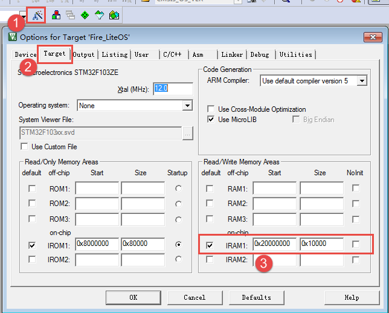

-   代码清单:移植-3_  **(2)**\：定义芯片RAM的大小，根据对应的芯片进行修改，比如STM32F103ZET6的RAM是64KB，那么
    BOARD_SRAM_SIZE_KB可以定义为不超过64K，当然一般不能定义到那么大的，因为工程本身也是使用了一些内存的，系统可
    管理的内存大小就要小一点，根据需要进行调整即可。

-   代码清单:移植-3_  **(3)**\ ：根据对应的芯片的起始地址与RAM的大小算出结束地址。

-   代码清单:移植-3_  **(4)(7)(8)**\ ：不同的宏定义对应不同的编译器，兼容性更强。

-   代码清单:移植-3_  **(5)**\ ：LiteOS所管理内存的真正起始地址，由LiteOS自动计算得出，不会造成浪费，很多操作系统
    的地址都是人为设定的，有一些用不上的地址就浪费掉了，而LiteOS则比较有优势，能让RAM得到最大化的利用。

-   代码清单:移植-3_  **(6)**\ ：LiteOS所管理内存的真正结束地址。

-   代码清单:移植-3_  **(9)**\ ：LiteOS所管理内存的实际大小。通过结束地址减去起始地址，那就是真正的系统所管理的地址了。

target_config.h文件修改
^^^^^^^^^^^^^^^^^^^^^^^^^^^^^^^^^^^^^

target_config.h的修改很简单，除了2.3.2 这一章节修改的内容以外，还需要修改对应的头文件以及实际芯片的RAM起始地址与大小
即可，如 代码清单:移植-4_ 高亮部分所示。

.. code-block:: c
    :caption: 代码清单:移植-4 target_config.h文件修改
    :name: 代码清单:移植-4
    :linenos:

    #ifndef _TARGET_CONFIG_H
    #define _TARGET_CONFIG_H

    #include "los_typedef.h"
    #include "stm32f1xx.h"
    #include <stdio.h>
    #include <string.h>

    #ifdef __cplusplus
    #if __cplusplus
    extern "C" {
    #endif /* __cplusplus */
    #endif /* __cplusplus */

    /*=====================================================================
                        Memory module configuration
    ====================================================================*/
    #define BOARD_SRAM_START_ADDR     0x20000000
    #define BOARD_SRAM_SIZE_KB        20
    #define BOARD_SRAM_END_ADDR (BOARD_SRAM_START_ADDR + 1024 * BOARD_SRAM_SIZE_KB)

    /**
    * Config the start address and size of the LiteOS's heap memory
    */
    #if defined ( __CC_ARM )

    extern UINT32 Image$$RW_IRAM1$$ZI$$Limit;
    #define LOS_HEAP_MEM_BEGIN    (&(Image$$RW_IRAM1$$ZI$$Limit))
    #define LOS_HEAP_MEM_END      BOARD_SRAM_END_ADDR

    #elif defined ( __ICCARM__ )

    #pragma segment="HEAP"
    #define LOS_HEAP_MEM_BEGIN    (__segment_end("HEAP"))
    #define LOS_HEAP_MEM_END      BOARD_SRAM_END_ADDR

    #elif defined ( __GNUC__ )

    extern UINT32 _ebss;
    extern UINT32 _Min_Stack_Size;
    extern UINT32 _Min_Heap_Size;
    #define LOS_HEAP_MEM_BEGIN ((UINT32)(&_ebss) + (UINT32)(&_Min_Heap_Size))
    #define LOS_HEAP_MEM_END ((UINT32)BOARD_SRAM_END_ADDR - (UINT32)(&_Min_Stack_Size))

    #else
    #error "Unknown compiler"
    #endif

    /**
    * @ingroup los_config
    * Starting address of the LiteOS heap memory
    */
    #define OS_SYS_MEM_ADDR  (VOID *)LOS_HEAP_MEM_BEGIN

    /**
    * @ingroup los_config
    * Size of LiteOS heap memory
    */
    #define OS_SYS_MEM_SIZE (UINT32)((UINT32)LOS_HEAP_MEM_END - (UINT32) LOS_HEAP_MEM_BEGIN)

    /**
    * @ingroup los_config
    * Configuration module tailoring of mem node integrity checking
    */
    #define LOSCFG_BASE_MEM_NODE_INTEGRITY_CHECK                YES

    /**
    * @ingroup los_config
    * Configuration module tailoring of mem node size checking
    */
    #define LOSCFG_BASE_MEM_NODE_SIZE_CHECK                     YES

    #define LOSCFG_MEMORY_BESTFIT                               YES

    /**
    * @ingroup los_config
    * Configuration module tailoring of more mempry pool checking
    */
    #define LOSCFG_MEM_MUL_POOL                                 YES

    /**
    * @ingroup los_config
    * Number of memory checking blocks
    */
    #define OS_SYS_MEM_NUM                                      20

    /**
    * @ingroup los_config
    * Configuration module tailoring of slab memory
    */
    #define LOSCFG_KERNEL_MEM_SLAB                              YES

    #ifdef __cplusplus
    #if __cplusplus
    }
    #endif /* __cplusplus */
    #endif /* __cplusplus */

    #endif /* _TARGET_CONFIG_H */

修改相关文件
~~~~~~~~~~~~~~~~

启动文件内容修改
^^^^^^^^^^^^^^^^

如果移植的是非接管中断版本，则不需要看本小节内容。

因为LiteOS接管中断版本的中断向量表是由系统管理的，所以裸机的启动文件已经不适合了，必须替换掉，LiteOS的工程师已经写好了启动文件，只需要修改一下即可。在移植操作系统的过程中要用LiteOS的启动文件los_startup_keil.s替换掉裸机工程中的启动文件。里面存放的是与LiteOS相
关的初始化函数，启动文件中的内容如 代码清单:移植-5_ 所示。

.. code-block:: guess
    :caption: 代码清单:移植-5 los_startup_keil.s启动文件内容
    :name: 代码清单:移植-5
    :linenos:

    LOS_Heap_Min_Size   EQU     0x400					 

                    AREA    LOS_HEAP, NOINIT, READWRITE, ALIGN=3	(1)
    __los_heap_base
    LOS_Heap_Mem    SPACE   LOS_Heap_Min_Size

                    AREA    LOS_HEAP_INFO, DATA, READONLY, ALIGN=2	(2)
                    IMPORT  |Image$$ARM_LIB_STACKHEAP$$ZI$$Base|	(3)
                    EXPORT  __LOS_HEAP_ADDR_START__			(4)	
                    EXPORT  __LOS_HEAP_ADDR_END__		
    __LOS_HEAP_ADDR_START__
                    DCD     __los_heap_base				(5)
    __LOS_HEAP_ADDR_END__
                    DCD     |Image$$ARM_LIB_STACKHEAP$$ZI$$Base| - 1

                    PRESERVE8

                    AREA    RESET, CODE, READONLY
                    THUMB

                    IMPORT  ||Image$$ARM_LIB_STACKHEAP$$ZI$$Limit||
                    IMPORT  osPendSV

                    EXPORT  _BootVectors
                    EXPORT  Reset_Handler

    _BootVectors
                    DCD     ||Image$$ARM_LIB_STACKHEAP$$ZI$$Limit||
                    DCD     Reset_Handler

    Reset_Handler
                    IMPORT  SystemInit				(6)
                    IMPORT  __main
                    LDR     R0, =SystemInit				(7)
                    BLX     R0
                    LDR     R0, =__main
                    BX      R0

                    ALIGN
                    END

-   代码清单:移植-5_  **(1)**\ ：开辟栈的大小为 0X400（ 1KB），名字为 LOS_HEAP， NOINIT 即不初始化，READWRITE
    表示可读可写，按 8（2\ :sup:`3`\ ）字节对齐。

-   代码清单:移植-5_  **(2)**\ ：开辟栈的大小为 0X400（ 1KB），名字为 LOS_HEAP_INFO， READWRITE只读数据段， 
    按4（ 2\ :sup:`2`\ ）字节对齐。

-   代码清单:移植-5_  **(3)**\ ：声明|Image$$ARM_LIB_STACKHEAP$$ZI$$Base|来自外部文件，跟 C 语言中的 EXTERN 关键字类似。

-   代码清单:移植-5_  **(4)**\ ：声明__LOS_HEAP_ADDR_START__与__LOS_HEAP_ADDR_END__具有全局属性，可被外部的文件使用。

-   代码清单:移植-5_  **(5)**\ ：__LOS_HEAP_ADDR_START__和__LOS_HEAP_ADDR_END__是个全局变量。他们位于LOS_HEAP_INFO段
    中，该段会被链接到flash地址空间，因此这两个变量的地址在flash空间内。所以这两个符号是定义的const只读变量。他们的值分别
    是__los_heap_base和|Image$$ARM_LIB_STACKHEAP$$ZI$$Base\|- 1。

-   代码清单:移植-5_  **(6)**\ ：表示该标号来自外部文件，跟 C 语言中的 EXTERN 关键字类似。这里表示 SystemInit 和__main 这两个函数均来自外部的文件。

-   代码清单:移植-5_  **(7)**\ ：跳转到SystemInit 和__main 这两个函数执行，这两个函数是需要在外部实现的。

SystemInit()函数
''''''''''''''''''''''''''

SystemInit()函数在STM32的固件库已经实现了，它在system_stm32f10x.c文件中。

.. code-block:: c
    :caption:  代码清单:移植-6 SystemInit()函数（system_stm32f10x.c文件）
    :name: 代码清单:移植-6
    :linenos:

    void SystemInit (void)
    {
        /* Reset the RCC clock configuration to the default reset state(for debug purpose) */
        /* Set HSION bit */
        RCC->CR |= (uint32_t)0x00000001;				(1)

        /* Reset SW, HPRE, PPRE1, PPRE2, ADCPRE and MCO bits */
    #ifndef STM32F10X_CL
        RCC->CFGR &= (uint32_t)0xF8FF0000;
    #else
        RCC->CFGR &= (uint32_t)0xF0FF0000;
    #endif /* STM32F10X_CL */

        /* Reset HSEON, CSSON and PLLON bits */
        RCC->CR &= (uint32_t)0xFEF6FFFF;

        /* Reset HSEBYP bit */
        RCC->CR &= (uint32_t)0xFFFBFFFF;

        /* Reset PLLSRC, PLLXTPRE, PLLMUL and USBPRE/OTGFSPRE bits */
        RCC->CFGR &= (uint32_t)0xFF80FFFF;

    #ifdef STM32F10X_CL
        /* Reset PLL2ON and PLL3ON bits */
        RCC->CR &= (uint32_t)0xEBFFFFFF;

        /* Disable all interrupts and clear pending bits  */
        RCC->CIR = 0x00FF0000;

        /* Reset CFGR2 register */
        RCC->CFGR2 = 0x00000000;
    #elif defined (STM32F10X_LD_VL) || defined (STM32F10X_MD_VL) || (defined STM32F10X_HD_VL)
        /* Disable all interrupts and clear pending bits  */
        RCC->CIR = 0x009F0000;

        /* Reset CFGR2 register */
        RCC->CFGR2 = 0x00000000;
    #else
        /* Disable all interrupts and clear pending bits  */
        RCC->CIR = 0x009F0000;
    #endif /* STM32F10X_CL */

    #if defined (STM32F10X_HD) || (defined STM32F10X_XL) || (defined STM32F10X_HD_VL)
    #ifdef DATA_IN_ExtSRAM
        SystemInit_ExtMemCtl();
    #endif /* DATA_IN_ExtSRAM */
    #endif

        /* Configure the System clock frequency, HCLK, PCLK2 and PCLK1 prescalers */
        /* Configure the Flash Latency cycles and enable prefetch buffer */
        SetSysClock();						(2)

    #ifdef VECT_TAB_SRAM
        SCB->VTOR = SRAM_BASE | VECT_TAB_OFFSET; /* Vector Table Relocation in Internal SRAM. */
    #else
        SCB->VTOR = FLASH_BASE | VECT_TAB_OFFSET; /* Vector Table Relocation in Internal FLASH. */
    #endif
    }

-   代码清单:移植-6_  **(1)**\ ：操作时钟控制寄存器，将内部8M高速时钟使能，从这里可以看出系统启动后是首先依靠内部时钟源而工作的。

-   代码清单:移植-6_  **(2)**\ ：SetSysClock()是SystemInit()的重点函数，用来设置系统复位后的所有时钟，让系统工作起来。

分散加载文件修改
^^^^^^^^^^^^^^^^

如果移植的是非接管中断版本，则不需要看本小节内容。

在LiteOS中，中断向量表被放在运行内存里，避免影响分配内存，那么就需要将代码分散加载到不同的区域中，华为官方提供的分
散加载文件就在每个具体的工程文件目录下，如：LiteOS\targets\STM32F429IGTx_FIRE\MDK-ARM文件夹下的STM32F429IGTx-LiteOS.sct
文件，如图 STM32F429IGTx-LiteOS分散加载文件_ 所示。首先将它复制到自己工程的user文件夹中，并且将其名字修改为“Fire-F103-LiteOS.sct”，然后把它配置
到工程中，如此一来在编译器编译、链接的时候就会根据分散加载文件的配置进行处理，操作过程如图 工程中添加分散加载文件_ 所示。

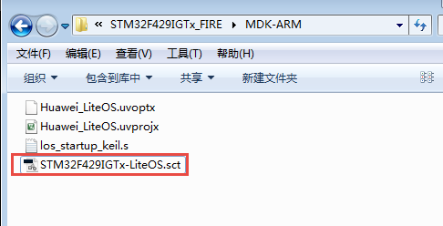

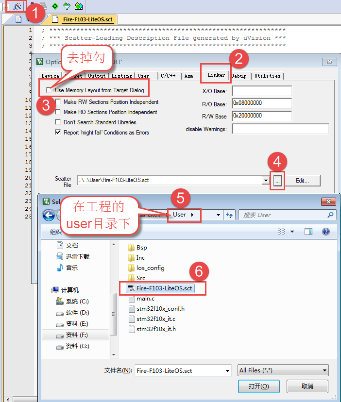

添加到工程配置中可以打开分散加载文件看看里面的源码\ **④**\ ，如图 打开Fire-F103-LiteOS.sct分散加载文件的步骤_ 所示。

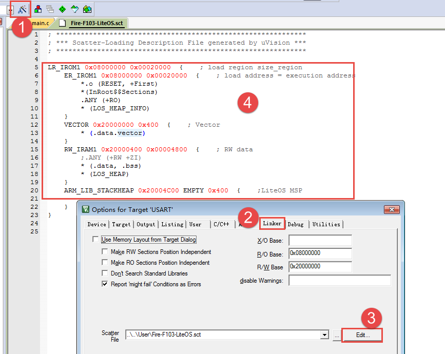

图 2‑15打开“Fire-F103-LiteOS.sct”分散加载文件的步骤

Fire-F103-LiteOS.sct分散加载文件
''''''''''''''''''''''''''''''''''''''''''''''''''

打开分散加载文件后，可以看到文件里面的源码，本章将会简单介绍一下分散加载文件的格式，如 代码清单:移植-7_ 所示。

.. code-block:: guess
    :caption:  代码清单:移植-7Fire-F103-LiteOS.sct分散加载文件源码
    :name: 代码清单:移植-7
    :linenos:

    LR_IROM1 0x08000000 0x00020000  {; load region size_region	(1)
        ER_IROM1 0x08000000 0x00020000  {; load address = execution address
            *.o (RESET, +First)
            *(InRoot$$Sections)
            .ANY (+RO)
            * (LOS_HEAP_INFO)					(2)
        }
        VECTOR 0x20000000 0x400  {    ; Vector
            * (.data.vector)					(3)
        }
        RW_IRAM1 0x20000400 0x00004800  {    ; RW data
            ;.ANY (+RW +ZI)					
            * (.data, .bss)					
            * (LOS_HEAP)						(4)
        }
        ARM_LIB_STACKHEAP 0x20004C00 EMPTY 0x400  {    ;LiteOS MSP

        }
    }

-   代码清单:移植-7_ **(1)**\ ：定义一个加载时域基地址： 0x08000000（是 STM32 内部 FLASH 的基地址），域大小
    为 0x00020000，读者可以根据对应芯片的实际 Flash 的大小进行修改。

-   代码清单:移植-7_ **(2)**\ ：定义一个运行时域，第一个运行时域必须和加载时域起始地址相同，否则将不能加载到运
    行时域，运行时域大小一般也和加载时域大小相同。运行时域将 RESET 段最先加载到本域的起始地址，RESET 的起始地址
    为0x08000000，直接从RESET结区开始运行，指向Reset_Handler开始运行，然后加载所有与LOS_HEAP_INFO匹配目标文件
    的可读可写数据，以及剩下的所有只读属性数据包含Code、 RW-Code、 RO-Data。

-   代码清单:移植-7_ **(3)**\ ：定义一个运行时域基地址： 0x20000000，大小为0x400 的RAM空间，用来存放中断向量表，
    所有的\* (.data.vector)类型数据，避免干扰对内存的分配。

-   代码清单:移植-7_ **(4)**\ ：定义一个运行时域基地址：0x20000400，大小为0x00004800的RAM，用来存放所有
    与(.data, .bss)、(LOS_HEAP)匹配的数据段，剩下的内存.ANY 将由LiteOS进行随意分配。

修改中断相关文件
^^^^^^^^^^^^^^^^

如果是使用接管中断的版本，不需要看本小节。

鉴于LiteOS已经处理好PendSV与SysTick中断了，就不需要用户自己去处理，如代码清单:移植-8所示，所以要在中断相关的源文
件（stm32fxxx_it.c）中注释（或者删除）掉void PendSV_Handler(void)与SysTick_Handler(void)这两个函数。

.. code-block:: c
    :caption:  代码清单:移植-8 LiteOS处理的PendSV与SysTick中断服务函数（los_hwi.c）
    :name: 代码清单:移植-8
    :linenos:

    /**********************************************************************
    Function    : PendSV_Handler
    Description : 此函数处理PendSVC异常， LiteOS调用接口
                osPendSV.
    Input       : None
    Output      : None
    Return      : None
    ******************************************************************/
    void PendSV_Handler(void)
    {
        osPendSV();
    }

    /********************************************************************
    Function    : SysTick_Handler
    Description : 此函数处理SysTick异常， LiteOS调用接口
                osTickHandler.
    Input       : None
    Output      : None
    Return      : None
    ****************************************************************/
    void SysTick_Handler(void)
    {
        if (g_bSysTickStart) {
            osTickHandler();
        } else {
            g_ullTickCount++;
        }
    }

修改core_cm3.h文件
^^^^^^^^^^^^^^^^^^^^^^^^^^^^

由于裸机例程使用的是ST官方固件库3.5版本的，他们提供的core_cm3.h文件是1.30版本的，这个版本是09年就出来了，已经
很老了，现在的core_cm3.h一直在更新，所以移植的时候，需要修改一下core_cm3.h的头文件，读者可以直接用本书提供的
core_cm3.h（4.30版本）文件。修改方法如下：打开本书提供的配套例程，在工程的CMSIS分组下，打开core_cm3.h，全选，
复制到裸机工程中的core_cm3.h文件即可，如图 修改core_cm3.h文件_ 所示。

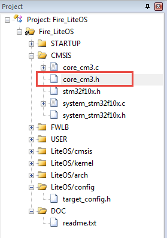

修改工程配置
~~~~~~~~~~~~~~~~

在LiteOS中，编译需要C99标准的支持，并且还要忽略正常的警告，选择“target”→“C/C++”，在“Misc Controls”选项中输
入 --diag_suppress=1,47,177,186,223,1295，意思是忽略这些编号的警号，如图 修改工程配置_ 所示。

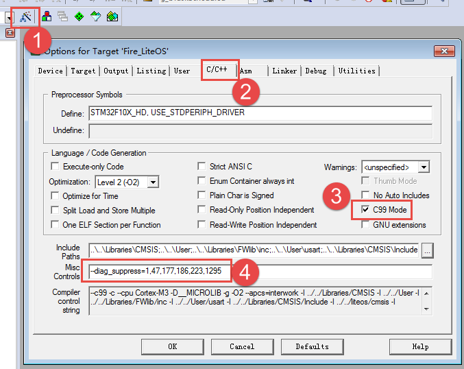

修改main.c
~~~~~~~~~~~~~~~~~~

至此，相信读者已经初步完成工程的移植了，LiteOS的接管中断方式的移植比非接管中断方式需要配置的地方要稍多一些，本书所提供
的配套例程，除非是特别说明，否则均默认使用非接管中断方式。

本书首先将原来裸机工程里面main.c的文件内容全部删除，然后新增如下内容，如 代码清单:移植-9_ 所示。

.. code-block:: c
    :caption: 代码清单:移植-9 main.c文件内容
    :name: 代码清单:移植-9
    :linenos:

    /**
    *********************************************************************
    * @file    main.c
    * @author  fire
    * @version V1.0
    * @date    2018-xx-xx
    * @brief   LiteOS  + STM32 工程模版
    *********************************************************************
    * @attention
    *
    * 实验平台:野火 F103-霸道 STM32 开发板
    * 论坛    :http://www.firebbs.cn
    * 淘宝    :https://fire-stm32.taobao.com
    *
    **********************************************************************
    */

    /*
    *************************************************************************
    *                             包含的头文件
    *************************************************************************
    */
    #include "stm32f10x.h"						(1)
    #include " los_sys.h "
    #include "los_typedef.h"
    #include "los_task.ph"						(2)
    /*
    *************************************************************************
    *                               变量
    *************************************************************************
    */

    /*
    *************************************************************************
    *                             函数声明
    *************************************************************************
    */

    /*
    *************************************************************************
    *                             main 函数
    *************************************************************************
    */
    /**
    * @brief  主函数
    * @param  无
    * @retval 无
    */
    int main(void)
    {
    /* 什么都没有*/
    }

    /********************************END OF FILE****************************/

-   代码清单:移植-9_  **(1)**\ ：添加需要包含的头文件，不同的开发板对应的头文件是不一样的，根据自己的开发板平台
    选择对应的头文件。本次例程用野火STM32开发板作为实验平台。

-   代码清单:移植-9_  **(2)**\ ：这些是LiteOS的相关文件的头文件，需要包含进去。

当工程已经初步移植完成，点击编译，如果采用非接管中断方式移植的工程，就会发现没有错误也没有警告。

下载验证
~~~~~~~~~

将程序编译好，用DAP仿真器把程序下载到野火STM32开发板（具体型号根据读者买的开发板而定，每个型号的开发板都配套有对应
的程序），因为目前也还没有在main函数里面创建任务，系统也尚未开始运行，main函数中什么都没有，所以下载到开发板上也是
没有任何现象的。如果要想看现象，得自己在main函数中创建应用任务，并且让LiteOS在开发板上正常运行，关于如何使用LiteOS
创建任务，请看下一章“创建任务”。

