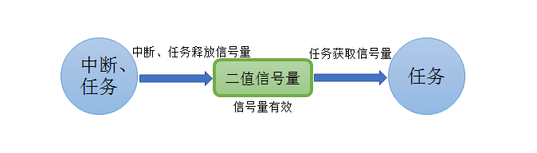
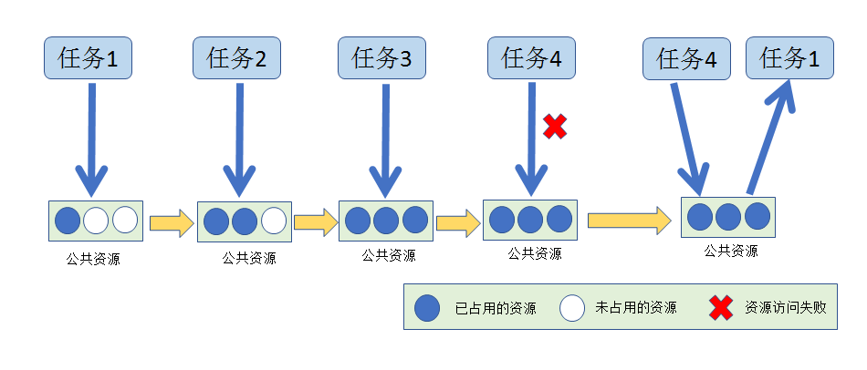
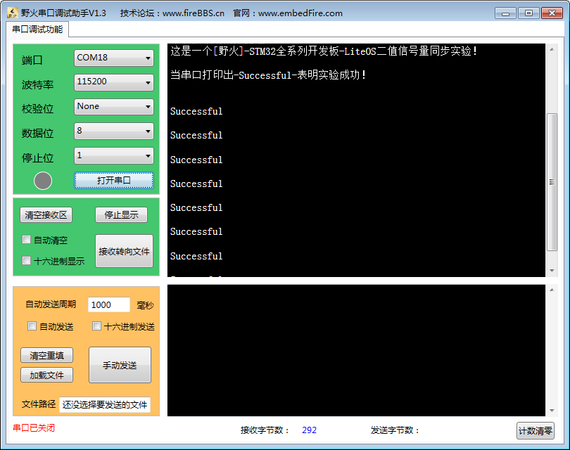
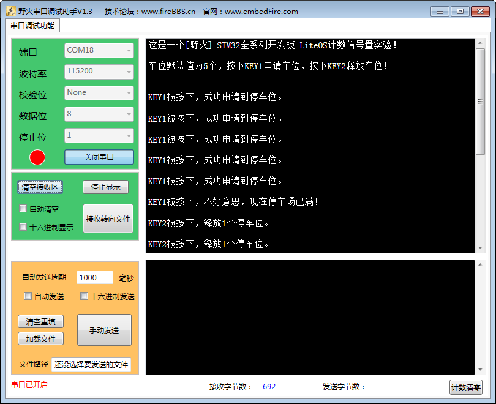

.. vim: syntax=rst

信号量
============

不知读者是否在裸机编程中这样使用过一个变量？它用于标记某个事件是否发生，或者标记一下某个资源是否正在被使用，然后系统轮询去检测这个变量
的状态，如果该资源是被占用了的或者某个事件还未发生，系统就不对它进行处理，而一旦发生则可以进行处理，使用这个变量实现了同步处理的功能。

信号量的基本概念
~~~~~~~~~~~~~~~~

信号量（Semaphore）是一种实现任务间通信的机制，实现任务之间同步或临界资源的互斥访问，常用于协助一组相互竞争的任务来访问临界资源。在多
任务系统中，各任务之间需要同步或互斥实现临界资源的保护，信号量功能可以为用户提供这方面的支持。

抽象来说，信号量是一个非负整数，所有获取它的任务都会将该整数减一，当该整数值为零时将无法被获取，所有试图获取它的任务都将进入阻塞态。通
常一个信号量的计数值用于对应有效的资源数，表示剩下的可被占用的互斥资源数，其值的含义分两种情况。

1. 0：表示没有积累下来的post信号量操作，且可能有任务阻塞在此信号量上。

2. 正值：表示有一个或多个post信号量操作。

二值信号量
^^^^^^^^^^^^^

二值信号量既可以用于同步功能也可以用于临界资源访问保护。

二值信号量和互斥信号量（以下使用互斥锁表示互斥信号量）非常相似，但是有一些细微差别：互斥锁有优先级继承机制，而二值信号量则没有这个
机制。这使得二值信号量更偏向应用于同步功能（任务与任务间的同步或任务和中断间同步），而互斥锁更偏向应用于临界资源的访问。除此之外，
互斥锁有所有者属性，只有持有锁的人才能give/post，而非持有者、中断不可以post；信号量则是任何任务包括中断都可以post。互斥锁的上锁、
解锁必须配对，而信号量则更适合类似生产者与消费者间交互的场景，生产者为特定的任务、中断；消费者则为其他的任务，一般不会配对，生产者
只能post，消费者只能pend。同时互斥锁因为有所有者属性，所以可以进行嵌套，持有锁的任务在获取同一把锁时不会被阻塞，而信号量如果用来做
互斥保护，出现嵌套情况则会产生死锁。

用作同步时，信号量在创建后应被置为空，任务1获取信号量而进入阻塞态，任务2在满足某种条件后，释放信号量，于是任务1获得信号量从而恢复
就绪态，参与系统的调度，从而达到了两个任务间的同步。同样的，信号量允许在中断服务函数中释放，如此一来任务1也会得到信号量，从而达到
任务与中断间的同步。

中断服务函数中应该要快进快出，处理的时间不能过长，在裸机开发中常用的做法是在中断中做一个标记，然后在主程序中轮询判断，当标记发生了，
再做对应的处理。这种轮询的处理方式是没办法实现实时处理的，比如：当一个事件发生了，但是主程序的循环中还有很多函数尚未处理，那么CPU
必须等处理完所有的函数才能去处理触发的事件，这就是裸机开发中的“实时响应，轮询处理”，而信号量则不同，在释放信号量的时候能立即将任务
转变为就绪态，如果任务的优先级在就绪任务中是最高的，任务就能立即被运行，这就是操作系统中的“实时响应，实时处理”。在LiteOS中使用信号
量用于同步，任务与任务的同步，中断与任务的同步，可以大大提高效率。

以同步为目的的信号量和以互斥为目的的信号量在使用有如下不同。

1. 用作互斥时，信号量创建后，信号量中可用信号量个数是1，在需要使用临界资源时，先取信号量，使其变空，这样其他任务需要使用临界资源时就会因为无法取到信号量而阻塞，从而保证了临界资源的安全，当任务使用完临界资源时必须要释放信号量。（在实际应用中一般不会使用信号量作互斥，因为操作系统提供专门为互斥访问的机制——互斥锁，将在下一章讲解）

2. 用作同步时，信号量在创建后被置为空，任务1取信号量而阻塞，任务2在满足某种条件后，释放信号量，于是任务1得以进入就绪态或运行态（如果就绪任务的优先级是最高的，那么会立即被运行），从而达到了两个任务间的同步。

计数信号量
^^^^^^^^^^^^^

顾名思义，计数信号量是用于计数的，在实际的使用中，计数信号量常用于事件计数与资源管理。每当某个事件发生时，任务/中断释放一个信号
量（信号量计数值加1），当处理被事件时（一般在任务中处理），处理任务会取走该信号量（信号量计数值减1），信号量的计数值则表示还剩余
多少个事件没被处理。此外，系统还有很多资源，也可以使用计数信号量进行资源管理，信号量的计数值表示系统中可用的资源数目，任务必须先获
取到信号量才能访问资源，当信号量的计数值为零时表示系统没有可用的资源，但是要注意，在使用完资源的时候必须归还信号量，否则当计数值为
0的时候任务就无法访问该资源了。

计数信号量允许多个任务对其进行操作，但限制了任务的数量。比如有一个停车场，里面只有100个车位，那么只能停100辆车，也相当于有100个信
号量，假如一开始停车场的车位还有100个，那么每进去一辆车就要消耗一个停车位，车位的数量就要减一，对应的，信号量在获取之后也需要减一，
当停车场停满了100辆车的时候，此时的停车位为0，其他车就不能停进去了，否则将造成事故，同理当信号量的值为0，其他任务就无法获取到信号
量，当有车从停车场离开的时候，车位又空余出来了，那么，其他车就能停在停车场了，信号量的操作也是一样的，当释放了这个资源，其他任务才
能对这个资源进行访问。

二值信号量的应用场景
~~~~~~~~~~~~~~~~~~~~

在嵌入式操作系统中二值信号量是任务与任务间、中断与任务间同步的重要手段。信号量分为二值信号量与计数信号量，什么是二值信号量呢？当
信号量被获取时其值为 0，当信号量被释放其值为 1，把这种只有 0和 1 两种情况的信号量称为二值信号量。

在多任务系统中经常会使用二值信号量，比如，某个任务需要等待某个中断发生了，再去执行对应的处理，那么任务可以处于阻塞态等待信号量，直
到中断发生后释放信号量后，该任务才被唤醒去执行对应的处理。当任务获取信号量时，因为此时尚未发生特定事件，信号量为空，任务会进入阻塞
状态；当事件的条件满足后，任务/中断便会释放信号量，告知任务这个事件发生了，任务取得信号量便被唤醒去执行对应的操作，任务执行完毕并不
需要归还信号量，这样子的CPU的效率可以大大提高，而且实时响应也是最快的。

二值信号量在任务与任务中同步的应用场景：假设有一个温湿度的传感器，假设是1s采集一次数据，并且让它在液晶屏中显示数据出来。如果液晶屏刷
新的周期是100ms更新一次数据，那么液晶屏只需要在1s后温湿度数据更新的时候刷新一次即可，在温湿度传感器采集完数据后，使用信号量进行一次
同步，告诉液晶屏任务可以更新数据，这样子在每次数据变化的时候都能及时更新数据，达成任务与任务间的同步，并且不会造成CPU资源的浪费。

同理，二值信号量在任务与中断同步的应用场景：在串口接收中，CPU并不知道何时会接收到数据，假设系统中存在一个任务是负责接收这些数据并且
处理的，如果在任务中每时每刻都在查询是否接收到数据的话，就会浪费CPU资源。因此在还未接收到数据的时候，任务就进入阻塞态，不参与任务的
调度，当中断接收到数据时，释放一个二值信号量，任务就立即从阻塞态中解除，进入就绪态，然后执行相应的处理。

二值信号量的运作机制
~~~~~~~~~~~~~~~~~~~~

在系统初始化时会进行信号量初始化，为配置的LOSCFG_BASE_IPC_SEM_LIMIT个信号量申请内存（该宏定义的值由用户指定），并把所有的信号量初始
化成未使用，并加入到信号量未使用链表g_stUnusedSemList中供系统使用。

信号量创建，从未使用的信号量链表中获取一个信号量资源，该信号量的最大计数值为1（OS_SEM_BINARY_MAX_COUNT），也就是二值信号量。

二值信号量获取，任何任务都可以从已创建的二值信号量资源中获取一个二值信号量，若当前信号量有效，则获取成功并且返回LOS_OK，否则任务
会根据用户指定的阻塞时间等待其他任务/中断释放信号量，在这段时间中，系统将任务处于阻塞态，被挂到该信号量的阻塞等待列表中，
示意图如图 信号量无效时候获取_ 所示。

假如中断或者另一个任务释放一个二值信号量，其过程如图 中断_任务释放信号量_ 所示，那么处于阻塞态的任务将恢复为就绪态，其过程如图 二值信号量运作机制_ 所示。

计数信号量的运作机制
~~~~~~~~~~~~~~~~~~~~

计数信号量可以用于资源管理，允许多个任务获取信号量访问共享资源，但会限制任务的最大数目。访问的任务数达到可支持的最大数目时，
会阻塞其他试图获取该信号量的任务，直到有任务释放了信号量，这就是计数信号量的运作机制。比如某个资源限定只能有3个任务访问，
那么任务4访问的时候，会因为获取不到信号量而进入阻塞，当某个任务（比如任务1）释放该资源时，任务4才能获取到信号量从而进行资源
的访问，其运作的机制如图 信号量运作示意图_ 所示。

信号量的使用讲解
~~~~~~~~~~~~~~~~

信号量控制块
^^^^^^^^^^^^^^^^^^

信号量控制块与任务控制类似，系统中每个信号量都有对应的信号量控制块，信号量控制块中包含了信号量的所有信息，比如信号量的状态信
息，使用情况、以及信号量阻塞列表等，如 代码清单:信号量-1_ 所示。

.. code-block:: c
    :caption:  代码清单:信号量-1信号量控制块
    :name: 代码清单:信号量-1
    :linenos:

    typedef struct {
        UINT16          usSemStat;           (1)
        UINT16          usSemCount;          (2)
        UINT16          usMaxSemCount;       (3)
        UINT16          usSemID;             (4)
        LOS_DL_LIST     stSemList;           (5)
    } SEM_CB_S;

-   代码清单:信号量-1_ **(1)**\ ：usSemStat表示信号量状态，标志信号量是否被使用。

-   代码清单:信号量-1_ **(2)**\ ：usSemCount表示可用信号量的个数。

-   代码清单:信号量-1_ **(3)**\ ：usMaxSemCount表示可用信号量的最大容量，在二值信号量中，其值为OS_SEM_BINARY_MAX_COUNT，也就是1；而
    在计数信号量中，它的最大值是OS_SEM_COUNTING_MAX_COUNT，也就是0xFFFF。

-   代码清单:信号量-1_ **(4)**\ ：usSemID表示信号量ID。

-   代码清单:信号量-1_ **(5)**\ ：stSemList是信号量阻塞列表，用于记录正在等待信号量的任务。

信号量错误代码
^^^^^^^^^^^^^^^^^^^

在LiteOS中，与信号量相关的函数大多数都会有返回值，其返回值是一些错误代码，方便使用者进行调试，下面列出一些常见的错误代码与参考解决方案，
具体如表 信号量常见错误代码说明_ 所示。

.. list-table::
   :widths: 25 25 25 25
   :name: 信号量常见错误代码说明
   :header-rows: 0

   * - 序号
     - 定义
     - 描述
     - 参考解决方案

   * - 1
     - LOS_ERRNO_SEM_NO_MEMORY
     - 内存空间不足
     - 分配更大的内存分区

   * - 2
     - LOS_ERRNO_SEM_INVALID
     - 非法传参
     - 改变传数为合法值

   * - 3
     - LOS_ERRNO_SEM_PTR_NULL
     - 传入空指针
     - 传入合法指针

   * - 4
     - LOS_ERRNO_SEM_ALL_BUSY
     - 信号量控制块不可用
     - 释放资源信号量资源

   * - 5
     - LOS_ERRNO_SEM_UNAVAILABLE
     - 定时时间非法
     - 传入正确的定时时间

   * - 6
     - LOS_ERRNO_SEM_PEND_INTERR
     - 中断期间非法调用LOS_SemPend
     - 中断期间禁止调用LOS_SemPend

   * - 7
     - LOS_ERRNO_SEM_PEND_IN_LOCK
     - 任务被锁，无法获得信号量
     - 在任务被锁时，不能调用LOS_SemPend

   * - 8
     - LOS_ERRNO_SEM_TIMEOUT
     - 获取信号量时间超时
     - 将时间设置在合理范围内

   * - 9
     - LOS_ERRNO_SEM_OVERFLOW
     - 信号量允许pend次数超过最大值
     - 传入合法的值

   * - 10
     - LOS_ERRNO_SEM_PENDED
     - 等待信号量的任务队列不为空
     - 唤醒所有等待该型号量的任务后删除该信号量

二值信号量创建函数LOS_BinarySemCreate()
^^^^^^^^^^^^^^^^^^^^^^^^^^^^^^^^^^^^^^^^^^^^^^^^^^^^^^^^^^^

LiteOS提供的二值信号量创建函数是LOS_BinarySemCreate()，因为创建的是二值的信号量，所以该信号量的容量只有一个，里面要么是满，要么是
空，在创建的时候用户可以自己定义它初始可用信号量的个数，范围是0~1， LOS_BinarySemCreate()函数原型如 代码清单:信号量-2_ 所示。

.. code-block:: c
    :caption:  代码清单:信号量-2 LOS_BinarySemCreate()函数原型
    :name: 代码清单:信号量-2
    :linenos:

    /*
    *@param usCount         可用信号量的初始数量。 值范围是[0,1]
    *@param puwSemHandle    初始化的信号量控制结构的ID
    */
    extern UINT32 LOS_BinarySemCreate (UINT16 usCount, UINT32 *puwSemHandle);

LOS_BinarySemCreate()函数源码的实现如 代码清单:信号量-3_ 所示，从源码中可以看到该函数实际上是调用osSemCreate()这个函数创
建信号量，LOS_BinarySemCreate()创建的是二值信号量，因此信号量的最大容量为OS_SEM_BINARY_MAX_COUNT，osSemCreate()源码如 代码清单:信号量-4_ 所示。

.. code-block:: c
    :caption:  代码清单:信号量-3 LOS_BinarySemCreate()函数源码
    :name: 代码清单:信号量-3
    :linenos:

    /*********************************************************************
    Function     : LOS_BinarySemCreate
    Description  : 创建一个二值信号量,
    Input        : uwCount--------- 信号量可用个数,
    Output       : puwSemHandle-----信号量ID,
    Return       : 返回LOS_OK表示创建成功,或者其他失败的错误代码
    **********************************************************************/
    LITE_OS_SEC_TEXT_INIT UINT32 LOS_BinarySemCreate (UINT16 usCount, UINT32 *puwSemHandle)
    {
        return osSemCreate(usCount, OS_SEM_BINARY_MAX_COUNT, puwSemHandle);
    }

.. code-block:: c
    :caption:  代码清单:信号量-4 osSemCreate()源码
    :name: 代码清单:信号量-4
    :linenos:

    /*********************************************************************
    Function     : osSemCreate
    Description  : 创建一个信号量
    Input        : None,
    Output       : None,
    Return       : 返回LOS_OK表示创建成功,或者其他失败的错误代码
    ******************************************************************/
    LITE_OS_SEC_TEXT_INIT UINT32 osSemCreate (UINT16 usCount, UINT16
                    usMaxCount, UINT32 *puwSemHandle){
        UINT32      uwIntSave;
        SEM_CB_S    *pstSemCreated;
        LOS_DL_LIST *pstUnusedSem;
        UINT32      uwErrNo;
        UINT32      uwErrLine;

        if (NULL == puwSemHandle) {			(1)
            return LOS_ERRNO_SEM_PTR_NULL;
        }

        if (usCount > usMaxCount) {			(2)
            OS_GOTO_ERR_HANDLER(LOS_ERRNO_SEM_OVERFLOW);
        }

        uwIntSave = LOS_IntLock();

        if (LOS_ListEmpty(&g_stUnusedSemList)) {		(3)
            LOS_IntRestore(uwIntSave);
            OS_GOTO_ERR_HANDLER(LOS_ERRNO_SEM_ALL_BUSY);
        }

        pstUnusedSem = LOS_DL_LIST_FIRST(&(g_stUnusedSemList));	(4)
        LOS_ListDelete(pstUnusedSem);
        pstSemCreated = (GET_SEM_LIST(pstUnusedSem));
        pstSemCreated->usSemCount = usCount;			(5)
        pstSemCreated->usSemStat = OS_SEM_USED;			(6)
        pstSemCreated->usMaxSemCount = usMaxCount;			(7)
        LOS_ListInit(&pstSemCreated->stSemList);			(8)
        *puwSemHandle = (UINT32)pstSemCreated->usSemID;		(9)
        LOS_IntRestore(uwIntSave);
        return LOS_OK;						(10)

    ErrHandler:
        OS_RETURN_ERROR_P2(uwErrLine, uwErrNo);
    }

-   代码清单:信号量-4_ **(1)**\ ：在信号量创建的时候，需要由用户定义信号量ID变量，并且将其地址传递到创建信号量函数中，假如信号量ID变量
    地址为NULL，系统将返回一个错误代码LOS_ERRNO_SEM_PTR_NULL。

-   代码清单:信号量-4_ **(2)**\ ：系统不允许可用信号量的个数大于信号量的最大容量，二值信号量中的最大容量为1，其可用的信号量个数的范围是0~1。

-   代码清单:信号量-4_ **(3)**\ ：通过判断未使用信号量列表来判断系统支持的信号量个数是否达到最大，如果列表为空，表示已经创建的信号量个数
    已经达到系统支持的最大值，就无法继续创建信号量。

-   代码清单:信号量-4_ **(4)**\ ：从系统的未使用信号量列表中取下一个信号量控制块，如果系统已经创建的信号量达到可支持的最大值，那么就无法继
    续创建，用户可以修改配置文件中的LOSCFG_BASE_IPC_SEM_LIMIT宏定义，以支持更多的信号量个数。

-   代码清单:信号量-4_ **(5)**\ ：初始化信号量的可用个数为用户自定义的个数usCount。

-   代码清单:信号量-4_ **(6)**\ ：信号量状态设置为已使用状态。

-   代码清单:信号量-4_ **(7)**\ ：根据用户指定的usMaxCount配置信号量中可用信号量的最大容量。

-   代码清单:信号量-4_ **(8)**\ ：初始化信号量阻塞列表，该列表用于记录阻塞在此信号量上的任务。

-   代码清单:信号量-4_ **(9)**\ ：将信号量ID通过puwSemHandle指针返回给用户，以后通过这个信号量ID能访问此信号量。

-   代码清单:信号量-4_ **(10)**\ ：创建成功返回LOS_OK

在创建信号量的时候，只需要传入二值信号量ID变量的地址与初始化可用信号量个数的值即可，并且可以指定初始信号量有
效的个数，对于二值信号量可以为1也可以为0。如果指定信号量有效个数为1，则表明中国信号量是有效的，任务可以立即
获取得信号量；而如果不需要立即获取信号量的情况下，可以将信号量可用个数的值初始化为0，其使用实例如 代码清单:信号量-5_ 高亮部分所示。

.. code-block:: c
    :caption:  代码清单:信号量-5 LOS_BinarySemCreate()函数实例
    :emphasize-lines: 4
    :name: 代码清单:信号量-5
    :linenos:

    UINT32 uwRet = LOS_OK;/* 定义一个创建的返回类型，初始化为创建成功的返回值 */

    /* 创建一个二值信号量*/
    uwRet = LOS_BinarySemCreate(1,&BinarySem_Handle);
    if (uwRet != LOS_OK)
    {
        printf("BinarySem_Handle二值信号量创建失败！\n");
    }

计数信号量创建函数LOS_SemCreate()
^^^^^^^^^^^^^^^^^^^^^^^^^^^^^^^^^^^^^^^^^^^^^^^^^^^^^^^^^^^^^^^^^^^^^^^^

计数信号量创建与二值信号量创建是一样的，都是调用osSemCreate()函数进行创建的，但是有一个区别：二值信号量的最
大容量是OS_SEM_BINARY_MAX_COUNT，该宏定义的值为1，而计数信号量的最大容量则为OS_SEM_COUNTING_MAX_COUNT，该
宏定义的值为0xFFFF。计数信号量创建函数LOS_SemCreate()源码实现如 代码清单:信号量-6_ 所示。

.. code-block:: c
    :caption: 代码清单:信号量-6计数信号量创建函数LOS_SemCreate()源码
    :name: 代码清单:信号量-6
    :linenos:

    /***********************************************************************
    Function     : LOS_SemCreate
    Description  : 创建一个计数信号量,
    Input        : uwCount--------- 初始化可用信号量个数,
    Output       : puwSemHandle-----信号量ID,
    Return       : 返回LOS_OK表示创建成功,或者其他失败的错误代码
    *********************************************************************/
    LITE_OS_SEC_TEXT_INIT UINT32 LOS_SemCreate (UINT16 usCount, UINT32 *puwSemHandle)
    {
        return osSemCreate(usCount, OS_SEM_COUNTING_MAX_COUNT, puwSemHandle);
    }

信号量删除函数LOS_SemDelete()
^^^^^^^^^^^^^^^^^^^^^^^^^^^^^^^^^^^^^^^^^^^^^^^^^^^^^^^^^^^^^^^^^^

信号量删除函数是根据信号量ID直接删除的，删除之后信号量的所有信息都会被系统回收，而且不能再次使用这个信号
量，但是需要注意一些几点：第一点，信号量在使用或者有任务在阻塞中等待该信号量的时候是不能被删除的；第二点，
如果某个信号量没有被创建，那也是无法被删除的。uwSemHandle是信号量ID，表示要删除哪个信号量，信号量删除函
数LOS_SemDelete()源码如 代码清单:信号量-7_ 所示。

.. code-block:: c
    :caption:  代码清单:信号量-7信号量删除函数LOS_SemDelete()源码
    :name: 代码清单:信号量-7
    :linenos:

    /***********************************************************************
    Function     : LOS_SemDelete
    Description :  删除一个信号量,
    Input        : uwSemHandle---- 信号量ID,
    Output       : None
    Return       : 返回LOS_OK表示删除成功,或者其他失败的错误代码
    *******************************************************************/
    LITE_OS_SEC_TEXT_INIT UINT32 LOS_SemDelete(UINT32 uwSemHandle)
    {
        UINT32      uwIntSave;
        SEM_CB_S    *pstSemDeleted;
        UINT32      uwErrNo;
        UINT32      uwErrLine;

        if (uwSemHandle >= (UINT32)LOSCFG_BASE_IPC_SEM_LIMIT) {	(1)
            OS_GOTO_ERR_HANDLER(LOS_ERRNO_SEM_INVALID);
        }

        pstSemDeleted = GET_SEM(uwSemHandle);			(2)
        uwIntSave = LOS_IntLock();
        if (OS_SEM_UNUSED == pstSemDeleted->usSemStat) {		(3)
            LOS_IntRestore(uwIntSave);
            OS_GOTO_ERR_HANDLER(LOS_ERRNO_SEM_INVALID);
        }

        if (!LOS_ListEmpty(&pstSemDeleted->stSemList)) {		(4)
            LOS_IntRestore(uwIntSave);
            OS_GOTO_ERR_HANDLER(LOS_ERRNO_SEM_PENDED);
        }

        LOS_ListAdd(&g_stUnusedSemList, &pstSemDeleted->stSemList);	(5)
        pstSemDeleted->usSemStat = OS_SEM_UNUSED;			(6)
        LOS_IntRestore(uwIntSave);
        return LOS_OK;
    ErrHandler:
        OS_RETURN_ERROR_P2(uwErrLine, uwErrNo);
    }

-   代码清单:信号量-7_ **(1)**\ ：判断信号量ID是否有效，如果是无效的，则返回错误代码。

-   代码清单:信号量-7_ **(2)**\ ：根据信号量ID获取要删除的信号量控制块，后续操作会对信号量的链表进行处理，系统不希望被打扰，此时需要屏蔽中断。

-   代码清单:信号量-7_ **(3)**\ ：如果信号量的状态是未使用状态，表明该信号量没有被创建，则需要返回错误代码LOS_ERRNO_SEM_INVALID。

-   代码清单:信号量-7_ **(4)**\ ：如果该信号量的阻塞列表不为空，即表示当前有任务阻塞在该信号量上，此时不允许删除该信号量。

-   代码清单:信号量-7_ **(5)**\ ：把要删除的信号量控制块添加到未使用信号量列表中，归还给系统，以便下次还可以创建新的信号量。

-   代码清单:信号量-7_ **(6)**\ ：将要删除的信号量状态变为未使用，表示该信号量被删除。

信号量删除的实例代码，如 代码清单:信号量-8_ 高亮部分所示。

.. code-block:: c
    :caption:  代码清单:信号量-8 信号量删除函数LOS_SemDelete()实例
    :emphasize-lines: 2
    :name: 代码清单:信号量-8
    :linenos:

    UINT32 uwRet = LOS_OK;/* 定义一个返回类型，初始化为删除成功的返回值 */
    uwRet = LOS_SemDelete(BinarySem_Handle); /* 删除信号量BinarySem_Handle */
    if (LOS_OK == uwRet)
    {
        printf("BinarySem_Handle二值信号量删除成功！\n");
    }

信号量释放函数LOS_SemPost()
^^^^^^^^^^^^^^^^^^^^^^^^^^^^^^^^^^^^^^^^^^^^^^^^^^^^^^^^^^^^

信号量的释放可以在任务、中断中使用。

在前面的讲解中，读者已经了解到只有当信号量有效的时候，任务才能获取信号量，那么，是什么函数使得信号量变得有效呢？其实有两
个方式，一个是在创建的时候进行初始化，指定可用的信号量个数为一个初始值；在二进制信号量中，该初始值的范围是0~1。假如某个
信号量中可用信号量个数为1，那么在信号量被获取一次后就成为无效状态，那就需要在外部释放有效的信号量，即调用信号量释放函数
LOS_SemPost()，该函数可以将信号量有效化，每调用一次该函数就释放一个信号量。但无论是二值信号量还是计数信号量，都不能一直
释放信号量，需要注意可用信号量的范围，对于二值信号量必须确保其可用值在0~1（OS_SEM_BINARY_MAX_COUNT）范围内；而对于计数
信号量其范围是0~ OS_SEM_COUNTING_MAX_COUNT。

信号量释放函数LOS_SemPost()的源码实现如 代码清单:信号量-9_ 所示。

.. code-block:: c
    :caption:  代码清单:信号量-9信号量释放函数LOS_SemPost()源码
    :name: 代码清单:信号量-9
    :linenos:

    /*******************************************************************
    Function     : LOS_SemPend
    Description  : 向指定的信号量ID进行释放信号量,
    Input        : uwSemHandle—信号量ID,
    Output       : None
    Return       : 返回LOS_OK表示释放成功,或者其他失败的错误代码
    *****************************************************************/
    LITE_OS_SEC_TEXT UINT32 LOS_SemPost(UINT32 uwSemHandle)
    {
        UINT32      uwIntSave;
        SEM_CB_S    *pstSemPosted = GET_SEM(uwSemHandle);		(1)
        LOS_TASK_CB *pstResumedTask;

        if (uwSemHandle >= LOSCFG_BASE_IPC_SEM_LIMIT) {		(2)
            return LOS_ERRNO_SEM_INVALID;
        }

        uwIntSave = LOS_IntLock();

        if (OS_SEM_UNUSED == pstSemPosted->usSemStat) {		(3)
            LOS_IntRestore(uwIntSave);
            OS_RETURN_ERROR(LOS_ERRNO_SEM_INVALID);
        }

        if (pstSemPosted->usMaxSemCount == pstSemPosted->usSemCount) {(4)
            (VOID)LOS_IntRestore(uwIntSave);
            OS_RETURN_ERROR(LOS_ERRNO_SEM_OVERFLOW);
        } if (!LOS_ListEmpty(&pstSemPosted->stSemList)) {
            pstResumedTask = OS_TCB_FROM_PENDLIST(LOS_DL_LIST_FIRST(
                &(pstSemPosted->stSemList))); 		(5)
            pstResumedTask->pTaskSem = NULL;
            osTaskWake(pstResumedTask, OS_TASK_STATUS_PEND);		(6)

            (VOID)LOS_IntRestore(uwIntSave);
            LOS_Schedule();					(7)
        } else {
            pstSemPosted->usSemCount++;				(8)
            (VOID)LOS_IntRestore(uwIntSave);
        }

        return LOS_OK;
    }

-   代码清单:信号量-9_ **(1)**\ ：根据信号量ID获取信号量控制块。

-   代码清单:信号量-9_ **(2)**\ ：判断信号量ID是否有效，如果无效，则返回错误代码LOS_ERRNO_SEM_INVALID。

-   代码清单:信号量-9_ **(3)**\ ：如果该信号量的状态是未使用的，表示信号量被删除了或者没被创建，则返回错误代码LOS_ERRNO_SEM_INVALID。

-   代码清单:信号量-9_ **(4)**\ ：如果信号量的可用个数已经到达信号量的最大容量了，那就没必要进行信号量的释放，那么也会返回一个错误代码LOS_ERRNO_SEM_OVERFLOW表示信号量已满。

-   代码清单:信号量-9_ **(5)**\ ：如果有任务因为获取不到信号量而进入阻塞状态，那么在释放信号量的时候，系统就要将该任务从阻塞态解除并且进行一次任务调度。

-   代码清单:信号量-9_ **(6)**\ ：将等待信号量的任务从阻塞态中解除，并且将该任务插入就绪列表中，表示任务可以参与系统的调度。

-   代码清单:信号量-9_ **(7)**\ ：进行一次任务调度。

-   代码清单:信号量-9_ **(8)**\ ：若是没有任务阻塞在该信号量上的话，每调用一次信号量释放函数，那么可用的信号量个数就会加1，直到可用信号量个数与信号量最大容量相等。

因为信号量的释放是直接调用LOS_SemPost()，是没有阻塞情况的，说明可以在中断中调用这个LOS_SemPost()函数。信号
量释放函数LOS_SemPost()的使用实例如 代码清单:信号量-10_ 高亮部分所示。

.. code-block:: c
    :caption:  代码清单:信号量-10信号量释放函数LOS_SemPost()实例
    :emphasize-lines: 8
    :name: 代码清单:信号量-10
    :linenos:

    static void Write_Task(void)
    {
        //获取二值信号量 BinarySem_Handle，没获取到则一直等待
        LOS_SemPend( BinarySem_Handle , LOS_WAIT_FOREVER );
        ucValue [ 0 ] ++;
        LOS_TaskDelay ( 100 );  /* 延时100Ticks */
        ucValue [ 1 ] ++;
        LOS_SemPost( BinarySem_Handle );	//释放二值信号量 BinarySem_Handle
        LOS_TaskYield();  		//放弃剩余时间片，进行一次任务切换
    }

信号量获取函数LOS_SemPend()
^^^^^^^^^^^^^^^^^^^^^^^^^^^^^^^^^^^^^^^^^^^^^^^^^^^^^^^^^^^^

与释放信号量对应的是获取信号量，当信号量有效的时候，任务才能获取信号量。任务获取了某个信号量时，该信号量的可用个数减一，当它
为0的时候，获取信号量的任务会进入阻塞态，阻塞时间由用户指定。每调用一次LOS_SemPend()函数获取信号量，信号量的可用个数减一，直
至为0，LOS_SemPend()函数源码如 代码清单:信号量-11_ 所示。

.. code-block:: c
    :caption:  代码清单:信号量-11 信号量获取函数LOS_SemPend()函数源码
    :name: 代码清单:信号量-11
    :linenos:

    /**********************************************************************
    Function     : LOS_SemPend
    Description  : 获取一个信号量,
    Input        : uwSemHandle--------- 信号量ID ,
            uwTimeout----------  等待时间
    Output       : None
    Return       : 返回LOS_OK表示获取成功,或者其他失败的错误代码
    *******************************************************************/
    LITE_OS_SEC_TEXT UINT32 LOS_SemPend(UINT32 uwSemHandle, UINT32 uwTimeout)
    {
        UINT32      uwIntSave;
        SEM_CB_S    *pstSemPended;
        UINT32      uwRetErr;
        LOS_TASK_CB *pstRunTsk;

        if (uwSemHandle >= (UINT32)LOSCFG_BASE_IPC_SEM_LIMIT) {	(1)
            OS_RETURN_ERROR(LOS_ERRNO_SEM_INVALID);
        }

        pstSemPended = GET_SEM(uwSemHandle);
        uwIntSave = LOS_IntLock();
        if (OS_SEM_UNUSED == pstSemPended->usSemStat) {		(2)
            LOS_IntRestore(uwIntSave);
            OS_RETURN_ERROR(LOS_ERRNO_SEM_INVALID);
        }

        if (pstSemPended->usSemCount > 0) {				(3)
            pstSemPended->usSemCount--;
            LOS_IntRestore(uwIntSave);
            return LOS_OK;
        }

        if (!uwTimeout) {						(4)
            uwRetErr = LOS_ERRNO_SEM_UNAVAILABLE;
            goto errre_uniSemPend;
        }

        if (OS_INT_ACTIVE) {					(5)
            uwRetErr = LOS_ERRNO_SEM_PEND_INTERR;
            PRINT_ERR("!!!LOS_ERRNO_SEM_PEND_INTERR!!!\n");
    #if (LOSCFG_PLATFORM_EXC == YES)
            osBackTrace();
    #endif
            goto errre_uniSemPend;
        }

        if (g_usLosTaskLock) {					(6)
            uwRetErr = LOS_ERRNO_SEM_PEND_IN_LOCK;
            PRINT_ERR("!!!LOS_ERRNO_SEM_PEND_IN_LOCK!!!\n");
    #if (LOSCFG_PLATFORM_EXC == YES)
            osBackTrace();
    #endif
            goto errre_uniSemPend;
        }

        pstRunTsk = (LOS_TASK_CB *)g_stLosTask.pstRunTask;		(7)
        pstRunTsk->pTaskSem = (VOID *)pstSemPended;
        osTaskWait(&pstSemPended->stSemList, OS_TASK_STATUS_PEND, uwTimeout);
        (VOID)LOS_IntRestore(uwIntSave);
        LOS_Schedule();						(8)

        if (pstRunTsk->usTaskStatus & OS_TASK_STATUS_TIMEOUT) {	(9)
            uwIntSave = LOS_IntLock();
            pstRunTsk->usTaskStatus &= (~OS_TASK_STATUS_TIMEOUT);
            uwRetErr = LOS_ERRNO_SEM_TIMEOUT;
            goto errre_uniSemPend;
        }

        return LOS_OK;

    errre_uniSemPend:
        (VOID)LOS_IntRestore(uwIntSave);
        OS_RETURN_ERROR(uwRetErr);					(10)
    }

-   代码清单:信号量-11_ **(1)**\ ：检查信号量ID是否有效，如果无效则返回错误代码。

-   代码清单:信号量-11_ **(2)**\ ：根据信号量ID获取对应的信号量控制块，并且检测该信号量的状态，如果是未使用、未创建或者是已删除的信号量，则返回错误代码。

-   代码清单:信号量-11_ **(3)**\ ：如果此时的信号量中可用的信号量个数大于0，则进行一次信号量的获取，信号量可用个数减一，返回LOS_OK表示获取成功。

-   代码清单:信号量-11_ **(4)**\ ：如果当前信号量中无可用信号量，需要根据用户指定阻塞时间进行等待。首先系统会判断用户是否设置了阻塞时间，如果阻塞时
    间为0则跳转到 代码清单:信号量-11_  **(10)** 处执行，返回错误代码LOS_ERRNO_SEM_UNAVAILABLE。

-   代码清单:信号量-11_ **(5)**\ ：如果在中断中获取信号量，则被LiteOS视为非法获取，因为LiteOS禁止在中断的上下文环境中获取信号量，直接返回错误代码。

-   代码清单:信号量-11_ **(6)**\ ：如果调度器已被上锁，则任务无法获取信号量，返回错误代码。

-   代码清单:信号量-11_ **(7)**\ ：如果当前信号量中无可用信号量时且用户指定了阻塞的时间，此时需要将任务阻塞，系统获取当前任务的控制块。然后调用osTaskWait()
    函数将任务按照用指定的阻塞时间进行阻塞。

-   代码清单:信号量-11_ **(8)**\ ：进行一次任务调度。

任务在阻塞中等到了信号量，那么LiteOS将会把任务从阻塞态中解除，并且将该任务加入就绪列表中。（这部分操作在信号量释放的时候会处理的）

-   代码清单:信号量-11_ **(9)**\ ：程序能运行到这，说明有中断或是其他任务释放了信号量，亦或者是阻塞时间超时，那么系统会先判断一下解除阻塞的原因，如果是由
    于阻塞时间超时，则返回错误代码LOS_ERRNO_SEM_TIMEOUT表示阻塞超时。

-   代码清单:信号量-11_ **(10)**\ ：根据不同情况返回错误代码。

信号量获取函数LOS_SemPend()的使用实例如 代码清单:信号量-12_ 高亮部分所示。

.. code-block:: c
    :caption:  代码清单:信号量-12信号量获取函数LOS_SemPend()实例
    :emphasize-lines: 4-5
    :name: 代码清单:信号量-12
    :linenos:

    static void Read_Task(void)
    {
        while (1) {
            //获取二值信号量 BinarySem_Handle,没获取到则一直等待
            LOS_SemPend( BinarySem_Handle , LOS_WAIT_FOREVER );
            if ( ucValue [ 0 ] == ucValue [ 1 ] ) {
                printf ( "\r\nSuccessful\r\n" );
            } else {
                printf ( "\r\nFail\r\n" );
            }
            LOS_SemPost( BinarySem_Handle ); //释放二值信号量 BinarySem_Handle
            LOS_TaskDelay ( 1000 );  	//每1s读一次，延时1000个Tick
        }
    }

信号量有三种获取模式：无阻塞模式、永久阻塞模式、指定阻塞时间模式。

-   1. 无阻塞模式：任务需要获取信号量，若当前信号量中可用信号量个数不为0，则获取成功，否则，立即返回获取失败 。

-   2. 永久阻塞模式：任务需要获取信号量，若当前信号量中可用信号量个数不为0，则获取成功。否则，该任务进入阻塞态，直到有其他任务/中断释放该信号量 。

-   3. 指定阻塞时间模式：任务需要获取信号量，若当前信号量中可用信号量个数不为0，则获取成功。否则，该任务进入阻塞态，阻塞时间由用户指定，在这段时间中有其他任务/中断释放该信号量，任务将恢复就绪态；或当阻塞时间超时，任务也会恢复就绪态。

二值信号量同步实验
~~~~~~~~~~~~~~~~~~~~~

二值信号量实验是在LiteOS中创建了两个任务，一个是获取信号量任务，一个是释放信号量任务，两个任务独立运行，获取信号量任务一直等待另一个
任务释放信号量，其等待时间是LOS_WAIT_FOREVER，当获取信号量成功后执行对应的同步操作，当处理完成就立即释放信号量。

释放信号量任务利用延时模拟占用信号量，延时的这段时间，另一个任务无法获得信号量，延时结束后释放信号量。获取信号量任务开始运行，然后形
成两个任务间的同步，若两个任务间同步成功，则在串口打印出信息，源码如 代码清单:信号量-13_ 高亮部分所示。

.. code-block:: c
    :caption:  代码清单:信号量-13 二值信号量同步实验源码
    :emphasize-lines: 48-49,118-122,188-204,211-228
    :name: 代码清单:信号量-13
    :linenos:

    /***************************************************************
    * @file    main.c
    * @author  fire
    * @version V1.0
    * @date    2018-xx-xx
    * @brief   STM32全系列开发板-LiteOS！
    **************************************************************
    * @attention
    *
    * 实验平台:野火 F103-霸道 STM32 开发板
    * 论坛    :http://www.firebbs.cn
    * 淘宝    :http://firestm32.taobao.com
    *
    ***************************************************************
    */
    /* LiteOS 头文件 */
    #include "los_sys.h"
    #include "los_task.ph"
    #include "los_sem.h"
    /* 板级外设头文件 */
    #include "bsp_usart.h"
    #include "bsp_led.h"
    #include "bsp_key.h"

    /****************************** 任务ID *********************************/
    /*
    * 任务ID是一个从0开始的数字，用于索引任务，当任务创建完成之后，它就具有了一个任务ID
    * 以后要想操作这个任务都需要通过这个任务ID，
    *
    */

    /* 定义任务ID变量 */
    UINT32 Read_Task_Handle;
    UINT32 Write_Task_Handle;

    /************************** 内核对象ID *********************************/
    /*
    * 信号量，消息队列，事件标志组，软件定时器这些都属于内核的对象，要想使用这些内核
    * 对象，必须先创建，创建成功之后会返回一个相应的ID。实际上就是一个整数，后续
    * 就可以通过这个ID操作这些内核对象。
    *
    *
    * 内核对象就是一种全局的数据结构，通过这些数据结构可以实现任务间的通信，
    * 任务间的事件同步等各种功能。至于这些功能的实现是通过调用这些内核对象的函数
    * 来完成的
    *
    */
    /* 定义二值信号量的ID变量 */
    UINT32 BinarySem_Handle;

    /************************ 全局变量声明 *******************************/
    /*
    * 在写应用程序的时候，可能需要用到一些全局变量。
    */

    uint8_t ucValue [ 2 ] = { 0x00, 0x00 };

    /* 函数声明 */
    static UINT32 AppTaskCreate(void);
    static UINT32 Creat_Read_Task(void);
    static UINT32 Creat_Write_Task(void);

    static void Read_Task(void);
    static void Write_Task(void);
    static void BSP_Init(void);

    /***************************************************************
    * @brief  主函数
    * @param  无
    * @retval 无
    * @note   第一步：开发板硬件初始化
                第二步：创建App应用任务
                第三步：启动LiteOS，开始多任务调度，启动失败则输出错误信息
    **************************************************************/
    int main(void)
    {
        UINT32 uwRet = LOS_OK;  //定义一个任务创建的返回值，默认为创建成功

        /* 板载相关初始化 */
        BSP_Init();

        printf("这是一个[野火]-STM32全系列开发板-LiteOS二值信号量同步实验！\n\n");
        printf("当串口打印出-Successful-表明实验成功！\n\n");

        /* LiteOS 内核初始化 */
        uwRet = LOS_KernelInit();

        if (uwRet != LOS_OK) {
            printf("LiteOS 核心初始化失败！失败代码0x%X\n",uwRet);
            return LOS_NOK;
        }

        /* 创建App应用任务，所有的应用任务都可以放在这个函数里面 */
        uwRet = AppTaskCreate();
        if (uwRet != LOS_OK) {
            printf("AppTaskCreate创建任务失败！失败代码0x%X\n",uwRet);
            return LOS_NOK;
        }

        /* 开启LiteOS任务调度 */
        LOS_Start();

        //正常情况下不会执行到这里
        while (1);
    }

    /*********************************************************************
    * @ 函数名  ： AppTaskCreate
    * @ 功能说明： 任务创建，为了方便管理，所有的任务创建函数都可以放在这个函数里面
    * @ 参数    ： 无
    * @ 返回值  ： 无
    ******************************************************************/
    static UINT32 AppTaskCreate(void)
    {
        /* 定义一个返回类型变量，初始化为LOS_OK */
        UINT32 uwRet = LOS_OK;

        /* 创建一个二值信号量*/
        uwRet = LOS_BinarySemCreate(1,&BinarySem_Handle);
        if (uwRet != LOS_OK) {
            printf("BinarySem创建失败！失败代码0x%X\n",uwRet);
        }

        uwRet = Creat_Read_Task();
        if (uwRet != LOS_OK) {
            printf("Read_Task任务创建失败！失败代码0x%X\n",uwRet);
            return uwRet;
        }

        uwRet = Creat_Write_Task();
        if (uwRet != LOS_OK) {
            printf("Write_Task任务创建失败！失败代码0x%X\n",uwRet);
            return uwRet;
        }
        return LOS_OK;
    }

    /******************************************************************
    * @ 函数名  ： Creat_Read_Task
    * @ 功能说明： 创建Read_Task任务
    * @ 参数    ：
    * @ 返回值  ： 无
    ******************************************************************/
    static UINT32 Creat_Read_Task()
    {
        //定义一个返回类型变量，初始化为LOS_OK
        UINT32 uwRet = LOS_OK;

        //定义一个用于创建任务的参数结构体
        TSK_INIT_PARAM_S task_init_param;

        task_init_param.usTaskPrio = 5;	/* 任务优先级，数值越小，优先级越高 */
        task_init_param.pcName = "Read_Task";/* 任务名 */
        task_init_param.pfnTaskEntry = (TSK_ENTRY_FUNC)Read_Task;
        task_init_param.uwStackSize = 1024;		/* 栈大小 */

        uwRet = LOS_TaskCreate(&Read_Task_Handle, &task_init_param);
        return uwRet;
    }
    /*******************************************************************
    * @ 函数名  ： Creat_Write_Task
    * @ 功能说明： 创建Write_Task任务
    * @ 参数    ：
    * @ 返回值  ： 无
    ******************************************************************/
    static UINT32 Creat_Write_Task()
    {
        //定义一个返回类型变量，初始化为LOS_OK
        UINT32 uwRet = LOS_OK;
        TSK_INIT_PARAM_S task_init_param;

        task_init_param.usTaskPrio = 4;	/* 任务优先级，数值越小，优先级越高 */
        task_init_param.pcName = "Write_Task";	/* 任务名*/
        task_init_param.pfnTaskEntry = (TSK_ENTRY_FUNC)Write_Task;
        task_init_param.uwStackSize = 1024;	/* 栈大小 */

        uwRet = LOS_TaskCreate(&Write_Task_Handle, &task_init_param);

        return uwRet;
    }

    /******************************************************************
    * @ 函数名  ： Read_Task
    * @ 功能说明： Read_Task任务实现
    * @ 参数    ： NULL
    * @ 返回值  ： NULL
    *****************************************************************/
    static void Read_Task(void)
    {
        /* 任务都是一个无限循环，不能返回 */
        while (1) {
            LOS_SemPend( BinarySem_Handle , LOS_WAIT_FOREVER );
            //获取二值信号量 BinarySem_Handle,没获取到则一直等待

            if ( ucValue [ 0 ] == ucValue [ 1 ] ) {
                printf ( "\r\nSuccessful\r\n" );
            } else {
                printf ( "\r\nFail\r\n" );
            }

            LOS_SemPost( BinarySem_Handle );  //释放二值信号量 BinarySem_Handle

        }
    }
    /******************************************************************
    * @ 函数名  ： Write_Task
    * @ 功能说明： Write_Task任务实现
    * @ 参数    ： NULL
    * @ 返回值  ： NULL
    *****************************************************************/
    static void Write_Task(void)
    {
        /* 定义一个创建任务的返回类型，初始化为创建成功的返回值 */
        UINT32 uwRet = LOS_OK;

        /* 任务都是一个无限循环，不能返回 */
        while (1) {
            LOS_SemPend( BinarySem_Handle , LOS_WAIT_FOREVER );
        //获取二值信号量 BinarySem_Handle，没获取到则一直等待
            ucValue [ 0 ] ++;
            LOS_TaskDelay ( 1000 );        		/* 延时1000Ticks

            ucValue [ 1 ] ++;
            LOS_SemPost( BinarySem_Handle );    //释放二值信号量
    arySem_Handle
            LOS_TaskYield();  	//放弃剩余时间片，进行一次任务切换
        }
    }

    /*******************************************************************
    * @ 函数名  ： BSP_Init
    * @ 功能说明： 板级外设初始化，所有开发板上的初始化均可放在这个函数里面
    * @ 参数    ：
    * @ 返回值  ： 无
    ******************************************************************/
    static void BSP_Init(void)
    {
        /*
        * STM32中断优先级分组为4，即4bit都用来表示抢占优先级，范围为：0~15
        * 优先级分组只需要分组一次即可，以后如果有其他的任务需要用到中断，
        * 都统一用这个优先级分组，千万不要再分组，切忌。
        */
        NVIC_PriorityGroupConfig( NVIC_PriorityGroup_4 );

        /* LED 初始化 */
        LED_GPIO_Config();

        /* 串口初始化	*/
        USART_Config();

        /* 按键初始化 */
        Key_GPIO_Config();
    }

    /*******************************END OF FILE*******************/

二值信号量同步实验现象
~~~~~~~~~~~~~~~~~~~~~~~~~~~~~

将程序编译好，用USB线连接电脑和开发板的USB接口（对应丝印为USB转串口），用DAP仿真器把配套程序下载到野火STM32开发
板（具体型号根据读者买的开发板而定，每个型号的开发板都配套有对应的程序），在电脑上打开串口调试助手，然后复位开发板
就可以在调试助手中看到串口的打印信息，表明两个任务同步成功，如图 二值信号量同步实验现象_ 所示。

计数信号量实验
~~~~~~~~~~~~~~~~~~~~

计数信号量实验是模拟停车场运行。在创建信号量的时候初始化5个可用信号量，系统中创建了两个任务：一个是获取信号量任务，
一个是释放信号量任务，两个任务独立运行，获取信号量任务通过按下KEY1进行信号量的获取，模拟停车场停车操作，其等待时
间是0，在串口调试助手输出相应信息。

释放信号量任务通过按下KEY2进行信号量的释放，模拟停车场取车操作，在串口调试助手输出相应信息，实验源
码如 代码清单:信号量-14_ 高亮部分所示。

.. code-block:: c
    :caption:  代码清单:信号量-14 计数信号量实验源码
    :emphasize-lines: 48-49,116-120,186-205,212-231
    :name: 代码清单:信号量-14
    :linenos:

    /***************************************************************
    * @file    main.c
    * @author  fire
    * @version V1.0
    * @date    2018-xx-xx
    * @brief   STM32全系列开发板-LiteOS！
    **************************************************************
    * @attention
    *
    * 实验平台:野火 F103-霸道 STM32 开发板
    * 论坛    :http://www.firebbs.cn
    * 淘宝    :http://firestm32.taobao.com
    *
    ***************************************************************
    */
    /* LiteOS 头文件 */
    #include "los_sys.h"
    #include "los_task.ph"
    #include "los_sem.h"
    /* 板级外设头文件 */
    #include "bsp_usart.h"
    #include "bsp_led.h"
    #include "bsp_key.h"

    /***************************** 任务ID *********************************/
    /*
    * 任务ID是一个从0开始的数字，用于索引任务，当任务创建完成之后，它就具有了一个任务ID
    * 以后要想操作这个任务都需要通过这个任务ID，
    *
    */

    /* 定义任务ID变量 */
    UINT32 Pend_Task_Handle;
    UINT32 Post_Task_Handle;

    /****************************** 内核对象ID *****************************/
    /*
    * 信号量，消息队列，事件标志组，软件定时器这些都属于内核的对象，要想使用这些内核
    * 对象，必须先创建，创建成功之后会返回一个相应的ID。实际上就是一个整数，后续
    * 就可以通过这个ID操作这些内核对象。
    *
    *
    内核对象就是一种全局的数据结构，通过这些数据结构可以实现任务间的通信，
    * 任务间的事件同步等各种功能。至于这些功能的实现是通过调用这些内核对象的函数
    * 来完成的
    *
    */
    /* 定义计数信号量的ID变量 */
    UINT32 CountSem_Handle;

    /**************************** 全局变量声明 *******************************/
    /*
    *在写应用程序的时候，可能需要用到一些全局变量。
    */

    /* 函数声明 */
    static UINT32 AppTaskCreate(void);
    static UINT32 Creat_Pend_Task(void);
    static UINT32 Creat_Post_Task(void);

    static void Pend_Task(void);
    static void Post_Task(void);
    static void BSP_Init(void);

    /***************************************************************
    * @brief  主函数
    * @param  无
    * @retval 无
    * @note   第一步：开发板硬件初始化
                第二步：创建App应用任务
                第三步：启动LiteOS，开始多任务调度，启动失败则输出错误信息
    **************************************************************/
    int main(void)
    {
        UINT32 uwRet = LOS_OK;  //定义一个任务创建的返回值，默认为创建成功

        /* 板载相关初始化 */
        BSP_Init();

        printf("这是一个[野火]-STM32全系列开发板-LiteOS计数信号量实验！\n\n");
        printf("车位默认值为5个，按下KEY1申请车位，按下KEY2释放车位！\n\n");

        /* LiteOS 内核初始化 */
        uwRet = LOS_KernelInit();

        if (uwRet != LOS_OK) {
            printf("LiteOS 核心初始化失败！失败代码0x%X\n",uwRet);
            return LOS_NOK;
        }

        /* 创建App应用任务，所有的应用任务都可以放在这个函数里面 */
        uwRet = AppTaskCreate();
        if (uwRet != LOS_OK) {
            printf("AppTaskCreate创建任务失败！失败代码0x%X\n",uwRet);
            return LOS_NOK;
        }

        /* 开启LiteOS任务调度 */
        LOS_Start();

        //正常情况下不会执行到这里
        while (1);
    }

    /***********************************************************************
    * @ 函数名  ： AppTaskCreate
    * @ 功能说明： 任务创建，为了方便管理，所有的任务创建函数都可以放在这个函数里面
    * @ 参数    ： 无
    * @ 返回值  ： 无
    *********************************************************************/
    static UINT32 AppTaskCreate(void)
    {
        /* 定义一个返回类型变量，初始化为LOS_OK */
        UINT32 uwRet = LOS_OK;

        /* 创建一个计数信号量，初始化计数值为5*/
        uwRet = LOS_SemCreate (5,&CountSem_Handle);
        if (uwRet != LOS_OK) {
            printf("CountSem创建失败！失败代码0x%X\n",uwRet);
        }

        uwRet = Creat_Pend_Task();
        if (uwRet != LOS_OK) {
            printf("Pend_Task任务创建失败！失败代码0x%X\n",uwRet);
            return uwRet;
        }

        uwRet = Creat_Post_Task();
        if (uwRet != LOS_OK) {
            printf("Post_Task任务创建失败！失败代码0x%X\n",uwRet);
            return uwRet;
        }
        return LOS_OK;
    }

    /******************************************************************
    * @ 函数名  ： Creat_Pend_Task
    * @ 功能说明： 创建Pend_Task任务
    * @ 参数    ：
    * @ 返回值  ： 无
    ******************************************************************/
    static UINT32 Creat_Pend_Task()
    {
        //定义一个创建任务的返回类型，初始化为创建成功的返回值
        UINT32 uwRet = LOS_OK;

        //定义一个用于创建任务的参数结构体
        TSK_INIT_PARAM_S task_init_param;

        task_init_param.usTaskPrio = 5;	/* 任务优先级，数值越小，优先级越高 */
        task_init_param.pcName = "Pend_Task";/* 任务名 */
        task_init_param.pfnTaskEntry = (TSK_ENTRY_FUNC)Pend_Task;
        task_init_param.uwStackSize = 1024;		/* 栈大小 */

        uwRet = LOS_TaskCreate(&Pend_Task_Handle, &task_init_param);
        return uwRet;
    }
    /*******************************************************************
    * @ 函数名  ： Creat_Post_Task
    * @ 功能说明： 创建Post_Task任务
    * @ 参数    ：
    * @ 返回值  ： 无
    ******************************************************************/
    static UINT32 Creat_Post_Task()
    {
        // 定义一个创建任务的返回类型，初始化为创建成功的返回值
        UINT32 uwRet = LOS_OK;
        TSK_INIT_PARAM_S task_init_param;

        task_init_param.usTaskPrio = 4;	/* 任务优先级，数值越小，优先级越高 */
        task_init_param.pcName = "Post_Task";	/* 任务名*/
        task_init_param.pfnTaskEntry = (TSK_ENTRY_FUNC)Post_Task;
        task_init_param.uwStackSize = 1024;	/* 栈大小 */

        uwRet = LOS_TaskCreate(&Post_Task_Handle, &task_init_param);

        return uwRet;
    }

    /******************************************************************
    * @ 函数名  ： Pend_Task
    * @ 功能说明： Pend_Task任务实现
    * @ 参数    ： NULL
    * @ 返回值  ： NULL
    *****************************************************************/
    static void Pend_Task(void)
    {
        UINT32 uwRet = LOS_OK;

        /* 任务都是一个无限循环，不能返回 */
        while (1) {
            //如果KEY1被按下
            if ( Key_Scan(KEY1_GPIO_PORT,KEY1_GPIO_PIN) == KEY_ON ) {
                /* 获取一个计数信号量，等待时间0 */
                uwRet = LOS_SemPend ( CountSem_Handle,0);

                if (LOS_OK ==  uwRet)
                    printf ( "\r\nKEY1被按下，成功申请到停车位。\r\n" );
                else
                    printf ( "\r\nKEY1被按下，不好意思，现在停车场已满！\r\n" );

            }
            LOS_TaskDelay(20);     //每20ms扫描一次
        }
    }
    /******************************************************************
    * @ 函数名  ： Post_Task
    * @ 功能说明： Post_Task任务实现
    * @ 参数    ： NULL
    * @ 返回值  ： NULL
    *****************************************************************/
    static void Post_Task(void)
    {
        UINT32 uwRet = LOS_OK;

        while (1) {
            //如果KEY2被按下
            if ( Key_Scan(KEY2_GPIO_PORT,KEY2_GPIO_PIN) == KEY_ON ) {
                /*
                释放一个计数信号量，LiteOS的计数信号量允许一直释放，在编程中注意一下即可*/
                uwRet = LOS_SemPost(CountSem_Handle);

                if ( LOS_OK == uwRet )
                    printf ( "\r\nKEY2被按下，释放1个停车位。\r\n" );
                else
                    printf ( "\r\nKEY2被按下，但已无车位可以释放！\r\n" );

            }
            LOS_TaskDelay(20);     //每20ms扫描一次
        }
    }

    /*******************************************************************
    * @ 函数名  ： BSP_Init
    * @ 功能说明： 板级外设初始化，所有开发板上的初始化均可放在这个函数里面
    * @ 参数    ：
    * @ 返回值  ： 无
    ******************************************************************/
    static void BSP_Init(void)
    {
        /*
        * STM32中断优先级分组为4，即4bit都用来表示抢占优先级，范围为：0~15
        * 优先级分组只需要分组一次即可，以后如果有其他的任务需要用到中断，
        * 都统一用这个优先级分组，千万不要再分组，切忌。
        */
        NVIC_PriorityGroupConfig( NVIC_PriorityGroup_4 );

        /* LED 初始化 */
        LED_GPIO_Config();

        /* 串口初始化	*/
        USART_Config();

        /* 按键初始化 */
        Key_GPIO_Config();
    }

    /*******************************END OF FILE*****************/

计数信号量实验现象
~~~~~~~~~~~~~~~~~~~

将程序编译好，用USB线连接电脑和开发板的USB接口（对应丝印为USB转串口），用DAP仿真器把配套程序下载到野火STM32开发板（具
体型号根据读者买的开发板而定，每个型号的开发板都配套有对应的程序），在电脑上打开串口调试助手，然后复位开发板就可以在调
试助手中看到串口的打印信息，按下开发板的KEY1按键获取信号量模拟停车，按下KEY2按键释放信号量模拟取车；按下KEY1与KEY2，
就可以在串口调试助手中看到运行结果，如图 计数信号量实验现象_ 所示。

