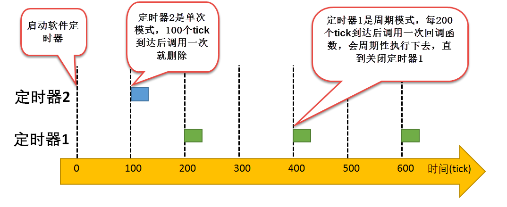
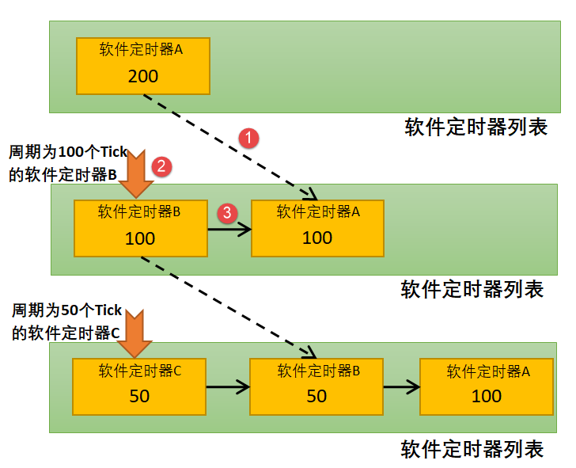
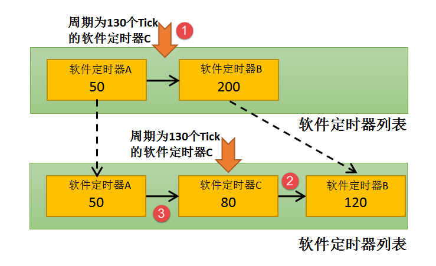
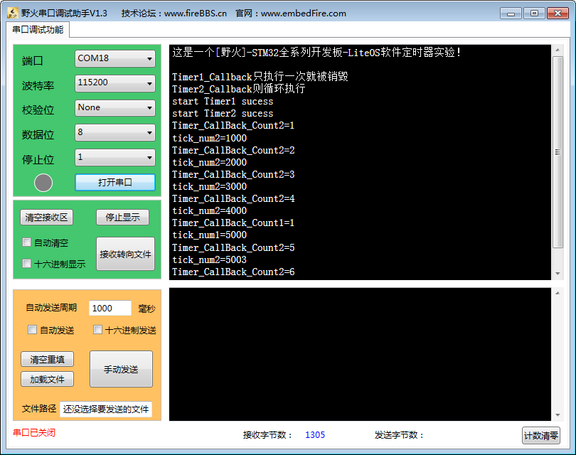

.. vim: syntax=rst

软件定时器
================

可能有不少读者了解定时器，但可能没听说过软件定时器。在操作系统中，软件定时器提供了软件层次的接口，软件定时器与底层硬件无关，使得程序拥有更好的可移植性。

软件定时器简介
~~~~~~~~~~~~~~~~~~~

软件定时器的基本概念
^^^^^^^^^^^^^^^^^^^^^^^^^

定时器，是指从指定的时刻开始，经过指定时间，然后触发一个超时事件，用户可以自定义定时器的周期与频率。类似生活中的闹钟，可以设置闹钟提示的时刻，也可以设置提示的次数。

定时器有硬件定时器和软件定时器之分。

    1. 硬件定时器是芯片本身提供的定时功能。一般是由外部晶振提供给芯片输入时钟，芯片向软件模块提供一组配置寄存器，接受控制输入，到达设定时间值后芯片中断控制器产生时钟中断。硬件定时器的精度一般很高，可以达到纳秒级别，并且是中断触发方式。

    2. 软件定时器，软件定时器是由操作系统提供的一类系统接口（函数），它构建在硬件定时器基础之上，使系统能够提供不受硬件定时器资源限制的定时器服务，它实现的功能与硬件定时器也是类似的。

使用硬件定时器时，每次在定时时间到达之后就会自动触发一个中断，用户在中断中处理信息；而使用软件定时器时，需要在创建软件定时器时指定时间到达后要调
用的函数（也称超时函数/回调函数，为了统一，下文均用回调函数描述），在回调函数中处理信息。

注意：软件定时器回调函数的上下文是任务，下文所说的定时器均为软件定时器。

软件定时器在被创建之后，当经过设定的超时时间后会触发回调函数。定时精度与系统时钟的周期有关。一般系统利用SysTick作为软件定时器的时基，软件定
时器的回调函数类似硬件的中断服务函数，所以，在回调函数中处理也应快进快出，而且回调函数中不能有任何阻塞任务运行的情况，如LOS_TaskDelay()以及
其他能阻塞任务运行的函数，因为软件定时器回调函数的上下文环境是任务，该任务会处理系统中所有超时的软件定时器，调用阻塞函数会影响其他定时器；两
次触发回调函数的时间间隔叫定时器的定时周期。

软件定时器的使用相当于扩展了定时器的数量，允许创建更多的定时业务，LiteOS软件定时器支持以下功能。

    1. 裁剪：能通过宏关闭软件定时器功能。

    2. 软件定时器创建。

    3. 软件定时器启动。

    4. 软件定时器停止。

    5. 软件定时器删除。

    6. 软件定时器剩余Tick数获取。

LiteOS提供的软件定时器支持单次模式和周期模式，单次模式和周期模式的定时时间到之后都会调用软件定时器的回调函数，用户可以在回调函数中加入要执行的工程代码。

单次模式：当用户创建了定时器并启动了定时器后，指定超时时间到达，只执行一次回调函数之后就将该定时器删除，不再重新执行。

周期模式：这个定时器会按照指定的定时时间循环执行回调函数，直到用户将定时器删除，具体如图 软件定时器的单次模式与周期模式_ 所示。

LiteOS通过一个软件定时器任务（osSwTmrTask）管理软定时器，软件定时器任务的优先级是0，即最高优先级，它是在LiteOS内核初始化的时候自动创建的。
为了满足用户定时需求，osSwTmrTask任务会在其执行期间检查用户启动的定时器，在超时后调用对应回调函数。

软件定时器的应用场景
^^^^^^^^^^^^^^^^^^^^^^^^^

在很多应用中，可能需要一些定时器任务，硬件定时器受硬件的限制，数量上不足以满足用户的实际需求，无法提供更多的定时器，可以采用软件定时器，由软
件定时器代替硬件定时器任务。但需要注意的是软件定时器的精度是无法和硬件定时器相比的，因为在软件定时器的定时过程中是极有可能被其他中断打断，因
此软件定时器更适用于对时间精度要求不高的任务。

软件定时器的精度
^^^^^^^^^^^^^^^^^^^^

在操作系统中，通常软件定时器以系统节拍周期为计时单位。系统节拍是系统时钟的频率，系统节拍配置为LOSCFG_BASE_CORE_TICK_PER_SECOND，默认是1000HZ，
因此系统的时钟节拍周期就为1Tick。由于节拍定义了系统中定时器能够分辨的精确度，系统可以根据实际系统CPU的处理能力和实时性需求设置合适的数值，系
统节拍宏定义的值越大，精度越高，但是系统开销也将越大，因为这代表在1s内系统进入中断的次数也就越多。

软件定时器的运作机制
^^^^^^^^^^^^^^^^^^^^^^^^^

软件定时器是可选的系统组件，在模块初始化的时候已经分配了一块连续的内存，系统支持的最大定时器个数由target_config.h中的LOSCFG_BASE_CORE_SWTMR_LIMIT宏配置。

软件定时器使用了系统中一个队列和一个任务资源，系统通过软件定时器命令队列处理软件定时器。

软件定时器以Tick为基本计时单位，当用户创建并启动一个软件定时器时， LiteOS会根据当前系统Tick与用户指定的超时时间计算出该定时器超时的Tick，并将该定时器插入定时器列表。

系统会在SysTick中断处理函数中扫描软件定时器列表，如果有定时器超时则通过“定时器命令队列”向软件定时器任务发送一个命令，任务在接收到命令就会去处
理命令对应的程序，调用对应软件定时器的回调函数。

如果软件定时器的定时时间到来，那么在Tick中断处理函数结束后，软件定时器任务osSwTmrTask（优先级为最高）被唤醒，在该任务中调用创建软件定时器时用户指定的回调函数。

定时器状态有以下几种：

    1. OS_SWTMR_STATUS_UNUSED（未使用），系统在定时器模块初始化的时候将系统中所有定时器资源初始化成该状态。

    2. OS_SWTMR_STATUS_CREATED（创建未启动/停止），在未使用状态下调用LOS_SwtmrCreate接口或者启动后调用LOS_SwtmrStop接口后，定时器将变成该状态。

    3. OS_SWTMR_STATUS_TICKING（运行），在定时器创建后调用LOS_SwtmrStart()函数接口，定时器将变成该状态，表示定时器运行时的状态。

使用软件定时器时候要注意以下几点：

    1. 在软件定时器的回调函数中处理时间应该尽可能短，不允许使用导致任务挂起或者阻塞的函数，如LOS_TaskDelay()。

    2. 软件定时器占用了系统的一个队列和一个任务资源，软件定时器任务的优先级设定为0，且不允许修改 。

    3. 创建单次软件定时器，该定时器超时执行完回调函数后，系统会自动删除该软件定时器，并回收资源。

软件定时器的使用讲解
~~~~~~~~~~~~~~~~~~~~~~~~~~~~~~

软件定时器控制块
^^^^^^^^^^^^^^^^^^^^

LiteOS最大支持LOSCFG_BASE_CORE_SWTMR_LIMIT个软件定时器，该宏在target_config.h文件中配置，每个软件定时器都有对应的软件定时器控制块，每个软
件定时器控制块都包含了软件定时器的基本信息，如软件定时器的状态、软件定时器工作模式、软件定时器的计数值，以及软件定时器回调函数等信息，
如 代码清单:定时器-1_ 所示。

.. code-block:: c
    :caption: 代码清单:定时器-1软件定时器控制块
    :name: 代码清单:定时器-1
    :linenos:

    /**
    * @ingroup los_swtmr
    * 软件定时器控制块结构体
    */
    typedef struct tagSwTmrCtrl {
        struct tagSwTmrCtrl *pstNext;     			(1)
        UINT8               ucState;       			(2)
        UINT8               ucMode;        			(3)
    #if (LOSCFG_BASE_CORE_SWTMR_ALIGN == YES)
        UINT8               ucRouses;       		(4)
        UINT8               ucSensitive;                 	(5)
    #endif
        UINT16              usTimerID;                      (6)
        UINT32              uwCount;        		(7)
        UINT32              uwInterval;    			(8)
        UINT32              uwArg;        			(9)
        SWTMR_PROC_FUNC     pfnHandler;     		(10)
    } SWTMR_CTRL_S;

-   代码清单:定时器-1_ **(1)**\ ：指向下一个软件定时器控制块的指针。

-   代码清单:定时器-1_ **(2)**\ ：软件定时器状态有以下三种：OS_SWTMR_STATUS_UNUSED（未使用状态）、OS_SWTMR_STATUS_CREATED（创建未启
    动/停止状态）、OS_SWTMR_STATUS_TICKING（运行状态）。

-   代码清单:定时器-1_ **(3)**\ ：软件定时器模式：单次模式、周期模式等。

-   代码清单:定时器-1_ **(4)**\ ：如果定义了LOSCFG_BASE_CORE_SWTMR_ALIGN则使能软件定时器唤醒功能。

-   代码清单:定时器-1_ **(5)**\ ：如果定义了LOSCFG_BASE_CORE_SWTMR_ALIGN则使能软件定时器对齐。

-   代码清单:定时器-1_ **(6)**\ ：软件定时器ID。

-   代码清单:定时器-1_ **(7)**\ ：软件计时器的计数值，用来记录软件定时器距离超时的剩余时间。

-   代码清单:定时器-1_ **(8)**\ ：软件定时器的超时时间间隔，即调用回调函数的周期。

-   代码清单:定时器-1_ **(9)**\ ：调用回调函数时传入的参数。

-   代码清单:定时器-1_ **(10)**\ ：处理软件定时器超时的回调函数。

软件定时器错误代码
^^^^^^^^^^^^^^^^^^^^^

在LiteOS中，与软件定时器相关的函数大多数都会有返回值，其返回值是一些错误代码，方便使用者进行调试，本书列出一些常见的错误代
码与参考解决方案，如表 常见软件定时器错误代码_ 所示。

.. list-table::
   :widths: 25 25 25 25
   :name: 常见软件定时器错误代码
   :header-rows: 0

   * - 序号
     - 定义
     - 描述
     - 参考解决方案

   * - 1
     - LOS_ERRNO_SWTMR_PTR_NULL
     - 软件定时器回调函数为空
     - 定义软件定时器回调函数

   * - 2
     - LOS_ERRNO_SWTMR_INTERVAL_NOT_SUITED
     - 软件定时器间隔时间为0
     - 重新定义间隔时间

   * - 3
     - LOS_ERRNO_SWTMR_MODE_INVALID
     - 不正确的软件定时器模式
     - 确认软件定时器模式

   * - 4
     - LOS_ERRNO_SWTMR_RET_PTR_NULL
     - 软件定时器ID指针入参为NULL
     - 定义ID变量，传入指针

   * - 5
     - LOS_ER RNO_SWTMR_MAXSIZE
     - 软件定时器个数超过最大值
     - 重新定义软件定时器最大个数，或者等待一个软件定时器释放资源

   * - 6
     - LOS_ERRNO_SWTMR_ID_INVALID
     - 不正确的软件定时器ID入参
     - 确保入参合法

   * - 7
     - LOS_ERRNO_SWTMR_NOT_CREATED
     - 软件定时器未创建
     - 创建软件定时器

   * - 8
     - LOS_ERRNO_SWTMR_NO_MEMORY
     - 软件定时器链表创建内存不足
     - 申请一块足够大的内存供软件定时器使用

   * - 9
     - LOS_ERRNO_SWTM R_MAXSIZE_INVALID
     - 不正确的软件定时器个数最大值
     - 重新定义该值

   * - 10
     - LOS_ERRNO_SWTMR_HWI_ACTIVE
     - 在中断中使用定时器
     - 修改源代码确保不在中断中使用

   * - 11
     - LOS_ERRNO_SWTMR_HANDLER_POOL_NO_MEM
     - membox内存不足
     - 扩大内存

   * - 12
     - LOS_ERRNO_SWTMR_QUEUE_CREATE_FAILED
     - 软件定时器队列创建失败
     - 检查用以创建队列的内存是否足够

   * - 13
     - LOS_ERRNO_SWTMR_TASK_CREATE_FAILED
     - 软件定时器任务创建失败
     - 检查用以创建软件定时器任务的内存是否足够并重新创建

   * - 14
     - LOS_ERRNO_SWTMR_NOT_STARTED
     - 未启动软件定时器
     - 启动软件定时器

   * - 15
     - LOS_ERRNO_SWTMR_STATUS_INVALID
     - 不正确的软件定时器状态
     - 检查确认软件定时器状态

   * - 16
     - LOS_ERRNO_SW TMR_TICK_PTR_NULL
     - 用以获取软件定时器超时Tick数的入参指针为NULL
     - 创建一个有效的变量

软件定时器典型开发流程
^^^^^^^^^^^^^^^^^^^^^^^^^^

    1. 在target_config.h文件中确认配置项LOSCFG_BASE_CORE_SWTMR和LOSCFG_BASE_IPC_QUEUE为YES打开状态。

    2. 在target_config.h文件中配置LOSCFG_BASE_CORE_SWTMR_LIMIT最大支持的软件定时器数。

    3. 在target_config.h文件中配置OS_SWTMR_HANDLE_QUEUE_SIZE软件定时器队列最大长度。

    4. 创建一个指定定时时间、指定超时处理函数、指定触发模式的软件定时器。

    5. 编写软件定时器回调函数。

    6. 启动定时器LOS_SwtmrStart。

    7. 停止定时器LOS_SwtmrStop。

    8. 删除定时器LOS_SwtmrDelete。

软件定时器创建函数LOS_SwtmrCreate()
^^^^^^^^^^^^^^^^^^^^^^^^^^^^^^^^^^^^^^^^^^^^^^^^^^^^^^^^^^^^^^^^^

LiteOS提供软件定时器创建函数LOS_SwtmrCreate()，读者在使用软件定时器前需要先创建软件定时器，同时还需要定义一个软件定时器ID变量，用于
保存创建成功后返回的软件定时器ID，其源码如 代码清单:定时器-2_ 所示，使用实例如 代码清单:定时器-4_ 高亮部分所示。

.. code-block:: c
    :caption: 代码清单:定时器-2软件定时器创建函数LOS_SwtmrCreate()源码
    :name: 代码清单:定时器-2
    :linenos:

    /**********************************************************************
    Function   : LOS_SwtmrCreate
    Description: 创建一个软件定时器
    Input      : uwInterval	：软件定时器的定时时间（Tick）
                usMode		：软件定时器的工作模式
                pfnHandler	：软件定时器的回调函数
                uwArg		：软件定时器传入参数
    Output     : pusSwTmrID	：软件定时器ID指针
    Return     : 返回LOS_OK表示创建成功,或者其他失败的错误代码
    **********************************************************************/
    LITE_OS_SEC_TEXT_INIT UINT32 LOS_SwtmrCreate(UINT32 uwInterval,
                            UINT8 ucMode,
                        SWTMR_PROC_FUNC pfnHandler,
                            UINT16 *pusSwTmrID,
                        UINT32 uwArg
    #if (LOSCFG_BASE_CORE_SWTMR_ALIGN == YES)			(1)
                            ,UINT8 ucRouses,
                            UINT8 ucSensitive
    #endif
                                                )
    {
        SWTMR_CTRL_S  *pstSwtmr;
        UINTPTR  uvIntSave;

        if (0 == uwInterval) {					(2)
            return LOS_ERRNO_SWTMR_INTERVAL_NOT_SUITED;
        }

        if ((LOS_SWTMR_MODE_ONCE != ucMode)				(3)
            && (LOS_SWTMR_MODE_PERIOD != ucMode)
            && (LOS_SWTMR_MODE_NO_SELFDELETE != ucMode)) {
            return LOS_ERRNO_SWTMR_MODE_INVALID;
        }

        if (NULL == pfnHandler) {					(4)
            return LOS_ERRNO_SWTMR_PTR_NULL;
        }

        if (NULL == pusSwTmrID) {					(5)
            return LOS_ERRNO_SWTMR_RET_PTR_NULL;
        }

    #if (LOSCFG_BASE_CORE_SWTMR_ALIGN == YES)
    if((OS_SWTMR_ROUSES_IGNORE != ucRouses)&&(OS_SWTMR_ROUSES_ALLOW != ucRouses)) {
            return OS_ERRNO_SWTMR_ROUSES_INVALID;
        }

        if ((OS_SWTMR_ALIGN_INSENSITIVE != ucSensitive)&&
            (OS_SWTMR_ALIGN_SENSITIVE != ucSensitive)) {
            return OS_ERRNO_SWTMR_ALIGN_INVALID;
        }
    #endif

        uvIntSave = LOS_IntLock();
        if (NULL == m_pstSwtmrFreeList) {				(6)
            LOS_IntRestore(uvIntSave);
            return LOS_ERRNO_SWTMR_MAXSIZE;
        }

        pstSwtmr = m_pstSwtmrFreeList;
        m_pstSwtmrFreeList = pstSwtmr->pstNext;
        LOS_IntRestore(uvIntSave);
        pstSwtmr->pfnHandler    = pfnHandler;			(7)
        pstSwtmr->ucMode        = ucMode;				(8)
        pstSwtmr->uwInterval    = uwInterval;			(9)
        pstSwtmr->pstNext       = (SWTMR_CTRL_S *)NULL;		(10)
        pstSwtmr->uwCount       = 0;				(11)
        pstSwtmr->uwArg         = uwArg;				(12)
    #if (LOSCFG_BASE_CORE_SWTMR_ALIGN == YES)
        pstSwtmr->ucRouses      = ucRouses;
        pstSwtmr->ucSensitive   = ucSensitive;
    #endif
        pstSwtmr->ucState       = OS_SWTMR_STATUS_CREATED;		(13)
        *pusSwTmrID = pstSwtmr->usTimerID;				(14)

        return LOS_OK;
    }

-   代码清单:定时器-2_ **(1)**\ ：如果配置了LOSCFG_BASE_CORE_SWTMR_ALIGN，则需要传入ucRouses与ucSensitive参数，这是关于软件定时器对齐的，暂时无需理会。

-   代码清单:定时器-2_ **(2)**\ ：如果软件定时器间隔时间为0，返回错误代码。

-   代码清单:定时器-2_ **(3)**\ ：如果软件定时器的工作模式不正确，返回错误代码。 LiteOS的软件定时器支持的工作模式有以下几种，目前支持的仅有前3种，如 代码清单:定时器-3_ 所示。

.. code-block:: c
    :caption: 代码清单:定时器-3LiteOS软件定时器工作模式
    :name: 代码清单:定时器-3
    :linenos:

    enum enSwTmrType {
        LOS_SWTMR_MODE_ONCE,                 /**< 单次模式 */
        LOS_SWTMR_MODE_PERIOD,               /**< 周期模式 */
        LOS_SWTMR_MODE_NO_SELFDELETE,        /**< 单次模式，但不能删除自己 */
        LOS_SWTMR_MODE_OPP,                  /**<在一次性定时器完成定时后，启用定期
                                软件定时器。 暂时不支持此模式。*/
    };

-   代码清单:定时器-2_ **(4)**\ ：如果用户没有实现软件定时器的回调函数，也返回错误代码，用户需要自己编写软件定时器回调函数。

-   代码清单:定时器-2_ **(5)**\ ：如果软件定时器ID变量的地址为NULL，则返回错误代码。

-   代码清单:定时器-2_ **(6)**\ ：当系统已经使用的软件定时器个数超过支持的最大值时，返回错误代码，读者可以在target_config.h文件中修
    改LOSCFG_BASE_CORE_SWTMR_LIMIT宏定义以增加系统支持的软件定时器最大个数。

-   代码清单:定时器-2_ **(7)**\ ：从软件定时器未使用列表中取下一个软件定时器，然后根据用户指定参数对软件定时器进行初始化，首先初始化软件定时器的回调函数。

-   代码清单:定时器-2_ **(8)**\ ：初始化软件定时器的工作模式。

-   代码清单:定时器-2_ **(9)**\ ：初始化软件定时器的处理周期。

-   代码清单:定时器-2_ **(10)**\ ：初始化pstNext指针为NULL，在启动软件定时器的时候会按照唤醒时间升序插入软件定时器列表中。

-   代码清单:定时器-2_ **(11)**\ ：初始化软件定时器的剩余唤醒时间为0，在启动软件定时器的时候会重新计算。

-   代码清单:定时器-2_ **(12)**\ ：初始软件定时器回调函数的传入参数。

-   代码清单:定时器-2_ **(13)**\ ：初始化软件定时器的状态为OS_SWTMR_STATUS_CREATED，表示软件定时器是处于创建状态，尚未启动。

-   代码清单:定时器-2_ **(14)**\ ：将软件定时器ID通过pusSwTmrID指针返回给用户。

.. code-block:: c
    :caption: 代码清单:定时器-4软件定时器创建函数LOS_SwtmrCreate()实例
    :emphasize-lines: 3-9
    :name: 代码清单:定时器-4
    :linenos:

    UINT32 uwRet = LOS_OK;/* 定义一个创建任务的返回类型，初始化为创建成功的返回值 */

    /* 创建一个软件定时器定时器*/
    uwRet = LOS_SwtmrCreate(5000, /* 软件定时器的定时时间（Tick）*/
                            LOS_SWTMR_MODE_ONCE, /* 软件定时器模式 一次模式 */
                            (SWTMR_PROC_FUNC)Timer1_Callback, //软件定时器的回调函数
                            &Timer1_Handle,		/* 软件定时器的id */
                            0);			/*软件定时器的回调函数传入参数 */

    if (uwRet != LOS_OK)
    {
        printf("软件定时器Timer1创建失败！\n");
    }

注意：如果使能了LOSCFG_BASE_CORE_SWTMR_ALIGN宏定义则还需传入两个参数：ucRouses与ucSensitive。

软件定时器的回调函数是由用户实现的，类似于中断服务函数，在回调函数中的处理时间尽可能短，虽然软件定时器回调函数的上下文环境是任务，但不
允许调用任何阻塞任务运行的函数，回调函数的应用实例如 代码清单:定时器-5_ 高亮部分所示。

.. code-block:: c
    :caption: 代码清单:定时器-5软件定时器回调函数
    :emphasize-lines: 7-17
    :name: 代码清单:定时器-5
    :linenos:

    /************************************************************************
    * @ 函数名  ： Timer1_Callback
    * @ 功能说明： 软件定时器回调函数
    * @ 参数    ： 传入1个参数，但未使用
    * @ 返回值  ： 无
    ****************************************************************/
    static void Timer1_Callback(UINT32 arg)
    {
        UINT32 tick_num;

        TmrCb_Count++;			/* 每回调一次加一 */
        LED1_TOGGLE;
        tick_num1 = (UINT32)LOS_TickCountGet();	/* 获取滴答定时器的计数值 */

        printf("Timer_CallBack_Count=%d\n", TmrCb_Count);
        printf("tick_num=%d\n", tick_num);
    }

软件定时器删除函数LOS_SwtmrDelete()
^^^^^^^^^^^^^^^^^^^^^^^^^^^^^^^^^^^^^^^^^^^^^^^^^^^^^^^^^^^^^^^^^

LiteOS允许用户主动删除软件定时器，被删除的软件定时器不会继续执行，回调函数也无法再次被调用，关于该软件定时器的所有资源都会被系统回
收。软件定时器删除函数LOS_SwtmrDelete()的源码如 代码清单:定时器-6_ 所示。

.. code-block:: c
    :caption: 代码清单:定时器-6软件定时器删除函数LOS_SwtmrDelete()源码
    :name: 代码清单:定时器-6
    :linenos:

    /************************************************************************
    Function   : LOS_SwtmrDelete
    Description: 删除一个软件定时器
    Input      : usSwTmrID ------- 软件定时器ID
    Output     : None
    Return     : 返回LOS_OK表示删除成功,或者其他失败的错误代码
    *******************************************************************/
    LITE_OS_SEC_TEXT UINT32 LOS_SwtmrDelete(UINT16 usSwTmrID)
    {
        SWTMR_CTRL_S  *pstSwtmr;
        UINTPTR  uvIntSave;
        UINT32 uwRet = LOS_OK;
        UINT16 usSwTmrCBID;

        CHECK_SWTMRID(usSwTmrID, uvIntSave, usSwTmrCBID, pstSwtmr);	(1)
        switch (pstSwtmr->ucState) {
        case OS_SWTMR_STATUS_UNUSED:				(2)
            uwRet = LOS_ERRNO_SWTMR_NOT_CREATED;
            break;
        case OS_SWTMR_STATUS_TICKING:				(3)
            osSwtmrStop(pstSwtmr);
        case OS_SWTMR_STATUS_CREATED:  				(4)
            osSwtmrDelete(pstSwtmr);
            break;
        default:
            uwRet = LOS_ERRNO_SWTMR_STATUS_INVALID;
            break;
        }

        LOS_IntRestore(uvIntSave);
        return uwRet;
    }

-   代码清单:定时器-6_ **(1)**\ ：检查要删除的软件定时器的ID是否有效，CHECK_SWTMRID其实上一个宏定义，在los_swtmr.c文件中定义，在这个
    宏定义中实现了检查软件定时器ID是否有效，如果有效则根据软件定时器ID进行获取软件定时器控制块pstSwtmr。

-   代码清单:定时器-6_ **(2)**\ ：获取软件定时器的状态，并根据软件定时器的状态进行删除操作，如果要删除的软件定时器是没有被创建或者已经
    被删除的，则直接返回错误代码LOS_ERRNO_SWTMR_NOT_CREATED。

-   代码清单:定时器-6_ **(3)**\ ：如果软件定时器还在运行中，则先停止软件定时器而不是直接删除，在软件定时器被停止之后，它没有break，所
    以是不会退出switch语句，然后再进行删除操作。

-   代码清单:定时器-6_ **(4)**\：如果软件定时器已经停止了，则表示可以进行删除操作，调用osSwtmrDelete()函数进行删除操作：将软件定时器
    归还到系统软件定时器未使用列表中，并且将软件定时器的状态变为OS_SWTMR_STATUS_UNUSED，以便在下次创建软件定时器的时候能从未使用列表获
    取到软件定时器，如 代码清单:定时器-7_ 所示。

.. code-block:: c
    :caption: 代码清单:定时器-7 osSwtmrDelete()删除软件定时器源码
    :emphasize-lines: 2
    :name: 代码清单:定时器-7
    :linenos:

    UINT32 uwRet = LOS_OK;
    uwRet = LOS_SwtmrDelete(Timer_Handle);//删除软件定时器
    if (LOS_OK != uwRet)
    {
        printf("删除软件定时器失败\n");
    } else
    {
        printf("删除成功\n");
    }

进行软件定时器删除操作要传入正确的软件定时器ID，并且应先将软件定时器停止工作，再进行软件定时器删除，其使用实例如 代码清单:定时器-8_ 高亮部分所示。

.. code-block:: c
    :caption: 代码清单:定时器-8软件定时器删除函数LOS_SwtmrDelete()实例
    :emphasize-lines: 2
    :name: 代码清单:定时器-8
    :linenos:

    UINT32 uwRet = LOS_OK;
    uwRet = LOS_SwtmrDelete(Timer_Handle);//删除软件定时器
    if (LOS_OK != uwRet)
    {
        printf("删除软件定时器失败\n");
    } else
    {
        printf("删除成功\n");
    }

软件定时器启动函数LOS_SwtmrStart()
^^^^^^^^^^^^^^^^^^^^^^^^^^^^^^^^^^^^^^^^^^^^^^^^^^^^^^^^^^^^^

在创建成功软件定时器的时候，软件定时器的状态从OS_SWTMR_STATUS_UNUSED（未使用状态）变成OS_SWTMR_STATUS_CREATED（创建未启动/停止
状态），创建完成的软件定时器是未运行的，用户在需要的时候可以启动它，LirteOS提供了软件定时器启动函数LOS_SwtmrStart()，
如 代码清单:定时器-9_ 所示，使用实例如 代码清单:定时器-11_ 高亮部分所示。

.. code-block:: c
    :caption: 代码清单:定时器-9软件定时器启动函数LOS_SwtmrStart()
    :name: 代码清单:定时器-9
    :linenos:

    /**********************************************************************
    Function   : LOS_SwtmrStart
    Description: 启动一个软件定时器
    Input      : usSwTmrID ------- 软件定时器ID
    Output     : None
    Return     : 返回LOS_OK表示启动成功,或者其他失败的错误代码
    **********************************************************************/
    LITE_OS_SEC_TEXT UINT32 LOS_SwtmrStart(UINT16 usSwTmrID)
    {
        SWTMR_CTRL_S  *pstSwtmr;
        UINTPTR  uvIntSave;
    #if (LOSCFG_BASE_CORE_SWTMR_ALIGN == YES)
        UINT32 uwTimes;
    #endif
        UINT32 uwRet = LOS_OK;
        UINT16 usSwTmrCBID;

        CHECK_SWTMRID(usSwTmrID, uvIntSave, usSwTmrCBID, pstSwtmr);
    #if (LOSCFG_BASE_CORE_SWTMR_ALIGN == YES)			(1)
        if ( OS_SWTMR_ALIGN_INSENSITIVE == pstSwtmr->ucSensitive &&
            LOS_SWTMR_MODE_PERIOD == pstSwtmr->ucMode ) {
            SET_ALIGN_SWTMR_CAN_ALIGNED(m_uwSwTmrAlignID[pstSwtmr->
                usTimerID % LOSCFG_BASE_CORE_SWTMR_LIMIT]);
            if (pstSwtmr->uwInterval % LOS_COMMON_DIVISOR == 0) {
                SET_ALIGN_SWTMR_CAN_MULTIPLE(m_uwSwTmrAlignID[pstSwtmr->
                usTimerID % LOSCFG_BASE_CORE_SWTMR_LIMIT]);
                uwTimes = pstSwtmr->uwInterval / (LOS_COMMON_DIVISOR);
                SET_ALIGN_SWTMR_DIVISOR_TIMERS(m_uwSwTmrAlignID[pstSwtmr->
                usTimerID % LOSCFG_BASE_CORE_SWTMR_LIMIT], uwTimes);
            }
        }
    #endif

        switch (pstSwtmr->ucState) {
        case OS_SWTMR_STATUS_UNUSED:				(2)
            uwRet = LOS_ERRNO_SWTMR_NOT_CREATED;
            break;
        case OS_SWTMR_STATUS_TICKING:				(3)
            osSwtmrStop(pstSwtmr);
        case OS_SWTMR_STATUS_CREATED:				(4)
            osSwTmrStart(pstSwtmr);
            break;
        default:
            uwRet = LOS_ERRNO_SWTMR_STATUS_INVALID;
            break;
        }

        LOS_IntRestore(uvIntSave);
        return uwRet;
    }

-   代码清单:定时器-9_ **(1)**\ ：当配置了LOSCFG_BASE_CORE_SWTMR_ALIGN才会对软件定时器进行对齐操作，此处暂时无需理会。

-   代码清单:定时器-9_ **(2)**\ ：在CHECK_SWTMRID这个宏定义中会根据软件定时器ID获取软件定时器的状态，现在判断一下其状态，如果软件定时器没有
    创建或者已经删除了，是无法启动的，返回错误代码LOS_ERRNO_SWTMR_NOT_CREATED。

-   代码清单:定时器-9_ **(3)**\ ：如果软件定时器已经启动了，再次调用LOS_SwtmrStart()函数将会停止已经启动的定时器，然后重新启动软件定时器，因
    为停止软件定时器之后，并没有退出switch语句。

-   代码清单:定时器-9_ **(4)**\ ：调用osSwTmrStart()函数启动软件定时器，该函数源码如代码清单:定时器-10所示。

.. code-block:: c
    :caption: 代码清单:定时器-10 osSwTmrStart()源码
    :name: 代码清单:定时器-10
    :linenos:

    /***************************************************************
    Function   : osSwTmrStart
    Description: 启动一个软件定时器
    Input      : pstSwtmr ---- 需要启动软件定时器
    Output     : None
    Return     : None
    *****************************************************************/
    LITE_OS_SEC_TEXT VOID osSwTmrStart(SWTMR_CTRL_S *pstSwtmr)
    {
        SWTMR_CTRL_S *pstPrev = (SWTMR_CTRL_S *)NULL;
        SWTMR_CTRL_S *pstCur = (SWTMR_CTRL_S *)NULL;

        /**************

        * 中间省略配置了LOSCFG_BASE_CORE_SWTMR_ALIGN才有用的代码
        * 本例程中未使用LOSCFG_BASE_CORE_SWTMR_ALIGN
        * .....
        * .....

        ***************/

        pstSwtmr->uwCount = pstSwtmr->uwInterval;

        pstCur = m_pstSwtmrSortList;				(1)
        while (pstCur != NULL) {
            if (pstCur->uwCount > pstSwtmr->uwCount) {		(2)
                break;
            }

            pstSwtmr->uwCount -= pstCur->uwCount;			(3)
            pstPrev = pstCur;
            pstCur = pstCur->pstNext;				(4)
        }

        pstSwtmr->pstNext = pstCur;				(5)

        if (pstCur != NULL) {
            pstCur->uwCount -= pstSwtmr->uwCount;			(6)
        }

        if (pstPrev == NULL) {
            m_pstSwtmrSortList = pstSwtmr;				(7)
        } else {
            pstPrev->pstNext = pstSwtmr;				(8)
        }

        pstSwtmr->ucState = OS_SWTMR_STATUS_TICKING;		(9)

        return;
    }

在启动的过程中，会将软件定时器按唤醒时间升序插入软件定时器列表中，距离唤醒时间越短的软件定时器排在列表头部，距离唤醒时间越长的软件定
时器排在尾部。例如，软件定时器列表中一开始只有一个周期为200个Tick的软件定时器A，那么A定时器在200个Tick后就会被唤醒，调用对应的回调
函数；此时插入一个周期为100个Tick的软件定时器B，那么100个Tick之后，软件定时器B就会被唤醒，而原来在200个Tick后唤醒的软件定时器A，将
会在软件定时器B调用之后的100个Tick唤醒；同理，插入一个周期为50个Tick的软件定时器C也是一样的，如图 软件定时器插入队列时的排序1_ 与图 软件定时器插入队列时的排序2_ 所示。

上文简单分析了插入软件定时器列表的过程，那么结合源码分析LiteOS将软件定时器插入软件定时器列表的实现过程：

-   代码清单:定时器-10_ **(1)**\ ：m_pstSwtmrSortList是LiteOS管理软件定时器的列表，所有被创建并且启动的软件定时器都会被插入这个软件定时器列表中，首先
    获取软件定时器列表的第一个软件软件定时器，保存在局部变量pstCur中。

-   代码清单:定时器-10_ **(2)**\ ：当pstCur不为空的时候，表明软件定时器列表中存在软件定时器，那就进行新的软件定时器插入操作，系统将列表中的第一个软件定
    时器（pstCur）唤醒时间与新插入的软件定时器唤醒时间比较一下。如果pstCur的唤醒时间是大于新插入的软件定时器的唤醒时间，那就直接退出循环，说明新插入的软
    件定时器应该处于软件定时器列表头部，因为它距离唤醒的时间是最小的，如图 软件定时器插入队列时的排序1_  **(2)**\ 所示。

-   代码清单:定时器-10_ **(3)**\ ：如果插入的软件定时器距离唤醒时间不是最小的，则继续寻找，直到应该合适的位置。这时候新插入的软件定时器唤醒的时间应该要
    减去前一个唤醒的时间，如图 软件定时器插入队列时的排序2_ 所示插入的软件定时器C，本来插入的周期是130个Tick，减去软件定时器A唤醒的时间50个Tick，这表明
    在软件定时器A唤醒之后的80个Tick再去唤醒软件定时器C，而软件定时器A距离唤醒的时间是50个Tick，等到唤醒软件定时器C也是经过的时间是130个Tick（50+80），与设定的一致。

-   代码清单:定时器-10_ **(4)**\ ：继续寻找要插入的位置，直到找到合适的位置，才退出循环。

-   代码清单:定时器-10_ **(5)**\ ：找到合适的插入位置，那么需要进行插入操作，新插入的软件定时器的执向下一个软件定时器就是pstCur，如
    图 软件定时器插入队列时的排序1_  **(3)**\ 和图 软件定时器插入队列时的排序2_  **(2)**\ 所示。

-   代码清单:定时器-10_ **(6)**\ ：如果pstCur不为NULL，表示插入的软件定时器后面还是有定时器的，那么需要改变其唤醒的时间，减去插入的软件定时器时间，
    如图 软件定时器插入队列时的排序1_ 所示中软件定时器A、B和图 软件定时器插入队列时的排序2_ 所示中软件定时器B。

-   代码清单:定时器-10_ **(7)**\ ：如果新插入的软件定时器前面没有定时器了，表示该软件定时器插入到软件定时器列表头部，所以m_pstSwtmrSortList要指向
    新插入的软件定时器，如图 软件定时器插入队列时的排序1_ 所示中的软件定时器C。

-   代码清单:定时器-10_ **(8)**\ ：而新插入的软件定时器前面还存在软件定时器，那么就让该软件定时器的pstNext指针指向新插入的软件定时器，如
    图 软件定时器插入队列时的排序2_ \ **(3)**\ 所示。

-   代码清单:定时器-10_ **(9)**\ ：设置软件定时器状态为工作状态。

.. code-block:: c
    :caption: 代码清单:定时器-11软件定时器启动函数LOS_SwtmrStart()实例
    :emphasize-lines: 2-3
    :name: 代码清单:定时器-11
    :linenos:

    UINT32 uwRet = LOS_OK;
    /* 启动一个软件定时器定时器*/
    uwRet = LOS_SwtmrStart(Timer2_Handle);
    if (LOS_OK != uwRet)
    {
        printf("start Timer2 failed\n");
    } else
    {
        printf("start Timer2 sucess\n");
    }

软件定时器停止函数LOS_SwtmrStop()
^^^^^^^^^^^^^^^^^^^^^^^^^^^^^^^^^^^^^^^^^^^^^^^^^^^^^^^^^^^^

与软件定时器启动函数相反的是软件定时器停止函数，软件定时器停止函数LOS_SwtmrStop()是用于停止正在运行的软件定时器，在不需要使用的
时候可以停止软件定时器，或者是需要删除某个软件定时器之前应先把软件定时器停止，所以，软件定时器的停止也是很常用的函数，其源码如 代码清单:定时器-12_ 所示。

.. code-block:: c
    :caption: 代码清单:定时器-12软件定时器停止函数LOS_SwtmrStop()源码
    :name: 代码清单:定时器-12
    :linenos:

    /**********************************************************************
    Function   : LOS_SwtmrStop
    Description: 停止一个软件定时器
    Input      : usSwTmrID ------- 软件定时器ID
    Output     : None
    Return     : 返回LOS_OK表示停止成功,或者其他失败的错误代码
    ********************************************************************/
    LITE_OS_SEC_TEXT UINT32 LOS_SwtmrStop(UINT16 usSwTmrID)
    {
        SWTMR_CTRL_S *pstSwtmr;
        UINTPTR uvIntSave;
        UINT16 usSwTmrCBID;
        UINT32 uwRet = LOS_OK;

        CHECK_SWTMRID(usSwTmrID, uvIntSave, usSwTmrCBID, pstSwtmr);	(1)
        switch (pstSwtmr->ucState) {
        case OS_SWTMR_STATUS_UNUSED:				(2)
            uwRet = LOS_ERRNO_SWTMR_NOT_CREATED;
            break;
        case OS_SWTMR_STATUS_CREATED:				(3)
            uwRet = LOS_ERRNO_SWTMR_NOT_STARTED;
            break;
        case OS_SWTMR_STATUS_TICKING:				(4)
            osSwtmrStop(pstSwtmr);
            break;
        default:
            uwRet = LOS_ERRNO_SWTMR_STATUS_INVALID;
            break;
        }

        LOS_IntRestore(uvIntSave);
        return uwRet;
    33 }

-   代码清单:定时器-12_ **(1)**\ ：通过宏定义CHECK_SWTMRID检查软件定时器ID是否有效，并且根据软件定时器ID获取对应的软件定时器控制块。

-   代码清单:定时器-12_ **(2)**\ ：获取当前定时器的状态，如果软件定时器没有创建或者已经被删除了，返回错误代码LOS_ERRNO_SWTMR_NOT_CREATED。

-   代码清单:定时器-12_ **(3)**\ ：如果软件定时器没有启动，则返回错误代码。

-   代码清单:定时器-12_ **(4)**\ ：如果软件定时器已经启动了，调用软件定时器停止函数LOS_SwtmrStop()将会停止已经启动的定时器。而真正停止软件定时器
    的代码是osSwtmrStop()，如 代码清单:定时器-13_ 所示。

.. code-block:: c
    :caption: 代码清单:定时器-13软件定时器停止函数osSwtmrStop源码
    :name: 代码清单:定时器-13
    :linenos:

    /***********************************************************************
    Function   : osSwtmrStop
    Description:  停止一个软件定时器
    Input      : pstSwtmr
    Output     : None
    Return     : None
    *******************************************************************/
    LITE_OS_SEC_TEXT VOID osSwtmrStop(SWTMR_CTRL_S *pstSwtmr)
    {
        SWTMR_CTRL_S *pstPrev = (SWTMR_CTRL_S *)NULL;
        SWTMR_CTRL_S *pstCur = (SWTMR_CTRL_S *)NULL;

        if (!m_pstSwtmrSortList)
            return;

        pstCur = m_pstSwtmrSortList;			(1)

        while (pstCur != pstSwtmr) {
            pstPrev = pstCur;
            pstCur = pstCur->pstNext;			(2)
        }

        if (pstCur->pstNext != NULL) {
            pstCur->pstNext->uwCount += pstCur->uwCount;	(3)
        }

        if (pstPrev == NULL) {
            m_pstSwtmrSortList = pstCur->pstNext;		(4)
        } else {
            pstPrev->pstNext = pstCur->pstNext;		(5)
        }

        pstCur->pstNext = (SWTMR_CTRL_S *)NULL;
        pstCur->ucState = OS_SWTMR_STATUS_CREATED;		(6)

    #if (LOSCFG_BASE_CORE_SWTMR_ALIGN == YES)
        SET_ALIGN_SWTMR_ALREADY_NOT_ALIGNED(m_uwSwTmrAlignID[
        pstSwtmr->usTimerID % LOSCFG_BASE_CORE_SWTMR_LIMIT]);
    #endif
    }

-   代码清单:定时器-13_ **(1)**\ ：获取软件定时器列表的第一个软件定时器，并且保存在pstCur中，为遍历定时器列表做准备。

-   代码清单:定时器-13_ **(2)**\ ：如果pstCur不是要停止的软件定时器，那就需要遍历软件定时器列表，直到找到要停止的软件定时器。

-   代码清单:定时器-13_ **(3)**\ ：如果要停止的软件定时器后面还有定时器的话，那么要修改该定时器唤醒的时间，即加上要停止的软件定时器的时间。

-   代码清单:定时器-13_ **(4)**\ ：如果停止的软件定时器是列表中第一个的话，那么将m_pstSwtmrSortList指向列表中第二个定时器（当前软件定时器的下一个）。

-   代码清单:定时器-13_ **(5)**\ ：如果停止的不是列表中第一个软件定时器的话，就要将软件定时器前后的两个定时器连接起来。

-   代码清单:定时器-13_ **(6)**\ ：设置软件定时器的状态是停止状态。

软件定时器实验
~~~~~~~~~~~~~~~~~~~

软件定时器实验是在LiteOS中创建了两个软件定时器，其中一个软件定时器是单次模式，5000Tick调用一次回调函数，另一个软件定时器是周期模式，
1000Tick调用一次回调函数，在回调函数中输出相关信息，实验源码如 代码清单:定时器-14_ 高亮部分所示。

.. code-block:: c
    :caption: 代码清单:定时器-14软件定时器实验源码
    :emphasize-lines: 32-34,118-152,163-173,180-192
    :name: 代码清单:定时器-14
    :linenos:

    /***************************************************************
    * @file    main.c
    * @author  fire
    * @version V1.0
    * @date    2018-xx-xx
    * @brief   STM32全系列开发板-LiteOS！
    **************************************************************
    * @attention
    *
    * 实验平台:野火 F103-霸道 STM32 开发板
    * 论坛    :http://www.firebbs.cn
    * 淘宝    :http://firestm32.taobao.com
    *
    ***************************************************************
    */
    /* LiteOS 头文件 */
    #include "los_sys.h"
    #include "los_task.ph"
    #include "los_swtmr.h"
    /* 板级外设头文件 */
    #include "bsp_usart.h"
    #include "bsp_led.h"
    #include "bsp_key.h"

    /**************************** 任务ID *****************************/
    /*
    * 任务ID是一个从0开始的数字，用于索引任务，当任务创建完成之后，它就具有了一个任务ID
    * 以后要想操作这个任务都需要通过这个任务ID，
    *
    */

    /* 定义定时器ID变量*/
    UINT16 Timer1_Handle;
    UINT16 Timer2_Handle;

    /************************* 内核对象ID ******************************/
    /*
    * 信号量，消息队列，事件标志组，软件定时器这些都属于内核的对象，要想使用这些内核
    * 对象，必须先创建，创建成功之后会返回一个相应的ID。实际上就是一个整数，后续
    * 就可以通过这个ID操作这些内核对象。
    *
    *
    内核对象就是一种全局的数据结构，通过这些数据结构可以实现任务间的通信，
    * 任务间的事件同步等各种功能。至于这些功能的实现是通过调用这些内核对象的函数
    * 来完成的
    *
    */

    /********************** 全局变量声明 *******************************/
    /*
    * 在写应用程序的时候，可能需要用到一些全局变量。
    */
    static UINT32 TmrCb_Count1 = 0;
    static UINT32 TmrCb_Count2 = 0;

    /* 函数声明 */
    static UINT32 AppTaskCreate(void);
    static void Timer1_Callback(UINT32 arg);
    static void Timer2_Callback(UINT32 arg);

    static void LED_Task(void);
    static void Key_Task(void);
    static void BSP_Init(void);

    /***************************************************************
    * @brief  主函数
    * @param  无
    * @retval 无
    * @note   第一步：开发板硬件初始化
            第二步：创建App应用任务
            第三步：启动LiteOS，开始多任务调度，启动失败则输出错误信息
    **************************************************************/
    int main(void)
    {
    //定义一个返回类型变量，初始化为LOS_OK
    UINT32 uwRet = LOS_OK;

    /* 板载相关初始化 */
    BSP_Init();

    printf("这是一个[野火]-STM32全系列开发板-LiteOS软件定时器实验！\n\n");
    printf("Timer1_Callback只执行一次就被销毁\n");
    printf("Timer2_Callback则循环执行\n");

    /* LiteOS 内核初始化 */
    uwRet = LOS_KernelInit();

    if (uwRet != LOS_OK) {
        printf("LiteOS 核心初始化失败！失败代码0x%X\n",uwRet);
        return LOS_NOK;
    }

    /* 创建App应用任务，所有的应用任务都可以放在这个函数里面 */
    uwRet = AppTaskCreate();
    if (uwRet != LOS_OK) {
        printf("AppTaskCreate创建任务失败！失败代码0x%X\n",uwRet);
        return LOS_NOK;
        }

        /* 开启LiteOS任务调度 */
        LOS_Start();

        //正常情况下不会执行到这里
        while (1);
    }

    /*********************************************************************
    * @ 函数名  ： AppTaskCreate
    * @ 功能说明： 任务创建，为了方便管理，所有的任务创建函数都可以放在这个函数里面
    * @ 参数    ： 无
    * @ 返回值  ： 无
    *********************************************************************/
    static UINT32 AppTaskCreate(void)
    {
        /* 定义一个返回类型变量，初始化为LOS_OK */
        UINT32 uwRet = LOS_OK;

        /* 创建一个软件定时器定时器*/
        uwRet = LOS_SwtmrCreate(5000, /* 软件定时器的定时时间*/
                    LOS_SWTMR_MODE_ONCE, /* 软件定时器模式 一次模式 */
                    (SWTMR_PROC_FUNC)Timer1_Callback,/*软件定时器的回调函数 */
                    &Timer1_Handle,		/* 软件定时器的id */
                    0);
        if (uwRet != LOS_OK) {
            printf("软件定时器Timer1创建失败！\n");
        }
        uwRet = LOS_SwtmrCreate(1000,	/* 软件定时器的定时时间（Tick）*/
                    LOS_SWTMR_MODE_PERIOD,/* 软件定时器模式 周期模式 */
                    (SWTMR_PROC_FUNC)Timer2_Callback,/* 软件定时器的回调函数 */
                    &Timer2_Handle,	/* 软件定时器的id */
                    0);
        if (uwRet != LOS_OK) {
            printf("软件定时器Timer2创建失败！\n");
            return uwRet;
        }

        /* 启动一个软件定时器定时器*/
        uwRet = LOS_SwtmrStart(Timer1_Handle);
        if (LOS_OK != uwRet) {
            printf("start Timer1 failed\n");
            return uwRet;
        } else {
            printf("start Timer1 sucess\n");
        }
        /* 启动一个软件定时器定时器*/
        uwRet = LOS_SwtmrStart(Timer2_Handle);
        if (LOS_OK != uwRet) {
            printf("start Timer2 failed\n");
            return uwRet;
        } else {
            printf("start Timer2 sucess\n");
        }

        return LOS_OK;
    }

    /******************************************************************
    * @ 函数名  ： Timer1_Callback
    * @ 功能说明： 软件定时器回调函数1
    * @ 参数    ： 传入1个参数，但未使用
    * @ 返回值  ： 无
    *****************************************************************/
    static void Timer1_Callback(UINT32 arg)
    {
        UINT32 tick_num1;

        TmrCb_Count1++;			/* 每回调一次加一 */
        LED1_TOGGLE;
        tick_num1 = (UINT32)LOS_TickCountGet();	/* 获取滴答定时器的计数值 */

        printf("Timer_CallBack_Count1=%d\n", TmrCb_Count1);
        printf("tick_num1=%d\n", tick_num1);
    }
    /****************************************************************
    * @ 函数名  ： Timer2_Callback
    * @ 功能说明： 软件定时器回调函数2
    * @ 参数    ： 传入1个参数，但未使用
    * @ 返回值  ： 无
    ******************************************************************/
    static void Timer2_Callback(UINT32 arg)
    {
        UINT32 tick_num2;

        TmrCb_Count2++;				/* 每回调一次加一 */
        LED2_TOGGLE;
        tick_num2 = (UINT32)LOS_TickCountGet();	/* 获取滴答定时器的计数值 */

        printf("Timer_CallBack_Count2=%d\n", TmrCb_Count2);

        printf("tick_num2=%d\n", tick_num2);

    }

    /*******************************************************************
    * @ 函数名  ： BSP_Init
    * @ 功能说明： 板级外设初始化，所有开发板上的初始化均可放在这个函数里面
    * @ 参数    ：
    * @ 返回值  ： 无
    ******************************************************************/
    static void BSP_Init(void)
    {
        /*
        * STM32中断优先级分组为4，即4bit都用来表示抢占优先级，范围为：0~15
        * 优先级分组只需要分组一次即可，以后如果有其他的任务需要用到中断，
        * 都统一用这个优先级分组，千万不要再分组，切忌。
        */
        NVIC_PriorityGroupConfig( NVIC_PriorityGroup_4 );

        /* LED 初始化 */
        LED_GPIO_Config();

        /* 串口初始化	*/
        USART_Config();

        /* 按键初始化 */
        Key_GPIO_Config();
    }

    /********************************END OF FILE**********************/

实验现象
~~~~~~~~~~~~

程序编译好，用USB线连接电脑和开发板的USB接口（对应丝印为USB转串口），用DAP仿真器把配套程序下载到野火STM32开发板（具体型号根据
读者买的开发板而定，每个型号的开发板都配套有对应的程序），在电脑上打开串口调试助手，然后复位开发板就可以在调试助手中看到串口的
打印信息，在串口调试助手中可以看到运行结果：每1000个Tick时候软件定时器就会触发一次回调函数，当5000个Tick到来的时候，触发软件定
时器单次模式的回调函数，如图 软件定时器实验现象_ 所示。

