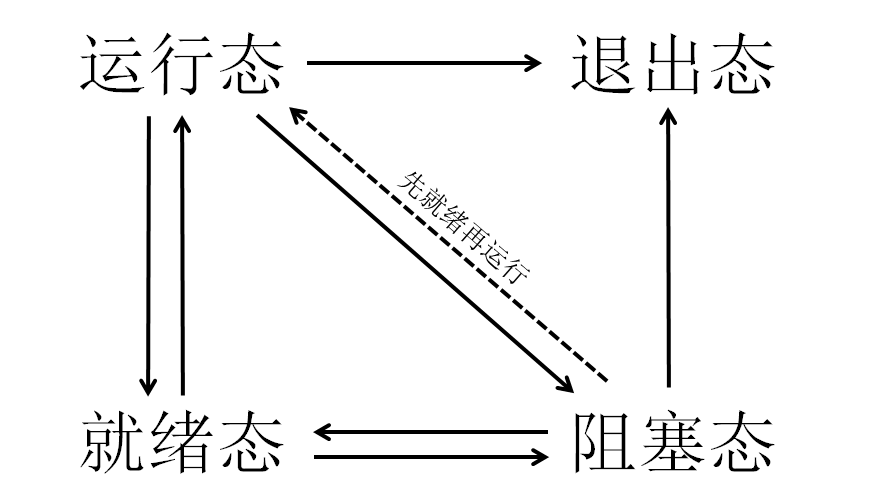
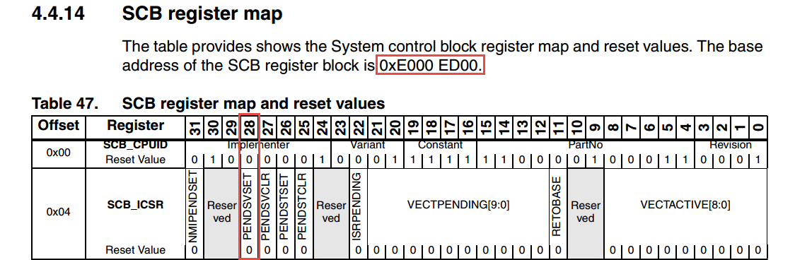
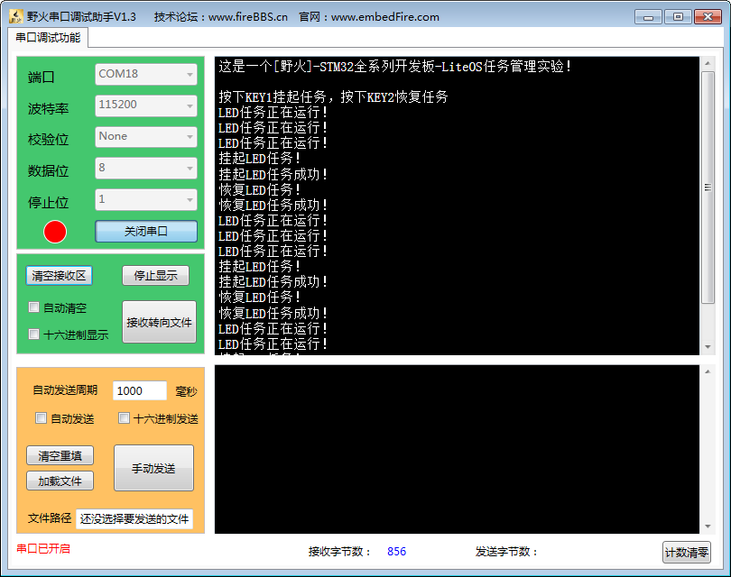

.. vim: syntax=rst

任务管理
===========

任务管理是LiteOS的核心组成部分，本章主要介绍任务及调度器相关的概念，分析任务相关函数的实现过程。

基本概念
~~~~~~~~

任务的基本概念
^^^^^^^^^^^^^^^^^^

从系统的角度看，任务是竞争系统资源的最小运行单元。LiteOS是一个支持多任务的操作系统。在LiteOS中，任务可以使用CPU、内存
空间等系统资源，并独立于其他任务运行。理论上任何数量的任务都可以共享同一个优先级，处于就绪态的多个最高优先级任务将会以
时间片切换的方式共享CPU。

简而言之： LiteOS的任务可认为是一系列独立任务的集合，每个任务在独立的环境中运行。在任何时刻，有且只有一个任务处于运行态，
由LiteOS调度器决定哪个任务可以运行。调度器的主要职责是找到处于就绪态的最高优先级任务，并且在任务切入切出时保存任务上下
文内容（寄存器值、任务栈数据），为了实现这点，LiteOS的每个任务都需要有独立的任务栈，当任务切出时，它的上下文环境会被保
存在任务栈中，当任务恢复运行时，就能从任务栈中正确的恢复上次的运行环境。系统的任务越多，整需要SRAM就越大，一个系统能够
运行多少个任务，取决于系统的SRAM大小。

任务享有独立的栈空间，系统决定任务的状态，它表示任务是否可以运行，同时还能使用内核的IPC通信资源，实现中断与任务、任务与任务之间的通信。

LiteOS支持抢占式调度机制，高优先级的任务可打断低优先级任务，低优先级任务必须在高优先级任务阻塞或结束后才能得到调度，同
时LiteOS也支持时间片轮转调度机制。

任务通常会运行在一个死循环中不会退出，如果一个任务不再需要运行时，可以调用LiteOS中的任务删除函数将其删除。

LiteOS的任务默认有32个优先级(0-31)，最高优先级为0，最低优先级为31。

任务调度器的基本概念
^^^^^^^^^^^^^^^^^^^^^^^

LiteOS中提供的任务调度器是基于优先级的全抢占式调度：在系统中除了中断处理函数、调度器上锁和处于临界段中的情况是不可抢占之外，
系统的其他部分都是可以抢占的。系统默认可以支持32个优先级(0～31)，优先级数值越大的任务优先级越低，31为最低优先级，分配给空闲
任务使用，一般不建议用户来使用这个优先级。在一些资源比较紧张的系统中，可以根据实际情况选择系统支持的任务优先级个数，创建合适
的任务，以节约内存资源。在系统中，当有比当前任务优先级更高的任务就绪时，当前任务将立刻被切出，高优先级任务抢占处理器运行。

LiteOS内核中也允许创建相同优先级的任务，相同优先级的任务采用时间片轮转方式进行调度（也就是通常说的分时调度器），时间片轮转
调度仅在当前系统有多个最高优先级就绪任务存在的情况下才有效。为了保证系统的实时性，系统尽最大可能地保证高优先级的任务得以运行，
任务调度的原则是一旦任务状态发生了改变，并且当前运行的任务优先级小于就绪列表中最高优先级任务时，立刻进行任务切换（除非当前系
统处于中断处理程序中或禁止任务切换的状态）。

任务状态的概念
^^^^^^^^^^^^^^^^^^

LiteOS系统中的任务都有多种运行状态。系统初始化完成后，创建的任务就可以在系统中竞争资源，由内核进行调度。

任务状态通常分为以下四种。

    1. 就绪态（Ready）：该任务处于就绪列表中，就绪的任务已经具备执行的能力，只等待调度器进行调度，新创建的任务会被初始化为该状态。

    2. 运行态（Running）：该状态表明任务正在执行，此时它占用处理器，LiteOS调度器选择运行的永远是处于最高优先级的就绪态任务，当任务被运行的一刻，它的任务状态就变成了运行态。

    3. 阻塞态（Blocked）：如果任务当前正在等待某个时序或外部中断，那么该任务处于阻塞状态，它不处于就绪列表中，无法得到调度器的调度。阻塞态包含任务被挂起、任务被延时、任务正在等待信号量、读写队列或者等待读写事件等。

    4. 退出态（Dead）：该任务运行结束，等待系统回收资源。

任务状态迁移
^^^^^^^^^^^^^^

LiteOS系统中的每一个任务都有多种运行状态，它们之间的转换关系是怎么样的呢？从运行态任务变成阻塞态，或者从阻塞态变成就绪态，这些任务状
态是怎么迁移的呢，下面就一起了解任务状态迁移吧，如 任务状态示意图_ 所示。

-   创建任务→就绪态：任务创建完成后进入就绪态，表明任务已准备就绪，随时可以运行，只等待调度器进行调度。

-   就绪态→运行态：任务创建后进入就绪态，发生任务切换时，就绪列表中最高优先级的任务被执行，从而进入运行态，但此刻该任务依旧在就绪列表中。

-   运行态→就绪态：有更高优先级任务创建或者恢复后，会发生任务调度，此刻就绪列表中最高优先级任务变为运行态，而原先运行的
    任务由运行态变为就绪态，仍处于就绪列表中，等待最高优先级的任务运行完毕后继续运行（CPU使用权被更高优先级的任务抢占了）。

-   运行态→阻塞态：正在运行的任务发生阻塞（挂起、延时、读信号量等待）时，该任务会从就绪列表中删除。任务状态由运行态变成阻塞态，
    然后发生任务切换，系统运行就绪列表中最高优先级任务。

-   阻塞态→就绪态（阻塞态→运行态）：阻塞的任务被恢复后（任务恢复、延时时间超时、读信号量超时或读到信号量等），此时被恢复的任务会
    被加入就绪列表，从而由阻塞态变成就绪态；如果此时被恢复任务的优先级高于正在运行任务的优先级，则会发生任务切换，将该任务将再次
    转换任务状态，由就绪态变成运行态。

-   就绪态→阻塞态：任务也有可能在就绪态时被阻塞（挂起），此时任务状态会由就绪态变为阻塞态，该任务从就绪列表中删除，不会参与系统调
    度，直到该任务被恢复就绪态。

-   运行态、阻塞态→退出态：调用系统中删除任务的函数，无论是处于何种状态的任务都将变为退出态。

常用的任务函数讲解
~~~~~~~~~~~~~~~~~~~~~~~

任务创建函数LOS_TaskCreate()
^^^^^^^^^^^^^^^^^^^^^^^^^^^^^^^^^^^^

在前面的章节中，本书已经讲解了任务创建函数的使用，而未分析LOS_TaskCreate()的源码，那么LiteOS中任务创建函数LOS_TaskCreate()是如何实
现的呢？如 代码清单:任务管理-1_ 所示。

.. code-block:: c
    :caption: 代码清单:任务管理-1任务创建函数LOS_TaskCreate()源码
    :name: 代码清单:任务管理-1
    :linenos:

    LITE_OS_SEC_TEXT_INIT UINT32 LOS_TaskCreate(UINT32 *puwTaskID,
                    TSK_INIT_PARAM_S *pstInitParam){
        UINT32 uwRet = LOS_OK;
        UINTPTR uvIntSave;
        LOS_TASK_CB *pstTaskCB;					(1)

        uwRet = LOS_TaskCreateOnly(puwTaskID, pstInitParam);		(2)
        if (LOS_OK != uwRet) {
            return uwRet;
        }
        pstTaskCB = OS_TCB_FROM_TID(*puwTaskID);			(3)

        uvIntSave = LOS_IntLock();
        pstTaskCB->usTaskStatus &= (~OS_TASK_STATUS_SUSPEND);
        pstTaskCB->usTaskStatus |= OS_TASK_STATUS_READY;		(4)

    #if (LOSCFG_BASE_CORE_CPUP == YES)
        g_pstCpup[pstTaskCB->uwTaskID].uwID = pstTaskCB->uwTaskID;
        g_pstCpup[pstTaskCB->uwTaskID].usStatus = pstTaskCB->usTaskStatus;
    #endif

        osPriqueueEnqueue(&pstTaskCB->stPendList, pstTaskCB->usPriority); (5)
        g_stLosTask.pstNewTask = LOS_DL_LIST_ENTRY(osPriqueueTop(),
                    LOS_TASK_CB, stPendList);
        if ((g_bTaskScheduled) && (g_usLosTaskLock == 0)) {
            if (g_stLosTask.pstRunTask != g_stLosTask.pstNewTask) {		(6)
                if (LOS_CHECK_SCHEDULE) {
                    (VOID)LOS_IntRestore(uvIntSave);
                    osSchedule();						(7)
                    return LOS_OK;
                }
            }
        }

        (VOID)LOS_IntRestore(uvIntSave);
        return LOS_OK;						(8)
    }

-   代码清单:任务管理-1_ **(1)**\ ：定义一个新创建任务的任务控制块结构体指针，用于保存新创建任务的任务信息。

-   代码清单:任务管理-1_  **(2)**\ ：调用 LOS_TaskCreateOnly()函数进行任务的创建并且阻塞任务，该函数仅创建任务，而不
    配置任务状态信息，参数puwTaskID是任务的ID的指针，指向用户定义任务ID变量的地址，在创建任务成功后将通过该指针返回一个任务ID给用户，
    任务配置与pstInitParam一致，在创建新任务时，会对之前已删除任务的任务控制块和任务栈进行回收。

-   代码清单:任务管理-1_  **(3)**\ ：通过任务ID获取对应任务控制块的信息。

-   代码清单:任务管理-1_  **(4)**\ ：将新创建的任务从阻塞态中解除，然后将任务状态设置为就绪态，这步操作之后任务状态由新创建的阻塞态变
    为就绪态（Ready），表明任务可以参与系统调度。

-   代码清单:任务管理-1_  **(5)**\ ：首先获取新创建任务的优先级，并且将任务按照优先级顺序插入任务就绪列表。

-   代码清单:任务管理-1_  **(6)**\ ：如果开启了任务调度，并且调度器没有被上锁，则进行第二次判断：如果新建的任务优先级比当前的任务优先级
    更高，则进行一次任务调度，否则将返回任务创建成功\ **(8)**\ 。

-   代码清单:任务管理-1_  **(7)**\ ：如果满足了\ **(6)** 中的条件，则进行任务的调度，任务的调度是用汇编
    代码实现的，如 代码清单:任务管理-2_ 所示，然后返回任务创建成功。

.. code-block::
    :caption: 代码清单:任务管理-2 LiteOS任务调度的实现
    :name: 代码清单:任务管理-2
    :linenos:

    OS_NVIC_INT_CTRL             EQU     0xE000ED04
    OS_NVIC_PENDSVSET           EQU     0x10000000

    osTaskSchedule
        LDR     R0, =OS_NVIC_INT_CTRL
        LDR     R1, =OS_NVIC_PENDSVSET
        STR     R1, [R0]
        BX      LR

在Cortex-M系列处理器中，LiteOS的调度是利用PendSV进行任务调度的，LiteOS向0xE000ED04这个地址写入0x10000000，
即将SCB寄存器的第28位置1，触发PendSV中断，真正的任务切换是在PendSV中断中进行的，如图 任务调度将PendSV置1_ 所示。

任务删除函数LOS_TaskDelete()
^^^^^^^^^^^^^^^^^^^^^^^^^^^^^^^^^^^^^^^^^^^^^^^^^^^

在LiteOS中支持显式删除任务，当任务不需要的时候，可以删除它，例如，在“小心翼翼，十分谨慎”法启动流程中，就是对启
动任务进行了删除操作，因为系统只需要运行一次该任务，删除任务后，LiteOS会回收任务的相关资源，任务删除的实现过程如 代码清单:任务管理-3_ 所示。

.. code-block:: c
    :caption: 代码清单:任务管理-3任务删除函数 LOS_TaskDelete()源码
    :name: 代码清单:任务管理-3
    :linenos:

    LITE_OS_SEC_TEXT_INIT UINT32 LOS_TaskDelete(UINT32 uwTaskID)
    {
        UINTPTR uvIntSave;
        LOS_TASK_CB *pstTaskCB;
        UINT16 usTempStatus;
        UINT32 uwErrRet = OS_ERROR;

        CHECK_TASKID(uwTaskID);
        uvIntSave = LOS_IntLock();

        pstTaskCB = OS_TCB_FROM_TID(uwTaskID);

        usTempStatus = pstTaskCB->usTaskStatus;

        if (OS_TASK_STATUS_UNUSED & usTempStatus) {			(1)
            uwErrRet = LOS_ERRNO_TSK_NOT_CREATED;
            OS_GOTO_ERREND();
        }

        if ((OS_TASK_STATUS_RUNNING & usTempStatus)
                && (g_usLosTaskLock != 0)) {  (2)
        PRINT_INFO("In case of task lock,task deletion is not recommended\n");
            g_usLosTaskLock = 0;
        }

        if (OS_TASK_STATUS_READY & usTempStatus) {			(3)
            osPriqueueDequeue(&pstTaskCB->stPendList);
            pstTaskCB->usTaskStatus &= (~OS_TASK_STATUS_READY);
        } else if ((OS_TASK_STATUS_PEND & usTempStatus)
                || (OS_TASK_STATUS_PEND_QUEUE & usTempStatus)) {
                    LOS_ListDelete(&pstTaskCB->stPendList);	(4)
        }
        if ((OS_TASK_STATUS_DELAY | OS_TASK_STATUS_TIMEOUT) & usTempStatus) {
            osTimerListDelete(pstTaskCB);				(5)
        }

        pstTaskCB->usTaskStatus &= (~(OS_TASK_STATUS_SUSPEND));
        pstTaskCB->usTaskStatus |= OS_TASK_STATUS_UNUSED;
        pstTaskCB->uwEvent.uwEventID = 0xFFFFFFFF;
        pstTaskCB->uwEventMask = 0;

        g_stLosTask.pstNewTask = LOS_DL_LIST_ENTRY(osPriqueueTop(),
                        LOS_TASK_CB, stPendList); 	(6)

        if (OS_TASK_STATUS_RUNNING & pstTaskCB->usTaskStatus) {	(7)
            LOS_ListTailInsert(&g_stTskRecyleList, &pstTaskCB->stPendList);
            g_stLosTask.pstRunTask = &g_pstTaskCBArray[g_uwTskMaxNum];
            g_stLosTask.pstRunTask->uwTaskID = uwTaskID;
            g_stLosTask.pstRunTask->usTaskStatus = pstTaskCB->usTaskStatus;
            g_stLosTask.pstRunTask->uwTopOfStack = pstTaskCB->uwTopOfStack;
            g_stLosTask.pstRunTask->pcTaskName = pstTaskCB->pcTaskName;
            pstTaskCB->usTaskStatus = OS_TASK_STATUS_UNUSED;
            (VOID)LOS_IntRestore(uvIntSave);
            osSchedule();
            return LOS_OK;
        } else {
            pstTaskCB->usTaskStatus = OS_TASK_STATUS_UNUSED;		(8)
            LOS_ListAdd(&g_stLosFreeTask, &pstTaskCB->stPendList);	(9)
            (VOID)LOS_MemFree(m_aucSysMem0, (VOID *)pstTaskCB->uwTopOfStack);(10)
            pstTaskCB->uwTopOfStack = (UINT32)NULL;			(11)
        }

        (VOID)LOS_IntRestore(uvIntSave);
        return LOS_OK;						(12)

    LOS_ERREND:
        (VOID)LOS_IntRestore(uvIntSave);
        return uwErrRet;						(13)
    }

-   代码清单:任务管理-3_ **(1)**\ ：如果要删除的任务的任务状态是OS_TASK_STATUS_UNUSED，表示任务尚未创建，系统无法删除，将返回错误代码LOS_ERRNO_TSK_NOT_CREATED。

-   代码清单:任务管理-3_ **(2)**\ ：如果要删除的任务正在运行且调度器已经被上锁，系统会将任务解锁，g_usLosTaskLock 被设置为0，然后接着进行删除操作。

-   代码清单:任务管理-3_ **(3)**\ ：如果要删除的任务在就绪态，那么LiteOS会将要删除的任务从就绪列表中移除，并且取消任务的就绪状态。

-   代码清单:任务管理-3_ **(4)**\ ：如果要删除的任务在阻塞态或者任务在队列中被阻塞，那么LiteOS会将要删除的任务从阻塞列表中删除。

-   代码清单:任务管理-3_ **(5)**\ ：如果要删除的任务正在处于延时状态或者任务正在等待信号量/事件等阻塞超时状态，那么LiteOS将从延时列表中删除任务。

-   代码清单:任务管理-3_ **(6)**\ ：系统重新在就绪列表中寻找处于就绪态的最高优先级任务，保证系统能正常运行，因为如果删除的任务是下一个即将要切换的任务，那
    么删除之后系统将无法正常进行任务切换。

-   代码清单:任务管理-3_ **(7)**\ ：如果删除的任务是当前正在运行的任务，因为删除任务以后要调度新的任务运行，而调度的过程需要当前任务的参与，所以还不能直接
    将当前任务彻底删除掉，只是将任务添加到系统的回收列表中（g_stTskRecyleList），在创建任务的时候将回收列表中的任务进行回收，而当前任务需要继续执行，直到
    系统调度完成，就完成了当前任务的使命。

-   代码清单:任务管理-3_ **(8)**\ ：如果被删除的任务不是当前任务，那么直接将任务状态变为未使用状态。

-   代码清单:任务管理-3_ **(9)**\ ：将任务控制块插入系统可用任务链表中，为了以后能再创建任务，系统支持的任务个数是有限的，当删除了一个任务之后，就要归还，
    否则当系统可用任务链表中没有可用的任务控制块，那么就不能创建任务了，因为任务控制块的内存控制在系统初始化的时候就已经分配了。

-   代码清单:任务管理-3_ **(10)**\ ：将任务控制块的内存进行释放，回收利用。

-   代码清单:任务管理-3_ **(11)**\ ：将任务的栈顶指针指向NULL。

-   代码清单:任务管理-3_ **(12)-(13)**\ ：如果删除成功则返回LOS_OK，否则将返回错误代码。

任务延时函数LOS_TaskDelay()
^^^^^^^^^^^^^^^^^^^^^^^^^^^^^^^^^^^^^^^^^^^^^^^

延时函数是在使用操作系统的时候是经常用到的函数，延时函数的作用是将调用延时函数的任务进入阻塞态而放弃CPU 的使用权，
这样子系统中其他任务优先级较低的任务就能完成获得CPU的使用权。否则的话，高优先级任务一直占用CPU，导致系统无法进行
任务切换，比它优先级低的任务将永远得不到运行，延时的基本单位为Tick，配置LOSCFG_BASE_CORE_TICK_PER_SECOND宏定义
即可改变系统节拍，如果LOSCFG_BASE_CORE_TICK_PER_SECOND配置为1000，那么一个Tick为1ms，延时函数的实现方式如 代码清单:任务管理-4_ 所示。

.. code-block:: c
    :caption:  代码清单:任务管理-4 任务延时函数LOS_TaskDelay()源码
    :name: 代码清单:任务管理-4
    :linenos:

    LITE_OS_SEC_TEXT UINT32 LOS_TaskDelay(UINT32 uwTick)
    {
        UINTPTR uvIntSave;

        if (OS_INT_ACTIVE) {					(1)
            return LOS_ERRNO_TSK_DELAY_IN_INT;
        }

        if (g_usLosTaskLock != 0) {				(2)
            return LOS_ERRNO_TSK_DELAY_IN_LOCK;
        }

        if (uwTick == 0) {						(3)
            return LOS_TaskYield();
        } else {
        uvIntSave = LOS_IntLock();
        osPriqueueDequeue(&(g_stLosTask.pstRunTask->stPendList)); (4)
        g_stLosTask.pstRunTask->usTaskStatus &= (~OS_TASK_STATUS_READY);
        osTaskAdd2TimerList((LOS_TASK_CB *)g_stLosTask.pstRunTask,uwTick);
        g_stLosTask.pstRunTask->usTaskStatus |= OS_TASK_STATUS_DELAY;
        (VOID)LOS_IntRestore(uvIntSave);
        LOS_Schedule();					(5)
        }

        return LOS_OK;
    }

-   代码清单:任务管理-4_  **(1)**\ ：如果在中断中进行延时，这将是非法的，LiteOS会返回错误代码，因为LiteOS不允许在中断中调用延时操作。

-   代码清单:任务管理-4_  **(2)**\ ：如果在调度器被锁定时进行延时，这也是非法的，因为延时操作需要依赖调度器的调度， 因此LiteOS也会返回错误代码。

-   代码清单:任务管理-4_  **(3)**\ ：如果要进行0个Tick的延时，那么当前任务将主动放弃CPU的使用权，进行一次强制切换任务。

-   代码清单:任务管理-4_  **(4)-(5)**\ ：如果任务可以进行延时，LiteOS将调用延时函数的任务从就绪列表中删除，同时将该任务的任务状态从就绪态中
    解除；然后将该任务添加到延时链表中，最后将任务的状态变为延时状态（阻塞态），当延时的时间到达，任务将从阻塞态直接变为就绪态，最后，LiteOS
    进行一次任务的切换，再返回LOS_OK表示延时成功。

注意，在每个任务的循环中必须要有阻塞的出现，否则，比该任务优先级低的任务是永远无法获得CPU的使用权的。

任务挂起函数LOS_TaskSuspend()
^^^^^^^^^^^^^^^^^^^^^^^^^^^^^^^^^^^^^^^^^^^^^^^^^^^^

LiteOS支持挂起指定任务，被挂起的任务不会得到CPU使用权，不管该任务具有什么优先级。

调用LOS_TaskSuspend()函数挂起任务的次数是不会累计的：即使多次调用LOS_TaskSuspend()函数将一个任务挂起，也只需调用一次任
务恢复函数LOS_TaskResume()就能使挂起的任务解除挂起状态。任务挂起是经常使用的一个函数，如果读者想要某个任务长时间不需要执
行的时候，就可以使用LOS_TaskSuspend()函数将该任务挂起，任务挂起函数的源码实现如 代码清单:任务管理-5_ 所示。

.. code-block:: c
    :caption:  代码清单:任务管理-5任务挂起函数LOS_TaskSuspend()源码
    :name: 代码清单:任务管理-5
    :linenos:

    LITE_OS_SEC_TEXT_INIT UINT32 LOS_TaskSuspend(UINT32 uwTaskID)
    {
        UINTPTR uvIntSave;
        LOS_TASK_CB *pstTaskCB;
        UINT16 usTempStatus;
        UINT32 uwErrRet = OS_ERROR;

        CHECK_TASKID(uwTaskID);
        pstTaskCB = OS_TCB_FROM_TID(uwTaskID);			(1)
        uvIntSave = LOS_IntLock();
        usTempStatus = pstTaskCB->usTaskStatus;
        if (OS_TASK_STATUS_UNUSED & usTempStatus) {			(2)
            uwErrRet = LOS_ERRNO_TSK_NOT_CREATED;
            OS_GOTO_ERREND();
        }

        if (OS_TASK_STATUS_SUSPEND & usTempStatus) {		(3)
            uwErrRet = LOS_ERRNO_TSK_ALREADY_SUSPENDED;
            OS_GOTO_ERREND();
        }

        if((OS_TASK_STATUS_RUNNING & usTempStatus)&&(g_usLosTaskLock != 0)) {
            uwErrRet = LOS_ERRNO_TSK_SUSPEND_LOCKED;		(4)
            OS_GOTO_ERREND();
        }

        if (OS_TASK_STATUS_READY & usTempStatus) {			(5)
            osPriqueueDequeue(&pstTaskCB->stPendList);		(6)
            pstTaskCB->usTaskStatus &= (~OS_TASK_STATUS_READY);	(7)
        }

        pstTaskCB->usTaskStatus |= OS_TASK_STATUS_SUSPEND;		(8)
        if (uwTaskID == g_stLosTask.pstRunTask->uwTaskID) {
            (VOID)LOS_IntRestore(uvIntSave);
            LOS_Schedule();					(9)
            return LOS_OK;
        }

        (VOID)LOS_IntRestore(uvIntSave);
        return LOS_OK;

    LOS_ERREND:
        (VOID)LOS_IntRestore(uvIntSave);
        return uwErrRet;
    }

-   代码清单:任务管理-5_  **(1)**\ ：根据任务ID获取对应的任务控制块。

-   代码清单:任务管理-5_  **(2)**\ ：判断要挂起任务的状态，如果是未使用状态，就返回错误代码。

-   代码清单:任务管理-5_  **(3)**\ ：判断要挂起任务的状态，如果该任务已经被挂起了，会返回错误代码，用户可以在恢复任务后再挂起。

-   代码清单:任务管理-5_  **(4)**\ ：如果任务运行中并且调度器已经被上锁了，那么也无法进行挂起任务，返回错误代码。

-   代码清单:任务管理-5_  **(5)**\ ：如果任务处于就绪态，则可以进行挂起任务。

-   代码清单:任务管理-5_  **(6)**\ ：将任务从就绪列表中删除。

-   代码清单:任务管理-5_  **(7)**\ ：将任务从就绪态中解除。

-   代码清单:任务管理-5_  **(8)**\ ：将任务的状态变为挂起态。

-   代码清单:任务管理-5_  **(9)**\ ：进行一次任务调度。

任务恢复函数LOS_TaskResume()
^^^^^^^^^^^^^^^^^^^^^^^^^^^^^^^^^^^^^^^^^^^^^^^^^^^

任务恢复就是让挂起的任务重新进入就绪状态，恢复的任务会保留挂起前的状态信息，在恢复的时候继续运行。如果被恢复任务在所有
就绪态任务中，处于系统中的最高优先级，那么系统将进行一次任务切换。任务恢复函数LOS_TaskResume()的源码实现如 代码清单:任务管理-6_ 所示。

.. code-block:: c
    :caption:  代码清单:任务管理-6任务恢复函数LOS_TaskResume()源码
    :name: 代码清单:任务管理-6
    :linenos:

    LITE_OS_SEC_TEXT_INIT UINT32 LOS_TaskResume(UINT32 uwTaskID)
    {
        UINTPTR uvIntSave;
        LOS_TASK_CB *pstTaskCB;
        UINT16 usTempStatus;
        UINT32 uwErrRet = OS_ERROR;

        if (uwTaskID > LOSCFG_BASE_CORE_TSK_LIMIT) {		(1)
            return LOS_ERRNO_TSK_ID_INVALID;
        }

        pstTaskCB = OS_TCB_FROM_TID(uwTaskID);			(2)
        uvIntSave = LOS_IntLock();
        usTempStatus = pstTaskCB->usTaskStatus;

        if (OS_TASK_STATUS_UNUSED & usTempStatus) {			(3)
            uwErrRet = LOS_ERRNO_TSK_NOT_CREATED;
            OS_GOTO_ERREND();
        } else if (!(OS_TASK_STATUS_SUSPEND & usTempStatus)) {	(4)
            uwErrRet = LOS_ERRNO_TSK_NOT_SUSPENDED;
            OS_GOTO_ERREND();
        }

        pstTaskCB->usTaskStatus &= (~OS_TASK_STATUS_SUSPEND);	(5)
        if (!(OS_CHECK_TASK_BLOCK & pstTaskCB->usTaskStatus) ) {
            pstTaskCB->usTaskStatus |= OS_TASK_STATUS_READY;		(6)
            osPriqueueEnqueue(&pstTaskCB->stPendList, pstTaskCB->usPriority);
            if (g_bTaskScheduled) {				(7)
                (VOID)LOS_IntRestore(uvIntSave);
                LOS_Schedule();					(8)
                return LOS_OK;
            }
            g_stLosTask.pstNewTask = LOS_DL_LIST_ENTRY(osPriqueueTop(),
                            LOS_TASK_CB, stPendList);
    }
        (VOID)LOS_IntRestore(uvIntSave);
        return LOS_OK;

    LOS_ERREND:
        (VOID)LOS_IntRestore(uvIntSave);
        return uwErrRet;
    }

-   代码清单:任务管理-6_  **(1)**\ ：判断任务ID是否有效，如果无效则返回错误代码。

-   代码清单:任务管理-6_  **(2)**\ ：根据任务ID获取任务控制块。

-   代码清单:任务管理-6_  **(3)**\ ：判断要恢复任务的状态，如果是未使用状态，返回错误代码。

-   代码清单:任务管理-6_  **(4)**\ ：判断要恢复任务的状态，如果是未挂起状态，那就无需恢复了，也会返回错误代码。

-   代码清单:任务管理-6_  **(5)**\ ：经过前面的代码的判断，可以确认任务已经是挂起的，那么可以恢复任务，将任务的状态从阻塞态解除。

-   代码清单:任务管理-6_  **(6)**\ ：将任务状态变成就绪态。

-   代码清单:任务管理-6_  **(7)**\ ：将任务按照本身的优先级数值添加到就绪列表中。

-   代码清单:任务管理-6_  **(8)**\ ：如果调度器已经运行了，则发起一次任务调度，在任务调度中会寻找处于就绪态的最高优先级
    任务，如果被恢复的任务刚好是就绪态任务中的最高优先级，那么系统会立即运行该任务。

常用Task错误代码说明
~~~~~~~~~~~~~~~~~~~~~~~~

在LiteOS中，与任务相关的函数大多数都会有返回值，其返回值是一些错误代码，方便用户进行调试，本书将列出一些常见的错误
代码与参考解决方案，如表 常用Task函数返回的错误代码说明_ 所示。

.. list-table::
   :widths: 25 25 25 25
   :name: 常用Task函数返回的错误代码说明
   :header-rows: 0

   * - 序号
     - 定义
     - 描述
     - 参考解决方案

   * - 1
     - LOS_ERRNO_TSK_NO_MEMORY
     - 内存空间不足
     - 分配更大内存

   * - 2
     - LOS_ERRNO_TSK_PTR_NULL
     - 任务参数为空
     - 检查任务数

   * - 3
     - LOS_ERRNO_TSK_STKSZ_NOT_ALIGN
     - 任务栈未对齐
     - 对齐任务栈

   * - 4
     - LOS_ERRNO_TSK_PRIOR_ERROR
     - 不正确的任务优先级
     - 检查任务优先级

   * - 5
     - LOS_ERR NO_TSK_ENTRY_NULL
     - 任务入口函数为空定义任务入口
     - 定义任务入口函数

   * - 6
     - LOS_ERR NO_TSK_NAME_EMPTY
     - 任务名为空
     - 设置任名

   * - 7
     - LOS_ERRNO_TSK_STKSZ_TOO_SMALL
     - 任务栈太小
     - 扩大任务栈

   * - 8
     - LOS_ERR NO_TSK_ID_INVALID
     - 无效的任务ID
     - 检查任务ID

   * - 9
     - LOS_ERRNO_TSK_ALREADY_SUSPENDED
     - 任务已经被挂起
     - 等待这个任被恢复后，再尝试去挂起这个任务

   * - 10
     - LOS_ERRNO_TSK_NOT_SUSPENDED
     - 任务未被挂起
     - 挂起这个任务

   * - 11
     - LOS_ERRNO_TSK_NOT_CREATED
     - 任务未被创建
     - 创建这个任务

   * - 12
     - LOS_ERRNO_TSK_DELETE_LOCKED
     - 删除任务时，任务处于被锁状态
     - 等待解锁任务之后再进行删除操作

   * - 13
     - LOS_ERRNO_TSK_MSG_NONZERO
     - 任务信息非零
     - 暂不使用该错误代码

   * - 14
     - LOS_ERRNO_TSK_DELAY_IN_INT
     - 中断期间，进行任务延时
     - 等待退出中断后再进行延时操作

   * - 15
     - LOS_ERRNO_TSK_DELAY_IN_LOCK
     - 任务被锁的状态下，进行延时
     - 等待解锁任务之后再进行延时操作

   * - 16
     - LOS_ERRNO_TSK_YIELD_INVALID_TASK
     - 将被排入行程的任务是无效的
     - 检查这个任务

   * - 17
     - LOS_ERRNO_TSK_YIELD_NOT_ENOUGH_TASK
     - 没有或者仅有一个可用任务能进行行程安排
     - 增加任务数

   * - 18
     - LOS_ERRNO_TSK_TCB_UNAVAILABLE
     - 没有空闲的任务控制块可用
     - 增加任务控制块数量

   * - 19
     - LOS_ERRNO_TSK_HOOK_NOT_MATCH
     - 任务的钩子函数不匹配
     - 暂不使用该错误代码

   * - 20
     - LOS_ERRNO_TSK_HOOK_IS_FULL
     - 任务的钩子函数数量超过界限
     - 暂不使用该错误代码

   * - 21
     - LOS_ERRNO_TSK_OPERATE_IDLE
     - 这是个IDLE任务
     - 检查任务ID，不要试图操作IDLE任务

   * - 22
     - LOS_ERRNO_TSK_SUSPEND_LOCKED
     - 将被挂起的任务处于被锁状态
     - 等待任务解锁后再尝试挂起任务

   * - 23
     - LOS_ERRNO_TSK_FREE_STACK_FAILED
     - 任务栈free失败
     - 该错误代码暂不使用

   * - 24
     - LOS_ERRNO_TSK_STKAREA_TOO_SMALL
     - 任务栈区域太小
     - 该错误代码暂不使用

   * - 25
     - LOS_ERRNO_TSK_ACTIVE_FAILED
     - 任务触发失败
     - 创建一个IDLE任务后执行任务转换

   * - 26
     - LOS_ERRNO_TSK_CONFIG_TOO_MANY
     - 过多的任务配置项
     - 该错误代码暂不使用

   * - 27
     - LOS_ERRNO_TSK_STKSZ_TOO_LARGE
     - 任务栈大小设置过大
     - 减小任务栈大小

   * - 28
     - LOS_ERRNO_TSK_SUSPEND_SWTMR_NOT_ALLOWED
     - 不允许挂起软件定时器任务
     - 检查任务ID, 不要试图挂起软件定时器任务

常用任务函数的使用方法
~~~~~~~~~~~~~~~~~~~~~~~~~~

任务创建函数LOS_TaskCreate()
^^^^^^^^^^^^^^^^^^^^^^^^^^^^^^^^^^^^^^^^^^^^^^^^^^^

LOS_TaskCreate()函数原型如 代码清单:任务管理-7_ 所示。创建任务函数是创建每个独立任务的时候是必须使用的，在使用函数的时候，需要
提前定义任务ID变量，并且要自定义实现任务创建的pstInitParam，如 代码清单:任务管理-8_ 高亮部分所示。如果任务创建成功，则返回LOS_OK，
否则返回对应的错误代码。

.. code-block:: c
    :caption:  代码清单:任务管理-7LOS_TaskCreate()函数原型
    :name: 代码清单:任务管理-7
    :linenos:

    UINT32 LOS_TaskCreate(UINT32 \*puwTaskID, TSK_INIT_PARAM_S \*pstInitParam);

.. code-block:: c
    :caption:  代码清单:任务管理-8自定义实现任务的相关配置
    :emphasize-lines: 2-9
    :name: 代码清单:任务管理-8
    :linenos:

    UINT32 Test1_Task_Handle;		/* 定义任务ID变量 */
    TSK_INIT_PARAM_S task_init_param;	/* 自定义任务配置的相关参数 */

    task_init_param.usTaskPrio = 5;	/* 优先级，数值越小，优先级越高 */
    task_init_param.pcName = "Test1_Task";	/* 任务名，字符串形式，方便调试 */
    task_init_param.pfnTaskEntry = (TSK_ENTRY_FUNC)Test1_Task; /* 任务函数名 */
    task_init_param.uwStackSize = 0x1000;	/* 栈大小，单位为字，即4个字节 */

    uwRet = LOS_TaskCreate(&Test1_Task_Handle, &task_init_param);/* 创建任务 */

自定义任务配置的TSK_INIT_PARAM_S结构体在los_task.h中，其内部的配置参数具体作用如 代码清单:任务管理-9_ 所示，读者可以根
据自己的任务需要来配置，重要的任务优先级可以设置高一点，任务栈可以设置大一点，防止溢出导致系统崩溃，若指定的任
务栈大小为0，则系统使用配置项LOSCFG_BASE_CORE_TSK_DEFAULT_STACK_SIZE指定默认的任务栈大小，任务栈的大小按8字节大小对齐。

.. code-block:: c
    :caption:  代码清单:任务管理-9 TSK_INIT_PARAM_S结构体
    :name: 代码清单:任务管理-9
    :linenos:

    typedef struct tagTskInitParam {
        TSK_ENTRY_FUNC       pfnTaskEntry;       /**< 任务的入口函数    */
        UINT16               usTaskPrio;         /**< 任务优先级       */
        UINT32               uwArg;              /**< 任务参数（未使用） */
        UINT32               uwStackSize;        /**< 任务栈大小    */
        CHAR                 *pcName;            /**< 任务名字      */
        UINT32               uwResved;           /**< LiteOS保留未使用    */
    } TSK_INIT_PARAM_S;

任务删除函数LOS_TaskDelete()
^^^^^^^^^^^^^^^^^^^^^^^^^^^^^^^^^^^^^^^^^^^^^^^^^^^

任务删除函数是根据任务ID直接删除任务，任务控制块与任务栈将被系统回收，所有保存的信息都会被清空。uwTaskID是LOS_TaskDelete()
传入的任务ID，表示的是要删除哪个任务，如 代码清单:任务管理-10_ 所示。

.. code-block:: c
    :caption:  代码清单:任务管理-10任务删除函数LOS_TaskDelete()原型
    :name: 代码清单:任务管理-10
    :linenos:

    /**********************************************************************
    功能：LOS_TaskDelete
    描述：删除任务
    输入：uwTaskID ---任务ID
    输出：无
    返回：LOS_OK成功或失败时出现错误代码
    **********************************************************************/
    LITE_OS_SEC_TEXT_INIT UINT32 LOS_TaskDelete(UINT32 uwTaskID)

任务删除函数的实例：如 代码清单:任务管理-11_ 高亮部分所示，如果任务删除成功，则返回LOS_OK，否则返回其他错误代码。

.. code-block:: c
    :caption:  代码清单:任务管理-11 任务删除函数的用法
    :emphasize-lines: 3
    :name: 代码清单:任务管理-11
    :linenos:

    UINT32 uwRet = LOS_OK;/* 定义一个任务的返回类型，初始化为LOS_OK */

    uwRet = LOS_TaskDelete(Test_Task_Handle)
    if (uwRet != LOS_OK)
    {
        printf("任务删除失败\n");
    }

任务延时函数LOS_TaskDelay()
^^^^^^^^^^^^^^^^^^^^^^^^^^^^^^^^^^^^^^^^^^^^^^^

任务延时函数只有一个传入的参数uwTick，它的延时单位是Tick，支持传入0个Tick。读者根据实际情况对任务进行延时即可，其函数原型如 代码清单:任务管理-12_ 所示。

.. code-block:: c
    :caption:  代码清单:任务管理-12延时函数任务原型
    :name: 代码清单:任务管理-12
    :linenos:

    extern UINT32 LOS_TaskDelay(UINT32 uwTick);

任务延时函数有几点需要注意的地方，第一点：延时函数不允许在中断中使用；第二点：延时函数不允许在任务调度被锁定的时候使用；
第三点：如果传入0并且未锁定任务调度，则执行具有当前任务相同优先级的任务队列中的下一个任务，如果没有当前任务优先级的就绪
任务可用，则不会发生任务调度，并继续执行当前任务；第四点：不允许在系统初始化之前使用该函数；第五点：延时函数也是有返回
值的，如果使用时候发生错误，可以根据返回的错误代码来进行调整；第六点：这种延时并不精确。任务延时函数的使用方法如 代码清单:任务管理-13_ 高亮部分所示。

.. code-block:: c
    :caption:  代码清单:任务管理-13延时函数的使用方法
    :emphasize-lines: 6
    :name: 代码清单:任务管理-13
    :linenos:

    static void Test1_Task(void)
    {
        /* 每个任务都是无限循环 */
        while (1) {
            LED2_TOGGLE;  //LED2翻转
            LOS_TaskDelay(1000);   //1000个Tick 延时
        }
    }

任务挂起与恢复函数
^^^^^^^^^^^^^^^^^^^

任务的挂起与恢复函数在很多时候都是很有用的，比如想长时间暂停运行某个任务，但是又需要在其恢复的时候继续工作，那么是不可能
删除任务的，因为删除了任务的话，任务的所有的信息都是不可能恢复的。但是可以使用挂起任务函数，仅仅是将任务进入阻塞态，其内
部的资源都会保留在任务栈中，同时也不会参与任务的调度，当调用恢复函数的时候，整个任务立即从阻塞态进入就绪态，参与任务的调
度，如果该任务的优先级是当前就绪态优先级最高的任务，那么系统立即会进行一次任务切换，而恢复的任务将按照挂起前的任务状态继
续运行，从而达到需要的效果，注意，是继续运行，也就是说，挂起任务之前的任务状态信息，都会被系统保留下来，在恢复的瞬间，继
续运行，挂起任务与恢复任务的函数原型如 代码清单:任务管理-14_ 所示。

.. code-block:: c
    :caption:  代码清单:任务管理-14 挂起与恢复任务函数的原型
    :name: 代码清单:任务管理-14
    :linenos:

    /*
    * 暂停任务。
    * 此API用于挂起指定的任务，该任务将从就绪列表中删除。
    * 无法暂停正在运行和锁定的任务。
    * 无法暂停idle task和swtmr任务。
    */
    extern UINT32 LOS_TaskSuspend(UINT32 uwTaskID);

    /*
    * 恢复任务。
    * 此API用于恢复暂停的任务。
    * 如果任务被延迟或阻止，请恢复任务，而不将其添加到准备任务的队列中。
    * 如果在系统初始化后任务的优先级高于当前任务并且任务计划未锁定，则计划运行。
    */
    extern UINT32 LOS_TaskResume(UINT32 uwTaskID);

这两个任务函数的使用方法是根据传入的任务ID来挂起/恢复对应的任务，任务ID是每个任务的唯一识标，本书提供的例程将通过按键
来挂起与恢复LED任务，如 代码清单:任务管理-15_ 高亮部分所示。

.. code-block:: c
    :caption:  代码清单:任务管理-15 任务挂起与恢复的使用实例
    :emphasize-lines: 8,14
    :name: 代码清单:任务管理-15
    :linenos:

    static void Key_Task(void)
    {
        UINT32 uwRet = LOS_OK;/* 定义一个任务的返回类型，初始化为成功的返回值 */
        /* 任务都是一个无限循环，不能返回 */
        while (1) {/* KEY1 被按下 */
            if ( Key_Scan(KEY1_GPIO_PORT,KEY1_GPIO_PIN) == KEY_ON ) {
                printf("挂起LED1任务！\n");
                uwRet = LOS_TaskSuspend(LED_Task_Handle);/* 挂起LED任务 */
                if (LOS_OK == uwRet) {
                    printf("挂起LED1任务成功！\n");
                }/* KEY2 被按下 */
            } else if ( Key_Scan(KEY2_GPIO_PORT,KEY2_GPIO_PIN) == KEY_ON ) {
                printf("恢复LED1任务!\n");
                uwRet = LOS_TaskResume(LED_Task_Handle); /* 恢复LED任务 */
                if (LOS_OK == uwRet) {
                    printf("恢复LED1任务成功！\n");
                }
            }
            LOS_TaskDelay(20);                  /* 20Ticks扫描一次 */
        }
    }

任务的设计要点
~~~~~~~~~~~~~~~~~

作为一个嵌入式开发人员，要对自己设计的嵌入式系统要了如指掌，如任务的优先级信息、任务与中断的处理、任务的运行时间、逻
辑、状态等，才能设计出好的系统，因此在设计的时候需要根据需求制定框架，并且应该考虑以下几点因素：任务运行的上下文环境（
中断与任务）、空闲任务以及任务的执行时间合理设计。

1. 中断服务函数

中断服务函数是一种需要特别注意的上下文环境，它运行在非任务的执行环境下（一般为芯片的一种特殊运行模式），在这个上下文环境
中不能使用挂起当前任务的操作，不能有任何阻塞的操作，在中断中不允许调用带有阻塞机制的API函数。另外需要注意的是，中断服务程
序最好保持精简短小，快进快出，一般在中断服务函数中只做标记事件的发生，然后通知任务，让对应的处理任务去执行相关处理，因为
中断的优先级高于系统中任何任务，在中断处理时间过长，可能会导致整个系统任务无法正常运行。所以在设计的时候必须考虑中断的频
率、中断的处理时间等重要因素，以便配合对应中断处理任务的工作。

2. 普通任务

任务看似没有什么限制程序执行的因素，似乎所有的操作都可以执行。但是做为一个优先级明确的实时系统，如果一个任务中的程序出现
了死循环操作（此处的死循环是指没有阻塞机制的任务循环体），那么比该任务优先级低的任务都将无法执行，当然也包括了空闲任务，
因为没有阻塞的任务不会主动让出CPU，而低优先级的任务是不允许抢占高优先级任务的CPU的，而高优先级的任务可以抢占低优先级的
CPU，如此一来低优先级将无法运行，这种情况在实时操作系统中是必须注意的一点，所以在任务中不允许出现死循环。如果一个任务只
有就绪态而无阻塞态，势必会影响到其他低优先级任务的运行，所以在进行任务设计时，就应该保证任务在不活跃的时候，任务可
以进入阻塞态以让出CPU使用权，这就需要设计者明确知道什么情况下让任务进入阻塞态，保证低优先级任务可以正常运行。在实际设计
中，一般会将紧急的处理事件的任务优先级设置得高一些。

3. 空闲任务

空闲任务是LiteOS系统中没有其他工作进行时自动进入的系统任务。开发者可以通过宏定义LOSCFG_KERNEL_TICKLESS与
LOSCFG_KERNEL_RUNSTOP选择自己需要的特殊功能，如低功耗模式，睡眠模式等。不过需要注意的是，空闲任务是不允许阻塞也不允许被
挂起的，空闲任务是唯一一个不允许出现阻塞情况的任务，因为LiteOS需要保证系统永远都有一个可运行的任务。

4. 任务的执行时间

任务的执行时间一般是指两个方面，一是任务从开始到结束的时间，二是任务的周期。

在系统设计的时候这两个时间都需要用户去考虑清楚，例如，对于事件A对应的服务任务Ta，系统要求的实时响应指标是10ms，而Ta的最大
运行时间是1ms，那么10ms就是任务Ta的周期了，1ms则是任务的运行时间，简单来说任务Ta在10ms内完成对事件A的响应即可。此时，系统
中还存在着以50ms为周期的另一任务Tb，它每次运行的最大时间长度是100us。在这种情况下，即使把任务Tb的优先级抬到比Ta更高的位置，
对系统的实时性指标也没什么影响，因为即使在Ta的运行过程中，Tb抢占了Ta的资源，等到Tb执行完毕，消耗的时间也只不过是100us，还
是在事件A规定的响应时间内(10ms)，Ta能够安全完成对事件A的响应。但是假如系统中还存在任务Tc，其运行时间为20ms，假如将Tc的优
先级设置比Ta更高，那么在Ta运行的时候，突然间被Tc打断，等到Tc执行完毕，那Ta已经错过对事件A（10ms）的响应了，这是不允许的。
所以在设计的时候，必须考虑任务的时间，一般来说处理时间更短的任务优先级应设置更高一些
。

任务管理实验
~~~~~~~~~~~~~~~

任务管理实验是使用任务常用的函数进行一次实验，本书将在野火STM32开发板上进行该试验，实验将创建两个任务，一个是LED任务，另一个
是按键任务，LED任务的功能是显示任务运行的状态，而按键任务则是通过检测按键的按下情况来将LED任务的挂起/恢复，实验的源码如
代码清单:任务管理-16_ 高亮部分所示。

.. code-block:: c
    :caption:  代码清单:任务管理-16 任务管理实验源码
    :emphasize-lines: 32-33,158-166,173-198
    :name: 代码清单:任务管理-16
    :linenos:

    /***************************************************************
    * @file    main.c
    * @author  fire
    * @version V1.0
    * @date    2018-xx-xx
    * @brief   STM32全系列开发板-LiteOS！
    **************************************************************
    * @attention
    *
    * 实验平台:野火 F103-霸道 STM32 开发板
    * 论坛    :http://www.firebbs.cn
    * 淘宝    :http://firestm32.taobao.com
    *
    ***************************************************************
    */
    /* LiteOS 头文件 */
    #include "los_sys.h"
    #include "los_task.ph"
    /* 板级外设头文件 */
    #include "bsp_usart.h"
    #include "bsp_led.h"
    #include "bsp_key.h"

    /********************************* 任务ID *****************************/
    /*
    * 任务ID是一个从0开始的数字，用于索引任务，当任务创建完成之后，它就具有了一个任务ID
    * 以后要想操作这个任务都需要通过这个任务ID
    *
    */

    /* 定义任务ID变量 */
    UINT32 LED_Task_Handle;
    UINT32 Key_Task_Handle;

    /* 函数声明 */
    static UINT32 AppTaskCreate(void);
    static UINT32 Creat_LED_Task(void);
    static UINT32 Creat_Key_Task(void);

    static void LED_Task(void);
    static void Key_Task(void);
    static void BSP_Init(void);

    /***************************************************************
    * @brief  主函数
    * @param  无
    * @retval 无
    * @note   第一步：开发板硬件初始化
            第二步：创建App应用任务
            第三步：启动LiteOS，开始多任务调度，启动失败则输出错误信息
    **************************************************************/
    int main(void)
    {
    UINT32 uwRet = LOS_OK;  //定义一个任务创建的返回值，默认为创建成功

    /* 板载相关初始化 */
    BSP_Init();

    printf("这是一个[野火]-STM32全系列开发板-LiteOS任务管理实验！\n\n");
    printf("按下KEY1挂起任务，按下KEY2恢复任务\n");

    /* LiteOS 内核初始化 */
    uwRet = LOS_KernelInit();

    if (uwRet != LOS_OK) {
        printf("LiteOS 核心初始化失败！失败代码0x%X\n",uwRet);
        return LOS_NOK;
    }

    uwRet = AppTaskCreate();
    if (uwRet != LOS_OK) {
        printf("AppTaskCreate创建任务失败！失败代码0x%X\n",uwRet);
        return LOS_NOK;
    }

    /* 开启LiteOS任务调度 */
    LOS_Start();

    //正常情况下不会执行到这里
    while (1);
    }

    /*********************************************************************
    * @ 函数名  ： AppTaskCreate
    * @ 功能说明： 任务创建，为了方便管理，所有的任务创建函数都可以放在这个函数里面
    * @ 参数    ： 无
    * @ 返回值  ： 无
    *******************************************************************/
    static UINT32 AppTaskCreate(void)
    {
    /* 定义一个返回类型变量，初始化为LOS_OK */
    UINT32 uwRet = LOS_OK;

    uwRet = Creat_LED_Task();
    if (uwRet != LOS_OK) {
        printf("LED_Task任务创建失败！失败代码0x%X\n",uwRet);
        return uwRet;
        }

        uwRet = Creat_Key_Task();
        if (uwRet != LOS_OK) {
            printf("Key_Task任务创建失败！失败代码0x%X\n",uwRet);
            return uwRet;
        }
        return LOS_OK;
    }

    /******************************************************************
    * @ 函数名  ： Creat_LED_Task
    * @ 功能说明： 创建LED_Task任务
    * @ 参数    ：
    * @ 返回值  ： 无
    ******************************************************************/
    static UINT32 Creat_LED_Task()
    {
        //定义一个创建任务的返回类型，初始化为创建成功的返回值
        UINT32 uwRet = LOS_OK;

        //定义一个用于创建任务的参数结构体
        TSK_INIT_PARAM_S task_init_param;

        task_init_param.usTaskPrio = 5;	/* 任务优先级，数值越小，优先级越高 */
        task_init_param.pcName = "LED_Task";/* 任务名 */
        task_init_param.pfnTaskEntry = (TSK_ENTRY_FUNC)LED_Task;
        task_init_param.uwStackSize = 1024;		/* 栈大小 */

        uwRet=LOS_TaskCreate(&LED_Task_Handle,&task_init_param);/*创建任务 */
        return uwRet;
    }
    /*******************************************************************
    * @ 函数名  ： Creat_Key_Task
    * @ 功能说明： 创建Key_Task任务
    * @ 参数    ：
    * @ 返回值  ： 无
    ******************************************************************/
    static UINT32 Creat_Key_Task()
    {
        // 定义一个创建任务的返回类型，初始化为创建成功的返回值
        UINT32 uwRet = LOS_OK;
        TSK_INIT_PARAM_S task_init_param;

        task_init_param.usTaskPrio = 4;	/* 任务优先级，数值越小，优先级越高 */
        task_init_param.pcName = "Key_Task";	/* 任务名*/
        task_init_param.pfnTaskEntry = (TSK_ENTRY_FUNC)Key_Task;
        task_init_param.uwStackSize = 1024;	/* 栈大小 */

        uwRet = LOS_TaskCreate(&Key_Task_Handle,&task_init_param);/*创建任务 */

        return uwRet;
    }

    /******************************************************************
    * @ 函数名  ： LED_Task
    * @ 功能说明： LED_Task任务实现
    * @ 参数    ： NULL
    * @ 返回值  ： NULL
    *****************************************************************/
    static void LED_Task(void)
    {
        /* 任务都是一个无限循环，不能返回 */
        while (1) {
            LED2_TOGGLE;      //LED2翻转
            printf("LED任务正在运行！\n");
            LOS_TaskDelay(1000);
        }
    }
    /******************************************************************
    * @ 函数名  ： Key_Task
    * @ 功能说明： Key_Task任务实现
    * @ 参数    ： NULL
    * @ 返回值  ： NULL
    *****************************************************************/
    static void Key_Task(void)
    {
        UINT32 uwRet = LOS_OK;

        /* 任务都是一个无限循环，不能返回 */
        while (1) {
            /* K1 被按下 */
            if ( Key_Scan(KEY1_GPIO_PORT,KEY1_GPIO_PIN) == KEY_ON ) {
                printf("挂起LED任务！\n");
                uwRet = LOS_TaskSuspend(LED_Task_Handle);/* 挂起LED1任务 */
                if (LOS_OK == uwRet) {
                    printf("挂起LED任务成功！\n");
                }
            }
            /* K2 被按下 */
            else if ( Key_Scan(KEY2_GPIO_PORT,KEY2_GPIO_PIN) == KEY_ON ) {
                printf("恢复LED任务！\n");
                uwRet = LOS_TaskResume(LED_Task_Handle); /* 恢复LED1任务 */
                if (LOS_OK == uwRet) {
                    printf("恢复LED任务成功！\n");
                }

            }
            LOS_TaskDelay(20);   /* 20ms扫描一次 */
        }
    }

    /*******************************************************************
    * @ 函数名  ： BSP_Init
    * @ 功能说明： 板级外设初始化，所有开发板上的初始化均可放在这个函数里面
    * @ 参数    ：
    * @ 返回值  ： 无
    ******************************************************************/
    static void BSP_Init(void)
    {
        /*
        * STM32中断优先级分组为4，即4bit都用来表示抢占优先级，范围为：0~15
        * 优先级分组只需要分组一次即可，以后如果有其他的任务需要用到中断，
        * 都统一用这个优先级分组，千万不要再分组，切忌。
        */
        NVIC_PriorityGroupConfig( NVIC_PriorityGroup_4 );

        /* LED 初始化 */
        LED_GPIO_Config();

        /* 串口初始化	*/
        USART_Config();

        /* 按键初始化 */
        Key_GPIO_Config();
    }

    /********************END OF FILE**********************/

实验现象
~~~~~~~~

将程序编译好，用USB线连接电脑和开发板的USB接口（对应丝印为USB转串口），用DAP仿真器把配套程序下载到野火STM32开
发板（具体型号根据读者买的开发板而定，每个型号的开发板都配套有对应的程序），在电脑上打开串口调试助手，然后复位
开发板就可以在调试助手中看到串口的打印信息，在开发板可以看到，LED在闪烁，按下KEY1后可以看到开发板上的灯也不闪
烁了，同时在串口调试助手也输出了相应的信息，说明任务已经被挂起，按下KEY2后可以看到开发板上的灯也恢复闪烁了，同
时在串口调试助手也输出了相应的信息，说明任务已经被恢复，如图 任务管理实验现象_ 所示。

